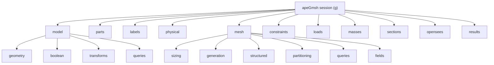
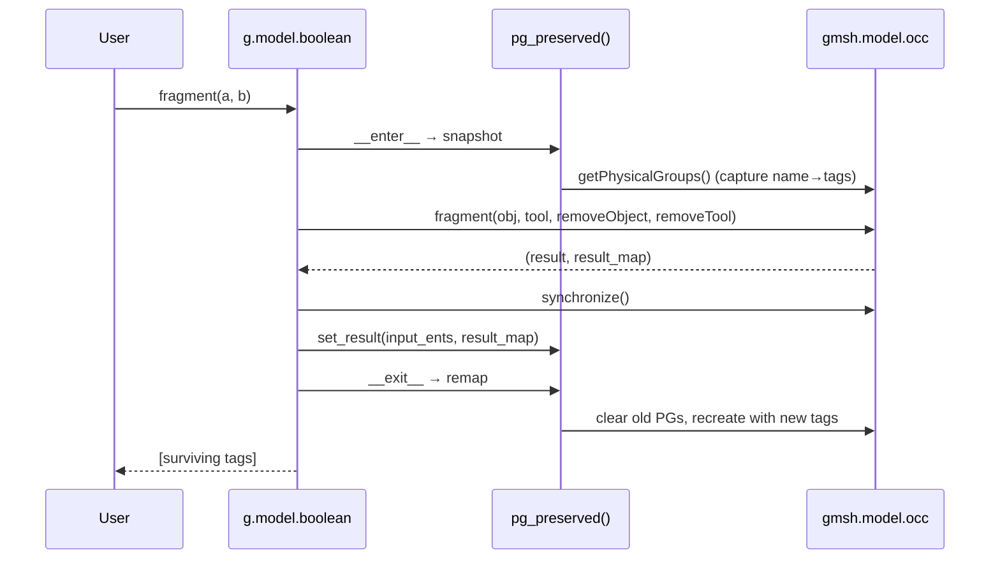
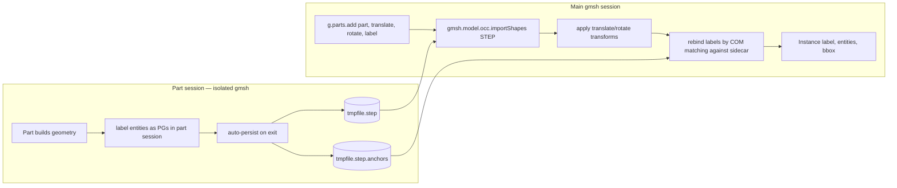
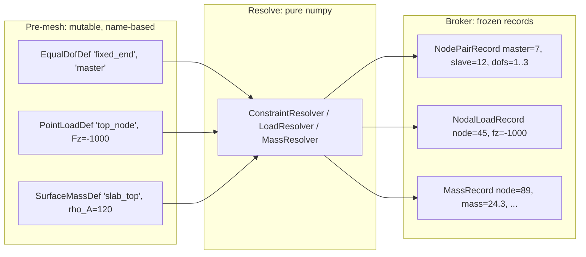
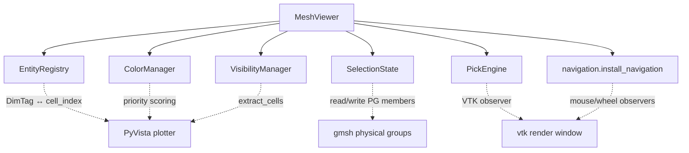
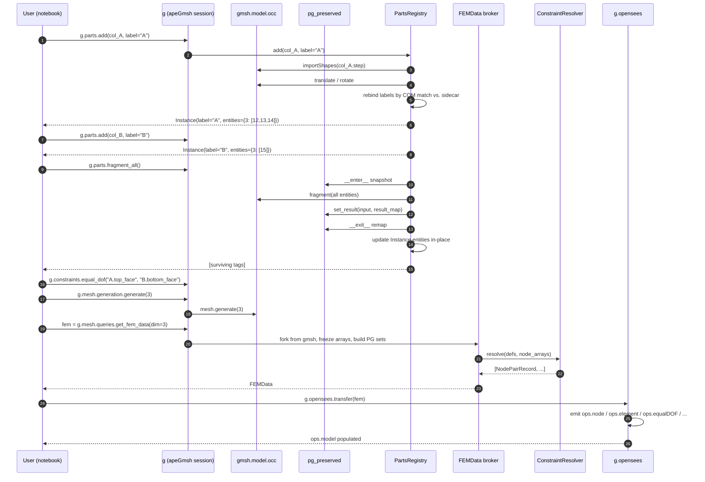

# apeGmsh Architecture

> [!note] Companion document
> This is the *how*. [[apeGmsh_principles]] is the *what we promise*.
> Tenets are cited by their roman numeral — `(iii)`, `(vii)`, `(xii)` —
> refer to the principles file for the full text.

Where the principles file lists the non-negotiables, this file explains
the machinery that keeps them true. It is written for contributors and
for future-me: it assumes you know gmsh's Python API and are comfortable
with the notion that `gmsh.model.occ.addBox` returns a bare integer tag
inside a process-global singleton.

The library rests on five architectural invariants, in dependency order:

1. **(dim, tag) is ground truth.** We never try to replace gmsh's
   identity model; we piggyback on it.
2. **Names are first-class and survive OCC booleans.** This is the
   single biggest ergonomic delta from raw gmsh and drives much of the
   machinery in `core/`.
3. **Pre-mesh intent is decoupled from mesh realization.** Constraints,
   loads, and masses target labels, not node IDs.
4. **The broker is a fork, not a view.** After `FEMData.from_gmsh()`,
   no downstream consumer touches gmsh.
5. **Resolvers are pure numpy; composites are impure.** Math lives in
   unit-testable functions; state lives in composites that call gmsh.

Everything else — the viewer, the solver adapter, the Part/Instance
system, the parametric sections — follows from these five.

---

## 1. The `(dim, tag)` ground truth

In gmsh, an entity is identified by a pair `(dim, tag)` where `dim ∈
{0,1,2,3}` is a point/curve/surface/volume and `tag` is a positive
integer unique per dimension. Tags are assigned by the OCC kernel and
are **not stable across boolean operations**.

```
fragment :  [(3, 1), (3, 2)]   →   [(3, 3), (3, 4), (3, 5)]
fuse     :  [(3, 1), (3, 2)]   →   [(3, 3)]
cut      :  [(3, 1)] − [(3, 2)] →  [(3, 3)]    (tag 2 destroyed)
```

This is the first thing apeGmsh has to reckon with. Any abstraction
that tries to hand the user a persistent handle to an entity (an
`Entity` object, an `EntityId` wrapper, a UUID) has to keep that handle
synchronized with the OCC kernel across every boolean, every
`remove_duplicates`, every re-import. That is a lot of synchronization
code that has to be *exactly right* or the abstraction silently corrupts
the user's model.

We pick the opposite strategy: **the user holds a name, never a tag.**
Tags are a kernel-level implementation detail; the user speaks in
labels and physical groups. Internally, we keep the tag up-to-date
inside the name's metadata, and every operation that can invalidate a
tag remaps the name in-place. Tenet `(iii)` ("names survive
operations") is the public-facing promise; the remapping machinery in
`core/Labels.py` and `core/_parts_fragmentation.py` is the
implementation.

> [!important] No opaque `Entity` wrapper
> apeGmsh never returns an `Entity` object. `g.model.geometry.add_box`
> returns a bare `int` tag — the same thing `gmsh.model.occ.addBox`
> returns. The tag is not stable, and the library says so by not
> wrapping it. If you need persistence, attach a label.

---

## 2. The composite tree

The session is a container. Every sub-composite accepts the session
as a `_parent` and exposes a narrow, typed surface. This is tenet
`(i)`: composition, not inheritance.

The layout mirrors gmsh's own module tree deliberately (tenet `(vii)`,
"we never hide gmsh") so that a reader who knows gmsh can navigate
apeGmsh by analogy.



A contributor reading `g.mesh.partitioning.renumber(method="rcm")`
should be able to guess, without opening the docs, that this maps to
something in `gmsh.model.mesh` that reorders node tags. The composite
hierarchy is also the IDE's autocomplete tree: types are the reference
documentation (tenet `(ii)`).

The attachment happens in `apeGmsh.begin()` by iterating a `_COMPOSITES`
list of `(attr_name, cls)` pairs and instantiating each with
`parent=self`. No metaclass magic, no registration decorators — just a
list. This is deliberate: a reader tracing where `g.mesh` comes from
finds exactly one line of code.

### Three class flavors

Per tenet `(ix)`:

- **Composites** — `Model`, `Mesh`, `LoadsComposite`, `PartsRegistry`.
  Stateful, hold `_parent`, call gmsh, are integration-tested. Regular
  classes, no `@dataclass`.
- **Defs** — `PointLoadDef`, `EqualDofDef`, `TiedContactDef`,
  `FaceLoadDef`, `PointMassDef`. Pre-mesh intent objects.
  Mutable dataclasses, sometimes with `__post_init__` validation.
- **Records** — `NodePairRecord`, `MassRecord`, `InterpolationRecord`,
  `NodeToSurfaceRecord`, `SPRecord`. Post-resolve outputs, frozen
  dataclasses, composed into `FEMData`.

The test suite verifies the frozen-ness of records by using them as
dict keys and comparing by `==` (e.g., `test_constraint_resolver.py`).

---

## 3. Names: the two-tier system

gmsh already has a name mechanism: a **physical group** is a named set
of entities of a single dimension. We do not build an alternative — we
split gmsh's PG namespace into two tiers and let gmsh's own machinery
handle persistence.

```
Physical group namespace
├── Tier 1: _label:*   (labels, is_label_pg, invisible to g.physical)
│     "_label:col_A.shaft", "_label:slab.top_face", ...
└── Tier 2: *          (user physical groups, visible)
      "Concrete", "FixedSupport", "InletSurface", ...
```

The prefix `_label:` is reserved. Helpers in `core/Labels.py`
(`is_label_pg`, `strip_prefix`, `add_prefix`) do the boundary
arithmetic. Every user-facing API in `g.labels.*` adds the prefix on
write and strips it on read; `g.physical.get_all()` filters the prefix
out entirely, so the user never sees `_label:*` unless they query gmsh
directly.

### Why piggyback on PGs instead of a separate dict?

Because gmsh's PG machinery **already handles** OCC booleans correctly
(almost — see §4 for the "almost"). If labels lived in a side dict
keyed on `(dim, tag)`, every boolean would require us to manually
translate every key through the `result_map`. By making labels *be*
PGs, we get to reuse one remapping routine for both tiers.

This is the clearest example in the codebase of a place where raw
gmsh's model was just slightly off from what we needed, and the right
move was to extend it rather than replace it.

### What labels and PGs are, formally

Both tiers are functions `name → set[(dim, tag)]` restricted so that
all dimtags share the same `dim`. Labels additionally carry an
entity-side reverse map (`labels_for_entity(dim, tag)`) built lazily
in `Labels.reverse_map`. User PGs do not have a built-in reverse map —
if you need one, call `gmsh.model.getPhysicalGroupsForEntity`.

---

## 4. Survival across OCC booleans

This is the section that earns apeGmsh its keep. The design here is
what makes multi-part assemblies usable at all.

### The raw gmsh story

`gmsh.model.occ.fragment(obj, tool, removeObject=True, removeTool=True)`
returns a pair `(result, result_map)` where:

- `result` is the list of surviving dimtags
- `result_map` is a list parallel to `obj + tool`; entry `i` is the
  list of dimtags that the `i`-th input produced

Example — two overlapping boxes fragmented:

```
input       : [(3,1), (3,2)]
result      : [(3,3), (3,4), (3,5)]
result_map  : [ [(3,3), (3,4)] ,         # box 1 split into two pieces
                [(3,4), (3,5)] ]         # box 2 split into two pieces
                                         # (3,4) is the shared overlap
```

gmsh does **not** automatically migrate physical group memberships to
the new tags. It leaves them pointing at the old (now-invalid) tags,
and your model breaks silently the next time you query the PG.

Fuse and cut have different semantics again:

- **Fuse**: `M` inputs → 1 output; all input PGs should point at the
  one survivor (`absorbed_into_result=True`).
- **Cut**: object may survive (possibly split); tool is consumed. Any
  PG on the tool must be either dropped or warned about.

### The apeGmsh story

`core/Labels.py` implements a two-phase envelope:

```
snapshot_physical_groups()   # record every PG's current state
  ⋯ gmsh.model.occ.fragment / fuse / cut ⋯
remap_physical_groups(snap, input_dimtags, result_map, absorbed_into_result=...)
```

The `pg_preserved()` context manager wraps both calls and is used by
every boolean in `g.model.boolean.*` and by `_parts_fragmentation.*`:

```python
with pg_preserved() as pg:
    result, result_map = gmsh.model.occ.fragment(obj, tool, ...)
    gmsh.model.occ.synchronize()
    pg.set_result(input_ents, result_map)
```

The exit of the `with` block is where the PG rebuild happens. Every
call site is tested against all three boolean semantics in
`tests/test_pg_boolean_survival.py` (pytest) and
`tests/run_pg_survival_test.py` (standalone, raw-gmsh, runs as a
diagnostic script).

### Visualising the remap



### The three-case table

| Operation | Input → Output cardinality  | PG migration rule                                    | Warning                                                                   |
| --------- | --------------------------- | ---------------------------------------------------- | ------------------------------------------------------------------------- |
| fragment  | 1 → N (split)               | each input PG's entry `t_in` → `result_map[i]` (all) | none                                                                      |
| fuse      | M → 1 (absorbed)            | every input PG's entry → the single survivor         | none                                                                      |
| cut       | obj: 1→N, tool: 1→0         | object follows fragment rule; tool PG dropped        | emit `"PG '<name>' consumed by cut"` for any PG whose entities all vanish |

`absorbed_into_result=True` is the flag on `remap_physical_groups` that
switches between the first two rows; `fuse_group` in
`_parts_fragmentation.py` passes it, `fragment_all` does not. The
consumed-tool warning is raised inside `remap_physical_groups` when a
PG ends up with an empty entity list post-remap.

### Why this design is load-bearing for the rest of the library

Every single label-aware API downstream of geometry authoring —
`g.parts.add`, `g.parts.fragment_all`, `g.parts.fuse_group`,
`g.model.boolean.fragment`, `g.model.geometry.slice`,
`g.model.geometry.cut_by_plane`, `g.constraints.equal_dof("label_a",
"label_b")`, every `*.get(pg="name")` query on FEMData — relies on the
promise that names outlast booleans. If §4 is wrong, nothing works.

---

## 5. Parts, Instances, Assembly

A `Part` is a standalone, isolated OCC session with its own
`gmsh.initialize()` and its own model name (`_part_<uuid>`). The user
constructs geometry inside the part as if it were a mini-model, then
hands the part to the main session via `g.parts.add(part)`.

> [!note] There is no `Assembly` class.
> `tests/test_library_contracts.py` explicitly asserts
> `"Assembly" not in apeGmsh.__all__`. The "assembly" is emergent —
> it is *whatever set of `Instance`s is in the `PartsRegistry` right
> now*. Making it a type would add a layer without adding a verb.

### The full round-trip



### Why a sidecar file?

STEP is an industry-standard B-rep format but it does **not** carry
gmsh-specific metadata — no physical groups, no labels, no tags.
When the main session calls `gmsh.model.occ.importShapes("part.step")`,
it gets back fresh `(dim, tag)` pairs with no connection to the tags
that existed inside the part session.

The sidecar file (`<step>.anchors`) records, for each labeled entity
in the part, a tuple `(dim, label, center_of_mass)`. On import,
apeGmsh computes the COM of each fresh entity and does greedy matching
against the sidecar list to rebind labels. If the user asked for a
transform, the transform is applied before matching, so the COM-space
comparison is done in the main-session frame.

Greedy matching is deterministic: sidecar entries are sorted by
label name, and for each entry we pick the closest unmatched fresh
entity. Ties (e.g., two identical boxes imported at symmetric
positions) are broken by entity tag order.

### `Instance` and `PartsRegistry`

```
Instance
├── label       : str           # user-chosen or part_name
├── part_name   : str           # the original Part's internal name
├── entities    : dict[int, list[int]]   # dim → tag list in main session
├── properties  : dict[str, Any]         # user metadata (material, ...)
└── bbox        : tuple | None

PartsRegistry._instances : dict[str, Instance]
```

`PartsRegistry` is the composite at `g.parts`. Its verbs:

- `.add(part, translate=, rotate=, label=, properties=)` — import + rebind
- `.from_model(label=, dim=)` — adopt existing in-main-session geometry
- `.fragment_all(dim=)` — split every instance against every other
- `.fragment_pair(label_a, label_b, dim=)` — narrow version
- `.fuse_group(labels, label=, dim=, properties=)` — collapse into one
- `.rename`, `.delete`, `.build_node_map`, `.build_face_map`

After `fragment_all`, `Instance.entities` is updated in-place via the
OCC `result_map`. The labels ride along because they are PGs and
already survived §4.

### How labels tie the whole thing together

```
Part session          STEP file + sidecar        Main session
───────────           ────────────────────        ────────────
_label:cube  ───┐                            ┌──► _label:col_A.cube
                │                            │    (auto-prefixed with
                ├──► sidecar["cube", COM] ───┤     instance label)
                │                            │
                └──► STEP geometry ──────────┘

   label PG                 sidecar                 label PG
 (tier 1 in part)        (bridging format)       (tier 1 in main)
```

The bridge format is `(label_name, dim, COM)` — deliberately
minimal. This is the only format that needs to round-trip through
STEP, so keeping it small keeps the coupling small.

After rebinding, the instance label is prefixed onto every part-side
label: `cube` becomes `col_A.cube` when added with `label="col_A"`.
Two instances of the same part produce independent label namespaces
(`col_A.cube` vs. `col_B.cube`) — tested in
`test_part_anchors.py::test_two_instances_independent`.

### Where this interacts with §4

`g.parts.fragment_all()` calls `gmsh.model.occ.fragment` once over all
tracked entities and relies on `pg_preserved()` to handle PG survival.
The *additional* responsibility it carries is updating
`Instance.entities[dim]` in-place from the `result_map`. The label PGs
themselves are handled by the generic §4 machinery — `PartsRegistry`
does not re-implement PG survival, it consumes it.

`fuse_group` does a little more: it also removes the old `Instance`
entries from `_instances` after the fuse, so the registry stays in
sync with the gmsh state. Because `fuse_group` uses
`absorbed_into_result=True`, both fused parts' label PGs end up
pointing at the single surviving volume, which is correct — in the
assembly metaphor, the new part inherits the names of its
constituents.

### Consistency with the principles

The Parts/Instances/no-Assembly design is consistent with tenets
`(i)` (composition — `PartsRegistry` is a composite at `g.parts`, not
a base class), `(iii)` (names survive — labels roundtrip through
STEP via the sidecar), and `(vi)` (solver-agnostic — nothing in the
Part or Instance schema knows about OpenSees).

It is **inconsistent** with tenet `(i)` in one place: the
`_PartsFragmentationMixin` (`core/_parts_fragmentation.py`) is mixed
into `PartsRegistry`. Tenet `(i)` explicitly bans mixins. This is
tracked in §11.

---

## 6. The broker boundary

`FEMData` is the single contract between the mesh world and the
solver world (tenet `(v)`). It is produced by
`g.mesh.queries.get_fem_data(dim=)` and consumed by the solver
adapter. After the fork, nothing in the `FEMData` tree calls gmsh.

```
FEMData (frozen)
├── info     : MeshInfo(n_nodes, n_elems, bandwidth, types[])
├── nodes    : NodeComposite
│   ├── ids, coords                         # numpy arrays
│   ├── physical     : PhysicalGroupSet     # {pg_name: {ids, coords, ...}}
│   ├── labels       : LabelSet             # {label: {ids}}
│   ├── constraints  : ConstraintSet        # post-resolve records
│   ├── loads        : LoadSet              # post-resolve records
│   ├── masses       : MassSet              # post-resolve records
│   └── get(pg=, partition=, label=)        # composable filter
├── elements : ElementComposite
│   ├── groups       : dict[int, ElementGroup]  # keyed by gmsh etype
│   ├── connectivity : ndarray              # (n_elem, npe)
│   ├── physical, labels                    # same pattern as nodes
│   ├── constraints  : InterpolationSet     # element-form constraints
│   ├── loads        : ElementLoadSet       # beamUniform, surfacePressure
│   └── get(...)                            # composable filter
└── partitions : list[int]                  # partition IDs if any
```

### Why frozen?

Because re-running the notebook must produce the same output (tenet
`(xiii)`). A live view over gmsh state would mean "whatever gmsh
happens to hold right now"; a fork means "the state at the moment we
forked." Frozen is the only way to keep a `FEMData` picklable,
cacheable, and comparable across runs.

`FEMData` holds numpy arrays plus Python dataclasses — nothing that
depends on a live gmsh session. The test suite exploits this: several
tests hand-build a `FEMData` from synthesized arrays with a faked
`gmsh` module (`test_results_roundtrip.py`,
`test_library_contracts.py`).

### The broker's query surface

`NodeComposite.get(pg=, partition=, label=)` and
`ElementComposite.get(pg=, element_type=, partition=, label=)` are
the main query verbs. They compose — `fem.nodes.get(pg="Concrete",
partition=p0)` returns the intersection. The return types are small
dataclasses (`NodeSetResult`, `ElementGroupResult`) so that the user
can chain `.ids`, `.coords`, `.connectivity`, and so on.

This is what makes downstream code (loaders, resolvers, adapters)
short. `fem.elements.get(pg="ShellSurface").connectivity` is a clean
one-liner over arrays; without the broker each caller would be
re-implementing PG filtering against `gmsh.model.mesh.getNodes` +
`gmsh.model.getPhysicalGroups`.

---

## 7. Resolvers

The resolver layer is the strongest architectural win in the codebase
(tenet `(xii)`). `ConstraintResolver`, `LoadResolver`, and
`MassResolver` live in `solvers/*.py` and share a single rule:

> **Zero `import gmsh`. Zero session references. Pure functions on
> numpy arrays.**

The composite (e.g., `ConstraintsComposite` at `g.constraints`) holds
the mutable list of `*Def` objects, plus a cache of resolved records.
At `get_fem_data()` time, it:

1. Collects the node IDs / coords / element connectivity it needs via
   `FEMData` (the broker, not gmsh).
2. Calls the pure resolver with those arrays plus the list of `*Def`s.
3. Stores the returned `*Record` list on `FEMData.nodes.constraints`.



This separation is what keeps a 700-line constraint resolver
maintainable. The resolver is tested with hand-built numpy arrays —
see `test_constraint_resolver.py`, `test_load_resolver.py`,
`test_mass_resolver.py` — and never needs a live mesh.

### The record model

Every resolver emits typed, frozen records:

- `NodePairRecord(kind, master_node, slave_node, dofs, ...)` — with a
  `.constraint_matrix(ndof)` method that returns the appropriate
  selection/skew matrix on demand.
- `InterpolationRecord(slave_node, master_nodes, weights, kind, ...)`
- `NodeToSurfaceRecord(master_node, slave_nodes, phantom_nodes,
  phantom_coords, rigid_link_records, equal_dof_records)` — with
  `.expand()` that yields the sub-records for adapters.
- `NodalLoadRecord`, `ElementLoadRecord`, `MassRecord`.

The adapter's job is almost trivial: iterate records, emit one line
per record. That thinness is the success criterion for tenet `(vi)`
("solver-agnostic in code, OpenSees in mind") — if emitting an
OpenSees command from a record takes more than a few lines of
adapter code, the record is under-specified and the resolver needs
to grow.

---

## 8. The solver adapter

`Gmsh2OpenSees` at `g.opensees` is the reference adapter. It reads
`FEMData` and emits either openseespy calls or Tcl. Nothing in the
adapter calls gmsh.

The adapter has three moving parts:

1. **`_ElemSpec` registry** (`solvers/_element_specs.py`) — maps
   gmsh element types to OpenSees element commands, with per-element
   metadata: `mat_family` (`nd`, `uni`, `section`, `none`),
   `gmsh_etypes`, `node_reorder`, `slots` / `slots_2d` / `slots_3d`,
   `expected_pg_dim`.
2. **Node/element renderer** — `_render_tcl` and `_render_py` produce
   one line per element from the `_ElemSpec` + user-supplied args.
3. **Tie element emitter** (`ASDEmbeddedNodeElement`) — a separate
   code path for node-to-surface ties, because they emit a different
   element family with `-rot` and `-K penalty` flags. Tie tags start
   at `1_000_000` when the broker is empty, otherwise
   `max(existing_tags) + 1`.

The reason the adapter can be thin is that all the heavy lifting
happened upstream: the broker's records are already close to
OpenSees-command shape.

> [!warning] Vocabulary leak
> `RIGID_BEAM_STIFF` is a constant used inside the broker's
> `node_to_surface_spring` resolver. It names an *OpenSees technique*
> (use a very stiff rigid beam to emulate an elastic beam) inside the
> solver-agnostic broker. Tenet `(vi)` says broker vocabulary should
> be neutral. This is a minor but real leak — tracked in §11.

---

## 9. The viewer

The viewer is "core and environment-aware" by tenet `(viii)`. It ships
with the library; the notebook user calls `g.mesh.viewer()` and the
library picks a backend.

### Architecture: composition over everything



No inheritance anywhere — each component is a plain class, a plain
dict, or a plain set. Wiring happens in `MeshViewer.__init__`.

The same pattern shows up in the UI panels:
`PreferencesTab`, `BrowserTab`, `SelectionTreePanel`, `PartsTreePanel`,
`LoadsTabPanel`, `MassTabPanel`, `ConstraintsTabPanel` each compose
`QtWidgets` via `_qt()` lazy-import plus a `TYPE_CHECKING` block for
IDE type hints. No shared base widget.

### Environment detection

The `_qt()` pattern is the core mechanism:

```python
def _qt():
    from qtpy import QtWidgets, QtCore, QtGui
    return QtWidgets, QtCore, QtGui
```

This defers the Qt import until the widget is actually instantiated,
so `from apeGmsh import apeGmsh` works on headless Colab
(tenet `(viii)` + the Colab-safety commitment in §7 of the
principles). An HTML/trame backend is part of the principles'
commitment but is not visible in the current viewer source tree — see
§11.

### Why the viewer reads gmsh directly

`viewers/scene/mesh_scene.py` and `viewers/scene/brep_scene.py` call
`gmsh.model.mesh.getElements`, `gmsh.model.getEntities`, and friends
directly — not through the broker. The reason is:

- `brep_scene` shows **geometry** (pre-mesh OCC shapes). There is no
  broker for geometry; the broker is about mesh.
- `mesh_scene` shows **mesh** and has to build a VTK unstructured grid
  from gmsh element arrays. Going through `FEMData` would copy the
  arrays; the scene builder reads gmsh directly for performance.

This is a tension with tenet `(v)` ("no viewer calls Gmsh after the
broker exists"). My read is that the tenet was written for solver
adapters, and the viewer's read access is compatible with the spirit
(the viewer does not mutate gmsh state post-broker). See §11.

---

## 10. Putting it all together — a traced call



Every arrow in this diagram is in the test suite somewhere. The flow
is the whole library at a glance.

---

## 11. Consistency audit

This is the honest section: where the code diverges from the
principles, and what to do about it.

### 11.1 Declared violations

**Mixin in `_PartsFragmentationMixin` — violates (i).**
Tenet `(i)` bans mixins outright. `core/_parts_fragmentation.py`
defines `_PartsFragmentationMixin` with a `TYPE_CHECKING`-only
contract block declaring the attributes it expects from the host
(`_instances`, `_parent`, `_compute_bbox`). `PartsRegistry` mixes it
in.

Remediation options, in order of surgical cost:

1. Rename the mixin to `PartsFragmenter` and have `PartsRegistry`
   hold one as `self._fragmenter`, delegating `fragment_all` /
   `fragment_pair` / `fuse_group` via three-line methods. No behavior
   change, purely structural.
2. Inline the methods directly into `PartsRegistry` — the file gets
   longer but tenet `(i)` is satisfied with no new indirection.

Either way, the mixin has to go or tenet `(i)` has to be amended.
This is the most visible internal inconsistency in the codebase.

**Vocabulary leak — `RIGID_BEAM_STIFF` — partial violation of (vi).**
The broker's `node_to_surface_spring` resolver emits records tagged
with the constant `RIGID_BEAM_STIFF`. That name describes an OpenSees
modeling technique, not a neutral FEM concept. The fix is a rename to
a solver-neutral term (e.g., `RIGID_BEAM_PENALTY` or
`ELASTIC_BEAM_EMULATED`) with the OpenSees-specific interpretation
moved into the adapter.

**Viewer reads gmsh directly — partial tension with (v).**
`viewers/scene/mesh_scene.py` and `brep_scene.py` call
`gmsh.model.mesh.getElements` and `gmsh.model.getEntities`. Tenet
`(v)` says "no viewer calls Gmsh after the broker exists" but the
viewer needs to show pre-broker geometry too. My read: the tenet was
written with the solver adapter in mind and should be amended to
"no *solver adapter* calls gmsh; viewers may read gmsh for scene
construction but never mutate it." The behavior is right; the
wording is slightly off.

### 11.2 Outstanding commitments

**HTML/trame backend — (viii) commitment, not yet observed in source.**
The principles file states three supported environments (desktop,
local Jupyter, Colab). The viewer source I walked is Qt-centric; the
environment-detection logic that routes to an HTML backend for
headless notebooks is either elsewhere in the tree or not yet
implemented. Worth auditing before tagging a release that claims
Colab support.

**`gmsh.fltk.run()` — (viii) says "never in documented workflow."**
Grep the tree: if any public docstring or example uses `fltk.run()`,
it contradicts the tenet. This is a one-off cleanup check.

### 11.3 Strongly consistent

- **Tenet `(iii)` names survive.** The two-tier PG design + §4
  remap machinery is exhaustively tested across fragment / fuse / cut
  in both pytest and a standalone raw-gmsh script. No dim, no boolean
  case is untested.
- **Tenet `(iv)` define-before, resolve-after.** Every `*Def` stores
  labels, not node IDs; resolvers run at `get_fem_data` time. The
  re-mesh case — change the mesh size, re-resolve, same records shape
  — falls out for free.
- **Tenet `(xii)` pure resolvers.** Zero `import gmsh` in any
  `*Resolver.py`. The tests exploit this by faking gmsh.
- **Tenet `(xiii)` reproducibility.** `g.mesh.partitioning.renumber`
  is an explicit step with named methods (`simple`, `rcm`). Phantom
  node allocation is contiguous and tested for uniqueness across
  multiple `node_to_surface` calls.
- **Tenet `(ix)` three class flavors.** Verified by inspection:
  composites are regular classes, `*Def`s are dataclasses, `*Record`s
  are frozen dataclasses.
- **Tenet `(vii)` never hide gmsh.** The composite tree is a
  parallel structure; tests freely mix `g.model.geometry.add_box(...)`
  with `gmsh.model.getEntities(3)` on the next line.

### 11.4 Parts / Instances / Assembly consistency

The Parts/Instances design has exactly one place of friction with the
principles (the mixin, §11.1) and is otherwise the cleanest
application of them:

- `(i)` composition: `PartsRegistry` is a composite under `g.parts`.
- `(iii)` names survive: labels ride through STEP via the sidecar,
  ride through `fragment_all` via `pg_preserved`, ride through
  `fuse_group` via `absorbed_into_result=True`.
- `(ii)` types as docs: `Instance` is a dataclass with typed fields;
  `PartsRegistry` has typed verbs.
- `(xi)` pre-mesh mutable: parts can be rebuilt, instances can be
  fragmented, labels can be renamed — all before `get_fem_data`.
- "No `Assembly`": the emergent-assembly design avoids inventing a
  type without a verb. This is consistent with the general library
  stance of resisting speculative abstractions (CLAUDE.md's
  "simplicity first" guidance).

The one design tension worth naming: **the sidecar format is
apeGmsh-specific**. A user who manually constructs a STEP outside the
Part lifecycle cannot label entities by anchor. If that becomes a
real use case, the fix is to expose a public `LabelAnchor` dataclass
and a `write_anchors(path, [(dim, label, com)])` helper. Until then,
the Part class is the blessed path.

---

## 12. Appendix: cheat sheet for contributors

**I want to add a new geometry primitive.**
Add it to `core/Model.py` under `g.model.geometry`. Create the entity
via `gmsh.model.occ.*`, call `gmsh.model.occ.synchronize()`, register
a `_metadata[(dim, tag)]` entry with a descriptive `kind`, and if the
user passed `label=`, call `self._parent.labels.add(label, [(dim,
tag)])`. See `add_box`, `add_cylinder` for the pattern.

**I want to add a new boolean.**
Wrap the raw gmsh call with `pg_preserved()`. Always pass
`removeObject=True, removeTool=True` unless there is a very specific
reason not to. See `core/Model.py::boolean.*`.

**I want to add a new constraint kind.**
Three steps: (1) add a `*Def` dataclass in `solvers/Constraints.py`;
(2) add a case in `ConstraintResolver.resolve` that emits
`NodePairRecord` / `InterpolationRecord` / a new `*Record` if the
shape is genuinely new; (3) add a case in
`solvers/_element_specs.py` or the tie emitter so the OpenSees
adapter can render it. Do **not** add any code in the adapter that
reads the `*Def` — the adapter should only see records.

**I want the viewer to show a new overlay.**
Add a pure function in `viewers/overlays/*.py` that takes `fem`,
kinds, and style parameters, and returns
`list[(mesh, add_mesh_kwargs)]`. Do not hold plotter references. See
`constraint_overlay.build_node_pair_actors` for the template.

**I want to add a new adapter (e.g., CalculiX).**
Create `solvers/Gmsh2CCX.py` that reads `FEMData`. Do not import
gmsh. Do not touch `ConstraintResolver` — resolvers are
solver-agnostic by rule. If a record type cannot be expressed in
CalculiX, the broker record is under-specified and needs a new
field; do not work around it in the adapter.

---

*Cross-references:*
[[apeGmsh_principles]] ·
[[gmsh_basics]] · [[gmsh_interface]] · [[gmsh_geometry_basics]] ·
[[gmsh_meshing_basics]] · [[gmsh_selection]]
