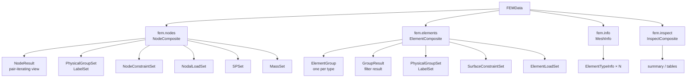

# apeGmsh Broker

> [!note] Companion document
> This file documents the **broker freeze** — what `FEMData` is, what it
> owns, and how solvers parse its contents. It assumes you have read
> [[apeGmsh_principles]] (tenets **(v)** "broker is a freeze", **(xi)**
> "pre-mesh is mutable, the broker is frozen", **(xii)** "three class
> flavours: composite / def / record") and [[apeGmsh_architecture]] §5.
> For the promise of name stability that feeds the broker, see
> [[apeGmsh_groundTruth]].

Everything upstream of `FEMData.from_gmsh()` — geometry, parts, labels,
physical groups, constraints, loads, masses — is **mutable pre-mesh
intent**. Everything downstream of that call is a **frozen fork**: a
pure-numpy, gmsh-free snapshot that the solver consumes without ever
touching the OCC kernel again. The broker exists so that the solver
never has to reason about `(dim, tag)` drift, session lifecycle, or
sidecar rebinding — all of that has been resolved into concrete node
IDs and connectivity arrays before the user writes a single
`ops.element(...)` line.

This file is the contributor-facing map of the broker: the four output
chambers, the parsing objects each one emits, and the conventions that
glue them into a solver-agnostic interface.

```
src/apeGmsh/mesh/
├── FEMData.py           ← the four chambers + top-level broker
├── _group_set.py        ← PhysicalGroupSet / LabelSet (name-first tiers)
├── _record_set.py       ← NodeConstraintSet, NodalLoadSet, MassSet, …
├── _element_types.py    ← ElementTypeInfo / ElementGroup / GroupResult
└── _fem_factory.py      ← from_gmsh / from_msh construction
```

---

## 1. The broker as a forked freeze

`FEMData` has no back-reference to the gmsh session that built it. Its
four public attributes are plain Python objects holding numpy arrays:

```python
class FEMData:
    def __init__(self, nodes, elements, info, mesh_selection=None):
        self.nodes    = nodes          # NodeComposite
        self.elements = elements       # ElementComposite
        self.info     = info           # MeshInfo
        self.mesh_selection = mesh_selection
        self.inspect  = InspectComposite(self)
```

The construction path is **one-way**:

```python
fem = FEMData.from_gmsh(dim=3, session=g, ndf=6)
# After this line, g can be closed, re-fragmented, or destroyed.
# `fem` stays valid because it copied everything it needs.
```

Concretely, `from_gmsh` does five things inside `_fem_factory.py`:

1. Calls `gmsh.model.mesh.getNodes()` / `getElements()` and snapshots
   arrays into `NodeComposite` / `ElementComposite`.
2. Walks every physical group and every label PG (from [[apeGmsh_groundTruth]] §2),
   copies their node-ID and element-ID sets into `PhysicalGroupSet` /
   `LabelSet` so no subsequent gmsh call is needed to answer
   `fem.nodes.get(pg="Base")`.
3. Resolves every pre-mesh constraint / load / mass definition against
   the live session — turning symbolic `label="col.base"` references into
   concrete `node_id` arrays — and hands the resulting records to the
   appropriate `_record_set` subclass.
4. Snapshots the `Parts` registry's `part_label → set[node_id]` and
   `part_label → set[element_id]` maps so `get(target="col_01")` keeps
   working after the session closes (see `NodeComposite._part_node_map`
   in `FEMData.py:275`).
5. Builds `MeshInfo` with element-type metadata and computes the
   semi-bandwidth in one numpy pass (`_compute_bandwidth`).

There is no `fem.refresh()`. If the mesh changes, you build a new
`FEMData`. That rule is what lets solvers assume the broker is
immutable between emission steps.

> [!warning] Live-DimTag fallback
> The `target=(dim, tag)` path on `NodeComposite` / `ElementComposite`
> is the *one* place the broker will call back into gmsh — and only if
> the user passes a raw tuple rather than a name. If the session has
> been closed this raises `RuntimeError` with a pointer at an explicit
> `label=` or `pg=` fallback. Name-based resolution is always
> session-free.

---

## 2. The four chambers



Every chamber has a distinct role:

| Chamber         | Class                | Owns                                                                                                 |
| --------------- | -------------------- | ---------------------------------------------------------------------------------------------------- |
| `fem.nodes`     | `NodeComposite`      | All node IDs + coords, per-name tier sets, all node-centric records                                  |
| `fem.elements`  | `ElementComposite`   | Per-type element groups, per-name tier sets, all element-centric records                             |
| `fem.info`      | `MeshInfo`           | Counts, bandwidth, element-type catalogue — no per-entity data                                       |
| `fem.inspect`   | `InspectComposite`   | Introspection views built lazily from the other three — never owns state                             |

The first two chambers are **composites** (tenet xii: mutable container
of methods + records), `MeshInfo` is a **record** (slotted, read-only),
`InspectComposite` is a **def** (stateless view).

---

## 3. `fem.nodes` — `NodeComposite`

The node chamber has one job: answer *"which nodes does this name
refer to?"* with O(1) lookups on preflattened arrays.

### 3.1 Direct array access

```python
fem.nodes.ids       # ndarray(N,) dtype=object   → iterates as Python int
fem.nodes.coords    # ndarray(N, 3) dtype=float64
fem.nodes.partitions  # list[int]                → empty if unpartitioned
```

The `object` dtype on `ids` is deliberate: iteration yields plain
Python `int`, which OpenSees and other C-extension solvers accept
without `int()` casts. See [[apeGmsh_principles]] tenet (xiii)
"solvers see only Python builtins".

### 3.2 The three-axis selection API

`NodeComposite.get()` is the one entry point the user touches for
every selection. It takes three orthogonal axes:

```python
fem.nodes.get(
    target=None,         # auto-resolve  : label → PG → part
    pg=None,             # explicit      : physical-group name(s)
    label=None,          # explicit      : label name(s)
    tag=None,            # explicit      : raw PG tag or (dim, tag)
    partition=None,      # intersection  : partition filter
) -> NodeResult
```

The `target=` path auto-tries resolution **label → PG → part** (matching
`LoadsComposite._resolve_target`). That precedence is the same one used
by pre-mesh constraint/load wiring, so intent flows through unchanged.
A list of targets is interpreted as a **union** with ID deduplication.

Raw `(dim, tag)` tuples fall back to `gmsh.model.mesh.getNodes(...)` —
see §1 on the live-DimTag fallback.

### 3.3 What `get()` returns: `NodeResult`

`NodeResult` is a pair-iterating view around `(ids, coords)`:

```python
class NodeResult:
    __slots__ = ('_ids', '_coords')

    @property
    def ids(self):    return self._ids         # ndarray(N,) object dtype
    @property
    def coords(self): return self._coords      # ndarray(N, 3) float64

    def __iter__(self):                        # yields (nid, xyz)
        for nid, xyz in zip(self._ids, self._coords):
            yield nid, xyz

    def to_dataframe(self) -> pd.DataFrame: ...
```

The dominant emission pattern is one line:

```python
for nid, xyz in fem.nodes.get(pg="Base"):
    ops.node(nid, *xyz)
```

`NodeResult` is deliberately narrow — no query methods, no filtering.
If you need to re-select, call `fem.nodes.get(...)` again. That keeps
the class tagged *record* rather than *composite*.

### 3.4 Node-centric sub-composites

Five sub-composites hang off the node chamber. All except the first two
inherit from `_RecordSetBase[_R]` and share `__iter__`, `__len__`,
`__bool__`, `by_kind(kind)`.

| Attribute                  | Class                 | What it holds                                    |
| -------------------------- | --------------------- | ------------------------------------------------ |
| `fem.nodes.physical`       | `PhysicalGroupSet`    | Tier 2 (user-facing) PGs — solver-visible        |
| `fem.nodes.labels`         | `LabelSet`            | Tier 1 (internal) labels — geometry bookkeeping  |
| `fem.nodes.constraints`    | `NodeConstraintSet`   | equal_dof, rigid_beam, node_to_surface, …        |
| `fem.nodes.loads`          | `NodalLoadSet`        | Point forces per pattern                         |
| `fem.nodes.sp`             | `SPSet`               | Single-point constraints (homogeneous + Sp)      |
| `fem.nodes.masses`         | `MassSet`             | Lumped nodal masses                              |

The tier split between `physical` and `labels` is load-bearing: it is
the same two-tier system documented in [[apeGmsh_groundTruth]] §2, but
evaluated against concrete mesh IDs instead of `(dim, tag)` pairs.
`PhysicalGroupSet.get_all()` filters out any `_label:`-prefixed PGs so
solver emission never sees internal labels by accident.

---

## 4. `fem.elements` — `ElementComposite`

The element chamber is **per-type**: an iterable of `ElementGroup`
blocks, one per Gmsh element code present in the mesh. Unlike nodes,
elements are not guaranteed to be homogeneous — a single mesh can carry
`tet4`, `hex8`, and `tri3` simultaneously. The API reflects that.

### 4.1 Iteration

```python
for group in fem.elements:            # ElementGroup per type
    for eid, conn in group:
        ops.element(group.type_name, eid, *conn, mat_tag)
```

`ElementGroup` is slotted; iterating yields `(int, tuple(int, …))` pairs
with explicit `int()` casts so the C-extension solvers never see
`numpy.int64`.

### 4.2 Direct array access

```python
fem.elements.ids              # ndarray(E,) int64 — concatenated over types
fem.elements.connectivity     # homogeneous-only; raises TypeError if mixed
fem.elements.types            # list[ElementTypeInfo]
fem.elements.partitions       # list[int]
fem.elements.is_homogeneous   # bool
fem.elements.type_table()     # DataFrame (code / name / dim / npe / count)
```

The `connectivity` guard is intentional: if the mesh carries more than
one type, there is no shape-consistent `(E, npe)` array to return.
`TypeError` here is louder than a silent ragged array.

### 4.3 The three-axis selection API

Same pattern as `NodeComposite.get()` with two additional filters:

```python
fem.elements.get(
    target=None,
    pg=None,
    label=None,
    tag=None,
    dim=None,              # element-dimension filter (0–3)
    element_type=None,     # type alias / Gmsh code / Gmsh name
    partition=None,
) -> GroupResult
```

All filters compose as **AND intersections**. Name-based resolution
uses the same label → PG → part chain as the node chamber.

### 4.4 What `get()` returns: `GroupResult`

`GroupResult` wraps a list of `ElementGroup` objects that survived the
filter. It is **chainable** — `get()` on a `GroupResult` returns a
narrower `GroupResult`.

```python
res = fem.elements.get(label="col.web")

# Iterate by type
for group in res:
    for eid, conn in group:
        ops.element(group.type_name, eid, *conn, mat_tag)

# Flat arrays — convenience when a single type is expected
ids, conn = res.resolve()                     # raises if mixed
ids, conn = res.resolve(element_type='tet4')  # pick one type

# Further narrow the result
surface_only = res.get(dim=2)

# Introspection
res.n_elements
res.types            # list[ElementTypeInfo]
res.is_homogeneous
```

`resolve()` is the pragmatic one-liner for the overwhelming majority of
solver emission; `for group in res:` is for heterogeneous meshes.

### 4.5 Element-centric sub-composites

| Attribute                     | Class                    | What it holds                                  |
| ----------------------------- | ------------------------ | ---------------------------------------------- |
| `fem.elements.physical`       | `PhysicalGroupSet`       | Same tier-2 set as `fem.nodes.physical`        |
| `fem.elements.labels`         | `LabelSet`               | Same tier-1 set as `fem.nodes.labels`          |
| `fem.elements.constraints`    | `SurfaceConstraintSet`   | tie, mortar, tied_contact, …                   |
| `fem.elements.loads`          | `ElementLoadSet`         | Surface pressure, body forces, …               |

The `physical` and `labels` references are the *same objects* as those
on the node chamber — not copies — so `id(fem.nodes.physical) ==
id(fem.elements.physical)`. That is by design: there is one tier-2
namespace and one tier-1 namespace per `FEMData`, and both chambers
expose it for ergonomic reasons.

---

## 5. `fem.info` — `MeshInfo`

`MeshInfo` is a slotted read-only summary. No methods beyond `summary()`
and `__repr__`:

```python
class MeshInfo:
    __slots__ = ('n_nodes', 'n_elems', 'bandwidth', 'types')
    n_nodes:   int
    n_elems:   int
    bandwidth: int                     # semi-bandwidth (max node-id span)
    types:     list[ElementTypeInfo]
```

The `types` list is the canonical element-type catalogue for the mesh —
each entry is a slotted `ElementTypeInfo` (see §7.3). Two legacy
single-type properties (`nodes_per_elem`, `elem_type_name`) delegate to
the first entry for back-compat.

`bandwidth` is computed by `_compute_bandwidth(groups)` as
`max(max(conn_row) - min(conn_row))` across all elements. It is the
main input to OpenSees' `BandGeneral` and `ProfileSPD` solver sizing.

---

## 6. `fem.inspect` — `InspectComposite`

`InspectComposite` is a stateless view that builds DataFrames and
summary strings on demand from the other three chambers. It owns no
data and caches nothing.

```python
fem.inspect.summary()              # multi-line string — also __repr__
fem.inspect.node_table()           # DataFrame of all nodes
fem.inspect.element_table()        # DataFrame with a 'type' column
fem.inspect.physical_table()       # delegates to PhysicalGroupSet.summary()
fem.inspect.label_table()          # delegates to LabelSet.summary()
fem.inspect.constraint_summary()   # per-kind counts across node + surface
fem.inspect.load_summary()         # per-pattern nodal + element breakdown
fem.inspect.mass_summary()         # total + per-source breakdown
```

`FEMData.__repr__` delegates to `fem.inspect.summary()`, so the
interactive REPL experience is:

```
>>> fem
12 nodes, 8 elements (hex8:8), bandwidth=11
  Physical groups (2):
    (2) "Base"                  4 nodes
    (3) "Concrete"              12 nodes, 8 elems
  Element types (1):
    hex8         dim=3, order=1, npe=8, count=8
  Node constraints: NodeConstraintSet(2 records)
```

This chamber is the only one meant to be *eyeballed*. The other three
are meant to be *consumed by code*.

---

## 7. Parsing-object reference

This is the full catalogue of objects a solver writer will encounter
when walking the broker. Every one is documented here with its
iteration style and a one-liner OpenSees emission example.

### 7.1 `NodeResult`  (`FEMData.py`)

Returned by `NodeComposite.get(...)`. Iterable of `(nid, xyz)` pairs.
See §3.3.

```python
for nid, xyz in fem.nodes.get():
    ops.node(nid, *xyz)
```

### 7.2 `ElementGroup`  (`_element_types.py`)

One per element type in the mesh. Iterable of `(eid, conn_tuple)` pairs.

```python
class ElementGroup:
    __slots__ = ('element_type', 'ids', 'connectivity')
    # properties: type_name, type_code, dim, npe
```

```python
for group in fem.elements:
    for eid, conn in group:
        ops.element(group.type_name, eid, *conn, mat_tag)
```

### 7.3 `GroupResult`  (`_element_types.py`)

Returned by `ElementComposite.get(...)`. Wraps a list of surviving
`ElementGroup` blocks. Chainable: `get(...)` on a `GroupResult`
returns a narrower `GroupResult`. See §4.4.

```python
ids, conn = fem.elements.get(label="col.web").resolve()
```

### 7.4 `ElementTypeInfo`  (`_element_types.py`)

Slotted type catalogue entry.

```python
class ElementTypeInfo:
    __slots__ = ('code', 'name', 'gmsh_name', 'dim', 'order', 'npe', 'count')
```

```python
for t in fem.info.types:
    print(t.name, t.dim, t.npe, t.count)
```

The `name` field is a short alias (`'tet4'`, `'hex8'`, `'tri3'`, …)
resolved through `_KNOWN_ALIASES` in `_element_types.py`; the
`gmsh_name` field preserves the upstream Gmsh string.

### 7.5 `PhysicalGroupSet` / `LabelSet`  (`_group_set.py`)

Both derive from `NamedGroupSet`, which stores
`{(dim, tag): info_dict}` with `object` dtype coercion applied once at
`__init__`. Name-first access:

```python
pg = fem.nodes.physical
pg.names()                     # list of PG names
pg.node_ids("Base")            # ndarray — object dtype
pg.node_coords("Base")         # ndarray(N, 3)
pg.element_ids("Concrete")     # ndarray — object dtype
pg.connectivity("Concrete")    # ragged padded with -1 for mixed types
pg.get_name(tag=7, dim=2)      # reverse lookup
pg.get_tag("Base")             # forward lookup
pg.summary()                   # DataFrame
```

`LabelSet` has the identical interface — the two tiers are separated
not by API shape but by **who owns them** (see [[apeGmsh_groundTruth]] §2).

### 7.6 `NodeConstraintSet`  (`_record_set.py`)

Node-to-node constraints. Holds three concrete record subclasses:

| Record type              | Tier       | Source kinds                                                |
| ------------------------ | ---------- | ----------------------------------------------------------- |
| `NodePairRecord`         | atomic     | `equal_dof`, `rigid_beam`, `rigid_rod`, `penalty`           |
| `NodeGroupRecord`        | compound   | `rigid_diaphragm`, `rigid_body`, `kinematic_coupling`       |
| `NodeToSurfaceRecord`    | compound   | `node_to_surface` (also creates phantom nodes)              |

**Atomic vs compound convention** — the critical invariant for solver
writers:

| Iterator                         | Returns       | Expands compound? |
| -------------------------------- | ------------- | ----------------- |
| `pairs()`                        | atomic        | yes (all)         |
| `equal_dofs()`                   | atomic        | yes (NodeToSurf)  |
| `rigid_link_groups()`            | `(m, [s,…])`  | yes (all rigid)   |
| `rigid_diaphragms()`             | `(m, [s,…])`  | no (diaphragm)    |
| `node_to_surfaces()`             | compound      | no                |
| `phantom_nodes()`                | `NodeResult`  | n/a               |
| direct `for r in set`            | mixed         | no                |
| `by_kind(kind)`                  | mixed         | no                |

> [!important] When to use which iterator
> If you need `phantom_coords`, `mortar_operator`, or any compound-only
> side-band field, iterate the **compound** accessor. If you just need
> flat solver commands, use the atomic iterator — compound records are
> expanded for you automatically. Mixing the two is a bug.

Canonical OpenSees flow:

```python
K = fem.nodes.constraints.Kind

# 1. Phantom nodes first (node_to_surface creates them)
for nid, xyz in fem.nodes.constraints.phantom_nodes():
    ops.node(nid, *xyz)

# 2. Rigid links — grouped by master
for master, slaves in fem.nodes.constraints.rigid_link_groups():
    for slave in slaves:
        ops.rigidLink("beam", master, slave)

# 3. Equal DOFs — flat iteration
for p in fem.nodes.constraints.equal_dofs():
    ops.equalDOF(p.master_node, p.slave_node, *p.dofs)

# 4. Diaphragms — native multi-slave
for master, slaves in fem.nodes.constraints.rigid_diaphragms():
    ops.rigidDiaphragm(3, master, *slaves)
```

`Kind` is `ConstraintKind` re-exported as `.Kind` on the set for
linter-friendly kind comparisons (no magic strings).

### 7.7 `SurfaceConstraintSet`  (`_record_set.py`)

Element-side constraints (ties and contact). Same atomic / compound
split:

| Record type               | Tier     | Source kinds                       |
| ------------------------- | -------- | ---------------------------------- |
| `InterpolationRecord`     | atomic   | `tie`, per-node projection         |
| `SurfaceCouplingRecord`   | compound | `mortar`, `tied_contact` (carries `mortar_operator`) |

```python
# Flat — compound couplings expanded to per-node interpolations
for rec in fem.elements.constraints.interpolations():
    ops.equalDOF(rec.master_node, rec.slave_node, *rec.dofs)

# Compound — need the mortar operator
for cpl in fem.elements.constraints.couplings():
    M = cpl.mortar_operator        # scipy sparse matrix
    # ... emit a mortar element ...
```

### 7.8 `NodalLoadSet`  (`_record_set.py`)

Point forces per pattern. Records are `NodalLoadRecord`.

```python
for pat in fem.nodes.loads.patterns():
    for rec in fem.nodes.loads.by_pattern(pat):
        ops.load(rec.node_id, *rec.values)
```

`.summary()` returns a per-pattern DataFrame.

### 7.9 `ElementLoadSet`  (`_record_set.py`)

Surface pressure / body forces per pattern. Records are
`ElementLoadRecord` with a `load_type` field (`'pressure'`, `'body'`, …).

```python
for pat in fem.elements.loads.patterns():
    for rec in fem.elements.loads.by_pattern(pat):
        ops.eleLoad("-ele", *rec.element_ids, "-type", rec.load_type, ...)
```

### 7.10 `SPSet`  (`_record_set.py`)

Single-point constraints. Records are `SPRecord` with a `prescribed`
flag splitting homogeneous (`fix`) from non-homogeneous (`sp`)
constraints.

```python
for r in fem.nodes.sp.homogeneous():          # boolean mask per DOF
    ops.fix(r.node_id, *r.flags)

for r in fem.nodes.sp.prescribed():            # value per DOF
    ops.sp(r.node_id, r.dof, r.value)

fem.nodes.sp.by_node(nid)                      # all SPs on one node
```

### 7.11 `MassSet`  (`_record_set.py`)

Lumped nodal masses. Records are `MassRecord`.

```python
for r in fem.nodes.masses:
    ops.mass(r.node_id, *r.values)

fem.nodes.masses.total_mass()
fem.nodes.masses.by_node(nid)
fem.nodes.masses.summary()
```

---

## 8. Cross-cutting conventions

Five rules apply across every chamber. Every one exists for a concrete
reason and breaking any of them is a red flag in code review.

### 8.1 `object` dtype for all IDs

Every node-ID and element-ID array stored in the broker is
`dtype=object`, so iteration yields Python `int`. The coercion is
centralised in `_group_set._to_object` and applied **once at `__init__`**
of every record-carrying class — never per-call. See [[apeGmsh_principles]]
tenet (xiii). C-extension solvers that accept `int` but not `numpy.int64`
(OpenSees is the motivating case) work without a single `int()` cast in
user code.

### 8.2 Name-first resolution order

Every `target=` / `label=` / `pg=` resolver follows the same
precedence: **label → physical group → part label**. This is the same
chain `LoadsComposite._resolve_target` uses pre-mesh, and it is the
reason pre-mesh intent flows unchanged into post-mesh queries. Adding
a new resolver? Match that order, or documented exceptions must be
called out in the resolver's docstring.

### 8.3 Tier filtering in `PhysicalGroupSet.get_all()`

`PhysicalGroupSet` filters out any PG whose name starts with the
`_label:` prefix. The solver-facing tier **must never** see internal
labels by accident. `LabelSet` does the inverse (only `_label:`-prefixed
PGs), and both sets strip the prefix before exposing names.

### 8.4 Atomic vs compound iterators

Any record set that holds compound records (currently
`NodeConstraintSet` and `SurfaceConstraintSet`) must offer two iterator
tiers: an **atomic** iterator that flattens compounds into solver-ready
commands, and a **compound** iterator that preserves side-band fields
(phantom coords, mortar operators). Never mix the two in one iterator;
users can't tell compound from atomic at the call site and the bug
manifests as silently lost phantom nodes.

### 8.5 The three class flavours

Per tenet (xii):

* **Composite** — mutable, holds state, holds records, holds methods.
  The four chambers (`NodeComposite`, `ElementComposite`, `MeshInfo`,
  `InspectComposite`) and all `_RecordSetBase` subclasses qualify.
* **Def** — stateless view class, no instance data beyond a back-ref to
  the composite it decorates. `InspectComposite` qualifies.
* **Record** — slotted read-only immutable. `NodeResult`, `ElementGroup`,
  `ElementTypeInfo`, `MeshInfo`, and every `*Record` type in
  `apeGmsh.solvers.{Constraints,Loads,Masses}` qualify.

A new class in the broker chamber must declare its flavour in its
docstring. `__slots__` on every record prevents accidental attribute
addition at runtime and halves memory on large meshes.

---

## 9. End-to-end OpenSees emission

The point of the broker is that solver emission is thirty lines of
straightforward Python. Here is a full script, start to finish, that
walks every chamber in the order a solver actually needs:

```python
import openseespy.opensees as ops
from apeGmsh.mesh.FEMData import FEMData

fem = FEMData.from_gmsh(dim=3, session=g, ndf=6)

ops.wipe()
ops.model('basic', '-ndm', 3, '-ndf', 6)

# --- nodes --------------------------------------------------------------
for nid, xyz in fem.nodes.get():
    ops.node(nid, *xyz)

# phantom nodes created by node_to_surface constraints
for nid, xyz in fem.nodes.constraints.phantom_nodes():
    ops.node(nid, *xyz)

# --- materials / sections (user code, not broker) -----------------------
ops.nDMaterial('ElasticIsotropic', 1, 30e9, 0.2)

# --- elements -----------------------------------------------------------
for group in fem.elements:
    for eid, conn in group:
        ops.element(group.type_name, eid, *conn, 1)

# --- boundary conditions ------------------------------------------------
for r in fem.nodes.sp.homogeneous():
    ops.fix(r.node_id, *r.flags)

# --- constraints --------------------------------------------------------
for master, slaves in fem.nodes.constraints.rigid_link_groups():
    for slave in slaves:
        ops.rigidLink("beam", master, slave)

for p in fem.nodes.constraints.equal_dofs():
    ops.equalDOF(p.master_node, p.slave_node, *p.dofs)

# --- loads --------------------------------------------------------------
for pat in fem.nodes.loads.patterns():
    ops.pattern('Plain', hash(pat) & 0x7fffffff, 1)
    for r in fem.nodes.loads.by_pattern(pat):
        ops.load(r.node_id, *r.values)
    ops.remove('loadPattern', hash(pat) & 0x7fffffff)

# --- masses -------------------------------------------------------------
for r in fem.nodes.masses:
    ops.mass(r.node_id, *r.values)
```

Nothing in that script calls gmsh, reads a file, or holds a
`(dim, tag)` pair. That is the shape of a working broker.

---

## 10. Contributor notes

A few rules for adding to the broker:

1. **Don't add a `refresh()`.** The broker is a freeze by contract
   (tenet v). Re-runs build a new `FEMData`; the old one stays valid
   until garbage-collected. Any "update in place" API would leak
   `(dim, tag)` semantics back into the solver interface.

2. **Don't hold a gmsh session reference.** The only place the broker
   may call gmsh is the live-DimTag fallback in `_resolve_one_target`
   / `_elements_on_dimtag`, and those are guarded with a `RuntimeError`
   that tells the user to pass an explicit name. Adding a second call
   site requires a design-review note in [[apeGmsh_principles]].

3. **New record types must declare their tier.** Every record subclass
   (`apeGmsh.solvers.Constraints`, `apeGmsh.solvers.Loads`,
   `apeGmsh.solvers.Masses`) must say atomic or compound in its
   docstring. New compound types must add both an expanding iterator
   on the owning record set and a preserving iterator on the same set.

4. **New chambers live on `FEMData` directly.** A "contacts chamber"
   or "recorders chamber" would be a new attribute, not a
   sub-composite. Sub-composites live on nodes or elements — the split
   is *node-centric* vs *element-centric*. If the data is
   session-level (e.g. recorders), it's a new top-level chamber.

5. **Match the tier filter in `PhysicalGroupSet.get_all()`.** Any new
   tier-2 iterator must filter out `_label:`-prefixed entries; any new
   tier-1 iterator must filter them *in* and strip the prefix.
   Violating this leaks internal label PGs into solver output and
   silently grows physical-group tables.

6. **Use `__slots__` on every record.** Memory matters at mesh scale
   (a million elements × ten records per is ten million Python
   objects), and slots also prevent accidental attribute pollution
   that would break the "immutable record" contract.

---

## Reading order

1. [[apeGmsh_principles]] — the tenets this file operationalises
   (especially v, xi, xii, xiii).
2. [[apeGmsh_architecture]] §5 — the broker as an architectural
   invariant.
3. [[apeGmsh_groundTruth]] §2 — where the tier-1 / tier-2 split comes
   from and why it has to survive the freeze.
4. This file — *what* `FEMData` is made of.
5. `src/apeGmsh/mesh/FEMData.py` — the 1155-line ground truth; skim
   classes in the order Node → Element → MeshInfo → Inspect → FEMData.
6. `src/apeGmsh/mesh/_fem_factory.py` — how the four chambers are
   actually populated from a live gmsh session.
