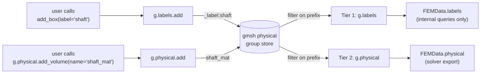
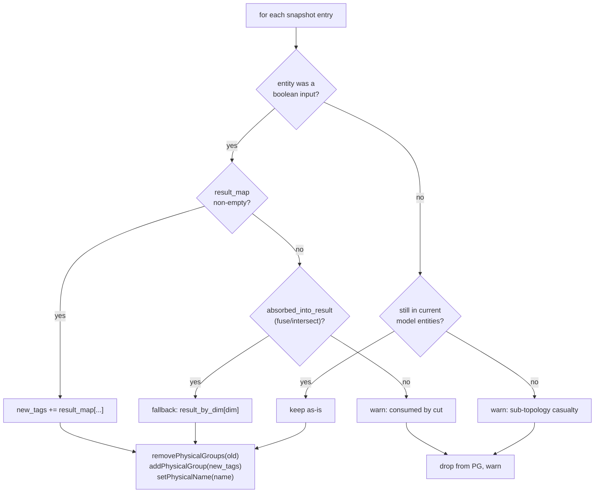
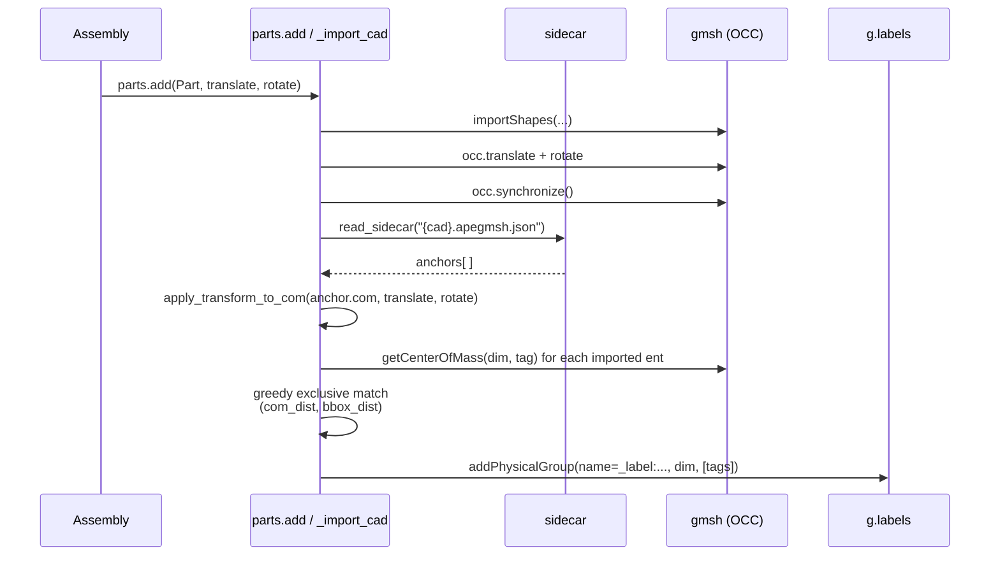

# apeGmsh Ground Truth

> [!note] Companion document
> This file is the *defence-in-depth* chapter.
> It assumes you have read [[apeGmsh_principles]] (tenets (iii) "names
> survive operations" and (iv) "define before mesh, resolve after") and
> [[apeGmsh_architecture]] §1–§2.
> Line references are to the code at the time of writing; grep the symbols
> if the files have moved.

The hardest promise apeGmsh makes is **(iii)**: a name assigned once is
valid for the rest of the session — through booleans, STEP round-trips,
re-fragmentation, and re-meshing. That promise is expensive because
gmsh's ground truth — the `(dim, tag)` integer pair — is *not* stable
across any of those operations. This document is the contributor-facing
audit of how apeGmsh keeps the abstraction from drifting, and the rules
that every new call site must follow so the abstraction *stays* un-drifted.

If a contributor adds a code path that mutates the gmsh topology without
passing through one of the mechanisms below, the abstraction breaks
silently — the user's label still resolves, but to the wrong entity, or
the entity they expect has been renumbered away. That is the failure
mode this file exists to prevent.

---

## 1. What "ground truth" means here

gmsh's Python API has exactly one identity for a geometry entity: the
pair `(dim, tag)` where `dim ∈ {0, 1, 2, 3}` and `tag` is an
OCC-assigned integer. Everything else — names, physical groups,
`setEntityName`, our labels — is *metadata layered over that pair*.

Three properties of `(dim, tag)` make it a hostile identity for
engineering workflows:

1. **Tags are not stable across OCC booleans.** `fuse`, `cut`,
   `intersect`, and `fragment` consume their inputs and emit new tags.
   The `result_map` returned by each call is the *only* source of truth
   for the remapping.
2. **Tags are not stable across STEP round-trips.** When a `Part` writes
   its geometry to STEP and the assembly re-imports it, the tags are
   freshly assigned by the importer.
3. **Physical-group membership is evaluated against stale tags after
   `synchronize()`.** gmsh's PGs do not automatically follow `result_map`
   — if you do nothing, the PG silently refers to entities that no
   longer exist.

apeGmsh does not try to replace this identity. Tenet (vii) forbids it:
"Gmsh is a beautiful piece of software. We never hide it." Instead, we
build a **name layer** on top, and invest heavily in keeping that name
layer honest across every operation that mutates the tag space.

---

## 2. The two-tier name layer

Every user-facing name in apeGmsh is ultimately stored as a gmsh
physical group. The two tiers are distinguished by a name prefix:

```
Tier 1  (geometry bookkeeping)      "_label:name"     ─► g.labels
Tier 2  (solver-facing)             "name"            ─► g.physical
```

The prefix `_label:` is the central convention.
[`core/Labels.py:68`](../src/apeGmsh/core/Labels.py) defines
`LABEL_PREFIX`, and three module-level helpers gate the two tiers:

- `is_label_pg(name)` — True if the PG is Tier 1.
- `strip_prefix(name)` / `add_prefix(name)` — the one-way doors.

Tier 2 consumers (`g.physical.get_all`, `g.physical.summary`,
`FEMData.physical`, the OpenSees exporter) **always filter out PGs for
which `is_label_pg` returns True**. Tier 1 consumers (`g.labels.*`)
filter the opposite way. Because the filter is a string prefix that no
user would accidentally type, the tiers cannot bleed into each other.



The one purpose of this separation is to make it safe to call
`g.model.geometry.add_box(..., label="shaft")` *without* polluting the
solver's namespace. The user can slice, fragment, re-mesh — and only
explicitly promote to a solver-facing PG when they are ready
(`g.labels.promote_to_physical("shaft", pg_name="shaft_mat")`).

> [!important] Rule for new code
> If you add a composite that emits PGs, it **must** decide tier and
> use the helpers in `core/Labels.py`. Writing a bare name like
> `gmsh.model.setPhysicalName(dim, tag, "foo")` skips tier filtering
> and creates a PG that *both* tiers will see. That is a bug.

---

## 3. The drift surfaces — where tags move

Five surfaces mutate the `(dim, tag)` space. Each has a dedicated
protection mechanism. Contributors adding new call sites that touch any
of these surfaces must route through the mechanism listed.

| # | Surface                        | Who touches it                              | Protection                              | Entry point                          |
|---|--------------------------------|---------------------------------------------|------------------------------------------|--------------------------------------|
| 1 | OCC booleans (fuse/cut/intersect/fragment) | `core/_model_boolean.py`, `core/_parts_fragmentation.py` | `pg_preserved()` contextmanager       | `core/Labels.py:135`                 |
| 2 | Free-entity removal after booleans | `_Boolean.fragment` (cleanup of free surfaces) | `cleanup_label_pgs(removed_dimtags)`  | `core/Labels.py:308`                 |
| 3 | Un-mapped renumberings (`removeAllDuplicates`, anchor-less reimports) | mesh-prep paths, future utilities | `reconcile_label_pgs()`              | `core/Labels.py:339`                 |
| 4 | STEP round-trip (`Part.save` → `parts.add`) | `core/Part.py`, `core/_parts_registry.py` | COM-anchor sidecar + greedy rebind   | `core/_part_anchors.py`              |
| 5 | Mesh renumbering                | `mesh/_mesh_partitioning.py`                | **none needed** — happens post-freeze   | `FEMData.from_gmsh()`                |

Everything after row 5 is the broker's problem, not the label layer's
problem — see §8.

---

## 4. The central invariant: snapshot-then-remap around every boolean

All four OCC boolean operations (`fuse`, `cut`, `intersect`, `fragment`)
destroy PG membership the moment `gmsh.model.occ.synchronize()` is
called. apeGmsh's response is a context manager that every boolean call
site in the codebase is required to wrap:

```python
from apeGmsh.core.Labels import pg_preserved

with pg_preserved() as pg:
    result, result_map = gmsh.model.occ.fragment(obj, tool, ...)
    gmsh.model.occ.synchronize()
    pg.set_result(obj + tool, result_map)
# PGs are re-created against the new tags here, on __exit__.
```

The contract is symmetric: `pg_preserved()` snapshots **every** PG on
entry (Tier 1 *and* Tier 2) and remaps **every** PG on exit, so a single
protected boolean call takes care of both tiers at once. The user never
invokes these helpers directly.

### 4.1 Snapshot (`snapshot_physical_groups`, `Labels.py:155`)

```python
{
    'dim':         int,     # 0..3
    'pg_tag':      int,     # gmsh internal PG tag
    'name':        str,     # either "name" or "_label:name"
    'entity_tags': [int],   # current membership (pre-boolean)
}
```

Captured *before* synchronize, so the entity list is still truthful.

### 4.2 Remap (`remap_physical_groups`, `Labels.py:178`)

For each snapshot entry, the remapper walks the `result_map` returned
by the OCC call:



Three details carry most of the weight:

- **`absorbed_into_result`** (`Labels.py:199`) distinguishes `cut` (a
  missing entry means "this was consumed, warn the user") from `fuse`
  and `intersect` (a missing entry means "this material is still in the
  model under a new tag, inherit"). `_Boolean._bool_op` passes the flag
  as `fn_name in ('fuse', 'intersect')`.
- **Non-input entities in a PG** are kept verbatim as long as they
  still exist in the post-synchronize model. A PG that spans entities
  some of which *weren't* boolean inputs survives the operation
  unchanged for those tags.
- **Empty PGs produce a warning, not an error.** A label whose
  entities were all consumed is not recreated; the user is told the
  label is now empty rather than having the call fail.

### 4.3 The `_PGPreserver` wrapper (`Labels.py:111`)

`pg_preserved()` yields a small `__slots__` object that stashes the
snapshot and accepts the result mapping. The context manager's
`__exit__` is where the remap happens, so the call site cannot
accidentally forget to remap: if the block returns normally, the remap
runs.

The single flag the call site *does* have to pass correctly is
`absorbed_into_result`. `_Boolean._bool_op`
(`core/_model_boolean.py:26`) handles this automatically for the four
user-facing boolean methods. `_PartsFragmentationMixin.fuse_group`
(`core/_parts_fragmentation.py:233`) passes `absorbed_into_result=True`
explicitly; `fragment_all` and `fragment_pair` pass the default
(`False`) because `fragment` splits rather than absorbs.

> [!warning] Do not call `gmsh.model.occ.{fuse,cut,intersect,fragment}`
> outside a `pg_preserved()` block. If you need a new boolean
> primitive, add it to `_Boolean` — do not sprinkle raw OCC booleans
> into composites. The linter-equivalent is `git grep` for the OCC
> method names; any hit outside `_model_boolean.py`,
> `_parts_fragmentation.py`, and tests is a bug.

---

## 5. The creation-time hook: `label=` kwargs and `_auto_pg_from_label`

A user does not call `g.labels.add(...)` directly; they say
`g.model.geometry.add_box(0, 0, 0, 1, 1, 3, label="shaft")` and expect
the label to exist afterwards. The glue for that is
`Model._register` (`core/Model.py:106`):

```python
def _register(self, dim, tag, label, kind):
    self._metadata[(dim, tag)] = {'kind': kind}
    if label and getattr(self._parent, '_auto_pg_from_label', False):
        self._parent.labels.add(dim, [tag], name=label)
    return tag
```

Two things matter here:

1. **`_auto_pg_from_label` is a session-level switch.** Both `Part`
   and `apeGmsh` set it True (see `_core.py:86` and `Part.__init__`).
   If a future session subclass wants labels-as-annotations *without*
   backing PGs, it can leave the flag False and `_register` will skip
   the PG creation.
2. **Label creation must never break geometry creation.** If
   `labels.add` raises (name collision, backend glitch), `_register`
   catches it and emits a warning rather than aborting the `add_box`
   call.

The invariant this closes: a label assigned at geometry-creation time
is a PG *before the user's next line runs*, so the first boolean
operation already has something to snapshot. Without this, labels
would only materialise on the first explicit `g.labels.add(...)` call
and would silently fail to survive an intervening boolean.

### 5.1 Merge-on-duplicate (`Labels.py:387`)

`Labels.add(dim, tags, name)` performs an upsert, not a create-or-fail:

- If `(_label:name, dim)` exists, the new tags are merged into the
  existing PG and a `UserWarning` is emitted (with a hint to use a
  different name if the merge was unintentional).
- If `(_label:name, other_dim)` exists, a cross-dim shadowing warning
  is emitted so the user knows `g.labels.entities("name")` may be
  ambiguous.

This is deliberate: after `slice()` or `fragment`, the same label often
legitimately needs to span multiple child entities; an error would
force the user to reconstruct a multi-tag PG by hand. The warning path
is the compromise — the right thing happens, but the user is told.

---

## 6. The file boundary: STEP + `.apegmsh.json` sidecar

Tag stability breaks harder at the STEP boundary than at the boolean
boundary: the importer has *no* `result_map`. gmsh's `write("foo.step")`
goes through OCC's plain STEP writer, which does not carry XDE /
TDataStd_Name labels, and third-party writers silently drop them
anyway. apeGmsh does not try to push labels through STEP; it writes
them **beside** STEP.

### 6.1 On write (`Part.save` → `collect_anchors`, `_part_anchors.py:81`)

When `Part.save("web.step")` is called, the Part session walks every
`_label:*` PG and emits a JSON record per contained entity:

```json
{
  "format_version": 1,
  "part_name": "web",
  "anchors": [
    {"pg_name": "top_flange", "dim": 2,
     "com":  [0.5, 0.0, 10.0],
     "bbox": [0.0, -0.25, 10.0, 1.0, 0.25, 10.0]}
  ]
}
```

The sidecar lives at `{cad}.apegmsh.json` (e.g.
`web.step.apegmsh.json`), sharing the directory with the STEP file.
Only Tier 1 labels are anchored — Tier 2 PGs are created explicitly in
the Assembly and don't need to travel (`_part_anchors.py:85`).

### 6.2 On read (`parts.add` → `rebind_physical_groups`, `_part_anchors.py:250`)

When the assembly session calls `g.parts.add(part_or_step,
translate=..., rotate=...)`, three things happen in sequence:



The rebind is **greedy and exclusive** (`_part_anchors.py:373`): each
imported entity can be claimed by at most one anchor. Ties are broken
by bbox distance when both sides have bbox data. Anchors that fail to
match within tolerance emit a warning rather than raising — the import
must still succeed so the user can inspect what happened
(`_part_anchors.py:397`).

### 6.3 Why COMs and not STEP metadata

Three reasons, stated in order of decreasing optimism:

1. Embedding labels in STEP XDE would require bypassing gmsh's writer.
   Tenet (vii) forbids hiding gmsh.
2. Even if we embedded them, third-party readers drop XDE silently.
3. A JSON sidecar is grep-able and trivially version-controllable,
   which matches tenet (xiv)'s "notebook-ergonomic" bias.

### 6.4 Known limitation

The rebind is valid **at import time only**. Subsequent
`fragment_all()` or `fuse_group()` calls in the assembly go through
`pg_preserved()` (§4) and the rebound PGs survive those, but the
stored `label_to_tag` snapshot inside the sidecar is not re-read.
Symmetric parts may tie — the first match by gmsh tag wins with a
warning (`_part_anchors.py:381`).

---

## 7. Fallbacks for un-mapped mutations

Some gmsh operations renumber entities *without* providing a
`result_map` — `removeAllDuplicates`, some CAD healing paths, and any
user who drops into `gmsh.*` directly per tenet (vii)'s escape-hatch
clause. Two fallbacks exist:

### 7.1 `cleanup_label_pgs(removed_dimtags)` (`Labels.py:308`)

Called when the caller *knows* exactly which entities were removed.
Used by `_Boolean.fragment` (`_model_boolean.py:181`) after its
free-surface sweep: after fragmenting in 3D, dim=2 surfaces with no
upward adjacency to a volume are trimmed; `cleanup_label_pgs` drops
those tags from any Tier 1 label that referenced them and removes
labels that become empty.

Only Tier 1 is touched. User-facing PGs are left alone because the
caller may want different semantics (e.g. a surface PG that should
warn rather than silently shrink).

### 7.2 `reconcile_label_pgs()` (`Labels.py:339`)

Called when the caller does *not* know which entities moved. Walks
every `_label:*` PG, compares membership against the current model's
entity set, drops stale tags, and removes labels that become empty.

This is the "nuclear option" for users who have dropped into
`gmsh.*` per the tenet (vii) escape hatch and are returning to
apeGmsh. It is not called automatically anywhere; advertising it in
the public API is future work.

---

## 8. The freeze: the broker is where drift ends

All of §3–§7 keeps labels honest in the *live* gmsh session. The
final defence — tenet (xi), "pre-mesh is mutable; the broker is
frozen" — is that `FEMData.from_gmsh(dim=..., session=g)` produces a
snapshot that does not hold a gmsh reference.

```
┌────────────────────┐        FEMData.from_gmsh()         ┌─────────────────────┐
│ live gmsh session  │  ────────────────────────────────► │   FEMData (frozen)  │
│   (dim, tag) can   │  one-way copy of nodes, elements,  │  node ids, coords,  │
│   still change     │  PG membership, labels, metadata   │  elements, PG sets, │
└────────────────────┘                                    │  LabelSet, records  │
                                                          └─────────────────────┘
```

Everything downstream — the OpenSees exporter, the MPCO recorders,
the mesh viewer, the constraint resolver, the load resolver — reads
from `FEMData`, never from gmsh. Mesh renumbering
(`mesh/_mesh_partitioning.py`) can therefore run against the broker
without any of the label-layer protections: the names are already
resolved to node/element ids, and the mapping is captured in
`NumberedMesh` / `RenumberResult`.

The consequence for contributors: **once the broker has been taken,
any further tag drift in the gmsh session does not affect exported
work.** Re-meshing produces a fresh `FEMData`, not a mutation of the
old one — tenet (xi).

---

## 9. Contributor checklist

When writing a new composite, resolver, or utility that touches the
gmsh topology, run down this list:

1. **Am I calling any of `occ.fuse`, `occ.cut`, `occ.intersect`,
   `occ.fragment`?** → Wrap in `pg_preserved()` and call
   `pg.set_result(input_dimtags, result_map, absorbed_into_result=...)`
   before the block exits. Refer to
   `core/_model_boolean.py:_Boolean._bool_op` for the canonical
   pattern.
2. **Am I calling `occ.remove` with a known list of dimtags?** →
   Call `cleanup_label_pgs(removed)` after `synchronize()`.
3. **Am I calling an operation that renumbers without a result map
   (`removeAllDuplicates`, some healing paths)?** → Document it
   loudly and provide a path for the caller to run
   `reconcile_label_pgs()` afterwards. Do not call it implicitly; it
   is a full-model scan.
4. **Am I emitting a physical group?** → Decide tier. Tier 1 uses
   `g.labels.add(...)` which prefixes for you. Tier 2 uses
   `g.physical.add(...)`. Never call
   `gmsh.model.setPhysicalName(dim, tag, "raw_name")` directly from
   a composite.
5. **Am I accepting a name from the user?** → Pass it through
   `resolve_to_tags(ref, dim=dim, session=self._parent)`
   (`core/_helpers.py:75`) so labels *and* PGs resolve with a single
   call. Order is Tier 1 first, Tier 2 second — respect that.
6. **Am I creating a new file format that round-trips geometry?** →
   Write a sidecar; do not try to embed labels in the CAD file.
   Mimic the COM-anchor structure in `_part_anchors.py`; do not
   reinvent the matching algorithm.
7. **Am I about to touch `FEMData` after construction?** → Don't.
   `FEMData` is frozen by contract. If a new piece of information
   needs to live on the broker, add it to `from_gmsh` so every user
   gets it consistently.

### 9.1 Anti-patterns the test suite catches

- Boolean without `pg_preserved` → a label disappears after fragment
  (`tests/test_labels_boolean.py` style).
- PG with raw (unprefixed) internal name → leaks into the OpenSees
  exporter (tested by Tier 2 filter assertions).
- Part imported without sidecar path → labels present in the Part
  but absent in the Assembly after `parts.add` (tested by anchor
  round-trip fixtures).

If your change breaks any of these, the failure is a guide to which
layer of the defence you have skipped.

---

## 10. Summary: the chain of trust

The abstraction "a label survives the whole session" is held up by
seven mechanisms, layered so that each one closes a different gap:

```
geometry creation        ──► _register + labels.add         (§5)
boolean ops              ──► pg_preserved / remap           (§4)
free-entity removal      ──► cleanup_label_pgs              (§7.1)
un-mapped renumberings   ──► reconcile_label_pgs            (§7.2)
file round-trip          ──► sidecar + COM rebind           (§6)
assembly booleans        ──► pg_preserved (same as §4)      (§4 again)
export to solver         ──► FEMData.from_gmsh freeze       (§8)
```

No single mechanism is sufficient. Removing any one of them opens a
drift surface that the remaining mechanisms cannot close. Every
contribution that touches gmsh topology is either routed through one
of these seven, or it is extending one of them — there is no third
option.

> [!tip] Reading order for new contributors
> 1. `core/Labels.py` — the whole file. Start with
>    `LABEL_PREFIX`, then `pg_preserved` and `remap_physical_groups`,
>    then `Labels.add`.
> 2. `core/_model_boolean.py` — the canonical call site.
> 3. `core/Model.py` — the `_register` hook.
> 4. `core/_part_anchors.py` — read + write + rebind, in that
>    order.
> 5. `core/_parts_fragmentation.py` — shows `pg_preserved` in an
>    assembly-scope boolean.
> 6. `mesh/FEMData.py::from_gmsh` — the one-way valve.

---

*Cross-references:*
[[apeGmsh_principles]] · [[apeGmsh_architecture]] · [[apeGmsh_navigation]] ·
[[gmsh_basics]] · [[gmsh_selection]]
