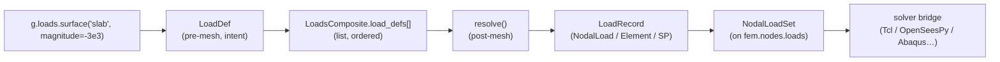

# apeGmsh Loads

> [!note] Companion document
> This file documents the **loads subsystem** — how pre-mesh geometric
> intent (pressures, gravity, line loads, prescribed face motions) is
> captured, grouped, and then resolved into per-node / per-element
> records on the frozen broker. It assumes you have read
> [[apeGmsh_principles]] (tenets **(ix)** "three class flavours",
> **(xi)** "pre-mesh is mutable, the broker is frozen", **(xii)** "pure
> resolvers, impure composites"), [[apeGmsh_broker]] for where
> [[apeGmsh_broker#fem.nodes|`fem.nodes`]] ends up carrying the records,
> and [[apeGmsh_partInstanceAssemble]] for the part-label naming that
> feeds targets.

Loads live in two files — one impure (Gmsh-aware), one pure
(numpy-only). This split is deliberate: the composite queries Gmsh for
entity geometry at `resolve()` time; the resolver receives raw arrays
and returns records. No load record ever carries a `(dim, tag)` — only
mesh node IDs and element tags.

```
src/apeGmsh/core/LoadsComposite.py    ← the composite (factory + target resolution)
src/apeGmsh/solvers/Loads.py          ← LoadDef hierarchy, LoadResolver, LoadRecord
src/apeGmsh/mesh/_record_set.py       ← NodalLoadSet (the record set stored on fem.nodes)
```

The session exposes the composite as `g.loads`. That's the only public
entry point contributors need to know; everything below is the shape
under the surface.

---

## 1. Why a two-stage pipeline

The intent (*"a 3 kN/m² pressure on the slab"*) is stable across mesh
refinements. The *resolved* nodal values are not — they change with
every `h`-refinement, element order, and face connectivity. If we
stored only resolved values, refining the mesh would silently drop
loads. If we stored only intent, the solver would need to know Gmsh.

The two-stage model keeps both at their own layer:



> [!important] The resolver never calls Gmsh.
> Target resolution (label → PG → part → `(dim, tag)`) is done by
> `LoadsComposite`. The resolver in `solvers/Loads.py` receives raw
> numpy arrays (node tags, coords, element tags, connectivity) and
> returns records. This is tenet **(xii)**: *pure resolvers, impure
> composites.*

---

## 2. LoadDef hierarchy (pre-mesh, intent)

Eight dataclasses, all inheriting from `LoadDef`. Each carries a
`target` identifier (flexible — resolved by the composite), a `pattern`
name (for grouping), and — for distributed loads — a `reduction` and
`target_form` pair that selects the math at resolve-time.

| Def subclass             | Geometric scope            | Extra fields                                                    |
| ------------------------ | -------------------------- | --------------------------------------------------------------- |
| `PointLoadDef`           | node(s)                    | `force_xyz`, `moment_xyz`                                       |
| `PointClosestLoadDef`    | nearest mesh node(s) to xyz | `xyz_request`, `within`, `tol`, `snap_distance` (writeback)   |
| `LineLoadDef`            | curve / 1-D entity         | `magnitude`+`direction`/`q_xyz`; `normal`+`away_from`           |
| `SurfaceLoadDef`         | face / 2-D entity          | `magnitude`, `normal: bool`, `direction`                        |
| `GravityLoadDef`         | volume / 3-D entity        | `g=(gx,gy,gz)`, `density` (or ``None`` to defer to the solver)  |
| `BodyLoadDef`            | volume / 3-D entity        | `force_per_volume=(bx,by,bz)`                                   |
| `FaceLoadDef`            | single face, centroid load | `force_xyz`, `moment_xyz` (least-norm to nodes)                 |
| `FaceSPDef`              | single face, prescribed u  | `dofs`, `disp_xyz`, `rot_xyz` (rigid-body motion at centroid)   |

All Def subclasses inherit three pipeline-selecting fields from the
base class:

- `reduction ∈ {"tributary", "consistent"}` — how a distributed load
  collapses onto nodes. *Tributary* is length/area/volume-weighted
  (mass-lumped); *consistent* integrates shape functions (equivalent
  to `f = ∫ N·q`). For linear elements the two match; higher-order
  edges/faces will diverge when that path is finished (see
  `resolve_line_consistent` note in `solvers/Loads.py:537`).
- `target_form ∈ {"nodal", "element"}` — where the load lands.
  *Nodal* produces one `NodalLoadRecord` per affected node;
  *element* produces one `ElementLoadRecord` per element (downstream
  emits `eleLoad -beamUniform`, `-type -surfacePressure`, or
  `-type -bodyForce`).
- `target_source ∈ {"auto", "pg", "label", "tag"}` — which resolution
  step is tried first. Set by the factory method from keyword overrides.

> [!tip] What `(reduction, target_form)` buys you
> * `("tributary", "nodal")` — closest to what first-timers expect.
>   Concentrated forces at nodes. Works everywhere.
> * `("consistent", "nodal")` — work-equivalent nodal forces for
>   higher-order elements; the "correct" FEM answer.
> * `("tributary", "element")` / `("consistent", "element")` — emit
>   `eleLoad` commands. Preferred for beams (lets OpenSees do the
>   member-end force calculation correctly) and for solid body loads
>   where the solver has its own quadrature.

---

## 3. LoadsComposite — factory + target resolution

`LoadsComposite` is a **composite** in the [[apeGmsh_principles]]
tenet-(ix) sense: it holds state (`load_defs`, `load_records`,
`_active_pattern`), queries the session, and owns side-effects. Every
method either appends a `LoadDef` or consumes one at resolve-time.

### 3.1 Seven factory methods

Each mirrors the Def subclass it builds:

```python
g.loads.point         (target, *, pg=None, label=None, tag=None,
                       force_xyz=None, moment_xyz=None, name=None)
g.loads.point_closest (xyz, *, within=None, pg=None, label=None, tag=None,
                       force_xyz=None, moment_xyz=None,
                       tol=None, name=None)
g.loads.line          (target, *, magnitude=None, direction=(0,0,-1),
                       q_xyz=None, reduction="tributary",
                       target_form="nodal", name=None)
g.loads.surface       (target, *, magnitude=0., normal=True,
                       direction=(0,0,-1), reduction="tributary",
                       target_form="nodal", name=None)
g.loads.gravity       (target, *, g=(0,0,-9.81), density=None,
                       reduction="tributary", target_form="nodal", name=None)
g.loads.body          (target, *, force_per_volume=(0,0,0),
                       reduction="tributary", target_form="nodal", name=None)
g.loads.face_load     (target, *, force_xyz=None, moment_xyz=None, name=None)
g.loads.face_sp       (target, *, dofs=None, disp_xyz=None, rot_xyz=None, name=None)
```

> [!tip] `point_closest` — coordinate-driven point loads
> When the load point doesn't live on a named PG/label, give a
> world-coordinate `xyz` and let the composite snap to the nearest
> mesh node at resolve time. `within=` (PG / label / part / DimTag
> list) restricts the candidate pool. `tol=None` (default) returns
> the single nearest node; `tol > 0` returns every node inside that
> radius. The actual snap distance is written back to
> `defn.snap_distance` after resolve so it surfaces in `summary()`
> (see `LoadsComposite.py:245-278, 1065-1121`).

### 3.2 Target resolution (the five-step lookup)

Every factory method accepts a flexible `target` plus three explicit
keyword overrides (`pg=`, `label=`, `tag=`). Under the hood,
`_coalesce_target` collapses these into `(target_value, source)` and
`_resolve_target()` walks a prioritized lookup chain:

| # | Source                   | Provided by               | Tried when `source=`      |
| - | ------------------------ | ------------------------- | ------------------------- |
| 1 | raw `list[(dim, tag)]`   | the caller                | any (type check)          |
| 2 | mesh selection name      | `g.mesh_selection`        | `auto`                    |
| 3 | label (Tier 1, prefixed) | `_label:`-prefixed PG     | `auto`, `label`           |
| 4 | physical group (Tier 2)  | user-authored PG          | `auto`, `pg`              |
| 5 | part label               | `g.parts._instances`      | `auto`                    |

First match wins. If two namespaces share a name, **label wins** over
PG because it's checked first. To pin a specific source, use the
keyword form:

```python
g.loads.point("top",            force_xyz=(0, 0, -1))   # auto
g.loads.point(pg="top",         force_xyz=(0, 0, -1))   # force PG
g.loads.point(label="top",      force_xyz=(0, 0, -1))   # force label
g.loads.point(tag=[(0, 7)],     force_xyz=(0, 0, -1))   # direct DimTag
```

> [!warning] Target is resolved at `resolve()` time, not at `point()` time.
> The factory stores the *name*, not the resolved entities. If you
> add a label after storing the def, the lookup still succeeds. If
> you rename something between `g.loads.point(...)` and
> `g.mesh.get_fem_data()`, the lookup will fail with a `KeyError`.
> This is [[apeGmsh_principles|tenet (iii)]] "names survive
> operations": intent is *declared* against names, resolved against
> the live session.

### 3.3 The dispatch table

`_DISPATCH` maps `(LoadDefType, reduction, target_form)` to a private
`_resolve_<kind>` method on the composite. `_add_def` validates the
combo at factory time — an unsupported `(reduction, target_form)`
combination raises **before** the def is stored, so the failure
message names the offending call site, not the resolve pass.

```
PointLoadDef          │ tributary / nodal     → _resolve_point
PointClosestLoadDef   │ tributary / nodal     → _resolve_point_closest
LineLoadDef           │ {trib,cons} × nodal   → _resolve_line_{tributary,consistent}
                      │ {trib,cons} × element → _resolve_line_element
SurfaceLoadDef        │ {trib,cons} × nodal   → _resolve_surface_{tributary,consistent}
                      │ {trib,cons} × element → _resolve_surface_element
GravityLoadDef        │ {trib,cons} × nodal   → _resolve_gravity_{tributary,consistent}
                      │ {trib,cons} × element → _resolve_gravity_element
BodyLoadDef           │ {trib,cons} × nodal   → _resolve_body_tributary
                      │ {trib,cons} × element → _resolve_body_element
FaceLoadDef           │ tributary / nodal     → _resolve_face_load
FaceSPDef             │ tributary / nodal     → _resolve_face_sp
```

Each `_resolve_<kind>` method is a thin shim: it queries Gmsh for the
right geometry primitive (edges, faces, element connectivity) and
hands raw arrays to `LoadResolver`. Three helpers back this:

- `_target_nodes(target, node_map, all_nodes, source)` — set of node IDs.
- `_target_edges(target, source)` — list of `(n1, n2)` pairs from
  `gmsh.model.mesh.getElements(dim=1, tag)`.
- `_target_faces(target, source)` — list of node-ID lists from
  `getElements(dim=2, tag)`, keeping only corner nodes for
  area/normal math.
- `_target_elements(target, source)` — `(eids, conn_rows)` from
  `getElements(dim=3, tag)` for volume loads.

The fast path for part-label targets uses the pre-computed `node_map`
(built by [[apeGmsh_partInstanceAssemble#PartsRegistry|`g.parts.build_node_map`]])
instead of re-querying Gmsh.

### 3.4 Per-edge normal pressure on lines

`LineLoadDef.normal=True` (with optional `away_from=(x0, y0, z0)`,
`Loads.py:98-99`) emits a force-per-length vector perpendicular to
each edge in the xy-plane. Three composite-side helpers back this:

- `_curve_inplane_sign(curve_tag)` — uses `gmsh.model.getAdjacencies`
  + oriented boundary to recover the in-plane "into-structure" sign
  when the curve bounds exactly one surface
  (`LoadsComposite.py:1143`).
- `_edge_normal_q(...)` — builds the per-edge normal vector
  `(-Ty, Tx, 0)` (or its mirror), flipping toward / away from
  `away_from` when given (`LoadsComposite.py:1176`).
- `_collect_line_normal_items(...)` — walks every 1-D mesh element on
  the resolved entities and bundles `(n1, n2, q)` tuples for the
  resolver (`LoadsComposite.py:1210`).

### 3.5 `validate_pre_mesh()`

`LoadsComposite.validate_pre_mesh()` (`LoadsComposite.py:753`) walks
every stored `LoadDef` whose `target` is a string and re-runs
`_resolve_target` so unknown labels / PGs / part labels surface as
`KeyError` *before* meshing. It is invoked by `Mesh.generate(...)`
so typos fail fast rather than after minutes of meshing. Raw
`(dim, tag)` lists are skipped.

---

## 4. Patterns — grouping defs for the solver

OpenSees organizes loads into *patterns* (each with a `timeSeries`). The
composite mirrors that vocabulary with a lightweight context manager:

```python
with g.loads.pattern("dead"):
    g.loads.gravity("concrete", g=(0, 0, -9.81), density=2400)
    g.loads.line("beams", magnitude=-2e3, direction="z")

with g.loads.pattern("live"):
    g.loads.surface("slabs", magnitude=-3e3)
```

`_active_pattern` is a single string attribute on the composite. Each
factory method copies it into the Def's `pattern` field. Defs outside
any `pattern(...)` block default to `"default"`. Queries:

- `g.loads.by_pattern(name)` → `list[LoadDef]`
- `g.loads.patterns()` → ordered list of unique pattern names

The downstream OpenSees emitter loops over `patterns()` and emits one
`ops.pattern('Plain', ...)` block per name.

---

## 5. LoadResolver — pure numpy

`LoadResolver` in `solvers/Loads.py` is the **pure def** in tenet-(ix)
terms: no `self._parent`, no Gmsh imports, no session plumbing. It
holds only the four resolved arrays and a pair of `{tag: index}`
lookup dicts:

```python
LoadResolver(node_tags, node_coords, elem_tags=None, connectivity=None)
```

Geometry helpers — all `O(1)` hash lookups via `_node_to_idx`:

- `coords_of(node_id) -> (3,) ndarray`
- `edge_length(n1, n2) -> float`
- `face_area(node_ids) -> float` — fan triangulation from `node[0]`
- `face_normal(node_ids) -> (3,) ndarray` — cross product of first
  three nodes; sign convention: first three nodes CCW ⇒ outward
- `element_volume(conn_row) -> float` — exact tet4, 6-tet decomposition
  for hex8, bbox fallback for exotic types

Per-path math (all returning `list[LoadRecord]`):

- `resolve_point(defn, node_set)` — same `(F, M)` at every node.
- `resolve_line_tributary(defn, edges)` — each edge deposits `q·L/2`
  at each endpoint.
- `resolve_surface_tributary(defn, faces)` — each face contributes
  `magnitude·A·n / N_nodes`.
- `resolve_gravity_tributary(defn, elements)` — `ρ·V·g / N_nodes` per
  element (requires `defn.density` to be set; see warning below).
- `resolve_body_tributary(defn, elements)` — `bf·V / N_nodes`.
- `resolve_line_consistent`, `resolve_surface_consistent`,
  `resolve_gravity_consistent` — for linear / tri3 / quad4 these
  currently delegate to tributary (correct up to that order).
- `resolve_line_element`, `resolve_surface_element`,
  `resolve_gravity_element`, `resolve_body_element` — emit
  `ElementLoadRecord`s (`beamUniform`, `surfacePressure`, `bodyForce`).
- `resolve_face_load(defn, node_ids)` — equal-split for `force_xyz`;
  least-norm distribution for `moment_xyz` via a 6×3N equilibrium
  matrix (`_moment_to_nodal_forces`).
- `resolve_face_sp(defn, node_ids)` — `u_i = disp_xyz + rot_xyz × r_i`,
  emits one `SPRecord` per constrained DOF per node.

> [!warning] Gravity needs a density in tributary mode
> `GravityLoadDef` with `target_form="nodal"` **requires**
> `density=...` on the def. If you pass `density=None`, the resolver
> refuses rather than silently emitting zero force. To defer density
> to the solver's material/section, use `target_form="element"`, which
> emits `eleLoad -type -bodyForce` with `density=None` and lets the
> solver read ρ from the fiber/quad section.

---

## 6. LoadRecord hierarchy (post-mesh, resolved)

Three record types, all inheriting from `LoadRecord`:

| Record type          | Fields                                                         | Emitted for                                           |
| -------------------- | -------------------------------------------------------------- | ------------------------------------------------------ |
| `NodalLoadRecord`    | `node_id`, `force_xyz`, `moment_xyz`                           | point, line/surface/gravity/body (nodal form), face_load |
| `ElementLoadRecord`  | `element_id`, `load_type`, `params: dict`                      | line/surface/gravity/body (element form)               |
| `SPRecord`           | `node_id`, `dof` (1-based), `value`, `is_homogeneous`          | face_sp only                                           |

Records are **solver-agnostic**: `force_xyz` and `moment_xyz` are pure
3D spatial vectors, not 6-DOF slices. Zero sub-vectors are stored as
`None` so the downstream emitter skips them cheaply.

The composite's `resolve()` returns the whole list wrapped in a
`NodalLoadSet` (see `mesh/_record_set.py`), which is the collection
object that ends up on `fem.nodes.loads`. See [[apeGmsh_broker]] §5 for
the record-set conventions (atomic vs compound iterators, object dtype,
etc.).

---

## 7. End-to-end skeleton

```python
import apeGmsh as ape
import openseespy.opensees as ops

with ape.apeGmsh("bridge.geo") as g:
    with g.parts.part("deck") as p:
        p.box(10, 2, 0.3)
    with g.parts.part("pier") as p:
        p.box(1, 1, 5)

    g.parts.register_instances({"deck": (0, 0, 5),
                                "pier1": (0, 0, 0),
                                "pier2": (10, 0, 0)})
    g.parts.add_label("deck_top", part="deck", dim=2,
                      where="max_z")

    # Pre-mesh intent
    with g.loads.pattern("dead"):
        g.loads.gravity("deck",  g=(0, 0, -9.81), density=2400)
        g.loads.gravity("pier1", g=(0, 0, -9.81), density=2400)
        g.loads.gravity("pier2", g=(0, 0, -9.81), density=2400)

    with g.loads.pattern("live"):
        g.loads.surface(label="deck_top", magnitude=-5e3,
                        reduction="consistent")

    g.mesh.generate(size=0.5)
    fem = g.mesh.get_fem_data(dim=3)   # <-- resolve() fires here

# Frozen fork — no more Gmsh
ops.wipe(); ops.model("basic", "-ndm", 3, "-ndf", 6)
for nid, x, y, z in fem.nodes.iter_coords():
    ops.node(int(nid), float(x), float(y), float(z))
for pat in fem.nodes.loads.patterns():
    ops.timeSeries("Linear", hash(pat))
    ops.pattern("Plain", hash(pat), hash(pat))
    for rec in fem.nodes.loads.by_pattern(pat):
        if rec.force_xyz:
            ops.load(rec.node_id, *rec.force_xyz, 0.0, 0.0, 0.0)
```

The important observation: after `get_fem_data(dim=3)` returns, the
`with` block is the only thing still touching Gmsh. Everything below
is pure numpy + OpenSees. The loads arrived as node IDs; the session
can be closed and the solver will still run.

---

## 8. Contributor rules

1. **Every new load type is a new `LoadDef` subclass + a
   `_DISPATCH` entry + a `_resolve_<kind>`**. Don't smuggle extra
   parameters into existing def subclasses — the dispatch table is
   the source of truth for supported combos.
2. **The resolver stays pure.** If you need a Gmsh query, do it in
   the composite and pass the resolved array to the resolver. Adding
   `import gmsh` to `solvers/Loads.py` breaks tenet **(xii)**.
3. **Target resolution follows the five-step chain.** Do not reimplement
   lookup in a factory method — always route through
   `_coalesce_target` + `_resolve_target`.
4. **Patterns group, they don't filter.** Never use the pattern name as
   a target selector. A pattern is *what* timeseries the load attaches
   to, not *where* it lives.
5. **Records never carry `(dim, tag)`.** After `resolve()`, the bridge
   to the solver is mesh-level only. This is what makes the broker
   freeze sound: downstream of `from_gmsh(...)` no object references
   the OCC kernel.
6. **`reduction` and `target_form` are orthogonal axes.** If you add a
   new reduction (e.g. `"petrov_galerkin"`), you add it for *every*
   applicable def, not just the one you need. If you add a new
   `target_form` (e.g. `"gauss_point"`), same rule.

---

## 9. Where it plugs in

- **Stored on the session** as `g.loads` (a `LoadsComposite`
  instance, built in `apeGmsh._core.apeGmsh.__init__`; see
  [[apeGmsh_architecture]] §3 on composites).
- **Called by** `Mesh.get_fem_data(...)` after meshing — the resolver
  fires exactly once per freeze, with the post-mesh `node_tags`,
  `node_coords`, `elem_tags`, and `connectivity` arrays.
- **Stored as** `fem.nodes.loads: NodalLoadSet` on the broker — see
  [[apeGmsh_broker#fem.nodes|`fem.nodes`]] for the full record-set
  contract.
- **Emitted by** the OpenSees bridge (`solvers/_opensees_build.py`)
  which loops `fem.nodes.loads.patterns()` → `by_pattern(name)` →
  `ops.load(...)` / `ops.eleLoad(...)` / `ops.sp(...)`.

The load pipeline is one of the shorter FSMs in the codebase:

```
factory (pre-mesh)  →  store in load_defs  →  resolve (post-mesh)  →  NodalLoadSet on fem.nodes.loads  →  solver emission
```

Four arrows. If you add a sixth — say, pre-mesh validation that
queries Gmsh for entity existence — you've broken tenet **(xi)**
"pre-mesh is mutable"; entities don't settle until after the first
meshing pass.
