# apeGmsh Navigation

> [!note] Companion documents
> [[apeGmsh_principles]] — *what we promise* (tenets i–xiv).
> [[apeGmsh_architecture]] — *how the machinery holds those promises together*.
> **This file** — *where the code lives*. Class and method index, task-to-file
> map, and a tree of every public and private symbol under `src/apeGmsh/`.

Navigation is intentionally mechanical. The architecture doc explains *why*
things are arranged the way they are; here you get the minimum information
needed to find the right file and the right method without reading
docstrings. Use §3 if you know **what you want to do**, §4 if you know
**what class you're looking for**.

---

## 1. The architecture idea in one paragraph

apeGmsh is a thin, opinionated layer over the gmsh Python API that turns
gmsh's singleton, `(dim, tag)`-indexed, imperative state machine into a
session-scoped, *name-indexed*, solver-ready broker. Users compose models
from `Part` objects (isolated OCC sessions persisted as STEP + anchor
sidecars), import them into a top-level `apeGmsh` session where they get
**labels** (Tier 1 `_label:`-prefixed physical groups), declare
constraints, loads, and masses against those labels *before meshing*,
generate a mesh, then fork a frozen `FEMData` snapshot — the **broker** —
which solver adapters (OpenSees, today) consume. Between *define* and
*resolve*, pure numpy resolvers turn intent into records; the broker
boundary is the only contract the solver adapters see. See
[[apeGmsh_architecture]] §0 for the full invariants and §10 for an
end-to-end trace.

---

## 2. Top-level composite map

Every symbol below hangs off a live `apeGmsh` session instance (`g`).
`g.*` attributes are created by `_SessionBase._create_composites()` from
the `_COMPOSITES` tuple in [`_core.py`](../src/apeGmsh/_core.py).

```mermaid
graph TD
    G[apeGmsh session <br/> g]
    G --> INSPECT[g.inspect<br/><i>viz.Inspect</i>]
    G --> MODEL[g.model<br/><i>core.Model</i>]
    G --> LABELS[g.labels<br/><i>core.Labels</i>]
    G --> SECTIONS[g.sections<br/><i>sections.SectionsBuilder</i>]
    G --> PARTS[g.parts<br/><i>core.PartsRegistry</i>]
    G --> CONSTR[g.constraints<br/><i>ConstraintsComposite</i>]
    G --> LOADS[g.loads<br/><i>LoadsComposite</i>]
    G --> MASSES[g.masses<br/><i>MassesComposite</i>]
    G --> MESH[g.mesh<br/><i>mesh.Mesh</i>]
    G --> LOADER[g.loader<br/><i>mesh.MshLoader</i>]
    G --> PHYS[g.physical<br/><i>mesh.PhysicalGroups</i>]
    G --> MSEL[g.mesh_selection<br/><i>MeshSelectionSet</i>]
    G --> VIEW[g.view<br/><i>mesh.View</i>]
    G --> OPS[g.opensees<br/><i>solvers.OpenSees</i>]
    G --> PLOT[g.plot<br/><i>viz.Plot — lazy</i>]

    MODEL --> MG[.geometry <i>_Geometry</i>]
    MODEL --> MB[.boolean <i>_Boolean</i>]
    MODEL --> MT[.transforms <i>_Transforms</i>]
    MODEL --> MQ[.queries <i>_Queries</i>]
    MODEL --> MIO[.io <i>_IO</i>]

    MESH --> MESHGEN[.generation <i>_Generation</i>]
    MESH --> MESHQ[.queries <i>_Queries</i>]
    MESH --> MESHSZ[.sizing <i>_Sizing</i>]
    MESH --> MESHF[.fields <i>FieldHelper</i>]
    MESH --> MESHE[.editing <i>_Editing</i>]
    MESH --> MESHS[.structured <i>_Structured</i>]
    MESH --> MESHP[.partitioning <i>_Partitioning</i>]

    OPS --> OMAT[.materials <i>_Materials</i>]
    OPS --> OELEM[.elements <i>_Elements</i>]
    OPS --> OING[.ingest <i>_Ingest</i>]
    OPS --> OEXP[.export <i>_Export</i>]
    OPS --> OINS[.inspect <i>_Inspect</i>]
```



The ASCII equivalent, for pasting into commit messages:

```
g                                                       (apeGmsh session)
├── inspect          viz.Inspect
├── model            core.Model
│   ├── .geometry    _Geometry          (core/_model_geometry.py)
│   ├── .boolean     _Boolean           (core/_model_boolean.py)
│   ├── .transforms  _Transforms        (core/_model_transforms.py)
│   ├── .queries     _Queries           (core/_model_queries.py)
│   └── .io          _IO                (core/_model_io.py)
├── labels           core.Labels
├── sections         sections.SectionsBuilder
├── parts            core.PartsRegistry
├── constraints      ConstraintsComposite
├── loads            LoadsComposite
├── masses           MassesComposite
├── mesh             mesh.Mesh
│   ├── .generation    _Generation      (mesh/_mesh_generation.py)
│   ├── .queries       _Queries         (mesh/_mesh_queries.py)
│   ├── .sizing        _Sizing          (mesh/_mesh_sizing.py)
│   ├── .fields        FieldHelper      (mesh/_mesh_field.py)
│   ├── .editing       _Editing         (mesh/_mesh_editing.py)
│   ├── .structured    _Structured      (mesh/_mesh_structured.py)
│   └── .partitioning  _Partitioning    (mesh/_mesh_partitioning.py)
├── loader           mesh.MshLoader
├── physical         mesh.PhysicalGroups
├── mesh_selection   mesh.MeshSelectionSet
├── view             mesh.View
├── opensees         solvers.OpenSees
│   ├── .materials   _Materials
│   ├── .elements    _Elements
│   ├── .ingest      _Ingest
│   ├── .export      _Export
│   └── .inspect     _Inspect
└── plot             viz.Plot                           (lazy-loaded)
```

Output of the workflow is `fem = g.mesh.queries.get_fem_data(dim=N)` —
a frozen [`FEMData`](../src/apeGmsh/mesh/FEMData.py) that has its own
composite tree: `fem.nodes`, `fem.elements`, `fem.physical`, `fem.labels`,
`fem.constraints`, `fem.loads`, `fem.masses`, `fem.inspect`. See §4.3
for the full broker surface.

---

## 3. Task-oriented index — "I want to X → go to Y"

### 3.1 Build geometry

| I want to…                              | Call                                                     | Lives in                                         |
| --------------------------------------- | -------------------------------------------------------- | ------------------------------------------------ |
| add a point / line / spline             | `g.model.geometry.add_point`, `add_line`, `add_spline`   | `core/_model_geometry.py`                        |
| add a primitive solid                   | `g.model.geometry.add_box` / `_sphere` / `_cylinder` / `_cone` / `_torus` / `_wedge` | `core/_model_geometry.py`                        |
| add a rectangle / surface / curve loop  | `g.model.geometry.add_rectangle` / `add_plane_surface` / `add_curve_loop` | `core/_model_geometry.py`                        |
| add a geometric imperfection            | `g.model.geometry.add_imperfect_line`                    | `core/_model_geometry.py`                        |
| cut a body by a surface or a plane      | `g.model.geometry.cut_by_surface` / `cut_by_plane`       | `core/_model_geometry.py`                        |
| insert a cutting plane along an axis    | `g.model.geometry.add_axis_cutting_plane`                | `core/_model_geometry.py`                        |
| slice a body into pieces                | `g.model.geometry.slice`                                 | `core/_model_geometry.py`                        |
| fuse / cut / intersect / fragment       | `g.model.boolean.fuse` / `cut` / `intersect` / `fragment` | `core/_model_boolean.py`                         |
| translate / rotate / scale / mirror / copy | `g.model.transforms.translate` / `rotate` / `scale` / `mirror` / `copy` | `core/_model_transforms.py`                      |
| extrude / revolve / sweep / thru-sections | `g.model.transforms.extrude` / `revolve` / `sweep` / `thru_sections` | `core/_model_transforms.py`                      |
| load STEP / IGES / DXF / heal shapes    | `g.model.io.load_step` / `load_iges` / `load_dxf` / `heal_shapes` | `core/_model_io.py`                              |
| save geometry to STEP / IGES / DXF      | `g.model.io.save_step` / `save_iges` / `save_dxf`        | `core/_model_io.py`                              |
| compute bbox / center-of-mass / mass    | `g.model.queries.bounding_box` / `center_of_mass` / `mass` | `core/_model_queries.py`                         |
| remove duplicates / make conformal      | `g.model.queries.remove_duplicates` / `make_conformal`   | `core/_model_queries.py`                         |
| sync OCC → model                        | `g.model.sync()`                                         | `core/Model.py`                                  |

### 3.2 Name things (labels and physical groups)

| I want to…                              | Call                                                     | Lives in                                         |
| --------------------------------------- | -------------------------------------------------------- | ------------------------------------------------ |
| attach a label at creation              | `add_*(..., label="foo")` on any geometry method         | `core/_model_geometry.py`                        |
| attach a label after the fact           | `g.labels.add(dim, tags, name)`                          | `core/Labels.py`                                 |
| resolve a label to current tags         | `g.labels.entities(name, dim=...)`                       | `core/Labels.py`                                 |
| promote a label to a user-visible PG    | `g.labels.promote_to_physical(label, pg_name)`           | `core/Labels.py`                                 |
| list all labels                         | `g.labels.get_all(dim=...)`                              | `core/Labels.py`                                 |
| create a user PG directly               | `g.physical.add_point` / `add_curve` / `add_surface` / `add_volume` | `mesh/PhysicalGroups.py`                         |
| create a PG *from* one or more labels   | `g.physical.from_label(...)` / `from_labels(...)`        | `mesh/PhysicalGroups.py`                         |
| survive labels/PGs across booleans      | `with pg_preserved() as p: ...; p.set_result(...)`       | `core/Labels.py` — invoked by `_Boolean._bool_op`|

### 3.3 Assemble parts

| I want to…                              | Call                                                     | Lives in                                         |
| --------------------------------------- | -------------------------------------------------------- | ------------------------------------------------ |
| build one physical piece in isolation   | `p = Part("web"); p.begin(); ...; p.end()`               | `core/Part.py`                                   |
| persist it to STEP + anchor sidecar     | `p.save("web.step")` (or auto on `end()`)                | `core/Part.py` + `core/_part_anchors.py`         |
| bring a part into the main session      | `g.parts.add(part, translate=..., rotate=..., label=...)` | `core/_parts_registry.py`                        |
| register already-imported dimtags       | `g.parts.register(label, dimtags)`                       | `core/_parts_registry.py`                        |
| capture an instance from the live model | `g.parts.from_model(label, ...)`                         | `core/_parts_registry.py`                        |
| fragment all imported parts             | `g.parts.fragment_all(dim=3)`                            | `core/_parts_fragmentation.py`                   |
| fragment two parts pairwise             | `g.parts.fragment_pair(a, b)`                            | `core/_parts_fragmentation.py`                   |
| fuse a group of parts                   | `g.parts.fuse_group([...])`                              | `core/_parts_fragmentation.py`                   |
| look up an instance by label            | `g.parts.get(label)` or `g.parts.instances[label]`       | `core/_parts_registry.py`                        |
| rename / delete an instance             | `g.parts.rename(old, new)` / `g.parts.delete(label)`     | `core/_parts_registry.py`                        |

### 3.4 Declare intent (pre-mesh)

| I want to…                              | Call                                                     | Lives in                                         |
| --------------------------------------- | -------------------------------------------------------- | ------------------------------------------------ |
| tie two bodies at a contact             | `g.constraints.equal_dof(m, s)` / `g.constraints.tie(m, s)` | `core/ConstraintsComposite.py`                   |
| enforce a rigid link between two points | `g.constraints.rigid_link(m, s, link_type="beam"|"rod")` | `core/ConstraintsComposite.py`                   |
| build a rigid diaphragm                 | `g.constraints.rigid_diaphragm(master_pt, slave_label, plane_normal=...)` | `core/ConstraintsComposite.py`                   |
| couple a 6-DOF node to a solid surface  | `g.constraints.node_to_surface(master, slave)` or `_spring` | `core/ConstraintsComposite.py`                   |
| embed a truss in a solid                | `g.constraints.embedded(host, embedded)`                 | `core/ConstraintsComposite.py`                   |
| distributing / kinematic coupling       | `g.constraints.distributing_coupling(...)` / `kinematic_coupling(...)` | `core/ConstraintsComposite.py`                   |
| tied-contact / mortar surface pair      | `g.constraints.tied_contact(...)` / `mortar(...)`        | `core/ConstraintsComposite.py`                   |
| apply a point load                      | `with g.loads.pattern("dead"): g.loads.point(label, force_xyz=...)` | `core/LoadsComposite.py`                         |
| apply a line or surface load            | `g.loads.line(...)` / `g.loads.surface(...)`             | `core/LoadsComposite.py`                         |
| apply gravity / body load               | `g.loads.gravity(label, g=(0,0,-9.81), density=...)` / `g.loads.body(...)` | `core/LoadsComposite.py`                         |
| apply a prescribed displacement         | `g.loads.face_sp(...)`                                   | `core/LoadsComposite.py`                         |
| place a point / line / surface / volume mass | `g.masses.point` / `line` / `surface` / `volume`         | `core/MassesComposite.py`                        |
| list, filter, or clear declared intent  | `g.loads.list_defs()`, `.patterns()`, `.clear()` — and equivalents on `constraints` / `masses` | all three composites                             |

### 3.5 Mesh

| I want to…                              | Call                                                     | Lives in                                         |
| --------------------------------------- | -------------------------------------------------------- | ------------------------------------------------ |
| generate the mesh                       | `g.mesh.generation.generate(dim)`                        | `mesh/_mesh_generation.py`                       |
| bump element order (quadratic, cubic)   | `g.mesh.generation.set_order(2)`                         | `mesh/_mesh_generation.py`                       |
| refine / optimize                       | `g.mesh.generation.refine()` / `.optimize(method=...)`   | `mesh/_mesh_generation.py`                       |
| pick an algorithm                       | `g.mesh.generation.set_algorithm(alg, dim=...)`          | `mesh/_mesh_generation.py`                       |
| set a global size                       | `g.mesh.sizing.set_global_size(h)`                       | `mesh/_mesh_sizing.py`                           |
| set a size by physical group            | `g.mesh.sizing.set_size_by_physical(pg, h)`              | `mesh/_mesh_sizing.py`                           |
| add a distance / threshold / box field  | `g.mesh.fields.distance(...)` / `.threshold(...)` / `.box(...)` | `mesh/_mesh_field.py`                            |
| set a background size field             | `g.mesh.fields.set_background(tag)`                      | `mesh/_mesh_field.py`                            |
| make a surface / volume transfinite     | `g.mesh.structured.set_transfinite_curve` / `surface` / `volume` | `mesh/_mesh_structured.py`                       |
| recombine to quads / hexes              | `g.mesh.structured.recombine()`                          | `mesh/_mesh_structured.py`                       |
| embed a lower-dim entity                | `g.mesh.editing.embed(...)`                              | `mesh/_mesh_editing.py`                          |
| enforce periodicity                     | `g.mesh.editing.set_periodic(...)`                       | `mesh/_mesh_editing.py`                          |
| remove duplicate nodes / elements       | `g.mesh.editing.remove_duplicate_nodes()` / `_elements()`| `mesh/_mesh_editing.py`                          |
| renumber nodes/elements (RCM, etc.)     | `g.mesh.partitioning.renumber(method=...)`               | `mesh/_mesh_partitioning.py`                     |
| partition for parallel solvers          | `g.mesh.partitioning.partition(n_parts)`                 | `mesh/_mesh_partitioning.py`                     |
| load an external `.msh`                 | `g.loader.load(path)` (classmethod) or `g.loader.from_msh(...)` | `mesh/MshLoader.py`                              |

### 3.6 Extract the broker

| I want to…                              | Call                                                     | Lives in                                         |
| --------------------------------------- | -------------------------------------------------------- | ------------------------------------------------ |
| fork a frozen `FEMData` snapshot        | `fem = g.mesh.queries.get_fem_data(dim=3)`               | `mesh/_mesh_queries.py` → `mesh/FEMData.py`      |
| load a `FEMData` from `.msh` file       | `FEMData.from_msh(path)`                                 | `mesh/FEMData.py`                                |
| get node ids / coords                   | `fem.nodes.ids` / `fem.nodes.coords` / `fem.nodes.get(target)` | `mesh/FEMData.py`                                |
| get element ids / connectivity / types  | `fem.elements.ids` / `.connectivity` / `.types`          | `mesh/FEMData.py`                                |
| resolve a label or PG to mesh nodes     | `fem.physical.node_ids(name)` / `fem.labels.node_ids(name)` | `mesh/_group_set.py`                             |
| list all PGs / labels in the broker     | `fem.physical.names()` / `fem.labels.names()`            | `mesh/_group_set.py`                             |
| get constraint records                  | `fem.constraints.pairs()` / `.node_to_surfaces()` / `.rigid_link_groups()` / `.rigid_diaphragms()` | `mesh/_record_set.py` (`NodeConstraintSet`, `SurfaceConstraintSet`)|
| get load records                        | `fem.loads.by_pattern(name)` / `.patterns()` / `.summary()` | `mesh/_record_set.py` (`NodalLoadSet`, `ElementLoadSet`) |
| get single-point constraints (SP)       | `fem.sp.homogeneous()` / `.prescribed()` / `.by_node(id)`| `mesh/_record_set.py` (`SPSet`)                  |
| get mass records                        | `fem.masses.by_node(id)` / `.total_mass()` / `.summary()`| `mesh/_record_set.py` (`MassSet`)                |
| print a human-readable summary          | `fem.inspect.summary()`                                  | `mesh/FEMData.py` (`InspectComposite`)           |

### 3.7 Feed a solver

| I want to…                              | Call                                                     | Lives in                                         |
| --------------------------------------- | -------------------------------------------------------- | ------------------------------------------------ |
| build an OpenSees model in-process      | `g.opensees.set_model(ndm=3, ndf=6); g.opensees.build()` | `solvers/OpenSees.py`                            |
| emit a `.tcl` or `.py` script           | `g.opensees.export.tcl(path)` / `.py(path)`              | `solvers/_opensees_export.py`                    |
| ingest FEMData into opensees            | `g.opensees.ingest.loads(fem)` / `.sp(fem)` / `.masses(fem)` / `.constraints(fem)` | `solvers/_opensees_ingest.py`                    |
| add materials / elements / fixities     | `g.opensees.materials.add_nd_material(...)` / `.add_uni_material(...)` / `.add_section(...)` | `solvers/_opensees_materials.py`                 |
| assign elements / geom transf / fix     | `g.opensees.elements.add_geom_transf(...)` / `.assign(...)` / `.fix(...)` | `solvers/_opensees_elements.py`                  |
| inspect the built model                 | `g.opensees.inspect.node_table()` / `.element_table()` / `.summary()` | `solvers/_opensees_inspect.py`                   |
| renumber for smaller bandwidth          | `Numberer(fem).renumber(method="rcm")`                   | `solvers/Numberer.py`                            |

### 3.8 Visualise

| I want to…                              | Call                                                     | Lives in                                         |
| --------------------------------------- | -------------------------------------------------------- | ------------------------------------------------ |
| open the interactive Qt model viewer    | `g.model.viewer()` or `g.model.gui()`                    | `viewers/model_viewer.py`                        |
| open the mesh viewer                    | `g.mesh.viewer()`                                        | `viewers/mesh_viewer.py`                         |
| open the results viewer                 | `g.mesh.results_viewer(...)` / `Results(...).viewer()`   | `results/Results.py`                             |
| plot geometry / mesh in matplotlib      | `g.plot.geometry(...)` / `g.plot.mesh(...)`              | `viz/Plot.py`                                    |
| label entities / nodes / elements       | `g.plot.label_entities(...)` / `label_nodes(...)` / `label_elements(...)` | `viz/Plot.py`                                    |
| export a VTU for ParaView               | `VTKExport(g).add_node_scalar(...).write("out.vtu")`     | `viz/VTKExport.py`                               |
| pick entities programmatically          | `sel = g.model.launch_picker()`                          | `core/Model.py` → `viz/Selection.py`             |
| build a `Selection` query               | `g.plot_selection.select_volumes(...).filter(...)`       | `viz/Selection.py`                               |
| inspect the geom-transf orientation     | `GeomTransfViewer().show(beams=...)` (browser-based)     | `viewers/geom_transf_viewer.py`                  |

### 3.9 Contribute

| I want to…                              | Go to                                                    |
| --------------------------------------- | -------------------------------------------------------- |
| add a new geometry primitive            | `core/_model_geometry.py` — new `add_*` method on `_Geometry`, wrap in `_register(dim, tag, label, kind)` |
| add a new boolean semantics             | `core/_model_boolean.py` — new method on `_Boolean`, route through `_bool_op` so `pg_preserved()` runs |
| add a new constraint *kind*             | ① new `*Def` dataclass in `solvers/_constraint_defs.py`; ② new `resolve_*` method on `ConstraintResolver` in `solvers/_constraint_resolver.py`; ③ new user-facing method on `ConstraintsComposite`; ④ OpenSees emission in `solvers/_opensees_constraints.py` |
| add a new load or mass kind             | Parallel to constraints: `*Def` in `solvers/Loads.py` / `Masses.py`, `resolve_*` on the resolver, user method on the composite, OpenSees handling in `_opensees_ingest.py` |
| add a new solver adapter                | New module under `solvers/`. Read `FEMData` from the ingest side; consult [[apeGmsh_architecture]] §8 for the boundary contract |
| add a new viewer overlay                | `viewers/overlays/` — write a `build_*` function returning actors; wire into `viewers/model_viewer.py` or `viewers/mesh_viewer.py` |
| add a new UI tab                        | `viewers/ui/` — mimic one of the existing panels (`loads_tab.py`, `constraints_tab.py`); wire into `viewers/ui/viewer_window.py::ViewerWindow.add_tab` |
| add a new section shape                 | `sections/solid.py` / `shell.py` / `profile.py` — new module-level function; register in `sections/_builder.py::SectionsBuilder` |
| add a new record type                   | `mesh/_record_set.py` — subclass `_RecordSetBase[YourRecord]`; wire into `_fem_factory._from_gmsh` |

---

## 4. Exhaustive class and method tree

Classification labels used below:
**[composite]** — stateful, holds `_parent`, regular class (tenet ix);
**[sub-composite]** — helper composite attached to a parent composite;
**[def]** — mutable `@dataclass` for pre-mesh intent;
**[record]** — frozen `@dataclass` for post-resolve output;
**[resolver]** — pure-numpy broker-side math;
**[helper]** — internal class without the composite-contract;
**[viewer]** — PyVista/Qt/browser UI;
**[enum]** — `IntEnum` or constant namespace;
**[protocol]** — structural typing contract;
**[exception]** — raises for missing deps or user errors.

Private methods starting with `_` and private helpers starting with `_`
are included. `[property]`, `[classmethod]`, `[staticmethod]`,
`[contextmanager]` decorators are noted in square brackets.

### 4.1 Root package — `src/apeGmsh/`

#### `__init__.py`
Re-exports only. Public surface: `apeGmsh`, `Part`, `PartsRegistry`,
`Instance`, `ConstraintsComposite`, `FEMData`, `MeshInfo`,
`PhysicalGroupSet`, `LabelSet`, `Algorithm2D`, `Algorithm3D`,
`MeshAlgorithm2D`, `MeshAlgorithm3D`, `ALGORITHM_2D`, `ALGORITHM_3D`,
`OptimizeMethod`, `MshLoader`, `Results`, `Numberer`, `NumberedMesh`,
`RenumberResult`, `PartitionInfo`, `Selection`, `SelectionComposite`,
`ModelViewer`, `MeshViewer`, `SelectionPicker` (alias of `ModelViewer`),
and `Constraints` (the facade module).

#### `_core.py`
- `apeGmsh(_SessionBase)` **[composite]** — the standalone session class.
  Declares `_COMPOSITES` tuple that `_SessionBase._create_composites()`
  iterates; exposes typed attributes `inspect`, `model`, `labels`,
  `sections`, `parts`, `constraints`, `loads`, `masses`, `mesh`, `loader`,
  `physical`, `mesh_selection`, `view`, `opensees`, `plot`.
  - `.__init__(self, *, model_name="ModelName", verbose=False)`

#### `_session.py`
- `_SessionBase` **[composite]** — base for `apeGmsh` and `Part`. Manages
  gmsh singleton lifecycle.
  - `.__init__(self, name, *, verbose=False)`
  - `.is_active` **[property]**
  - `.begin(self, *, verbose=None)`
  - `.end(self)`
  - `.__enter__(self)`
  - `.__exit__(self, exc_type, exc_val, exc_tb)`
  - `._create_composites(self)`
  - `.__repr__(self)`

#### `_optional.py`
- `MissingOptionalDependency` **[exception]** — lazy-import proxy that
  defers `ImportError` until first attribute access (tenet *Lazy imports,
  Colab-safe*, commitment §7).
  - `.__init__(self, feature, package, extra, cause)`
  - `._message(self)`
  - `._raise(self)`
  - `.__getattr__(self, name)`
  - `.__call__(self, *args, **kwargs)`
  - `.__repr__(self)`

#### `_logging.py`
- `_HasLogging` **[helper]** — single-method mixin providing `._log()`
  routed by the session's `verbose` flag.
  - `._log(self, msg)`

#### `_types.py`
- `SessionProtocol(Protocol)` **[protocol]** — structural type used by
  composites that only need `is_active`.
  - `.is_active` **[property]**
- Module-level type aliases: `Tag`, `DimTag`, `TagsLike`, `EntityRef`,
  `EntityRefs`.

### 4.2 Core composites — `core/`

#### `core/Model.py`
- `Model(_HasLogging)` **[composite]** — top-level façade for geometry,
  booleans, transforms, queries, I/O. Owns `_metadata` dict (the source
  of `kind=` used by `g.model.queries.registry`).
  - `.__init__(self, parent)` — builds sub-composites `.geometry`,
    `.boolean`, `.transforms`, `.queries`, `.io`.
  - `._resolve_dim(self, tag, default_dim)`
  - `._as_dimtags(self, tags, default_dim=3)`
  - `._register(self, dim, tag, label, kind)` — central entry point:
    records `(dim, tag) → {label, kind}` and auto-creates the Tier 1
    `_label:` PG when a label is provided.
  - `.sync(self)` — proxy for `gmsh.model.occ.synchronize()`
  - `.viewer(self, **kwargs)`
  - `.gui(self)`
  - `.launch_picker(self, *, show_points, show_curves, show_surfaces, show_volumes, verbose)`
  - `.__repr__(self)`

#### `core/Part.py`
- `Part(_SessionBase)` **[composite]** — isolated single-body gmsh
  session; persists to STEP + `.anchors.json` sidecar on `end()`.
  - `.__init__(self, name, *, auto_persist=True)`
  - `.begin(self, *, verbose=None)`
  - `.end(self)`
  - `._auto_persist_to_temp(self)`
  - `._write_anchors(self, target)`
  - `._register_finalizer(self)`
  - `.cleanup(self)`
  - `.save(self, file_path, *, fmt=None, write_anchors=True, _internal_autopersist=False)`
  - `.has_file` **[property]**
  - `.__repr__(self)`

#### `core/Labels.py`
Module-level functions:
- `is_label_pg(name)`, `strip_prefix(name)`, `add_prefix(name)`
- `snapshot_physical_groups()` — dumps every PG (name, dim, tag, entities)
  to a dict list.
- `remap_physical_groups(snapshot, input_dimtags, result_map, absorbed_into_result)`
  — core of label/PG survival across booleans.
- `cleanup_label_pgs(removed_dimtags)`
- `reconcile_label_pgs()`
- `pg_preserved()` **[contextmanager]** — yields a `_PGPreserver`, runs
  the boolean, then remaps.

Classes:
- `_PGPreserver` **[helper]** — binding passed out of `pg_preserved()`.
  - `.__init__(self, snap)`
  - `.set_result(self, input_dimtags, result_map, absorbed_into_result)`
- `Labels(_HasLogging)` **[composite]** — Tier 1 naming. User-facing API
  over `_label:`-prefixed PGs.
  - `.__init__(self, parent)`
  - `.add(self, dim, tags, name)`
  - `._label_index()` **[staticmethod]**
  - `.entities(self, name, *, dim=None)`
  - `.get_all(self, *, dim=-1)`
  - `.has(self, name, *, dim=None)`
  - `.remove(self, name, *, dim=None)`
  - `.rename(self, old_name, new_name, *, dim=None)`
  - `.promote_to_physical(self, label_name, pg_name, *, dim=None)`
  - `.reverse_map(self, *, dim=-1)`
  - `.labels_for_entity(self, dim, tag)`
  - `.__repr__(self)`

#### `core/ConstraintsComposite.py`
- `ConstraintsComposite` **[composite]** — accumulates `ConstraintDef`
  intents and dispatches post-mesh to `ConstraintResolver`.
  - `.__init__(self, parent)`
  - `._add_def(self, defn)`
  - `.equal_dof(self, master_label, slave_label, *, master_entities=None, slave_entities=None, dofs=None, tolerance=1e-6, name=None)`
  - `.rigid_link(self, master_label, slave_label, *, link_type="beam", master_point=None, slave_entities=None, tolerance=1e-6, name=None)`
  - `.penalty(self, master_label, slave_label, *, stiffness=1e10, dofs=None, tolerance=1e-6, name=None)`
  - `.rigid_diaphragm(self, master_label, slave_label, *, master_point=None, plane_normal=None, constrained_dofs=None, plane_tolerance=1e-6, name=None)`
  - `.rigid_body(self, master_label, slave_label, *, master_point=None, name=None)`
  - `.kinematic_coupling(self, master_label, slave_label, *, master_point=None, dofs=None, name=None)`
  - `.tie(self, master_label, slave_label, *, master_entities=None, slave_entities=None, dofs=None, tolerance=1e-6, name=None)`
  - `.distributing_coupling(self, master_label, slave_label, *, master_point=None, dofs=None, weighting=None, name=None)`
  - `.embedded(self, host_label, embedded_label, *, tolerance=1.0, name=None)`
  - `.node_to_surface(self, master, slave, *, dofs=None, tolerance=1e-6, name=None)`
  - `.node_to_surface_spring(self, master, slave, *, stiffness=..., dofs=None, tolerance=1e-6, name=None)`
  - `.tied_contact(self, master_label, slave_label, *, master_entities=None, slave_entities=None, dofs=None, tolerance=1e-6, name=None)`
  - `.mortar(self, master_label, slave_label, *, master_entities=None, slave_entities=None, dofs=None, integration_order=2, name=None)`
  - `.resolve(self, node_tags, node_coords, elem_tags=None, connectivity=None, node_map=None, face_map=None)`
  - `._resolve_nodes(self, label, role, defn, node_map, all_nodes)`
  - `._resolve_faces(self, label, role, defn, face_map)`
  - `._resolve_node_pair(self, resolver, defn, node_map, face_map, all_nodes)`
  - `._resolve_diaphragm(self, resolver, defn, node_map, face_map, all_nodes)`
  - `._resolve_kinematic(self, resolver, defn, node_map, face_map, all_nodes)`
  - `._resolve_face_slave(self, resolver, defn, node_map, face_map, all_nodes)`
  - `._resolve_face_both(self, resolver, defn, node_map, face_map, all_nodes)`
  - `._resolve_node_to_surface(self, resolver, defn, node_map, face_map, all_nodes)`
  - `._resolve_embedded(self, resolver, defn, node_map, face_map, all_nodes)`
  - `.list_defs(self)`
  - `.list_records(self)`
  - `.clear(self)`
  - `.__repr__(self)`

Module-level: `_DISPATCH`, `_RESOLVER_METHOD`, `_FACE_TYPES` dispatch
tables.

#### `core/LoadsComposite.py`
- `LoadsComposite` **[composite]** — same pattern as constraints; also
  owns the active pattern stack.
  - `.__init__(self, parent)`
  - `.pattern(self, name)` **[contextmanager]**
  - `.point(self, target=None, *, pg=None, label=None, tag=None, force_xyz=None, moment_xyz=None, name=None)`
  - `.line(self, target=None, *, pg=None, label=None, tag=None, magnitude=None, direction=None, q_xyz=None, reduction="tributary", target_form=None, name=None)`
  - `.surface(self, target=None, *, pg=None, label=None, tag=None, magnitude=None, normal=None, direction=None, reduction="tributary", target_form=None, name=None)`
  - `.gravity(self, target=None, *, pg=None, label=None, tag=None, g=(0,0,-9.81), density=None, reduction="tributary", target_form=None, name=None)`
  - `.body(self, target=None, *, pg=None, label=None, tag=None, force_per_volume=None, reduction="tributary", target_form=None, name=None)`
  - `.face_load(self, target=None, *, pg=None, label=None, tag=None, force_xyz=None, moment_xyz=None, name=None)`
  - `.face_sp(self, target=None, *, pg=None, label=None, tag=None, dofs=None, disp_xyz=None, rot_xyz=None, name=None)`
  - `._coalesce_target(target, *, pg=None, label=None, tag=None)` **[staticmethod]**
  - `._add_def(self, defn)`
  - `._resolve_target(self, target, source="auto")`
  - `._target_nodes(self, target, node_map, all_nodes, source="auto")`
  - `._target_edges(self, target, source="auto")`
  - `._target_faces(self, target, source="auto")`
  - `._target_elements(self, target, source="auto")`
  - `.resolve(self, node_tags, node_coords, elem_tags=None, connectivity=None, node_map=None, face_map=None)`
  - `._resolve_point(self, resolver, defn, node_map, all_nodes)`
  - `._resolve_line_tributary(self, resolver, defn, node_map, all_nodes)`
  - `._resolve_line_consistent(self, resolver, defn, node_map, all_nodes)`
  - `._resolve_line_element(self, resolver, defn, node_map, all_nodes)`
  - `._resolve_surface_tributary(self, resolver, defn, node_map, all_nodes)`
  - `._resolve_surface_consistent(self, resolver, defn, node_map, all_nodes)`
  - `._resolve_surface_element(self, resolver, defn, node_map, all_nodes)`
  - `._resolve_gravity_tributary(self, resolver, defn, node_map, all_nodes)`
  - `._resolve_gravity_consistent(self, resolver, defn, node_map, all_nodes)`
  - `._resolve_gravity_element(self, resolver, defn, node_map, all_nodes)`
  - `._resolve_body_tributary(self, resolver, defn, node_map, all_nodes)`
  - `._resolve_body_element(self, resolver, defn, node_map, all_nodes)`
  - `._resolve_face_load(self, resolver, defn, node_map, all_nodes)`
  - `._resolve_face_sp(self, resolver, defn, node_map, all_nodes)`
  - `.by_pattern(self, name)`
  - `.patterns(self)`
  - `.__len__(self)`
  - `.__repr__(self)`

#### `core/MassesComposite.py`
- `MassesComposite` **[composite]**
  - `.__init__(self, parent)`
  - `.point(self, target=None, *, pg=None, label=None, tag=None, mass=None, rotational=None, reduction="lumped", name=None)`
  - `.line(self, target=None, *, pg=None, label=None, tag=None, linear_density=None, reduction="lumped", name=None)`
  - `.surface(self, target=None, *, pg=None, label=None, tag=None, areal_density=None, reduction="lumped", name=None)`
  - `.volume(self, target=None, *, pg=None, label=None, tag=None, density=None, reduction="lumped", name=None)`
  - `._coalesce_target(target, *, pg=None, label=None, tag=None)` **[staticmethod]**
  - `._add_def(self, defn)`
  - `._resolve_target(self, target, source="auto")`
  - `._target_nodes(self, target, node_map, all_nodes, source="auto")`
  - `._target_edges(self, target, source="auto")`
  - `._target_faces(self, target, source="auto")`
  - `._target_elements(self, target, source="auto")`
  - `.resolve(self, node_tags, node_coords, elem_tags=None, connectivity=None, node_map=None, face_map=None)`
  - `._resolve_point(self, resolver, defn, node_map, all_nodes)`
  - `._resolve_line_lumped(self, resolver, defn, node_map, all_nodes)`
  - `._resolve_line_consistent(self, resolver, defn, node_map, all_nodes)`
  - `._resolve_surface_lumped(self, resolver, defn, node_map, all_nodes)`
  - `._resolve_surface_consistent(self, resolver, defn, node_map, all_nodes)`
  - `._resolve_volume_lumped(self, resolver, defn, node_map, all_nodes)`
  - `._resolve_volume_consistent(self, resolver, defn, node_map, all_nodes)`
  - `.__len__(self)`
  - `.__repr__(self)`

#### `core/_model_geometry.py`
- `_Geometry` **[sub-composite]**
  - `.__init__(self, model)`
  - `.add_point(self, x, y, z, *, mesh_size=None, lc=None, label=None, sync=True)`
  - `.add_line(self, start, end, *, label=None, sync=True)`
  - `.add_imperfect_line(self, start, end, *, magnitude, direction="y", shape="sine", n_segments=20, modes=1, label=None, sync=True)`
  - `.replace_line(self, old_tag, new_start, new_end, *, label=None, sync=True)`
  - `.sweep(self, profile, path, *, label=None, sync=True)`
  - `.add_arc(self, start, center, end, *, label=None, sync=True)`
  - `.add_circle(self, x, y, z, r, *, label=None, sync=True)`
  - `.add_ellipse(self, x, y, z, rx, ry, *, label=None, sync=True)`
  - `.add_spline(self, points, *, label=None, sync=True)`
  - `.add_bspline(self, points, *, degree=3, label=None, sync=True)`
  - `.add_bezier(self, points, *, label=None, sync=True)`
  - `.add_wire(self, curves, *, label=None, sync=True)`
  - `.add_curve_loop(self, curves, *, label=None, sync=True)`
  - `.add_plane_surface(self, loop, *, label=None, sync=True)`
  - `.add_surface_filling(self, edges, *, label=None, sync=True)`
  - `.add_rectangle(self, x, y, z, dx, dy, *, angle=0.0, label=None, sync=True)`
  - `.add_cutting_plane(self, origin, normal, *, size=None, label=None, sync=True)`
  - `.add_axis_cutting_plane(self, axis, offset, *, size=None, label=None, sync=True)`
  - `._collect_volume_tags(self)`
  - `._resolve_label_to_tags(self, label)`
  - `._normalize_solid_input(self, target)`
  - `.cut_by_surface(self, target, tool, *, label_above=None, label_below=None, remove_tool=True, sync=True)`
  - `.cut_by_plane(self, target, plane_or_axis, *, offset=0.0, label_above=None, label_below=None, sync=True)`
  - `._resolve_plane_normal(self, plane_or_axis, offset)`
  - `._classify_fragments(self, fragments, plane_origin, plane_normal)`
  - `._try_label(labels_comp, label, tag)` **[staticmethod]**
  - `._any_point_on_surface(self, surface_tag)`
  - `._cleanup_slice_orphans(self, ...)`
  - `.slice(self, target, axis, offset, *, label=None, sync=True)`
  - `._add_solid(self, gmsh_fn_name, kind, label, sync, *args)`
  - `.add_box(self, x, y, z, dx, dy, dz, *, label=None, sync=True)`
  - `.add_sphere(self, x, y, z, r, *, angle1=None, angle2=None, angle3=None, label=None, sync=True)`
  - `.add_cylinder(self, x, y, z, dx, dy, dz, r, *, angle=None, label=None, sync=True)`
  - `.add_cone(self, x, y, z, dx, dy, dz, r1, r2, *, angle=None, label=None, sync=True)`
  - `.add_torus(self, x, y, z, r1, r2, *, angle=None, label=None, sync=True)`
  - `.add_wedge(self, x, y, z, dx, dy, dz, *, ltx=None, label=None, sync=True)`

#### `core/_model_boolean.py`
- `_Boolean` **[sub-composite]**
  - `.__init__(self, model)`
  - `._bool_op(self, fn_name, objects, tools, default_dim, remove_object, remove_tool, sync, cleanup_free=False)` — single source-of-truth for PG survival; calls `pg_preserved()`.
  - `.fuse(self, objects, tools=None, *, dim=None, remove_object=True, remove_tool=True, sync=True)`
  - `.cut(self, objects, tools, *, dim=None, remove_object=True, remove_tool=True, sync=True)`
  - `.intersect(self, objects, tools, *, dim=None, remove_object=True, remove_tool=True, sync=True)`
  - `.fragment(self, objects, tools=None, *, dim=None, remove_object=True, remove_tool=True, cleanup_free=False, sync=True)`

#### `core/_model_transforms.py`
- `_Transforms` **[sub-composite]**
  - `.__init__(self, model)`
  - `.translate(self, tags, dx, dy, dz, *, dim=3, sync=True)`
  - `.rotate(self, tags, angle, *, ax=0, ay=0, az=1, cx=0, cy=0, cz=0, dim=3, sync=True)`
  - `.scale(self, tags, sx, sy, sz, *, cx=0, cy=0, cz=0, dim=3, sync=True)`
  - `.mirror(self, tags, a, b, c, d, *, dim=3, sync=True)`
  - `.copy(self, tags, *, dim=3, sync=True)`
  - `.extrude(self, tags, dx, dy, dz, *, dim=2, num_elements=None, heights=None, recombine=False, sync=True)`
  - `.revolve(self, tags, angle, *, ax=0, ay=1, az=0, cx=0, cy=0, cz=0, dim=2, num_elements=None, sync=True)`
  - `.sweep(self, profile, path, *, dim=2, num_elements=None, discretization=None, recombine=False, sync=True)`
  - `.thru_sections(self, loops, *, dim=1, num_elements=None, recombine=False, sync=True)`

#### `core/_model_queries.py`
- `_temporary_tolerance(tol)` — module-level helper.
- `_Queries` **[sub-composite]**
  - `.__init__(self, model)`
  - `.remove(self, tags, *, dim=None, sync=True, recursive=False)`
  - `.remove_duplicates(self, *, tolerance=None, sync=True)`
  - `.make_conformal(self, *, tolerance=None, sync=True)`
  - `.bounding_box(self, tags, *, dim=3)`
  - `.center_of_mass(self, tags, *, dim=3)`
  - `.mass(self, tags, *, dim=3)`
  - `.boundary(self, tags, *, dim=3, combined=False, oriented=False, recursive=False)`
  - `.adjacencies(self, dim, tag)`
  - `.entities_in_bounding_box(self, xmin, xmax, ymin, ymax, zmin, zmax, *, dim=-1)`
  - `.registry(self)` — returns a pandas DataFrame of `(dim, tag) → kind,label`.

#### `core/_model_io.py`
- `_DXFImporter` **[helper]**
  - `.__init__(self, model, tol)`
  - `._point_key(self, x, y, z)`
  - `._get_or_add_point(self, x, y, z)`
  - `._bbox_key(...)` **[staticmethod]**
  - `._convert_point(self, entity)`
  - `._convert_line(self, entity)`
  - `._convert_arc(self, entity)`
  - `._convert_circle(self, entity)`
  - `._convert_polyline(self, entity)`
  - `._convert_spline(self, entity)`
  - `.run(self, path, *, layers=None)`
  - `._rebuild_layers(self)`
- `_IO` **[sub-composite]**
  - `.__init__(self, model)`
  - `._import_shapes(self, path, *, fmt, heal, label, sync)`
  - `.load_iges(self, file_path, *, heal=True, label=None, sync=True)`
  - `.load_step(self, file_path, *, heal=True, label=None, sync=True)`
  - `.heal_shapes(self, *, tolerance=None, sync=True)`
  - `.save_iges(self, file_path)`
  - `.save_step(self, file_path)`
  - `.load_dxf(self, file_path, *, tol=1e-6, layers=None, label=None, sync=True)`
  - `.save_dxf(self, file_path)`
  - `.save_msh(self, file_path)`
  - `.load_msh(self, file_path, *, sync=True)`

#### `core/_part_anchors.py`
Module-level functions (no classes):
- `sidecar_path(cad_path)`
- `collect_anchors(gmsh_module)`
- `write_sidecar(target, anchors, part_name)`
- `read_sidecar(cad_path)`
- `_rodrigues_rotate(vec, axis, angle)`
- `apply_transform_to_com(com, *, translate, rotate)`
- `_bbox_distance(bbox_a, bbox_b)`
- `rebind_physical_groups(anchors, imported_dimtags, *, translate, rotate, label_prefix)`
— the greedy-COM matcher that rebinds label PGs to fresh import tags.
- `_imported_characteristic_length(...)`

#### `core/_parts_fragmentation.py`
- `_PartsFragmentationMixin` **[helper]** — mixed into `PartsRegistry`
  (this is the one surviving mixin in the codebase; see
  [[apeGmsh_architecture]] §11 consistency audit).
  - `.fragment_all(self, *, dim=None)`
  - `.fragment_pair(self, label_a, label_b, *, dim=None)`
  - `.fuse_group(self, labels, *, dim=None, new_label=None)`

#### `core/_parts_registry.py`
- `Instance` **[record]** — frozen dataclass, the output of importing a
  `Part` into the session. Carries `name`, `entities`, `com_by_label`.
  - `.__post_init__(self)`
- `_InstanceLabels` **[helper]** — tab-completion shim exposing each
  label on an `Instance` as a prefixed attribute.
  - `.__init__(self, inst)`
  - `.__getattr__(self, name)`
  - `.__dir__(self)`
  - `.__repr__(self)`
- `PartsRegistry(_PartsFragmentationMixin)` **[composite]**
  - `.__init__(self, parent)`
  - `.instances` **[property]**
  - `.part(self, label)` **[contextmanager]**
  - `.register(self, label, dimtags)`
  - `.from_model(self, label, dimtags=None, *, anchors=None)`
  - `.add(self, part, *, translate=(0,0,0), rotate=None, label=None)`
  - `.import_step(self, step_path, *, label=None, heal=True, translate=(0,0,0), rotate=None)`
  - `.build_node_map(self, node_ids, node_coords)`
  - `.build_face_map(self, node_map)`
  - `.get(self, label)`
  - `.labels(self)`
  - `.rename(self, old_label, new_label)`
  - `.delete(self, label)`
  - `._import_cad(self, path, *, fmt, heal, label, translate, rotate)`
  - `._apply_transforms(dimtags, translate, rotate)` **[staticmethod]**
  - `._compute_bbox(dimtags)` **[staticmethod]**
  - `._nodes_in_bbox(node_ids, node_coords, bbox, *, margin=0.0)` **[staticmethod]**
  - `._get_nodes_for_entities(self, dimtags)`
  - `._collect_surface_faces(self, selected_dimtags)`
  - `.__repr__(self)`

#### `core/_helpers.py`
Module-level functions only:
- `resolve_dim(tag, default_dim)`
- `as_dimtags(tags, default_dim)`
- `resolve_to_tags(entity_ref, *, dim=None, session=None)`
- `_is_dimtag_tuple(val)`
- `_resolve_string(...)`

### 4.3 Mesh and broker — `mesh/`

#### `mesh/Mesh.py`
- `Mesh(_HasLogging)` **[composite]** — composite of composites: owns
  `.generation`, `.queries`, `.sizing`, `.fields`, `.editing`,
  `.structured`, `.partitioning`.
  - `.__init__(self, parent)`
  - `._as_dimtags(self, tags, default_dim=0)`
  - `._resolve_physical(self, name, dim)`
  - `._get_raw_fem_data(self, dim=2)`
  - `.viewer(self, **kwargs)`
  - `.results_viewer(self, ...)`
  - `.__repr__(self)`

#### `mesh/_mesh_generation.py`
- `_Generation` **[sub-composite]**
  - `.__init__(self, parent_mesh)`
  - `.generate(self, dim=3)`
  - `.set_order(self, order)`
  - `.refine(self)`
  - `.optimize(self, *, method=None, dim_tags=None, force=False, niter=1)`
  - `.set_algorithm(self, algorithm, *, dim=None)`
  - `.set_algorithm_by_physical(self, pg_name, algorithm, *, dim=None)`

#### `mesh/_mesh_queries.py`
- `_Queries` **[sub-composite]**
  - `.__init__(self, parent_mesh)`
  - `.get_nodes(self, *, dim=-1, tag=-1, include_boundary=True, return_parametric=False)`
  - `.get_elements(self, *, dim=-1, tag=-1)`
  - `.get_element_properties(self, element_type)`
  - `.get_fem_data(self, dim=None, *, include_2d_in_3d=False, ignore_physical_groups=False)` — the **broker fork point**.
  - `.get_element_qualities(self, *, dim=-1, quality_name="gamma")`
  - `.quality_report(self, *, dim=-1, quality_name="gamma")`

#### `mesh/_mesh_sizing.py`
- `_Sizing` **[sub-composite]**
  - `.__init__(self, parent_mesh)`
  - `.set_global_size(self, size)`
  - `.set_size_sources(self, sources)`
  - `.set_size_global(self, size)`
  - `.set_size(self, tags, size, *, dim=None)`
  - `.set_size_all_points(self, size)`
  - `.set_size_callback(self, callback)`
  - `.set_size_by_physical(self, name, size, *, dim=None)`

#### `mesh/_mesh_field.py`
- `FieldHelper` **[sub-composite]** (exposed as `.fields`)
  - `.__init__(self, parent_mesh)`
  - `._log(self, msg)`
  - `.add(self, field_type)`
  - `.set_number(self, tag, name, value)`
  - `.set_numbers(self, tag, name, values)`
  - `.set_string(self, tag, name, value)`
  - `.set_background(self, tag)`
  - `.set_boundary_layer_field(self, tag)`
  - `.distance(self, targets, *, size_at_target, size_far, dim=None)`
  - `.threshold(self, field_tag, *, lower_bound, lower_size, upper_bound, upper_size)`
  - `.math_eval(self, expression)`
  - `.box(self, *, x_min, x_max, y_min, y_max, z_min, z_max, v_in, v_out, thickness=0.0)`
  - `.minimum(self, field_tags)`
  - `.boundary_layer(self, ...)`

#### `mesh/_mesh_editing.py`
- `_Editing` **[sub-composite]**
  - `.__init__(self, parent_mesh)`
  - `.embed(self, inner_dimtags, outer_dim, outer_tag)`
  - `.set_periodic(self, dim, tags, tags_master, affine_matrix)`
  - `.import_stl(self)`
  - `.classify_surfaces(self, angle, ...)`
  - `.create_geometry(self, ...)`
  - `.clear(self, dim_tags=None)`
  - `.reverse(self, dim_tags=None)`
  - `.relocate_nodes(self, *, dim=-1, tag=-1)`
  - `.remove_duplicate_nodes(self, verbose=True)`
  - `.remove_duplicate_elements(self, verbose=True)`
  - `.affine_transform(self, ...)`

#### `mesh/_mesh_structured.py`
- `_Structured` **[sub-composite]**
  - `.__init__(self, parent_mesh)`
  - `._resolve(self, tag, dim)`
  - `.set_transfinite_curve(self, tag, n_nodes, *, progression=None, bump=None)`
  - `.set_transfinite_surface(self, tag, *, arrangement="Left", corner_points=None)`
  - `.set_transfinite_volume(self, tag, *, arrangement="Left", corner_points=None)`
  - `.set_transfinite_automatic(self, ...)`
  - `.set_transfinite_by_physical(self, pg_name, *, ...)`
  - `.set_recombine(self, tags, *, dim=2)`
  - `.recombine(self)`
  - `.set_recombine_by_physical(self, pg_name, *, dim=2)`
  - `.set_smoothing(self, tag, val, *, dim=2)`
  - `.set_smoothing_by_physical(self, pg_name, val, *, dim=2)`
  - `.set_compound(self, dim, tags)`
  - `.remove_constraints(self, ...)`

#### `mesh/_mesh_partitioning.py`
- `RenumberResult` **[record]**
  - `.__init__(self, ...)`
  - `.__repr__(self)`
- `PartitionInfo` **[record]**
  - `.__init__(self, ...)`
  - `.__repr__(self)`
- `_Partitioning` **[sub-composite]**
  - `.__init__(self, parent_mesh)`
  - `.renumber(self, *, method="rcm", start_node=1, start_elem=1)`
  - `._renumber_nodes_simple(base)` **[staticmethod]**
  - `._renumber_elements_simple(dim, base)` **[staticmethod]**
  - `.partition(self, n_parts)`
  - `.partition_explicit(self, *, ...)`
  - `.unpartition(self)`
  - `._gather_partition_info(self)`
  - `.n_partitions(self)`
  - `.summary(self)`
  - `.entity_table(self, dim=-1)`
  - `.save(self, path, *, partition, fmt="msh")`

#### `mesh/_mesh_algorithms.py`
- `Algorithm2D(IntEnum)` **[enum]**
- `Algorithm3D(IntEnum)` **[enum]**
- `MeshAlgorithm2D` **[enum]** — constant namespace
- `MeshAlgorithm3D` **[enum]** — constant namespace
- `OptimizeMethod` **[enum]** — constant namespace
- Module-level helpers: `_normalize_algorithm(alg, dim)`.

#### `mesh/_mesh_filters.py`
Module-level pure functions (no classes):
- `nodes_on_plane(origin, normal, *, tolerance=1e-6)`
- `nodes_in_box(xmin, xmax, ymin, ymax, zmin, zmax)`
- `nodes_in_sphere(center, radius)`
- `nodes_nearest(point, *, k=1)`
- `element_centroids(dim=-1, tag=-1)`
- `elements_in_box(xmin, xmax, ymin, ymax, zmin, zmax, *, dim=-1)`
- `elements_on_plane(origin, normal, *, dim=-1, tolerance=1e-6)`
- `boundary_nodes_of(dim, tag)`
- `_axis_index(axis)`

#### `mesh/_element_types.py`
- `ElementTypeInfo` **[record]**
  - `.__init__(self, code, gmsh_name, dim, npe, alias)`
  - `.__repr__(self)`, `.__eq__(self, other)`, `.__hash__(self)`
- `ElementGroup` **[record]**
  - `.__init__(self, type_info, ids, connectivity)`
  - `.type_name` **[property]**
  - `.type_code` **[property]**
  - `.dim` **[property]**
  - `.npe` **[property]**
  - `.__len__(self)`, `.__iter__(self)`, `.__repr__(self)`
- `GroupResult` **[record]**
  - `.__init__(self, groups)`
  - `.__iter__(self)`, `.__len__(self)`, `.__bool__(self)`
  - `.ids` **[property]**, `.n_elements` **[property]**, `.types` **[property]**
  - `.is_homogeneous` **[property]**, `.connectivity` **[property]**
  - `.get(self, target)`
  - `.resolve(self, ...)`
  - `.__repr__(self)`
- Module-level helpers: `_auto_alias`, `_alias_for`, `make_type_info`, `resolve_type_filter`.

#### `mesh/_fem_extract.py`
Module-level pure functions (no classes):
- `extract_raw(dim=2)`
- `_extract_entity_elements(pg_dim, pg_tag)`
- `extract_physical_groups()`
- `extract_labels()`
- `extract_partitions(dim)`

#### `mesh/_fem_factory.py`
Module-level helpers used by `FEMData.from_gmsh`:
- `_split_constraints(records)`
- `_split_loads(records)`
- `_collect_constraint_nodes(...)`
- `_build_element_groups(raw_groups)`
- `_flat_connectivity(groups)`
- `_flat_elem_tags(groups)`
- `_extract_mesh_core(dim)`
- `_from_gmsh(...)` — the heavy lifter behind `FEMData.from_gmsh`.
- `_filter_orphans(...)`
- `_from_msh(...)` — heavy lifter for `FEMData.from_msh`.

#### `mesh/_group_set.py`
- `NamedGroupSet` **[helper]** — abstract base for `PhysicalGroupSet` and `LabelSet`.
  - `.__init__(self, groups)`
  - `._build_name_index(self)`
  - `._resolve(self, target)`
  - `.node_ids(self, target)`
  - `.node_coords(self, target)`
  - `.element_ids(self, target)`
  - `.connectivity(self, target)`
  - `.names(self, dim=-1)`
  - `.get_all(self, dim=-1)`
  - `.get_name(self, dim, tag)`
  - `.get_tag(self, dim, name)`
  - `.__contains__(self, name)`
  - `.__getitem__(self, name)`
  - `.summary(self)`
  - `.__len__(self)`, `.__bool__(self)`, `.__iter__(self)`
  - Module helper: `_to_object(arr)`.
- `PhysicalGroupSet(NamedGroupSet)` **[record]**
  - `.__repr__(self)`
- `LabelSet(NamedGroupSet)` **[record]**
  - `.__repr__(self)`

#### `mesh/_record_set.py`
- `_RecordSetBase(Generic[_R])` **[helper]**
  - `.__init__(self, records=None)`
  - `.by_kind(self, kind)`
  - `.__iter__(self)`, `.__getitem__(self, idx)`, `.__len__(self)`, `.__bool__(self)`, `.__repr__(self)`
- `NodeConstraintSet(_RecordSetBase[ConstraintRecord])` **[record]**
  - `.pairs(self)`
  - `.node_to_surfaces(self)`
  - `.rigid_link_groups(self)`
  - `.stiff_beam_groups(self)`
  - `.rigid_diaphragms(self)`
  - `.equal_dofs(self)`
  - `.phantom_nodes(self)`
  - `.summary(self)`
  - `.__repr__(self)`
- `NodalLoadSet(_RecordSetBase[NodalLoadRecord])` **[record]**
  - `.patterns(self)`
  - `.by_pattern(self, name)`
  - `.summary(self)`
  - `.__repr__(self)`
- `SPSet(_RecordSetBase[SPRecord])` **[record]**
  - `.homogeneous(self)`
  - `.prescribed(self)`
  - `.by_node(self, node_id)`
  - `.__repr__(self)`
- `MassSet(_RecordSetBase[MassRecord])` **[record]**
  - `.by_node(self, node_id)`
  - `.total_mass(self)`
  - `.summary(self)`
  - `.__repr__(self)`
- `SurfaceConstraintSet(_RecordSetBase[ConstraintRecord])` **[record]**
  - `.interpolations(self)`
  - `.couplings(self)`
  - `.summary(self)`
  - `.__repr__(self)`
- `ElementLoadSet(_RecordSetBase[ElementLoadRecord])` **[record]**
  - `.patterns(self)`
  - `.by_pattern(self, name)`
  - `.summary(self)`
  - `.__repr__(self)`

#### `mesh/FEMData.py`
The broker, and the entire sub-tree that hangs off a `fem` instance.
- `NodeResult` **[record]**
  - `.__init__(self, ids, coords)`
  - `.ids` **[property]**, `.coords` **[property]**
  - `.__iter__(self)`, `.__len__(self)`, `.__bool__(self)`, `.__repr__(self)`
  - `.to_dataframe(self)`
- `MeshInfo` **[record]**
  - `.__init__(self, ...)`
  - `.nodes_per_elem` **[property]**
  - `.elem_type_name` **[property]**
  - `.__repr__(self)`, `.summary(self)`
- `NodeComposite` **[sub-composite]** — `fem.nodes`.
  - `.__init__(self, ...)`
  - `.ids` **[property]**, `.coords` **[property]**, `.partitions` **[property]**
  - `.get(self, target=None, *, pg=None, label=None, tag=None, partition=None)`
  - `._resolve_nodes(self, target, *, pg, label, tag)`
  - `._is_dimtag_tuple(x)` **[staticmethod]**
  - `._normalise_target(cls, target)` **[classmethod]**
  - `._resolve_one_target(self, t)`
  - `._nodes_on_dimtag(self, dim, tag)`
  - `._nodes_from_ids(self, id_set)`
  - `._union_nodes(selector, id_fn, coord_fn)` **[staticmethod]**
  - `._dedupe_node_parts(id_parts, coord_parts)` **[staticmethod]**
  - `._intersect_partition(self, ...)`
  - `.get_ids(self, target=None, *, pg=None, label=None, tag=None, partition=None)`
  - `.get_coords(self, target=None, *, pg=None, label=None, tag=None, partition=None)`
  - `.index(self, nid)`
  - `.__len__(self)`, `.__repr__(self)`
- `ElementComposite` **[sub-composite]** — `fem.elements`.
  - `.__init__(self, ...)`
  - `.__iter__(self)`, `.__len__(self)`, `.__bool__(self)`
  - `.ids` **[property]**, `.connectivity` **[property]**, `.types` **[property]**, `.partitions` **[property]**, `.is_homogeneous` **[property]**
  - `.type_table(self)`
  - `.get(self, target=None, *, pg=None, label=None, tag=None, partition=None)`
  - `._resolve_elem_ids(self, target, *, pg, label, tag)`
  - `._resolve_one_elem_target(self, t)`
  - `._elements_on_dimtag(dim, tag)` **[staticmethod]**
  - `._union_elem_ids(selector, id_fn)` **[staticmethod]**
  - `.get_ids(self, target=None, *, pg=None, label=None, tag=None, partition=None)`
  - `.resolve(self, ...)`
  - `.index(self, eid)`
  - `.__repr__(self)`
- `InspectComposite` **[sub-composite]** — `fem.inspect`.
  - `.__init__(self, fem)`
  - `.summary(self)`
  - `.node_table(self)`
  - `.element_table(self)`
  - `.physical_table(self)`
  - `.label_table(self)`
  - `.constraint_summary(self)`
  - `.load_summary(self)`
  - `.mass_summary(self)`
- `FEMData` **[record / broker]** — the frozen, solver-ready snapshot.
  - `.__init__(self, ...)`
  - `.partitions` **[property]**
  - `.from_gmsh(cls, *, dim=None, include_2d_in_3d=False, ignore_physical_groups=False)` **[classmethod]** — the **fork point**.
  - `.from_msh(cls, path, *, dim=None)` **[classmethod]**
  - `.viewer(self, *, blocking=False)`
  - `.__repr__(self)`
- Module helper: `_compute_bandwidth(groups)`.

#### `mesh/PhysicalGroups.py`
- `PhysicalGroups(_HasLogging)` **[composite]** — Tier 2 naming (user PGs).
  - `.__init__(self, parent)`
  - `.add(self, dim, tags, *, name="", tag=-1)`
  - `.add_point(self, tags, *, name="", tag=-1)`
  - `.add_curve(self, tags, *, name="", tag=-1)`
  - `.add_surface(self, tags, *, name="", tag=-1)`
  - `.add_volume(self, tags, *, name="", tag=-1)`
  - `.from_label(self, label_name, *, name="", dim=None)`
  - `.from_labels(self, label_names, *, name="", dim=None)`
  - `.set_name(self, dim, tag, name)`
  - `.remove_name(self, name)`
  - `.remove(self, dim_tags)`
  - `.remove_all(self)`
  - `.get_all(self, dim=-1)`
  - `.get_entities(self, dim, tag)`
  - `.entities(self, ...)`
  - `.get_groups_for_entity(self, dim, tag)`
  - `.get_name(self, dim, tag)`
  - `.get_tag(self, dim, name)`
  - `.summary(self)`
  - `.get_nodes(self, ...)`
  - `.__repr__(self)`

#### `mesh/MeshSelectionSet.py`
- `MeshSelectionSet(_HasLogging)` **[composite]** — persistent mesh-level selection sets (nodes and elements) backed by private PGs.
  - `.__init__(self, parent)`
  - `._alloc_tag(self, dim, tag=-1)`
  - `._get_mesh_nodes(self)`
  - `._get_mesh_elements(self, dim)`
  - `._build_node_lookup(self)`
  - `._store_node_set(self, ...)`
  - `._store_element_set(self, ...)`
  - `.add(self, ...)`
  - `.add_nodes(self, ...)`
  - `.add_elements(self, ...)`
  - `.set_name(self, dim, tag, name)`
  - `.remove_name(self, name)`
  - `.remove(self, dim_tags)`
  - `.remove_all(self)`
  - `.get_all(self, dim=-1)`
  - `.get_entities(self, dim, tag)`
  - `.get_name(self, dim, tag)`
  - `.get_tag(self, dim, name)`
  - `.get_nodes(self, dim, tag)`
  - `.get_elements(self, dim, tag)`
  - `.union(self, ...)`
  - `.intersection(self, ...)`
  - `.difference(self, ...)`
  - `.from_physical(self, ...)`
  - `.from_geometric(self, ...)`
  - `.filter_set(self, ...)`
  - `.sort_set(self, ...)`
  - `.summary(self)`
  - `.to_dataframe(self, dim, tag)`
  - `._snapshot(self)`
  - `.__len__(self)`, `.__repr__(self)`
- `MeshSelectionStore` **[record]** — frozen snapshot of the above.
  - `.__init__(self, sets)`
  - `.get_all(self, dim=-1)`
  - `.get_name(self, dim, tag)`
  - `.get_tag(self, dim, name)`
  - `.get_nodes(self, dim, tag)`
  - `.get_elements(self, dim, tag)`
  - `.summary(self)`
  - `.__len__(self)`, `.__repr__(self)`

#### `mesh/MshLoader.py`
- `MshLoader(_HasLogging)` **[composite]** — load a mesh from an external `.msh` file without running gmsh's mesher.
  - `.__init__(self, parent=None)`
  - `._validate_path(path)` **[staticmethod]**
  - `._log_fem(fem, label, verbose)` **[staticmethod]**
  - `.load(cls, path, *, dim=None, verbose=False)` **[classmethod]**
  - `.from_msh(self, path, *, dim=None)`

#### `mesh/Partition.py`
- `Partition(_HasLogging)` **[composite]** — legacy top-level `g.partition`; functionality now lives in `g.mesh.partitioning` (see `_core.py::_COMPOSITES` — this class is kept for backward compat but not wired).
  - `.__init__(self, parent)`
  - `.auto(self, n_parts)`
  - `.explicit(self, ...)`
  - `.unpartition(self)`
  - `.renumber(self, ...)`
  - `.n_partitions(self)`
  - `.get_partitions(self, dim, tag)`
  - `.get_parent(self, dim, tag)`
  - `.entity_table(self, dim=-1)`
  - `.summary(self)`
  - `.save(self, path, *, partition, fmt="msh")`
  - `.__repr__(self)`

#### `mesh/View.py`
- `View(_HasLogging)` **[composite]** — Gmsh-native post-processing views.
  - `.__init__(self, parent)`
  - `.add_element_scalar(self, name, ids, values, *, dim=3)`
  - `.add_element_vector(self, name, ids, vectors, *, dim=3)`
  - `.add_node_scalar(self, name, ids, values)`
  - `.add_node_vector(self, name, ids, vectors)`
  - `.list_views(self)`
  - `.count(self)`
  - `.__repr__(self)`

### 4.4 Solvers and resolvers — `solvers/`

#### `solvers/Constraints.py`
Facade only. Re-exports from `_constraint_defs.py`, `_constraint_records.py`, `_constraint_resolver.py`, and `_constraint_geom.py` (for historical importability). `__all__` is the public list (see §4.4 entries below).

#### `solvers/_constraint_defs.py`
All `@dataclass` **[def]** (mutable, pre-mesh intent):
- `ConstraintDef` — common base (abstract-ish, carries `master_label`, `slave_label`, `name`, `kind`).
- `EqualDOFDef(ConstraintDef)` — `dofs`, `tolerance`, `master_entities`, `slave_entities`.
- `RigidLinkDef(ConstraintDef)` — `link_type` ("beam"|"rod"), `master_point`, `slave_entities`, `tolerance`.
- `PenaltyDef(ConstraintDef)` — `stiffness`, `dofs`, `tolerance`.
- `RigidDiaphragmDef(ConstraintDef)` — `master_point`, `plane_normal`, `constrained_dofs`, `plane_tolerance`.
- `RigidBodyDef(ConstraintDef)` — `master_point`.
- `KinematicCouplingDef(ConstraintDef)` — `master_point`, `dofs`.
- `TieDef(ConstraintDef)` — `master_entities`, `slave_entities`, `dofs`, `tolerance`.
- `DistributingCouplingDef(ConstraintDef)` — `master_point`, `dofs`, `weighting`.
- `EmbeddedDef(ConstraintDef)` — `tolerance`.
- `NodeToSurfaceDef(ConstraintDef)` — `master_point`, `slave_entities`, `dofs`, `tolerance`, `stiffness`.
- `NodeToSurfaceSpringDef(NodeToSurfaceDef)` — subclass with non-None `stiffness`.
- `TiedContactDef(ConstraintDef)` — `master_entities`, `slave_entities`, `dofs`, `tolerance`.
- `MortarDef(ConstraintDef)` — `master_entities`, `slave_entities`, `dofs`, `integration_order`.

#### `solvers/_constraint_records.py`
All `@dataclass(frozen=True)` **[record]**:
- `ConstraintRecord` — common base; fields: `kind`, `name`, `master_label`, `slave_label`.
- `NodePairRecord(ConstraintRecord)` — `master_id`, `slave_id`, `dofs`, `weights`, `offset`.
  - `.constraint_matrix(self, ndof=6)`
- `NodeGroupRecord(ConstraintRecord)` — `master_id`, `slave_ids`, `dofs`, `weights`.
  - `.expand_to_pairs(self)`
- `InterpolationRecord(ConstraintRecord)` — `master_ids`, `slave_id`, `shape_values`, `dofs`.
  - `.constraint_matrix(self, ndof=3)`
- `SurfaceCouplingRecord(ConstraintRecord)` — `master_nodes`, `slave_nodes`, `shape_matrix`, `dofs`.
- `NodeToSurfaceRecord(ConstraintRecord)` — `master_id`, `slave_ids`, `phantom_ids`, `dofs`, `stiffness`.
  - `.expand(self)`

#### `solvers/_constraint_resolver.py`
- `ConstraintResolver` **[resolver]** — pure-numpy, zero-gmsh-import.
  - `.__init__(self, node_tags, node_coords, elem_tags=None, connectivity=None)`
  - `.tree` **[property]** — KDTree over node coords (lazy).
  - `._coords_of(self, tag)`
  - `._nodes_near(self, point, radius)`
  - `._closest_node(self, point)`
  - `._closest_node_in_set(self, point, id_set)`
  - `._match_node_pairs(self, master_nodes, slave_nodes, tolerance)`
  - `.resolve_equal_dof(self, defn, master_nodes, slave_nodes)`
  - `.resolve_rigid_link(self, defn, master_nodes, slave_nodes)`
  - `.resolve_penalty(self, defn, master_nodes, slave_nodes)`
  - `.resolve_rigid_diaphragm(self, defn, all_nodes)`
  - `.resolve_kinematic_coupling(self, defn, master_nodes, slave_nodes)`
  - `.resolve_tie(self, defn, master_faces, slave_nodes)`
  - `.resolve_distributing(self, defn, master_nodes, slave_nodes)`
  - `.resolve_tied_contact(self, defn, master_faces, slave_faces, master_nodes, slave_nodes)`
  - `.resolve_mortar(self, defn, master_faces, slave_faces, master_nodes, slave_nodes)`
  - `.resolve_node_to_surface(self, defn, master_node, slave_nodes)`
  - `.resolve_node_to_surface_spring(self, defn, master_node, slave_nodes)`

#### `solvers/_constraint_geom.py`
Pure geometry helpers used by the resolver:
- `_shape_tri3(xi, eta)`, `_shape_quad4(xi, eta)`, `_shape_tri6(xi, eta)`, `_shape_quad8(xi, eta)`
- `_SpatialIndex` **[helper]** — KDTree wrapper with fallback.
  - `.__init__(self, coords)`
  - `.query_ball_point(self, point, radius)`
  - `.query(self, point, k=1)`
- `_project_point_to_face(point, face_coords, shape_fn)`
- `_is_inside_parametric(xi, eta, shape_kind)`
- Module-level constant `SHAPE_FUNCTIONS`.

#### `solvers/_kinds.py`
- `ConstraintKind` **[enum]** — string constants for every constraint kind.
- `LoadKind` **[enum]** — string constants for every load kind.

#### `solvers/Loads.py`
All `@dataclass` **[def]**:
- `LoadDef`, `PointLoadDef`, `LineLoadDef`, `SurfaceLoadDef`,
  `GravityLoadDef`, `BodyLoadDef`, `FaceLoadDef`, `FaceSPDef`.

All `@dataclass(frozen=True)` **[record]**:
- `LoadRecord`, `NodalLoadRecord(LoadRecord)`,
  `ElementLoadRecord(LoadRecord)`, `SPRecord(LoadRecord)`.

Module-level helpers:
- `_direction_vec(direction)`
- `_to_force6(force_xyz, moment_xyz, ndof=6)`
- `_accumulate_nodal(accum, node_id, vec6)`
- `_accum_to_records(accum, *, pattern_name=None, tag=None, kind=None)`

- `LoadResolver` **[resolver]** — pure-numpy.
  - `.__init__(self, node_tags, node_coords, elem_tags=None, connectivity=None)`
  - `.coords_of(self, node_id)`
  - `.edge_length(self, n1, n2)`
  - `.face_area(self, node_ids)`
  - `.face_normal(self, node_ids)`
  - `.element_volume(self, conn_row)`
  - `.resolve_point(self, defn, nodes)`
  - `.resolve_line_tributary(self, defn, edges)`
  - `.resolve_surface_tributary(self, defn, faces)`
  - `.resolve_gravity_tributary(self, defn, elements)`
  - `.resolve_body_tributary(self, defn, elements)`
  - `.resolve_line_consistent(self, defn, edges)`
  - `.resolve_surface_consistent(self, defn, faces)`
  - `.resolve_gravity_consistent(self, defn, elements)`
  - `.resolve_line_element(self, defn, edges)`
  - `.resolve_surface_element(self, defn, faces)`
  - `.resolve_gravity_element(self, defn, elements)`
  - `.resolve_body_element(self, defn, elements)`
  - `.resolve_face_load(self, defn, faces)`
  - `._moment_to_nodal_forces(self, moment_xyz, face_coords)`
  - `.resolve_face_sp(self, defn, faces)`

#### `solvers/Masses.py`
All `@dataclass` **[def]**:
- `MassDef`, `PointMassDef`, `LineMassDef`, `SurfaceMassDef`, `VolumeMassDef`.

**[record]**:
- `MassRecord` (frozen dataclass).

Module-level helpers:
- `_accumulate(accum, node_id, vec6)`
- `_accum_to_records(accum, *, name=None)`

- `MassResolver` **[resolver]** — pure-numpy.
  - `.__init__(self, node_tags, node_coords, elem_tags=None, connectivity=None)`
  - `.coords_of(self, node_id)`
  - `.edge_length(self, n1, n2)`
  - `.face_area(self, node_ids)`
  - `.element_volume(self, conn_row)`
  - `.resolve_point_lumped(self, defn, nodes)`
  - `.resolve_line_lumped(self, defn, edges)`
  - `.resolve_surface_lumped(self, defn, faces)`
  - `.resolve_volume_lumped(self, defn, elements)`
  - `.resolve_point_consistent(self, defn, nodes)`
  - `.resolve_line_consistent(self, defn, edges)`
  - `.resolve_surface_consistent(self, defn, faces)`
  - `.resolve_volume_consistent(self, defn, elements)`

#### `solvers/Numberer.py`
- `NumberedMesh` **[record]** — frozen output.
  - `.summary(self)`
- `Numberer` **[helper]** — bandwidth-reducing renumberer (RCM family).
  - `.__init__(self, fem_data)`
  - `.renumber(self, *, method="rcm", start_node=1, start_elem=1)`
  - `.compare_methods(self)` — returns `{method_name: bandwidth}`.
- Module helpers: `_compute_bandwidth(connectivity)`, `_build_adjacency(...)`, `_pseudo_peripheral_node(adj)`, `_cm_from_start(...)`, `_rcm_ordering(...)`.

#### `solvers/OpenSees.py`
- `OpenSees(_HasLogging)` **[composite]** — in-process OpenSeesPy driver.
  - `.__init__(self, parent)` — builds sub-composites `.materials`, `.elements`, `.ingest`, `.export`, `.inspect`.
  - `._require_built(self, method)`
  - `._all_pg_names(self)`
  - `._find_pg(self, name, *, dim=None)`
  - `._nodes_for_pg(self, pg_name, *, dim=None)`
  - `.set_model(self, *, ndm=3, ndf=3)`
  - `.build(self)`
  - `.__repr__(self)`

#### `solvers/_opensees_materials.py`
- `_Materials` **[sub-composite]**
  - `.__init__(self, parent)`
  - `.add_nd_material(self, ...)`
  - `.add_uni_material(self, ...)`
  - `.add_section(self, ...)`

#### `solvers/_opensees_elements.py`
- `_Elements` **[sub-composite]**
  - `.__init__(self, parent)`
  - `.add_geom_transf(self, ...)`
  - `.assign(self, ...)`
  - `.fix(self, ...)`

#### `solvers/_opensees_ingest.py`
- `_Ingest` **[sub-composite]**
  - `.__init__(self, parent)`
  - `.loads(self, fem)`
  - `.sp(self, fem)`
  - `.masses(self, fem)`
  - `.constraints(self, fem)`

#### `solvers/_opensees_export.py`
- `_Export` **[sub-composite]**
  - `.__init__(self, parent)`
  - `.tcl(self, path)`
  - `.py(self, path)`

#### `solvers/_opensees_inspect.py`
- `_Inspect` **[sub-composite]**
  - `.__init__(self, parent)`
  - `.node_table(self)`
  - `.element_table(self)`
  - `.summary(self)`

#### `solvers/_opensees_build.py`
- `run_build(ops)` — module-level; called by `OpenSees.build()`.

#### `solvers/_opensees_constraints.py`
- `_make_tie_tag_allocator(ops)` → `next_tag()` closure
- `_quad4_split_pick(rec)`
- `_pick_retained_nodes(...)`
- `emit_tie_elements(ops)` — returns `{label: count}`.
- `render_tie_tcl(entry)`
- `render_tie_py(entry)`

#### `solvers/_element_specs.py`
- `_ElemSpec` **[record]** — per-element-type spec (arg slots, PG dim, renderer).
  - `.get_slots(self, ndm)`
  - `.expected_pg_dim` **[property]**
- Module-level: `_render_tcl(...)`, `_render_py(...)`.

### 4.5 Sections — `sections/`

#### `sections/_builder.py`
- `SectionsBuilder(_HasLogging)` **[composite]** — `g.sections`.
  - `.__init__(self, parent)`
  - `._build_section(self, ...)`
  - `.W_solid(self, name, ..., label=None)` — 7-volume W-shape solid mesh.
  - `.rect_solid(self, name, b, h, ..., label=None)`
  - `.W_shell(self, name, ..., label=None)` — 3-surface W-shape shell mesh.

#### `sections/solid.py`
Module-level builder functions (no classes):
- `W_solid(...)`, `rect_solid(...)`, `rect_hollow(...)`, `pipe_solid(...)`,
  `pipe_hollow(...)`, `angle_solid(...)`, `channel_solid(...)`,
  `tee_solid(...)`.

#### `sections/shell.py`
- `_build_rect_surface(geo, ...)` — internal.
- `W_shell(...)` — 3-surface W-shape builder.

#### `sections/profile.py`
- `W_profile(...)` — single-surface W-profile.

#### `sections/_classify.py`
- `classify_w_volumes(volumes)`
- `classify_end_faces(surfaces)`

### 4.6 Results — `results/`

#### `results/Results.py`
Module-level helpers:
- `_remap_connectivity(...)`, `_build_vtk_cells_from_fem(...)`,
  `_pad_cell_data(...)`, `_fem_to_vtk_cells(...)`, `_guess_primary_dim(fem)`.
- `Results` **[composite]** — VTK-backed result container with PyVista/trame viewer.
  - `.__init__(self, ...)`
  - `.from_fem(cls, ...)` **[classmethod]**
  - `._from_fem_steps(cls, ...)` **[classmethod]**
  - `.from_file(cls, ...)` **[classmethod]**
  - `.node_coords` **[property]**
  - `.cells` **[property]**
  - `.cell_types` **[property]**
  - `.point_fields` **[property]**
  - `.cell_fields` **[property]**
  - `.time_steps` **[property]**
  - `.physical_groups` **[property]**
  - `.has_time_series` **[property]**
  - `.n_steps` **[property]**
  - `.n_primary_cells` **[property]**
  - `.n_total_cells` **[property]**
  - `.name` **[property]**
  - `.field_names` **[property]**
  - `.get_point_field(self, name, *, step=None)`
  - `.get_cell_field(self, name, *, step=None)`
  - `._build_grid(self, step=None)`
  - `.to_mesh_data(self)`
  - `.to_vtu(self, filepath)`
  - `.to_pvd(self, base_path)`
  - `.viewer(self, *, blocking=False)`
  - `.summary(self)`
  - `.__repr__(self)`

### 4.7 Visualisation (non-interactive) — `viz/`

#### `viz/Inspect.py`
- `Inspect` **[composite]** — `g.inspect`. Summary tables for geometry/mesh.
  - `.__init__(self, parent)`
  - `.get_geometry_info(self)` → `(dict, pd.DataFrame)`
  - `.get_mesh_info(self)` → `(dict, pd.DataFrame)`
  - `.print_summary(self)`

#### `viz/Plot.py`
- `Plot(_HasLogging)` **[composite]** — matplotlib-based 3D plotter (lazy).
  - `.__init__(self, parent)`
  - `.figsize(self, size)`
  - `._ensure_axes(self)`
  - `._autoscale(self, pts)`
  - `._element_node_counts(etype)` **[staticmethod]**
  - `.geometry(self, ...)`
  - `.mesh(self, ...)`
  - `.quality(self, ...)`
  - `.label_entities(self, ...)`
  - `.label_nodes(self, ...)`
  - `.label_elements(self, ...)`
  - `.show(self)`
  - `.clear(self)`
  - `.physical_groups(self, ...)`
  - `.physical_groups_mesh(self, ...)`

#### `viz/Selection.py`
- `Selection` **[record]** — immutable query-result bag of DimTags.
  - `.__init__(self, ...)`
  - `.dim` **[property]**, `.dimtags` **[property]**, `.tags` **[property]**
  - `.__len__`, `.__iter__`, `.__bool__`, `.__contains__`, `.__repr__`
  - `._combine(self, other, op)`
  - `.__or__`, `.__and__`, `.__sub__`, `.__xor__`
  - `.filter(self, **kwargs)`
  - `.limit(self, n)`
  - `.sorted_by(self, ...)`
  - `.bbox(self)`
  - `.centers(self)`
  - `.masses(self)`
  - `.to_list(self)`
  - `.to_tags(self)`
  - `.to_physical(self, name, *, tag=-1)`
  - `.to_mesh_nodes(self)`
  - `.to_mesh_elements(self)`
  - `.to_dataframe(self)`
- `SelectionComposite(_HasLogging)` **[composite]** — `g.plot_selection` style query builder.
  - `.__init__(self, parent, model)`
  - `.picker(self, ...)`
  - `._query(self, dim, **kwargs)`
  - `.select_points(self, **kwargs)`
  - `.select_curves(self, **kwargs)`
  - `.select_surfaces(self, **kwargs)`
  - `.select_volumes(self, **kwargs)`
  - `.select_all(self, dim=-1, **kwargs)`
  - `.boundary_of(self, sel, *, combined=False)`
  - `.adjacent_to(self, ...)`
  - `.closest_to(self, ...)`
  - `.__repr__(self)`
- Module helpers: `_apply_filters`, `_filter_by_identity`, `_filter_by_spatial`, `_filter_by_metrics`, `_entity_center`, `_safe_mass`, `_is_axis_aligned`, `_entities_of_physical`.

#### `viz/VTKExport.py`
Module-level writers:
- `_encode_array(arr)`
- `write_vtu(path, *, ...)`
- `_add_data_array(parent, name, arr, ...)`
- `write_vtu_series(base_path, ...)`
- `VTKExport` **[helper]** — convenience wrapper.
  - `.__init__(self, ctx, dim=2)`
  - `.add_node_scalar(self, name, data)`
  - `.add_node_vector(self, name, data)`
  - `.add_elem_scalar(self, name, data)`
  - `.add_elem_vector(self, name, data)`
  - `._primary_conn_and_type(self)`
  - `.write(self, filename="results.vtu")`
  - `.write_mode_series(self, base_name, ...)`
  - `.__repr__(self)`

### 4.8 Interactive viewers — `viewers/`

#### `viewers/model_viewer.py`
- `ModelViewer` **[viewer]** — Qt+PyVista BRep picker.
  - `.__init__(self, ...)`
  - `.show(self, *, title=None, maximized=True)`
  - `.selection` **[property]**
  - `.tags` **[property]**
  - `.active_group` **[property]**
  - `.to_physical(self, name=None)`

#### `viewers/mesh_viewer.py`
- `MeshViewer` **[viewer]** — Qt+PyVista mesh picker with overlays.
  - `.__init__(self, ...)`
  - `.show(self, *, title=None, maximized=True)`
  - `.selection` **[property]**
  - `.tags` **[property]**

#### `viewers/geom_transf_viewer.py`
- `GeomTransfViewer` **[viewer]** — standalone browser-based viewer for OpenSees `geomTransf` orientation diagnostics.
  - `.__init__(self, title="OpenSees geomTransf viewer")`
  - `.show(self, beams, *, port=None, open_browser=True)`
  - `._build_beam_list(beams)` **[staticmethod]**
- `_ViewerHandler(BaseHTTPRequestHandler)` **[helper]**
  - `.__init__(self, *args, html, shutdown_event, ...)`
  - `.do_GET(self)`
  - `.do_POST(self)`
  - `.log_message(self, format, *args)`
- Module helper: `_build_html(beams, title)`.

#### `viewers/core/entity_registry.py`
- `EntityRegistry` **[helper]** — maps `(actor_id, cell_id) → DimTag`.
  - `.__init__(self)`
  - `.register_dim(self, dim, mesh, actor, cell_to_entity, entity_to_cells)`
  - `.swap_dim(self, dim, new_mesh, new_actor)`
  - `.resolve_pick(self, actor_id, cell_id)`
  - `.cells_for_entity(self, dt)`
  - `.mesh_for_entity(self, dt)`
  - `.actor_for_entity(self, dt)`
  - `.all_entities(self, dim=None)`
  - `.centroid(self, dt)`
  - `.bbox(self, dt)`
  - `.entity_points(self, dt, max_points=64)`
  - `.dims` **[property]**
  - `.__len__(self)`, `.__contains__(self, dt)`, `.__repr__(self)`

#### `viewers/core/color_manager.py`
- `ColorManager` **[helper]**
  - `.__init__(self, ...)`
  - `._default_idle(dt)` **[staticmethod]**
  - `.set_idle_fn(self, fn)`
  - `.reset_idle_fn(self)`
  - `.set_entity_state(self, dt, state)`
  - `.recolor_entity(self, dt, rgb)`
  - `.reset_all_idle(self)`
  - `.recolor_all(self, ...)`
  - `.set_pick_color(self, rgb)`
  - `._set_cells_rgb(self, dt, rgb)`

#### `viewers/core/visibility.py`
- `VisibilityManager` **[helper]**
  - `.__init__(self, ...)`
  - `.hidden` **[property]**
  - `.is_hidden(self, dt)`
  - `.hide(self)`
  - `.isolate(self)`
  - `.reveal_all(self)`
  - `._reset_colors(self)`
  - `._rebuild_actors(self)`
  - `._fire(self)`

#### `viewers/core/navigation.py`
Module-level only (camera math + VTK observer installer):
- `_quat(axis, angle)`, `_qmul(a, b)`, `_qconj(q)`, `_qrot(q, v)`
- `_orbit_around(renderer, pivot, dx_px, dy_px)`
- `_scene_center(renderer)`
- `install_navigation(plotter, registry, *, pivot_fn=None, ...)` —
  installs mouse callbacks (`on_mouse_move`, `on_mmb_press`/`release`,
  `_zoom_to_cursor`, `on_scroll_fwd/bwd`, `on_rmb_press/release`,
  `_abort`).

#### `viewers/core/pick_engine.py`
- `PickEngine` **[helper]** — box/click/hover pick coordinator.
  - `.__init__(self, ...)`
  - `.set_pickable_dims(self, dims)`
  - `.set_hidden_check(self, fn)`
  - `.drag_threshold` **[property]**
  - `.install(self)`
  - `._do_click(self, x, y, ctrl)`
  - `._do_hover(self, x, y)`
  - `._do_box(self, x0, y0, x1, y1, ctrl)`
  - `.hover_entity` **[property]**

#### `viewers/core/selection.py`
- `SelectionState` **[helper]** — pick stack + staged groups.
  - `.__init__(self)`
  - `.picks` **[property]**
  - `.pick(self, dt)`, `.unpick(self, dt)`, `.toggle(self, dt)`, `.clear(self)`, `.undo(self)`
  - `.select_batch(self, dts, *, mode="replace")`
  - `.box_add(self, dts)`, `.box_remove(self, dts)`
  - `.set_tab_candidates(self, candidates)`
  - `.cycle_tab(self)`
  - `.active_group` **[property]**, `.staged_groups` **[property]**, `.group_order` **[property]**
  - `.set_active_group(self, name)`
  - `.commit_active_group(self)`
  - `.apply_group(self, name)`
  - `.rename_group(self, old, new)`
  - `.delete_group(self, name)`
  - `.group_exists(self, name)`
  - `.flush_to_gmsh(self)`
  - `.centroid(self, registry)`
  - `._fire(self)`
  - `.__repr__(self)`
- Module helpers: `_load_group_members(name)`, `_delete_group_by_name(name)`, `_write_group(name, members)`.

#### `viewers/scene/brep_scene.py`
Module-level scene builders (no classes):
- `_surface_polydata_from_global_mesh(...)`
- `_generate_temp_mesh(diag)`
- `_compute_entity_bboxes(dims)`
- `build_brep_scene(plotter, registry, *, dims, opacity, color_manager, ...)`

#### `viewers/scene/mesh_scene.py`
- `elem_type_category(name)` — module helper.
- `_get_elem_props(etype)` — module helper.
- `MeshSceneData` **[helper]** — container for precomputed mesh actor data.
- `_collect_entity_cells(...)`
- `build_mesh_scene(plotter, registry, fem, *, dims, opacity, color_manager, ...)`

#### `viewers/scene/glyph_points.py`
- `build_point_glyphs(plotter, coords, *, radius=..., color=..., **kwargs)`
- `build_node_cloud(plotter, node_ids, node_coords, *, pick_radius, **kwargs)`

#### `viewers/overlays/constraint_overlay.py`
- `_node_coords_shifted(fem, nid, origin)`
- `build_node_pair_actors(plotter, fem, records, *, origin, color, **kwargs)`
- `build_surface_actors(plotter, fem, records, *, origin, color, **kwargs)`

#### `viewers/overlays/glyph_helpers.py`
- `rebuild_brep_point_glyphs(plotter, registry, *, radius, color)`
- `rebuild_node_cloud(plotter, fem, *, radius, color)`

#### `viewers/overlays/moment_glyph.py`
- `make_moment_glyph(origin, moment_vec, *, length, width, color, arrow_segments=16)`

#### `viewers/overlays/pref_helpers.py`
Callback factories for live preferences sliders:
- `make_line_width_cb(actors)` → `_cb(v)`
- `make_opacity_cb(actors)` → `_cb(v)`
- `make_edges_cb(actors)` → `_cb(show)`

#### `viewers/ui/viewer_window.py`
- `_lazy_qt()` — module helper.
- `ViewerWindow` **[viewer]** — base Qt window wrapping a PyVista plotter + dock layout.
  - `.__init__(self, ...)`
  - `.plotter` **[property]**, `.window` **[property]**
  - `.add_tab(self, name, widget)`
  - `.add_right_bottom_dock(self, title, widget)`
  - `.add_toolbar_button(self, tooltip, icon_text, callback)`
  - `.add_toolbar_separator(self)`
  - `.add_shortcut(self, key, callback)`
  - `.set_status(self, text, timeout=0)`
  - `.log(self, msg)`
  - `.exec(self)`
  - `._snap_view(self, direction)`
  - `._toggle_parallel(self, checked)`
  - `._fit_view(self)`
  - `._screenshot(self)`
  - `._make_icon(self, text, color, size=28)`

#### `viewers/ui/mesh_tabs.py`
- `_qt()` — module helper.
- `MeshInfoTab` **[helper]** — element/node/summary tabs.
  - `.__init__(self)`
  - `.show_element(self, elem_tag, elem_data)`
  - `.show_node(self, node_tag, coords)`
  - `.show_summary(self, n_nodes, n_elems, n_picked=0)`
  - `.clear(self)`
- `DisplayTab` **[helper]**
  - `.__init__(self, ...)`
- `MeshFilterTab` **[helper]**
  - `.__init__(self, ...)`
  - `._on_dim_toggled(self, _checked)`

#### `viewers/ui/loads_tab.py`
- `_qt()` — module helper.
- `pattern_color(name)` — deterministic color assignment.
- `LoadsTabPanel` **[helper]**
  - `.__init__(self, ...)`
  - `.refresh(self)`
  - `._format_def_detail(self, d)`
  - `.active_patterns(self)`
  - `._show_all(self)`
  - `._hide_all(self)`
  - `._on_item_changed(self, item, _column)`
  - `.set_fem(self, fem)`

#### `viewers/ui/constraints_tab.py`
- `_qt()`, `constraint_color(kind)`, `_def_kind_key(d)` — helpers.
- `ConstraintsTabPanel` **[helper]**
  - `.__init__(self, ...)`
  - `.refresh(self)`
  - `._update_stats(self)`
  - `._format_def_detail(d)` **[staticmethod]**
  - `.active_kinds(self)`
  - `._show_all(self)`
  - `._hide_all(self)`
  - `._on_item_changed(self, item, _column)`
  - `.set_fem(self, fem)`

#### `viewers/ui/mass_tab.py`
- `_qt()` — helper.
- `MassTabPanel` **[helper]**
  - `.__init__(self, ...)`
  - `.refresh(self)`
  - `._format_def_detail(self, d)`
  - `._update_stats(self)`
  - `.show_overlays(self)`
  - `._on_toggle(self, checked)`
  - `.set_fem(self, fem)`

#### `viewers/ui/_browser_tab.py`
- `_qt()` — helper.
- `BrowserTab` **[helper]** — labels/PG tree browser.
  - `.__init__(self, ...)`
  - `.refresh(self)`
  - `.update_active(self)`
  - `._collect_groups(self)`
  - `._on_tree_click(self, item, column)`
  - `._on_context_menu(self, pos)`
  - `._action_new(self)`
  - `._action_rename(self)`
  - `._action_delete(self)`

#### `viewers/ui/_filter_view_tabs.py`
- `_qt()` — helper.
- `FilterTab` **[helper]**
  - `.__init__(self, ...)`
  - `._on_toggled(self, _checked)`
  - `._select_all(self)`, `._select_none(self)`
- `ViewTab` **[helper]**
  - `.__init__(self, ...)`
  - `._fire(self, *_args)`

#### `viewers/ui/_parts_tree.py`
- `_qt()` — helper.
- `PartsTreePanel` **[helper]** — parts dock widget.
  - `.__init__(self, ...)`
  - `.refresh(self)`
  - `.highlight_part_for_entity(self, dt)`
  - `._on_tree_click(self, item, _column)`
  - `._on_context_menu(self, pos)`
  - `._action_new(self)`
  - `._action_rename(self, label=None)`
  - `._action_delete(self, label=None)`
  - `._action_fuse(self)`
  - `._collect_dimtags_for_item(self, data)`
  - `._collect_selected_dimtags(self)`

#### `viewers/ui/_selection_tree.py`
- `_qt()` — helper.
- `SelectionTreePanel` **[helper]** — live picks dock widget.
  - `.__init__(self, ...)`
  - `.update(self, picks)`
  - `._on_context_menu(self, pos)`
  - `._make_item(self, parent, dim, label, tag, color, bold=False)`

#### `viewers/ui/preferences.py`
- `_qt()` — helper.
- `PreferencesTab` **[helper]** — style/opacity/line-width controls.
  - `.__init__(self, ...)`
  - `.add_extra_row(self, label, widget)`
  - `.add_separator(self, text="")`

#### `viewers/ui/theme.py`
- `styled_group(title)` — module-level helper for Qt group-box styling.

#### `viewers/ui/model_tabs.py`
(Currently empty / placeholder.)

---

## 5. Reading order for contributors

If you've just cloned the repo and want to learn it end-to-end, read in
this order:

1. [[apeGmsh_principles]] — the 14 tenets and the 7 commitments.
2. `_session.py` + `_core.py` — the shape of the whole world in 250 lines.
3. `core/Model.py` + `core/_model_geometry.py` — how geometry
   registration works; the only place `_register(dim, tag, label, kind)`
   lives.
4. `core/Labels.py` — `pg_preserved()`, `snapshot_physical_groups()`,
   and the `_label:` convention. The survival story is here.
5. `core/_parts_registry.py` + `core/_part_anchors.py` — the parts
   round-trip: STEP write, sidecar, COM match, label rebind.
6. `mesh/FEMData.py` — the broker. Follow `FEMData.from_gmsh`.
7. `mesh/_fem_factory.py` — how the broker is assembled from gmsh output.
8. `solvers/_constraint_resolver.py` + `solvers/Loads.py::LoadResolver`
   + `solvers/Masses.py::MassResolver` — the pure-numpy math layer.
9. `solvers/OpenSees.py` + `solvers/_opensees_*.py` — the reference
   adapter.
10. `viewers/model_viewer.py`, then `viewers/core/*` — interactive layer.

After that, [[apeGmsh_architecture]] fills in *why* each piece is shaped
the way it is, with the §11 consistency audit as the checklist for any
new feature.

---

*Cross-references:*
[[apeGmsh_principles]] · [[apeGmsh_architecture]] ·
[[gmsh_basics]] · [[gmsh_interface]] · [[gmsh_selection]]
