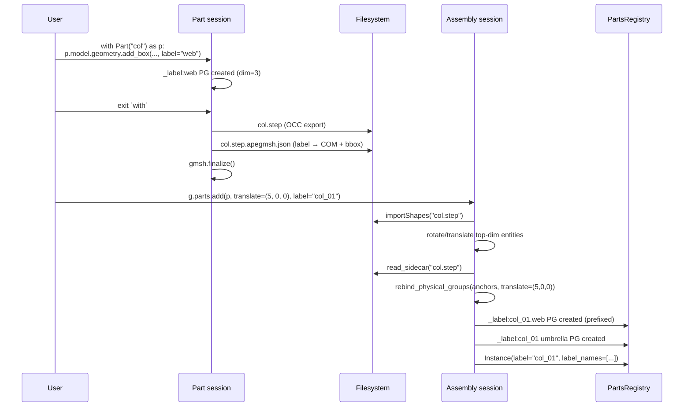

# apeGmsh Part / Instance / Assembly

> [!note] Companion document
> This file is the *compositional chapter* — how apeGmsh layers reusable
> geometry units into a multi-part assembly.
> Assumes familiarity with [[apeGmsh_principles]] (tenets **(iii)** "names
> survive operations" and **(vii)** "we never hide Gmsh"),
> [[apeGmsh_architecture]] §4 (the Part/Assembly split), and
> [[apeGmsh_groundTruth]] §6 (STEP sidecar and COM rebind) which this
> file cites freely.

apeGmsh borrows Abaqus' compositional vocabulary: a **Part** is an
isolated lump of geometry, an **Instance** is a placed copy of that
geometry inside a larger model, and the **Assembly** is the session
that owns the instances and eventually produces a mesh. The split is
deliberate — Parts are authored once and reused, the Assembly is where
fragmentation, labelling, meshing, and FEM export happen. This file is
the contributor-facing map of how the three concepts are implemented.

The whole scheme rests on one machine-friendly insight: **Gmsh has
exactly one active session per process**, so a Part and an Assembly
cannot coexist in memory — one of them has to be serialised. apeGmsh
serialises the Part through STEP (with a JSON sidecar for labels) and
hydrates it back into the Assembly via `g.parts.add(part)`. Every
non-trivial design decision in `core/Part.py` and
`core/_parts_registry.py` follows from that constraint.

```
src/apeGmsh/core/
├── Part.py                 ← isolated geometry session (the "Part")
├── _parts_registry.py      ← PartsRegistry + Instance (the "Assembly")
├── _parts_fragmentation.py ← fragment_all / fragment_pair / fuse_group
├── _part_anchors.py        ← STEP sidecar machinery (see groundTruth §6)
├── _session.py             ← _SessionBase (Part and apeGmsh both extend)
└── _core.py                ← the apeGmsh class (the Assembly session)
```

---

## 1. Why the split exists

Gmsh's Python API keeps a single process-global OCC kernel. You can
switch between *models* inside a session (`gmsh.model.add(name)`,
`gmsh.model.setCurrent(name)`), but every OCC boolean, every transform,
and every import mutates the same underlying singleton. That makes it
impossible to hold two independent geometries in memory and re-use
them by value.

Two strategies are possible, and apeGmsh picks the second:

| Strategy            | Shape                                                                | Trade-off                                                                           |
| ------------------- | -------------------------------------------------------------------- | ----------------------------------------------------------------------------------- |
| Model switching     | One `gmsh.initialize()`, many `gmsh.model.add()`                     | Fast, but Parts can't outlive the session; can't author a Part today and reuse next week |
| Session per Part    | `gmsh.initialize()` → build → export STEP → `gmsh.finalize()`        | Slow startup but Parts become **CAD artefacts** — portable, persistent, diffable    |

The CAD-artefact route is what makes `Part` usable as a library
primitive. A Part's canonical form is a STEP file on disk (plus a JSON
sidecar for labels), not a Python object in RAM. That is the reason
`Part.__exit__` auto-writes STEP, that is the reason
`parts.add(part)` always goes through `importShapes`, and that is the
reason `Instance.file_path` is a recorded field.

> [!important] Tenet **(iii)** is the non-obvious constraint
> "Names survive operations" must be true across the STEP round-trip
> too. Any label assigned inside a Part's `with` block has to
> rematerialise inside the Assembly under an instance-scoped name.
> Without that, the Part/Instance split buys nothing over raw Gmsh.
> The whole of §3 is dedicated to preserving this invariant.

---

## 2. The three concepts

```mermaid
flowchart LR
    subgraph PartSession [Part session — isolated Gmsh process state]
        P1[Part&nbsp;&quot;column&quot;<br/>geometry only]
        P1 -->|save/auto-persist| STEP[column.step + .apegmsh.json]
    end

    subgraph AssemblySession [Assembly session — the apeGmsh instance]
        STEP -->|g.parts.add&#40;part&#41;| I1[Instance &quot;col_1&quot;]
        STEP -->|g.parts.add&#40;part, translate=...&#41;| I2[Instance &quot;col_2&quot;]
        I1 --> REG[PartsRegistry]
        I2 --> REG
        REG -->|fragment_all| MESH[conformal geometry &rarr; mesh &rarr; FEMData]
    end
```



The three concepts have exact implementations:

| Concept      | Class                                | Lifetime                                        | Owns                                                                                       |
| ------------ | ------------------------------------ | ----------------------------------------------- | ------------------------------------------------------------------------------------------ |
| **Part**     | `core.Part.Part`                     | One `begin()` / `end()` block per rebuild       | A Gmsh session, a geometry tree, a `{name}.step` file, optional `.apegmsh.json` sidecar    |
| **Instance** | `core._parts_registry.Instance`      | Lives as long as its Assembly session           | Label, source file path, `{dim: [tag]}` entity map, placement transforms, metadata, bbox  |
| **Assembly** | `apeGmsh` (inherits `_SessionBase`)  | One `begin()` / `end()` block, holds `.parts`  | A Gmsh session, a `PartsRegistry`, labels, physical groups, mesh, fem                     |

"Assembly" is a conceptual name — there is no `Assembly` class. The
Abaqus parallel is `apeGmsh` itself, in the sense that
`g = apeGmsh(model_name="bridge"); g.begin()` *is* the assembly
session. `g.parts` is the machinery that lets that session behave like
an Abaqus assembly.

---

## 3. Part — the isolated geometry session

### 3.1 Life cycle

`Part` extends `_SessionBase` and owns a minimal set of composites —
`model`, `labels`, `physical`, `inspect`, `plot` — deliberately **no**
`mesh` and **no** solver composites. A Part cannot be meshed, cannot
carry constraints, cannot hold loads. That asymmetry is enforced by
the `_COMPOSITES` tuple in `Part.py` (line 130) and is not optional.

```python
from apeGmsh import Part

plate = Part("plate")
with plate:
    p1 = plate.model.geometry.add_point(0, 0, 0)
    # ... build geometry, assign labels ...
# plate.file_path now points at the auto-persisted STEP.
```

`Part.begin()` runs `gmsh.initialize() → gmsh.model.add(name)`,
`Part.end()` runs the auto-persist branch *then* `gmsh.finalize()`.
The sequence matters: auto-persist needs a live kernel to read the
geometry, so if the user's build code raised, we still try to write
the STEP before finalising (the exception is re-raised after
finalisation runs in the `finally` block).

### 3.2 Auto-persist and file ownership

Auto-persist is the "I did not call `save()`, write the geometry to a
tempfile so `parts.add(part)` works" path. It writes:

```
/tmp/apeGmsh_part_{name}_XXXXXX/{name}.step
/tmp/apeGmsh_part_{name}_XXXXXX/{name}.step.apegmsh.json
```

Three bookkeeping flags control deletion:

| Flag              | Meaning                                                                              |
| ----------------- | ------------------------------------------------------------------------------------ |
| `_auto_persist`   | Constructor opt-in — pass `Part(name, auto_persist=False)` to disable                |
| `_owns_file`      | True only when we wrote the file into a temp dir. **Never true for user `save()`.**  |
| `_finalizer`      | `weakref.finalize` that `shutil.rmtree`s the temp dir on GC — does not close over `self` |

**Rule.** The library will never delete a file the user named. If you
call `part.save("column.step")`, that file is yours — even if a prior
auto-persist happened, the temp dir is cleaned up *before* the
explicit save runs (`Part.save:345`), and `_owns_file` is left
unchanged at `False`.

### 3.3 Labels inside a Part

A Part has `_auto_pg_from_label = True` (set in
`Part.__init__:158`). This means every geometry method that takes a
`label="..."` kwarg routes through `Model._register`, which creates a
Tier 1 label PG (`_label:` prefix, see [[apeGmsh_groundTruth]] §2) for
that entity. The label travels through the STEP sidecar into the
Assembly — that is the whole point of having labels in a Part at all.

```python
plate = Part("plate")
with plate:
    top = plate.model.geometry.add_surface(...)  # no label
    edge = plate.model.geometry.add_line(
        a, b, label="edge.loaded",                # ← auto-creates _label:edge.loaded
    )
```

When `plate.end()` runs, `_write_anchors` scans every user-named PG
(via `collect_anchors`), computes the centre of mass, and writes the
sidecar. See [[apeGmsh_groundTruth]] §6 for the anchor format.

### 3.4 Re-entry

`Part.begin()` detects a prior `_owns_file` state and runs
`cleanup()` first, so a Part can be rebuilt:

```python
plate = Part("plate")
with plate:                         # first build
    plate.model.geometry.add_point(0, 0, 0)

# Second build — re-enter the same Part object
with plate:                         # old tempfile is reclaimed here
    plate.model.geometry.add_box(0, 0, 0, 10, 10, 10)
```

Cleanup is idempotent and safe to call at any time, including on a
`save()`-d Part (the `_owns_file` guard short-circuits).

---

## 4. Instance — the placed copy

`Instance` is a frozen `@dataclass` (tenet ix: "record classes are
dataclasses") that records a single placement of a Part inside the
Assembly's Gmsh session.

```python
@dataclass
class Instance:
    label:        str                          # unique in the registry
    part_name:    str                          # source Part name / file stem
    file_path:    Path | None = None           # CAD file on disk, None for inline parts
    entities:     dict[int, list[int]] = ...   # {dim: [tag, …]}, updated in-place by fragment
    translate:    tuple[float, float, float] = (0, 0, 0)
    rotate:       tuple[float, ...] | None = None
    properties:   dict[str, Any] = ...         # user metadata
    bbox:         tuple[float, float, float, float, float, float] | None = None
    label_names:  list[str] = ...              # prefixed label PG names created for this instance
    labels:       _InstanceLabels = ...        # attribute-access helper — see §4.2
```

### 4.1 The `entities` field is mutable

Unlike the "records are frozen" default, `Instance.entities` is a
mutable dict because **fragmentation rewrites tags in place**
(see [[apeGmsh_groundTruth]] §4). After `g.parts.fragment_all()`, a
single pre-fragment volume tag can map to several post-fragment tags,
and `_parts_fragmentation.fragment_all` updates `inst.entities[dim]`
without reconstructing the `Instance`. That is an intentional
exception to tenet (ix) — the alternative would be to replace every
`Instance` on every fragment, which breaks any user code holding a
reference.

### 4.2 `inst.labels` — attribute-access helper

`_InstanceLabels` is a thin slotted wrapper that turns a flat list of
prefixed label names into IDE-autocompletable attributes:

```python
col = g.parts.add(column, label="col")
col.labels.web            # → "col.web"          (valid, returns the string)
col.labels.top_flange     # → "col.top_flange"
col.labels.start_face     # → "col.start_face"

# Typos raise AttributeError with the available list
col.labels.spelled_wrong  # AttributeError: Instance 'col' has no label 'spelled_wrong'. Available: [...]
```

The trick is in `__getattr__`: it prepends `inst.label + "."` and
checks the result against `inst.label_names`. `__dir__` exposes the
stripped names so the IDE offers autocomplete. The slotted `_inst`
back-reference plus `object.__getattribute__` avoids recursion when
a user accesses `inst.labels.labels` or similar edge cases.

**Design intent.** The user never types a raw `"col.web"` string —
instead they let the IDE lead them to it via `col.labels.web`. That
matches tenet (ii) "types are the reference documentation" and
protects against typos that would silently resolve to a non-existent
label (and return an empty node set).

---

## 5. PartsRegistry — the `g.parts` composite

`PartsRegistry` is the Assembly-side object that owns every
`Instance`. It is a composite class (tenet ix), a regular class, and
inherits one mixin — `_PartsFragmentationMixin` — which is the single
exception to "no mixins" (tenet i). The exception is justified because
fragmentation is a closed surface of three methods
(`fragment_all`, `fragment_pair`, `fuse_group`) that are too
implementation-heavy to inline in the registry but share every field.

### 5.1 Five entry points for creating instances

Every Instance on the registry is created by exactly one of these:

```mermaid
flowchart LR
    subgraph Entry [Entry points on g.parts]
        E1[with g.parts.part&#40;&quot;beam&quot;&#41;:<br/>&hellip; inline geometry &hellip;]
        E2[g.parts.register&#40;&quot;slab&quot;, dimtags&#41;]
        E3[g.parts.from_model&#40;&quot;bracket&quot;&#41;]
        E4[g.parts.add&#40;part_obj&#41;]
        E5[g.parts.import_step&#40;&quot;file.step&quot;&#41;]
    end
    E1 --> INST[Instance]
    E2 --> INST
    E3 --> INST
    E4 --> INST
    E5 --> INST
    INST --> REG[PartsRegistry._instances]
```



Each entry point has a distinct use case:

| Method                  | Source of geometry                            | When to use                                                         |
| ----------------------- | --------------------------------------------- | ------------------------------------------------------------------- |
| `part(label)` (ctx mgr) | Built inline by the caller's block            | Quick inline parts — prototype, one-shot geometry                   |
| `register(label, dts)`  | Already in the session, user lists the tags    | Manual adoption when the user built geometry via raw `gmsh.*`       |
| `from_model(label)`     | Already in the session, registry picks untracked | After `g.model.io.load_step()` — adopt everything in one call    |
| `add(part, ...)`        | A `Part` object with an on-disk STEP           | The canonical path — reusable Part, optional translate/rotate       |
| `import_step(path)`     | A STEP or IGES file                           | Third-party CAD — no sidecar, no labels rebind (see §6)             |

#### 5.1.1 `part(label)` — diff-based inline tracking

```python
with g.parts.part("beam"):
    g.model.geometry.add_box(0, 0, 0, 1, 0.5, 10)
```

Implementation is a diff: snapshot `gmsh.model.getEntities(d)` for
`d ∈ {0,1,2,3}` before and after the block, and anything that appeared
gets bundled into an Instance. Simple, robust, and doesn't need the
user to enumerate tags.

> [!caution] The diff can't distinguish "created" from "revived"
> OCC can re-use the same tag for a newly-created entity if a prior
> entity with that tag was deleted. The inline `part()` block does not
> guard against that — keep the block focused on *additions only*.

#### 5.1.2 `register(label, dimtags)` — manual tagging

Used when the user built geometry via raw `gmsh.*` calls and now wants
it tracked. Includes an **ownership check**: each `(dim, tag)` can
belong to at most one part. Attempting to register an entity that
already belongs to a part raises `ValueError` naming the owning label.

#### 5.1.3 `from_model(label)` — adopt-what's-there

Scans `gmsh.model.getEntities(d)` per dim, subtracts tags already in
some `inst.entities[d]`, and assigns the rest. Useful after
`g.model.io.load_step(...)` when the user wants everything adopted
under one label without writing out the tag list.

#### 5.1.4 `add(part)` — the canonical path

This is the single most important entry point; it is where the full
Part/Instance/Assembly pipeline manifests:

```python
col = g.parts.add(column, label="col_01", translate=(0, 0, 0))
```

The method delegates to `_import_cad`, which does six things in order:

1. `gmsh.model.occ.importShapes(file, highestDimOnly=...)` loads the
   STEP into the live session.
2. Deduplicate the returned dimtags per dim (OCC returns sub-shapes
   multiple times).
3. Apply `rotate` then `translate` to the **highest-dim entities
   only** — OCC propagates the transform through sub-topology
   automatically. Applying to all dims raises "OpenCASCADE transform
   changed the number of shapes" (`_apply_transforms:740`).
4. Read the `.apegmsh.json` sidecar if present and call
   `rebind_physical_groups(anchors=..., translate=..., rotate=...)`
   (see [[apeGmsh_groundTruth]] §6 for the COM-anchor + bbox
   tiebreaker algorithm).
5. For every re-bound label, create a Tier 1 label PG under a
   **prefixed name** `{instance.label}.{pg_name}`. That is the line
   that makes `col.labels.web` work later.
6. Create one **umbrella label** `{instance.label}` covering all
   top-dim entities — so `fem.nodes.get(label="col_01")` returns every
   node of the instance, not just a sub-component.

Every sidecar label becomes a *fresh* label PG in the Assembly —
scoped by prefix, so two instances of the same Part never collide. See
§6 for the invariant this buys.

#### 5.1.5 `import_step(path)` — third-party CAD

Identical to `add()` except the source is a raw file path, not a
`Part` object, and we don't expect a sidecar (though the method does
check for one — if you exported a STEP from another apeGmsh session
and copied the sidecar alongside it, labels round-trip). A
user-provided `properties` dict can be passed through.

### 5.2 Registry lifecycle operations

```python
g.parts.instances        # read-only dict[label, Instance]
g.parts.get("col_01")    # raises KeyError on miss
g.parts.labels()         # list of labels in insertion order
g.parts.rename("old", "new")
g.parts.delete("col_01") # removes from registry; entities stay in Gmsh as "untracked"
```

`delete` is the asymmetric one: it drops the registry record but
leaves the geometry alive. Those orphaned entities show up in the
viewer's *Untracked* group and participate in `fragment_all` — with a
warning about untracked participants (see §7).

### 5.3 Node / face maps for post-mesh resolution

Once the mesh exists, `PartsRegistry` can translate instance labels
into mesh ID sets via bounding-box containment:

```python
fem = g.mesh.queries.get_fem_data(dim=3)
nm = g.parts.build_node_map(fem.nodes.ids, fem.nodes.coords)
# nm["col_01"] = {node_tag, ...}
```

`build_node_map` is a pure-numpy operation (tenet xii) — it iterates
`self._instances`, asks each for its bbox, and does vectorised
`np.all((coords >= mins) & (coords <= maxs), axis=1)` per instance.
Tolerance is `1e-6 * bbox_span`, which handles float jitter from OCC
without letting neighbouring parts bleed into each other.

`build_face_map(node_map)` then groups surface-element connectivity by
instance node ownership — an element belongs to part `P` iff all its
nodes are in `nm[P]`. This is the hook that `FEMData.from_gmsh` uses
to populate `NodeComposite._part_node_map` (see [[apeGmsh_broker]]
§1). After that snapshot, `fem.nodes.get(target="col_01")` works
without a live Gmsh session.

---

## 6. The STEP round-trip in detail

The round-trip is the backbone of the Part/Instance split. Written out
step by step:



Three invariants come out of this:

**(A) Label uniqueness.** Two instances of the same Part produce two
disjoint label sets (`col_01.web` and `col_02.web`). The prefix is
literally `f"{label}.{pg_name}"` (`_parts_registry.py:691`). Collisions
are impossible by construction — the registry already rejects
duplicate instance labels on every entry path.

**(B) Umbrella + sub-labels.** Every instance gets one umbrella label
matching its instance label plus one prefixed label per sidecar entry.
If the Part has no labels (no named geometry), only the umbrella is
created. If the sidecar is missing or empty (third-party STEP), only
the umbrella is created.

**(C) Failure is warned, not raised.** Sidecar read failures, anchor
rebind failures, and label-PG creation failures are all caught and
emitted as `warnings.warn` — the import itself must never fail because
a label didn't come through. Debugging relies on warnings surfacing to
the user; silent suppression is not an option.

> [!warning] `highestDimOnly=True` and sidecar anchors
> The sidecar can carry anchors at any dim (a face label on a solid,
> for example). When `_import_cad` reads anchors it re-enumerates *all*
> dims via `gmsh.model.getEntities(d)` for `d ∈ 0..3` rather than
> relying on the `entities` dict returned by `importShapes`. The
> `imported_entities` passed to `rebind_physical_groups` is the full
> model, not the Part's entities — otherwise a label on a surface of a
> volume would go unmatched when `highest_dim_only=True`.

---

## 7. Fragmentation semantics

`_PartsFragmentationMixin` adds three operations to the registry.
Each wraps an OCC call inside `pg_preserved()` so the snapshot-then-
remap invariant from [[apeGmsh_groundTruth]] §3 applies.

| Method                         | OCC call             | Rewrite of `inst.entities`                           | Instance survival                                 |
| ------------------------------ | -------------------- | ---------------------------------------------------- | ------------------------------------------------- |
| `fragment_all(dim=)`           | `occ.fragment(...)`  | In-place per old tag → list of new tags              | All instances survive; tags renumbered            |
| `fragment_pair(a, b, dim=)`    | `occ.fragment(...)`  | Registry is **not** rewritten (pair-local op)        | Both instances survive untouched in registry      |
| `fuse_group([a, b, ...], ...)` | `occ.fuse(...)`      | Old instances dropped, new `Instance` created        | Old instances deleted from registry               |

### 7.1 `fragment_all` — the common case

```python
g.parts.fragment_all(dim=3)     # auto-detects highest dim if None
```

Every tracked entity at the target dim is thrown into the fragment
pool. After the OCC call:

1. `old_tag → list[new_tag]` is built from `result_map`.
2. Every `Instance.entities[dim]` is flattened through that map
   in-place — a single old tag can expand to several new tags if the
   fragment split it.
3. Untracked participants (entities present in the Gmsh model that no
   `Instance` owns) trigger a `UserWarning` naming the orphan tags.
   Rationale: orphans will participate but can't be remapped, so the
   user sees drift coming.

### 7.2 `fuse_group` — absorbing instances

```python
inst = g.parts.fuse_group(
    ["col_01", "slab_01"],
    label="col_with_pile_cap",
    properties={"material": "concrete"},
)
```

Unlike `fragment_*`, `fuse_group` **removes** the listed instances
from the registry and creates one new `Instance` holding the fused
result. The `absorbed_into_result=True` flag is passed to
`remap_physical_groups` — see [[apeGmsh_groundTruth]] §3 — so every
label/PG on any of the inputs remaps to the surviving entity. Input
validation: at least two labels, no duplicates, at least one common
dim, no label collision with a non-input name.

### 7.3 `fragment_pair` — local fragmentation

Used when you want exactly two instances to share conformal
interfaces without touching the rest of the registry. Returns the
surviving tags but does **not** rewrite `inst.entities` — the caller
is expected to re-query if they need updated mappings. This is the
right tool when most of the assembly is already conformal and only
two contacts need resolving.

---

## 8. Instance-scoped naming — why it works

Three naming systems flow through the Part/Instance/Assembly pipeline,
and keeping them straight is the contributor's main maintenance
burden:

```
    in a Part                  in the Assembly
    ─────────                  ───────────────
    "edge.loaded"      →       "col_01.edge.loaded"     (Tier 1 label PG)
    _label:edge.loaded →       _label:col_01.edge.loaded (Gmsh PG name)
    "col_01"           →       "col_01"                  (Tier 1 umbrella label)
    <no user PG>       →       <user creates via g.physical.add or promote_to_physical>
```

* In the Part, the user assigns short local names. The Part is a
  closed universe — no collisions possible because there is only one
  Part per session.
* In the Assembly, every Part-local name gets a prefix equal to the
  instance label. That makes two instances of the same Part disjoint.
* The **umbrella label** is the instance's own name — letting users
  write `fem.nodes.get(label="col_01")` to grab the whole instance.
* Solver-facing PGs (Tier 2) are created explicitly in the Assembly
  via `g.physical.add(...)` or by promoting a label with
  `g.labels.promote_to_physical(...)`. Parts don't create Tier 2 PGs.

This is a clean separation and every new method that touches labels
must respect it. If a contributor adds an entry point that creates
instances (say, a `clone_instance(label)` method), it must:

1. Create label PGs under the new instance's prefix, not the
   source's.
2. Emit exactly one umbrella label matching the new instance label.
3. Not touch Tier 2 PGs — those belong to the user.

---

## 9. Contributor notes

Five rules for anyone adding to this surface:

1. **Never let a Part carry mesh state.** `Part._COMPOSITES` is the
   allow-list; adding `mesh` or any solver composite breaks the
   Part-as-CAD-artefact invariant. A Part meshes nothing.

2. **Auto-persist must never break the build.** Exceptions in
   `_auto_persist_to_temp` are caught, warned, and the user's build
   exception (if any) is the one that propagates. `gmsh.finalize`
   always runs. Do not add `raise` paths here.

3. **Respect the `_owns_file` bit.** Any new code path that might
   delete a file must gate on `_owns_file = True`. The library
   deleting a user-named file is the worst-case bug class for a CAD
   tool — trust is hard to recover.

4. **Sidecar failures are warnings.** The CAD export must not depend
   on anchor collection succeeding. `_write_anchors` swallows its
   own exceptions and warns. Keep it that way — a broken sidecar
   silently degrades to "labels don't round-trip" which is
   recoverable, whereas a broken STEP is not.

5. **When rewriting `Instance.entities`, do it in place.** User code
   may hold references to `Instance` objects from an earlier
   `parts.add(...)` call. Replacing the dict-valued field is fine;
   replacing the `Instance` breaks user code silently. See the
   in-place update in `fragment_all:99-104` for the reference pattern.

6. **Tier 2 PGs are the user's job, not the registry's.** The
   registry creates Tier 1 label PGs (prefixed, `_label:` marker) and
   nothing else. Any new feature that "helps" by also creating Tier 2
   PGs bleeds internal naming into solver output. Route promotion
   through `g.labels.promote_to_physical(name)` instead.

---

## 10. End-to-end assembly script

For reference, the canonical assembly looks like:

```python
from apeGmsh import apeGmsh, Part

# ── Build reusable Parts (isolated sessions) ───────────────────────────
column = Part("column")
with column:
    column.model.geometry.add_cylinder(
        0, 0, 0, 0, 0, 3.0, 0.15, label="shaft",
    )
    column.model.geometry.add_point(0, 0, 3.0, label="top")

slab = Part("slab")
with slab:
    slab.model.geometry.add_box(
        -2, -2, 3.0, 4, 4, 0.3, label="deck",
    )

# ── Assemble ───────────────────────────────────────────────────────────
g = apeGmsh(model_name="building")
with g:
    c1 = g.parts.add(column, label="col_A")
    c2 = g.parts.add(column, label="col_B", translate=(4, 0, 0))
    s  = g.parts.add(slab,   label="slab_1")

    g.parts.fragment_all(dim=3)

    # Promote labels to solver-facing PGs
    g.labels.promote_to_physical(c1.labels.shaft)     # → "col_A.shaft"
    g.labels.promote_to_physical(c2.labels.shaft)     # → "col_B.shaft"
    g.labels.promote_to_physical(s.labels.deck)       # → "slab_1.deck"

    g.mesh.generation.generate(dim=3)
    fem = g.mesh.queries.get_fem_data(dim=3)

# ── Outside the session — `fem` is a frozen broker ─────────────────────
print(fem.inspect.summary())

# Nodes of the whole column (umbrella label)
col_A_nodes = fem.nodes.get(target="col_A")

# Nodes on the column's shaft surface (sub-label)
shaft_nodes = fem.nodes.get(target="col_A.shaft")
```

Nothing in the assembly session touches a raw `(dim, tag)` pair. Every
reference is a name — short inside the Part, prefixed inside the
Assembly — and every operation that would ordinarily drift tags is
wrapped in the `pg_preserved()` invariant from
[[apeGmsh_groundTruth]] §3.

---

## Reading order

1. [[apeGmsh_principles]] — tenets (i) composition over inheritance,
   (iii) names survive operations, (vii) we never hide Gmsh.
2. [[apeGmsh_architecture]] §4 — the Part/Assembly split as an
   architectural invariant.
3. [[apeGmsh_groundTruth]] §3 (snapshot/remap), §6 (STEP sidecar and
   COM rebind) — the drift-prevention machinery this file builds on.
4. This file — *what* Parts and Instances are, *how* they compose.
5. `src/apeGmsh/core/Part.py` — the Part class, auto-persist, save.
6. `src/apeGmsh/core/_parts_registry.py` — `Instance`,
   `_InstanceLabels`, `PartsRegistry`, the five entry points, node /
   face maps.
7. `src/apeGmsh/core/_parts_fragmentation.py` — fragment_all,
   fragment_pair, fuse_group with in-place entity rewrites.
8. `src/apeGmsh/core/_part_anchors.py` — sidecar IO and the rebind
   algorithm.
