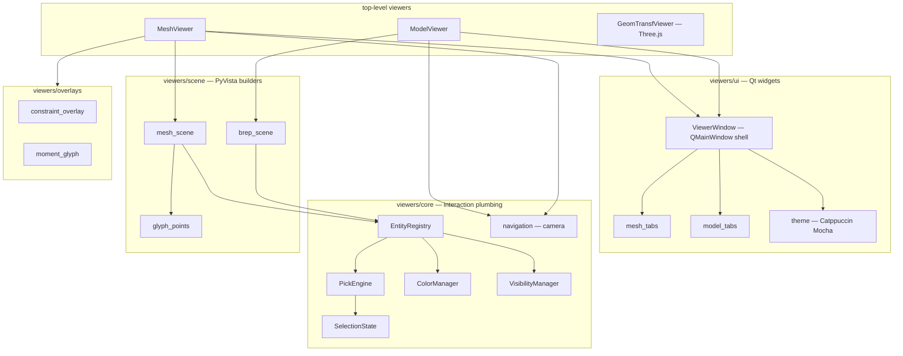

# apeGmsh Visualization

> [!note] Companion document
> This file maps the *visualization surface* — every module that draws
> something, interactive or static. It assumes you have read
> [[apeGmsh_principles]] (tenet **(viii)** "the viewer is core and
> environment-aware") and [[apeGmsh_architecture]] §6.
> For the data side of what these viewers render, see
> [[apeGmsh_broker]] (`FEMData`) and [[apeGmsh_partInstanceAssemble]]
> (parts and instances).

Tenet (viii) says 3D FEM is unreviewable without visualization, so
apeGmsh ships two visualization families, not one:

1. **`viz/`** — lightweight, inline-friendly composites (matplotlib
   plots, pandas-style introspection, entity selection, VTK export).
   These are for notebooks and quick figures.
2. **`viewers/`** — a full interactive Qt + PyVista desktop viewport
   with pixel-perfect picking, tabs, overlays, and a Catppuccin-Mocha
   theme. These are for interactive model review.

Both are wired into the session tree so the user never imports them
directly. The dispatch is:

```
g.inspect                 → viz/Inspect.Inspect               (composite on session)
g.plot                    → viz/Plot.Plot                     (composite on session, optional)
g.model.selection         → viz/Selection.SelectionComposite  (composite on Model)
g.model.viewer(**kw)      → viewers/model_viewer.ModelViewer  (interactive BRep)
g.mesh.viewer(**kw)       → viewers/mesh_viewer.MeshViewer    (interactive mesh + overlays)
fem.viewer(blocking=)     → Results.viewer → apeGmshViewer    (external frozen-snapshot viewer)
GeomTransfViewer().show() → viewers/geom_transf_viewer        (Three.js browser widget)
VTKExport / Results.to_vtu → .vtu / .pvd for ParaView
```

```
src/apeGmsh/
├── viz/                  ← inline / notebook-scale visualization
│   ├── Inspect.py        (Composite, g.inspect)
│   ├── Plot.py           (Composite, g.plot)
│   ├── Selection.py      (Record + Composite, g.model.selection)
│   └── VTKExport.py      (Def — .vtu writer)
├── viewers/              ← interactive Qt / PyVista viewport
│   ├── model_viewer.py   (ModelViewer)
│   ├── mesh_viewer.py    (MeshViewer)
│   ├── geom_transf_viewer.py (GeomTransfViewer, Three.js)
│   ├── core/             pick engine, entity registry, color, visibility, navigation
│   ├── scene/            brep_scene, mesh_scene, glyph_points
│   ├── ui/               Qt window + tabs + theme
│   └── overlays/         constraint / moment / glyph helpers
└── results/Results.py    ← external-viewer dispatch + .vtu bundling
```

---

## 1. The `viz/` package — inline-scale tools

Four modules, all usable in a notebook without opening a Qt window.
Every module maps onto one of the three class flavours from
[[apeGmsh_principles]] §5 tenet (ix).

### 1.1 `viz/Inspect.py` — `Inspect` (composite)

Attached as `g.inspect` on both `Part` and `apeGmsh` sessions (see
`_core.py:39` and `Part.py:133`). The primary contract is three
methods that return structured DataFrames for the notebook and a
formatted string for `print()`:

```python
g.inspect.get_geometry_info()    # → ({dim → {df, summary, entities}}, global_df)
g.inspect.get_mesh_info()        # → ({'nodes'|'elements' → {df, summary, quality}}, global_df)
g.inspect.print_summary()        # → str — geometry, PGs, mesh options, directives, stats
```

Per-dimension DataFrames carry entity tags, coordinates, bounds,
curvature, area, volume, inertia, SICN quality metrics, and the mesh
directives history (transfinite, recombine, fields, algorithms) as
recorded by the `Mesh` composite. This is the first thing the user
types to understand what state they have.

### 1.2 `viz/Plot.py` — `Plot` (composite, optional)

Attached as `g.plot` when matplotlib is installed — the `True` flag in
`_COMPOSITES` marks it optional so headless wheels skip it. The class
is a chainable matplotlib wrapper around a reused 3D figure/axes pair.

Every public method returns `self`:

```python
g.plot.figsize((10, 8)) \
      .geometry(show_points=True, show_curves=True, surface_alpha=0.3, label_tags=True) \
      .mesh(color='steelblue', edge_color='white', alpha=0.4) \
      .show()
```

What it draws: BRep via parametric sampling (Delaunay-triangulated
surfaces, polyline-sampled curves), mesh elements as
`Poly3DCollection`, mesh-quality heatmaps (SICN / minSIGE / gamma),
entity / node / element labels at centroids, and physical-group-coloured
variants of all of the above. **Pure matplotlib** — no VTK, no Qt.
Good for figure production and tight notebook inlining; not for
interactive review.

Internally, `_ensure_axes` lazily creates the figure on first call so
that a sequence of chained method calls shares one axes; `clear()`
discards and `show()` flushes to screen.

### 1.3 `viz/Selection.py` — `Selection` + `SelectionComposite`

Two classes, one pair. This is the entry point to the interactive
picker as well as the non-interactive spatial-filter API.

**`Selection`** (record, slotted). A frozen set of `(dim, tag)`
tuples with full set algebra and refinement:

```python
sel = g.model.selection.select_surfaces(in_box=(0, 0, 0, 10, 10, 1))
sel2 = sel & g.model.selection.select_all(labels=["top_flange"])
sel2.bbox()            # axis-aligned BB over the selection
sel2.centers()         # per-entity centroid array
sel2.to_physical("loaded_surfaces")   # promote to a Tier 2 PG
sel2.to_mesh_nodes()   # resolve to mesh nodes (mesh must exist)
```

The full filter vocabulary: `tags`, `exclude_tags`, `labels`, `kinds`,
`physical`, `in_box`, `in_sphere`, `on_plane`, `on_axis`, `at_point`,
`length_range`, `area_range`, `volume_range`, `aligned`, `horizontal`,
`vertical`, `predicate`. These compose via set algebra (`|`, `&`, `-`,
`^`) so the user builds selections with one-line expressions.

**`SelectionComposite`** (composite). Attached as
`g.model.selection` (see `core/Model.py:89`). Its query methods
return `Selection`, and its `picker(...)` method opens the interactive
`ModelViewer` — see §2.2.

### 1.4 `viz/VTKExport.py` — `VTKExport` (def)

Stateless `.vtu` writer — XML UnstructuredGrid with binary-base64 or
ASCII payload, full Gmsh → VTK element-type mapping (line, triangle,
quad, tet, hex, wedge, pyramid, quadratic variants). Not bound to a
session; called by `Results.to_vtu()` and ad-hoc post-processing. No
external dependencies beyond numpy + stdlib — deliberate, because this
is the one path that has to work in a CI/headless environment.

---

## 2. The `viewers/` package — interactive Qt + PyVista

This is the heavy viewer, structured as a layered system: scene
builders on the bottom, core interaction on top of them, UI on top of
that, and three concrete viewers at the surface that compose the
layers differently.



### 2.1 Top-level viewers

Three concrete viewers live directly under `viewers/`. They are
**composite-like** — stateful, Qt-owning, hold a session reference.

| Viewer                  | File                                       | Covers                               | Opened by                                                             |
| ----------------------- | ------------------------------------------ | ------------------------------------ | --------------------------------------------------------------------- |
| `ModelViewer`           | `viewers/model_viewer.py:29`               | BRep geometry + physical groups      | `g.model.viewer(...)` → `SelectionComposite.picker(...)`              |
| `MeshViewer`            | `viewers/mesh_viewer.py:32`                | Mesh elements + nodes + overlays     | `g.mesh.viewer(...)` and `FEMData.viewer(...)` via `Results`          |
| `GeomTransfViewer`      | `viewers/geom_transf_viewer.py`            | OpenSees beam local-frame (Three.js) | User code: `GeomTransfViewer().show(node_i=..., node_j=...)`          |

`ModelViewer` and `MeshViewer` both `.show()` to open a blocking Qt
window. After `close`, they expose picked state: `.selection`,
`.tags`, `.active_group`, plus helpers like `.to_physical(name)` so
the picker doubles as a PG-authoring tool.

`GeomTransfViewer` is an outlier: it writes a temp HTML file, opens
it with `webbrowser.open`, and uses Three.js (r128 via CDN) instead
of PyVista. This is the **only** viewer that runs without a Qt
installation — useful in Colab or SSH-forwarded environments where
Qt is not available. It is a *def* (stateless) because everything it
needs comes in on `.show()`.

### 2.2 `core/` — the interaction plumbing

Six modules, all **def** (stateless) so the interaction math stays
unit-testable:

* **`entity_registry.py`** — `EntityRegistry`. One merged PyVista
  `UnstructuredGrid` + one VTK actor per dimension, with O(1)
  bidirectional maps: `(actor_id, cell_id) ↔ DimTag` and
  `DimTag → [cell_indices]` and `DimTag → centroid`. This is the
  data structure that makes batched picking possible — without it,
  one actor per entity would blow up frame times on medium models.
* **`pick_engine.py`** — `PickEngine`. VTK cell picker + rubber-band
  box selection with modifier keys (L→R = window, R→L = crossing,
  Ctrl = unpick). Fires three callbacks — `on_pick`, `on_hover`,
  `on_box_select` — but **mutates no state itself**. State lives in
  `SelectionState`.
* **`selection.py`** — `SelectionState`. Working set of picked
  entities plus physical-group staging (dict `name → [DimTag]`),
  undo history, active-group pointer, `flush_to_gmsh()` to commit
  staged groups. All callbacks fire `on_changed` so the UI is
  reactive.
* **`color_manager.py`** — `ColorManager`. Single source of truth
  for per-cell RGB on the batched meshes. State priority
  `hidden > picked > hovered > idle`. Palette is protanopia-safe:
  pick = #E74C3C (red), hover = #FFD700 (gold), hidden = black, idle
  dimension-dependent. No rendering — the caller batches recolors
  and calls `plotter.render()` once.
* **`visibility.py`** — `VisibilityManager`. Hide / isolate /
  reveal via `extract_cells` (not opacity), so hidden geometry leaves
  **no black silhouette**. Full meshes are retained on the registry
  so `reveal_all()` restores without recomputation.
* **`navigation.py`** — pure function
  `install_navigation(plotter, get_orbit_pivot)`. Quaternion orbit,
  pan, zoom. Bindings: Shift+Scroll = orbit about pivot, MMB = pan,
  wheel = zoom-to-cursor, RMB drag = secondary pan. Quaternion math
  (`_quat`, `_qmul`, `_qconj`, `_qrot`) is VTK-free and unit-tested.

### 2.3 `scene/` — PyVista scene builders

These are pure functions that translate Gmsh state into batched
PyVista actors. Called once at viewer startup.

* **`brep_scene.py`** — `build_brep_scene(plotter, dims=[0,1,2,3], ...)`.
  Generates a throwaway coarse tessellation if the model isn't meshed,
  extracts per-entity triangulation, merges by dimension into one
  `UnstructuredGrid` per dim with `cell_data["entity_tag"]` and
  `cell_data["colors"]`. Returns an `EntityRegistry` pre-populated
  for the pick / color / visibility managers.
* **`mesh_scene.py`** — `build_mesh_scene(plotter, dims=[1,2,3], ...)`.
  Same pattern but for the real mesh, with the full Gmsh → VTK
  type mapping (line / triangle / quad / tet / hex / prism / pyramid
  and quadratic variants). Returns a `MeshSceneData` dataclass with
  `registry`, `node_cloud` (glyph-sphered mesh nodes), `node_tree`
  (scipy `KDTree` for node picking), plus element-type and partition
  colour tables. Default mesh colour is a steel blue (`#5B8DB8`).
* **`glyph_points.py`** — `build_point_glyphs(...)` and
  `build_node_cloud(...)`. Sphere glyphs scaled to model diagonal,
  coloured per-cell via `cell_data["colors"]`. The factor
  `0.003 × diagonal` is the default point size so models of any scale
  look right out of the box.

### 2.4 `ui/` — Qt layout and tabs

The UI layer is deliberately a thin shell over PyVista's `QtInteractor`
with **lazy Qt imports** (`_lazy_qt()`, `_qt()`) so importing
`apeGmsh.viewers` doesn't pull Qt into a headless environment.

* **`viewer_window.py`** — `ViewerWindow`. The QMainWindow shell:
  menu bar, toolbar, central VTK viewport, right-side tabbed dock,
  status bar. Constructor takes tabs, extra docks, toolbar actions,
  and an `on_close` callback. `.exec()` blocks on the Qt event loop
  and `.plotter` exposes the PyVista interactor so viewers can call
  `add_mesh`, `render`, etc.
* **`mesh_tabs.py`** — `MeshInfoTab` (picked element/node details),
  `DisplayTab` (color mode, label toggles, wireframe), `MeshFilterTab`
  (visibility, dims, element-type filters).
* **`model_tabs.py`** — re-exports from four sub-files:
  `_browser_tab.py` (entity browser tree), `_filter_view_tabs.py`
  (spatial/metric filter controls + preset views), `_selection_tree.py`
  (picked-entity tree with context menu), `_parts_tree.py` (assembly
  instance tree — one root per `Instance`, children are its entities).
* **`theme.py`** — global Catppuccin Mocha stylesheet.
  `styled_group(name)` produces themed QGroupBoxes. The viewport
  gradient (BG_TOP / BG_BOTTOM) is a dark blue that keeps edges
  readable without sacrificing colour-blind-safe contrast.
* **`preferences.py`** — user-facing settings (point size, line
  width, surface opacity, edges, AA, theme).
* **`loads_tab.py`, `constraints_tab.py`, `mass_tab.py`** — panels
  that tie to the `MeshViewer` overlay actors — they toggle
  visibility by kind and adjust glyph sizing.

### 2.5 `overlays/` — mesh-resolved decoration

Overlays draw on **mesh-resolved concepts** (loads, constraints,
masses). They are pure functions that consume a `FEMData` snapshot
and return `(mesh, add_mesh_kwargs)` pairs — no Qt, no session
reference, unit-testable.

* **`constraint_overlay.py`** — `build_node_pair_actors(fem,
  active_kinds, ...)`. Rigid beams as lines, equal DOF as markers,
  node-to-surface as master→slave lines (high-level topology, not
  expanded). The overlay is topology-level intentionally — it
  visualises intent, not the expanded atomic pair list from
  [[apeGmsh_broker]] §7.6.
* **`moment_glyph.py`** — `make_moment_glyph(radius, tube_radius,
  arc_degrees=270, ...)`. A 270° arc tube + cone arrowhead, axis
  along +X, rotated into position by PyVista's `orient='vectors'`.
  This is the standard "rotational" glyph for applied moments and
  rotational masses.
* **`glyph_helpers.py`, `pref_helpers.py`** — shared factories for
  arrows, spheres, sliders, comboboxes. Kept DRY across the three
  per-kind tabs.

---

## 3. Dispatch — how user calls reach viewers

There are four user-facing entry points. Each is a one-liner wrapper
that constructs a viewer and shows it.

| User call                | Dispatches to                                                           |
| ------------------------ | ----------------------------------------------------------------------- |
| `g.model.viewer(**kw)`   | `Model.viewer → SelectionComposite.picker → ModelViewer.show`           |
| `g.mesh.viewer(**kw)`    | `Mesh.viewer → MeshViewer.show`                                         |
| `fem.viewer(blocking=)`  | `FEMData.viewer → Results.from_fem → Results.viewer`                    |
| `sel.to_physical(name)`  | Selection methods — no window, writes a Tier 2 PG to Gmsh               |

The code paths in source:

```python
# core/Model.py:153
def viewer(self, **kwargs):
    return self.selection.picker(**kwargs)

# mesh/Mesh.py (viewer method)
def viewer(self, **kwargs):
    from ..viewers.mesh_viewer import MeshViewer
    return MeshViewer(self._parent, **kwargs).show()

# mesh/FEMData.py:1147
def viewer(self, *, blocking=False):
    from ..results.Results import Results
    Results.from_fem(self, name="FEMData").viewer(blocking=blocking)

# results/Results.py:938
def viewer(self, *, blocking=False):
    # Writes .vtu/.pvd to a tempdir, spawns apeGmshViewer subprocess
    # (non-blocking) or calls show_mesh_data (blocking, in-process).
```

`Results.viewer` is the one that reaches an **external**
`apeGmshViewer` tool — a separate Rust/WebGL viewer living outside
this repository. When a results timeline (multiple time steps,
scalar / vector / tensor fields) is involved, that viewer is the
right surface. For pre-solve model review, `MeshViewer` does the job
in-process.

---

## 4. Environment-aware behaviour

Tenet (viii) promises three environments (Desktop / Jupyter / Colab)
"work without code change". How that works today:

1. **Desktop** — `ViewerWindow` imports Qt lazily; PyQt6 or PySide
   must be installed. `.show()` blocks the Qt event loop until
   close.
2. **Jupyter (local)** — `pyvistaqt.QtInteractor` can render inline
   when Qt is available; otherwise PyVista falls back to its HTML
   / trame backend. Both cases are driven by the **PyVista**
   global default — apeGmsh does not override it.
3. **Colab / remote notebooks** — Qt is not available; `Results`
   and `GeomTransfViewer` take over. `Results.viewer(blocking=False)`
   spawns the external WebGL viewer subprocess; `GeomTransfViewer`
   opens an HTML page in the default browser using `webbrowser`.

Lazy Qt imports are the pattern everywhere — every file under
`viewers/ui/` uses `_lazy_qt()` helpers so that `import apeGmsh`
does not trigger Qt loading. This is what lets a CI job install
apeGmsh, build meshes, and write `.vtu` without a display.

---

## 5. Class-flavour inventory

A compact index mapping every visualization class to the three
flavours from [[apeGmsh_principles]] §5 tenet (ix).

| Class                         | File                                 | Flavour     | Attached to             |
| ----------------------------- | ------------------------------------ | ----------- | ----------------------- |
| `Inspect`                     | `viz/Inspect.py`                     | composite   | `g.inspect`             |
| `Plot`                        | `viz/Plot.py`                        | composite   | `g.plot` (optional)     |
| `SelectionComposite`          | `viz/Selection.py`                   | composite   | `g.model.selection`     |
| `Selection`                   | `viz/Selection.py`                   | record      | returned by queries     |
| `VTKExport`                   | `viz/VTKExport.py`                   | def         | utility                 |
| `ModelViewer`                 | `viewers/model_viewer.py`            | composite   | opened by picker()      |
| `MeshViewer`                  | `viewers/mesh_viewer.py`             | composite   | opened by mesh.viewer() |
| `GeomTransfViewer`            | `viewers/geom_transf_viewer.py`      | def         | standalone              |
| `ViewerWindow`                | `viewers/ui/viewer_window.py`        | def         | Qt shell                |
| `MeshInfoTab` / `DisplayTab` / `MeshFilterTab` | `viewers/ui/mesh_tabs.py` | def | tabs                    |
| `BrowserTab` / `FilterTab` / `ViewTab` / `SelectionTreePanel` / `PartsTreePanel` | `viewers/ui/model_tabs.py` (+ sub-files) | def | tabs  |
| `EntityRegistry`              | `viewers/core/entity_registry.py`    | def         | interaction plumbing    |
| `PickEngine`                  | `viewers/core/pick_engine.py`        | def         | interaction plumbing    |
| `SelectionState`              | `viewers/core/selection.py`          | def         | interaction plumbing    |
| `ColorManager`                | `viewers/core/color_manager.py`      | def         | interaction plumbing    |
| `VisibilityManager`           | `viewers/core/visibility.py`         | def         | interaction plumbing    |

Scene builders (`brep_scene`, `mesh_scene`, `glyph_points`) and
overlays (`constraint_overlay`, `moment_glyph`, `glyph_helpers`) are
modules of **pure functions** rather than classes — they fit the *def*
category but expose function-level entry points.

---

## 6. Contributor notes

Five rules for adding to the visualization surface:

1. **Keep scene builders pure.** `scene/*.py` and `overlays/*.py`
   functions must not touch Qt, must not hold a session reference,
   and must return data structures (meshes, `(mesh, kwargs)` tuples,
   `EntityRegistry`). Unit-testability depends on this.

2. **Mutate state through the managers.** `SelectionState`,
   `ColorManager`, `VisibilityManager` are the single sources of
   truth for their respective concerns. A new feature that bumps
   colour or visibility must go through the manager — never straight
   to `actor.GetProperty()`. Otherwise "hidden > picked > hovered >
   idle" priority silently breaks.

3. **Batch renders.** Every manager mutates arrays in place and
   declines to call `plotter.render()`. The caller is expected to
   coalesce N mutations into one render at the end of the event. A
   new feature that renders per-entity will tank frame rate on
   medium models.

4. **Lazy-import Qt.** Any new UI file must use `_lazy_qt()` /
   `_qt()` helpers. `apeGmsh.viewers` must stay importable in a
   headless / CI environment. The `VTKExport` module is the
   reference for zero-GUI-dep export.

5. **Overlays consume `FEMData`, not `g`.** Overlays decorate the
   mesh viewer; they must take a frozen `FEMData` snapshot and never
   a live session. This preserves tenet (v) "the broker is the
   boundary" — a crashed or closed session must not crash the
   viewer.

6. **New viewers go under `viewers/`, new inline tools go under
   `viz/`.** The split is intentional: `viz/` for matplotlib + pandas
   + stdout, `viewers/` for Qt + PyVista + overlays. Do not mix. If
   a concept needs both a matplotlib and a PyVista rendering, write
   two files.

---

## Reading order

1. [[apeGmsh_principles]] — tenet (viii) "the viewer is core and
   environment-aware".
2. [[apeGmsh_architecture]] §6 — viewer placement in the session
   tree.
3. This file — *what* the modules do and *how* they compose.
4. `src/apeGmsh/viz/Inspect.py`, `viz/Plot.py`, `viz/Selection.py` —
   the notebook-scale surface.
5. `src/apeGmsh/viewers/model_viewer.py`,
   `src/apeGmsh/viewers/mesh_viewer.py` — the two Qt entry points;
   skim to see how scene + core + ui are composed.
6. `src/apeGmsh/viewers/core/` — `entity_registry.py` is the key
   data structure; start there if you're extending picking.
7. `src/apeGmsh/viewers/scene/` and `overlays/` — the pure scene
   construction; read whichever is closest to the feature you're
   adding.
