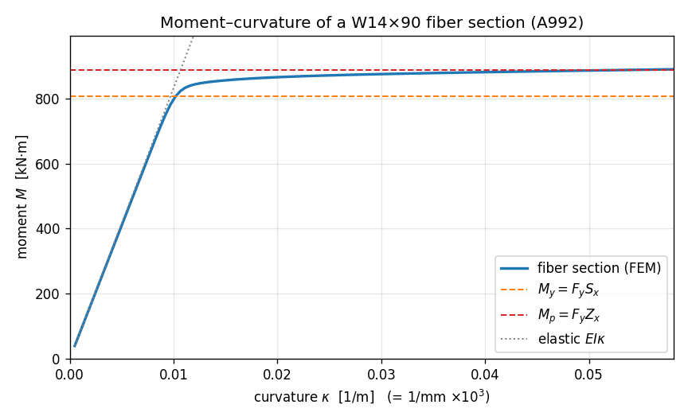

# E3 — Fiber sections and moment–curvature

Up to now every element has been *elastic*: give it an `A`, an `E`, an
`Iz`, and it bends forever along a straight line in the moment–curvature
plane. Real steel doesn't. Push a beam hard enough and its outer fibres
yield, the section softens, and the moment tops out at a **plastic
moment** the elastic formulas never see.

This is the example where we stop describing a section by two numbers and
start building it out of **fibres** — little slivers of material, each
with its own stress–strain law. Stack enough of them across the
cross-section and the section *discovers* its own moment–curvature
response: elastic at first, then yielding from the extreme fibre inward,
then a plateau. We'll do exactly that for a rolled wide-flange shape and
watch the curve walk through two numbers you can compute by hand — the
**first-yield moment** $M_y$ and the **plastic moment** $M_p$.

The section comes straight out of [**apeSteel**](https://github.com/nmorabowen/apeSteel),
the AISC steel-design library — we ask it for a `W14×90` and it hands
back the plate dimensions and section moduli. That's the whole point of
an ecosystem: the catalogue knows the steel, apeGmsh builds the fibre
model, OpenSees solves it.

!!! note "Units — N, mm, MPa"
    apeSteel's native base is **N-mm-tonne-s**, so section dimensions come
    back in millimetres and stresses in megapascals. We stay in that base
    for the whole page — lengths in mm, forces in N, moments in N·mm
    (printed as kN·m by dividing by 10⁶). It's a different system than the
    SI tutorials, but apeGmsh is unit-agnostic: pick one and be consistent.

## The problem

```
        Wide-flange section            Fibre discretisation
        bending about the              (3 rectangular patches,
        strong (z) axis                 fibres stacked in y)

           bf = 368                     ═══════════   ← top flange  (4 fibres deep)
        ┌───────────┐  ─┬─ tf=18           │   │
        │           │   │                  │   │      ← web        (24 fibres deep)
        └──┐     ┌──┘   │                  │   │
           │ tw  │      │ d = 356          │   │
        ┌──┘     └──┐   │                  │   │
        │           │   │               ═══════════   ← bottom flange (4 fibres)
        └───────────┘  ─┴─
                                    y ↑  (fibre coordinate = distance from centroid)
                                      └→ z

  W14×90, A992 steel:  Fy = 345 MPa,  E = 200 GPa
```

A doubly-symmetric section in pure bending has two moments you can write
down from the section moduli alone:

**First-yield moment** — the moment at which the *extreme fibre* just
reaches $F_y$, with everything inside still elastic:

$$
M_y \;=\; F_y\,S_x
$$

**Plastic moment** — the moment when the *entire* section has yielded,
the stress block fully plastic (tension below the neutral axis,
compression above):

$$
M_p \;=\; F_y\,Z_x
$$

$S_x$ is the **elastic** section modulus, $Z_x$ the **plastic** one. Their
ratio $Z_x/S_x$ is the **shape factor** — how much reserve strength a
section has past first yield. For a wide flange it's about **1.10** (most
of the steel is already in the flanges, where it yields early, so there's
little left to mobilise). apeSteel gives us both moduli from the
catalogue:

With $S_x = 2.34\times10^{6}\ \text{mm}^3$ and
$Z_x = 2.57\times10^{6}\ \text{mm}^3$ at $F_y = 345\ \text{MPa}$:

$$
M_y \approx 807\ \text{kN·m}, \qquad
M_p \approx 887\ \text{kN·m}, \qquad
\frac{Z_x}{S_x} = 1.10.
$$

Those are the two heights the FEM curve has to pass through.

## The whole model

The script reads top to bottom. The new ideas — a **fibre section** and a
**`ZeroLengthSection`** element driven by **imposed curvature** — are
flagged in the walkthrough below.

```python
import numpy as np
import apeSteel
from apeGmsh import apeGmsh
from apeGmsh.opensees import apeSees
from apeGmsh.opensees.section.fiber import RectPatch
import openseespy.opensees as opspy

# --- Section properties, straight from the AISC catalogue (apeSteel) ---
# apeSteel's canonical base is N-mm-tonne-s, so lengths are mm and
# stresses MPa. We stay in that base for the whole page.
SHAPE = "W14X90"
props = apeSteel.AISCv16Catalog().get_section_properties(SHAPE)
d, bf = props.overall_depth_d, props.flange_width_bf
tf, tw = props.flange_thickness_tf, props.web_thickness_tw
Sx = props.elastic_section_modulus_strong_axis_Sx     # [mm^3]
Zx = props.plastic_section_modulus_strong_axis_Zx     # [mm^3]
Ix = props.moment_of_inertia_strong_axis_Ix           # [mm^4]

Fy, E = 345.0, 200_000.0          # A992 steel: Fy = 345 MPa, E = 200 GPa
My, Mp = Fy * Sx, Fy * Zx         # first-yield and plastic moments

# --- 1. Two (essentially) coincident nodes for a zero-length section ---
with apeGmsh(model_name="moment_curvature") as g:
    a = g.model.geometry.add_point(0.0,   0.0, 0.0)
    b = g.model.geometry.add_point(5e-7,  0.0, 0.0)   # a hair away -> "coincident"
    ln = g.model.geometry.add_line(a, b)
    g.model.sync()

    g.physical.add(1, [ln], name="Section")
    g.physical.add(0, [a],  name="Fixed")
    g.physical.add(0, [b],  name="Rotated")

    g.mesh.structured.set_transfinite_curve(ln, 2)    # exactly one element
    g.mesh.generation.generate(1)
    fem = g.mesh.queries.get_fem_data(dim=1)

fixed_id   = int(fem.nodes.select(pg="Fixed").ids[0])
rotated_id = int(fem.nodes.select(pg="Rotated").ids[0])

# --- 2. Build the fiber section through the typed bridge ---
ops = apeSees(fem)
ops.model(ndm=2, ndf=3)                                # 2-D: ux, uy, thetaz

steel = ops.uniaxialMaterial.Steel02(fy=Fy, E=E, b=0.005)   # ~elastoplastic

# Discretise the wide-flange into three rectangular patches, fibres
# stacked through the depth (local y) so they resolve strong-axis bending.
section = ops.section.Fiber(patches=(
    RectPatch(material=steel, ny=4,  nz=1,                       # top flange
              yI=d/2 - tf, zI=-bf/2, yJ=d/2,        zJ=bf/2),
    RectPatch(material=steel, ny=24, nz=1,                       # web
              yI=-(d/2 - tf), zI=-tw/2, yJ=d/2 - tf, zJ=tw/2),
    RectPatch(material=steel, ny=4,  nz=1,                       # bottom flange
              yI=-d/2, zI=-bf/2, yJ=-(d/2 - tf), zJ=bf/2),
))
ops.element.ZeroLengthSection(pg="Section", section=section)

ops.fix(pg="Fixed",   dofs=(1, 1, 1))                  # clamp one node fully
ops.fix(pg="Rotated", dofs=(1, 1, 0))                  # free only the rotation

# --- 3. Impose curvature in steps, read moment back (live domain) ---
kappa_y = (Fy / E) / (d / 2)                           # first-yield curvature
n_steps = 120
d_kappa = 6.0 * kappa_y / n_steps                      # sweep to 6 kappa_y

ts = ops.timeSeries.Linear()
with ops.pattern.Plain(series=ts) as pat:
    pat.load(pg="Rotated", forces=(0.0, 0.0, 1.0))     # reference unit moment

ops.constraints.Plain()
ops.numberer.Plain()
ops.system.BandGeneral()
ops.test.NormDispIncr(tol=1e-8, max_iter=40)
ops.algorithm.Newton()
ops.integrator.DisplacementControl(node=rotated_id, dof=3, dU=d_kappa)
ops.analysis.Static()

ops.run(wipe=False)                                    # keep the domain live
kappa, moment = [], []
for _ in range(n_steps):
    opspy.analyze(1)
    opspy.reactions()
    kappa.append(opspy.nodeDisp(rotated_id, 3))                # imposed curvature
    moment.append(-opspy.nodeReaction(fixed_id, 3))            # reacting moment
kappa = np.array(kappa)
moment = np.array(moment)

# --- 4. Check against the closed form ---
print(f"{SHAPE} (A992)")
print(f"  Sx = {Sx:.3e} mm^3   Zx = {Zx:.3e} mm^3   shape factor Zx/Sx = {Zx/Sx:.3f}")
print(f"  My = Fy*Sx = {My/1e6:7.1f} kN*m")
print(f"  Mp = Fy*Zx = {Mp/1e6:7.1f} kN*m")
print()
print(f"  curvature swept to {kappa[-1]/kappa_y:.1f} * kappa_y")
print(f"  M_max          = {moment.max()/1e6:7.1f} kN*m")
print(f"  M_max / Mp     = {moment.max()/Mp:.3f}")
slope0 = moment[1] / kappa[1]
print(f"  elastic slope (M/kappa)_0 / (E*Ix) = {slope0/(E*Ix):.3f}")
```

Run it. You should see:

```
W14X90 (A992)
  Sx = 2.340e+06 mm^3   Zx = 2.570e+06 mm^3   shape factor Zx/Sx = 1.098
  My = Fy*Sx =   807.3 kN*m
  Mp = Fy*Zx =   886.6 kN*m

  curvature swept to 6.0 * kappa_y
  M_max          =   889.6 kN*m
  M_max / Mp     = 1.003
  elastic slope (M/kappa)_0 / (E*Ix) = 0.984
```

Three things landed:

- **M_max / Mp = 1.003.** At six times the yield curvature the section has
  fully plastified, and the moment it carries is the plastic moment
  $M_p = F_y Z_x$ to a third of a percent. (It nudges just past because of
  the small strain-hardening we gave the steel; an ideal elasto-plastic
  steel would asymptote to $M_p$ exactly.)
- **The shape factor is 1.098** — the textbook ~1.10 for a wide flange,
  computed by apeSteel straight from $Z_x/S_x$, and the curve really does
  climb from $M_y$ to that fraction higher.
- **The elastic slope is 0.984 of $EI$.** Before yield the section is
  linear with stiffness $E I_x$ — the fibre model reproduces it to 1.6 %.
  The small deficit is real: our three rectangular patches omit the rolled
  fillets between web and flange, so the fibre $I$ is a hair below the
  published $I_x$. (Add the fillets and it closes.)

## Step 1 — A zero-length section needs two coincident nodes

```python
    a = g.model.geometry.add_point(0.0,   0.0, 0.0)
    b = g.model.geometry.add_point(5e-7,  0.0, 0.0)   # a hair away
    ln = g.model.geometry.add_line(a, b)
    ...
    g.mesh.structured.set_transfinite_curve(ln, 2)    # exactly one element
```

A moment–curvature test isn't a beam — it's a *single section*, probed in
isolation. OpenSees does this with a **`zeroLengthSection`** element: two
nodes at the *same point*, coupled through one section. Impose a relative
rotation between the nodes and that rotation *is* the section curvature;
read the reacting moment and you've traced one point of the M–κ curve.

We can't draw a line of literally zero length, so we place the second
point a hair away (`5e-7`) and mesh it into exactly one element with
`set_transfinite_curve(ln, 2)` (two nodes → one element). The element
ignores its own vanishing geometric length entirely — it couples the two
nodes purely through the section.

!!! note "A harmless one-line note from OpenSees"
    Because the two nodes aren't *perfectly* coincident, OpenSees prints a
    one-line `ZeroLengthSection::setDomain() -- ... L= 5e-07, which is
    greater than the tolerance` to stderr. It's harmless — the element's
    response depends only on the section, not the geometric length, and
    the closed-form check above proves it behaves exactly right.

## Step 2 — A section built from fibres

```python
steel = ops.uniaxialMaterial.Steel02(fy=Fy, E=E, b=0.005)

section = ops.section.Fiber(patches=(
    RectPatch(material=steel, ny=4,  nz=1, yI=d/2 - tf, zI=-bf/2, yJ=d/2,       zJ=bf/2),
    RectPatch(material=steel, ny=24, nz=1, yI=-(d/2-tf), zI=-tw/2, yJ=d/2 - tf, zJ=tw/2),
    RectPatch(material=steel, ny=4,  nz=1, yI=-d/2,    zI=-bf/2, yJ=-(d/2-tf), zJ=bf/2),
))
ops.element.ZeroLengthSection(pg="Section", section=section)
```

Here's the genuinely new construct. Instead of handing the element an
`Iz`, we hand it a **fibre section** — a bundle of small material cells,
each carrying a 1-D stress–strain law. The constitutive law is
**`Steel02`** (Menegotto–Pinto, here with a tiny `b = 0.005` hardening so
it's almost elasto-plastic).

The section is three **`RectPatch`** blocks — top flange, web, bottom
flange — laid out in the section's local **(y, z)** frame, where **y is
the depth direction**. Each patch says "fill this rectangle with `ny × nz`
fibres of this material." We stack many fibres through the depth
(`ny=24` in the web) because strong-axis bending varies the strain
*linearly with y*: the more fibres in y, the more finely the model
resolves the yield front marching in from the extreme fibre. Across the
width (z) one column is plenty — strong-axis bending doesn't vary with z.

The patch corners come straight from the apeSteel dimensions `d`, `bf`,
`tf`, `tw`. That's the whole section: no `Iz`, no `Sx` fed to the element
— it will *derive* its stiffness and strength from the fibres themselves.

!!! tip "Register materials through the bridge"
    Build the `Steel02` with `ops.uniaxialMaterial.Steel02(...)`, not by
    constructing the dataclass directly — the bridge needs to *register*
    the material so it can resolve the fibre's material tag at build time.
    The same goes for the section (`ops.section.Fiber`).

## Step 3 — Drive it by curvature, not by load

```python
ops.fix(pg="Fixed",   dofs=(1, 1, 1))
ops.fix(pg="Rotated", dofs=(1, 1, 0))             # free only the rotation
...
ops.integrator.DisplacementControl(node=rotated_id, dof=3, dU=d_kappa)
```

Past yield the M–κ curve *flattens* — near the plastic plateau a tiny
moment increment produces a huge curvature jump. If we pushed with a
prescribed *moment* (load control) the solver would shoot off to infinity
the instant we asked for more than $M_p$. So we **control the
displacement** instead: `DisplacementControl` imposes the rotation DOF
(`dof=3`) of the `Rotated` node in fixed increments `dU = d_kappa`, and
*solves for the moment* that produces it. The clamp on `Fixed` plus
fixing both translations on `Rotated` leaves exactly one free DOF — the
relative rotation — which, for a zero-length element, equals the section
curvature.

```python
ops.run(wipe=False)                               # keep the domain live
for _ in range(n_steps):
    opspy.analyze(1)
    opspy.reactions()
    kappa.append(opspy.nodeDisp(rotated_id, 3))           # imposed curvature
    moment.append(-opspy.nodeReaction(fixed_id, 3))       # reacting moment
```

For a step-by-step sweep where we want a number out of every increment,
the cleanest read is the **live domain**: `ops.run(wipe=False)` builds the
model and leaves the OpenSees domain *open* so we can step it directly
with `opspy.analyze(1)` and read state back between steps. Each step,
`nodeDisp(rotated_id, 3)` is the curvature we imposed and
`nodeReaction(fixed_id, 3)` is the moment the section pushed back with
(after `reactions()` recomputes them). That's one (κ, M) point per step,
the whole curve in a loop.

!!! note "Live domain vs. the capture pipeline"
    Elsewhere we record with `DomainCaptureSpec` →
    `Results.from_native` — the right tool when you want a results file,
    a viewer, and `results.plot.*`. Here a parametric sweep that pulls two
    scalars per step, the **`ops.run(wipe=False)` live-domain fast path**
    is the documented, lighter-weight choice. Same OpenSees underneath;
    just a more direct read.

## The curve

Plotting moment against curvature draws the section's whole story on one
axis:

```python
import matplotlib
matplotlib.use("Agg")                 # headless backend
import matplotlib.pyplot as plt

fig, ax = plt.subplots(figsize=(7.2, 4.4))
ax.plot(kappa * 1e3, moment / 1e6, "-", lw=2, label="fiber section (FEM)")
ax.plot(kappa * 1e3, (E * Ix) * kappa / 1e6, ":", color="0.5",
        lw=1.2, label=r"elastic $EI\kappa$")
ax.axhline(My / 1e6, ls="--", color="#ff7f0e", lw=1.2, label=r"$M_y=F_yS_x$")
ax.axhline(Mp / 1e6, ls="--", color="#d62728", lw=1.2, label=r"$M_p=F_yZ_x$")
ax.set_xlabel(r"curvature $\kappa$  [1/m]")
ax.set_ylabel(r"moment $M$  [kN$\cdot$m]")
ax.set_title("Moment–curvature of a W14×90 fiber section (A992)")
ax.legend(loc="lower right"); ax.grid(alpha=0.3); fig.tight_layout()
fig.savefig("mphi-w14x90.png", dpi=120)
```



Read it like the textbook diagram it is. The curve tracks the dotted
$EI\kappa$ line exactly until the extreme fibre hits $F_y$ at
$M_y \approx 807\ \text{kN·m}$ — that's the **knee**. Past it the yield
front eats inward, the section softens, and the moment curls over toward
the **plastic plateau** at $M_p \approx 887\ \text{kN·m}$. The vertical
gap between the two dashed lines *is* the shape factor — the extra 10 %
the section delivers between first yield and full plastification.

!!! tip "Seeing it move"
    A single section has no shape to orbit, so there's no `show_web()`
    view here — the M–κ curve *is* the visualisation. Where `show_web()`
    earns its keep is on the member-level examples (a frame swaying, a
    plate's stress field), such as the nonlinear **pushover** capstone.

## What you just learned

You built a section out of material, not formulas, and watched it
reproduce two hand calculations:

- **Fibre sections** discretise a cross-section into many small material
  cells (`RectPatch`/`StraightLayer`/`FiberPoint`), each with its own
  uniaxial law. The section *derives* its moment–curvature response — you
  never hand it an `Iz`.
- **apeSteel is the section catalogue.** `get_section_properties("W14X90")`
  hands back the plate dimensions and the moduli $S_x$, $Z_x$ — and the
  shape factor falls out of $Z_x/S_x$. The steel library and the FEM
  library compose.
- **`ZeroLengthSection` probes one section** between two coincident nodes;
  imposed relative rotation = curvature, reacting moment = section moment.
- **Control displacement, not load,** to walk *past* the plastic plateau
  without the solver diverging — `DisplacementControl` on the rotation DOF.
- **The closed forms check out:** elastic slope $= EI$ (to the fillet),
  first yield at $M_y = F_y S_x$, plateau at $M_p = F_y Z_x$, shape factor
  $Z_x/S_x = 1.10$.

## Where next

- **Pushover from CAD** *(capstone)* — put this fibre section into a real
  **frame** and push it sideways to its capacity: the same yielding, now
  at member scale, traced as a base-shear-vs-drift curve.
- **[Modal analysis](modal-analysis.md)** — the dynamics counterpart, if
  you skipped it: mass, `eigen`, and natural frequencies.
- **[The OpenSees bridge guide](../internal_docs/guide_opensees.md)** — the
  full catalogue of typed materials, sections, and elements.
