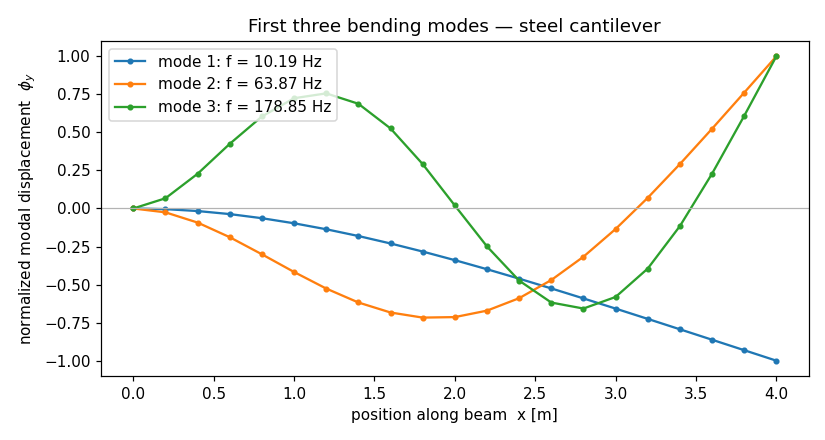

# Modal analysis of a cantilever

In [your first model](../tutorials/first-model.md) you pushed a cantilever with
a static tip load and read back a deflection. This time the beam carries no
load at all — we ask a different question: **if you pluck it, how does it
ring?** We'll compute the first three natural frequencies and draw the mode
shapes, then check the frequencies against a closed form that's been in the
vibrations textbooks for a century.

This is your first taste of *dynamics* in apeGmsh, and it introduces three
things every later dynamic model reuses: **mass** on the model, the **eigen**
solve on the typed bridge, and reading **modes** back through `Results`. The
mechanics are familiar — same cantilever, same typed bridge — so you can focus
on what's new.

## The problem

```
          y
          ^
  Fixed   |
  ████|===========================  ← free end
  ████|                                (no load — we want frequencies)
  ████|<---------- L = 4 m ---------->|

  Section: 0.10 m × 0.20 m rectangle (strong-axis bending)
  Material: steel — E = 200 GPa, ρ = 7850 kg/m³
```

A prismatic cantilever with **distributed mass** (the steel of the beam itself)
has natural frequencies you can write down. For Euler–Bernoulli bending the
$n$-th frequency is

$$
f_n \;=\; \frac{(\beta_n L)^2}{2\pi}\,\sqrt{\dfrac{E\,I}{\bar m\,L^{4}}}
\qquad\text{where } \bar m = \rho A
$$

and the $\beta_n L$ are the roots of $\cos(\beta L)\cosh(\beta L) = -1$:

| mode $n$ | $\beta_n L$ |
|:--:|:--:|
| 1 | 1.8751 |
| 2 | 4.6941 |
| 3 | 7.8548 |

With $E = 200\times10^9\ \text{Pa}$, $I = \tfrac{bh^3}{12} = 6.667\times10^{-5}\ \text{m}^4$,
$\bar m = \rho A = 7850 \cdot 0.02 = 157\ \text{kg/m}$, and $L = 4\ \text{m}$, the
formula gives **10.19, 63.87, 178.85 Hz**. Those three numbers are what apeGmsh
has to reproduce.

!!! note "Units"
    As always, apeGmsh just stores the numbers you give it. We stay in
    **consistent SI** — metres, newtons, pascals, **and kilograms** — so the
    frequencies come out in hertz. The new ingredient versus the static
    tutorial is mass: it has units, and it has to be consistent with the rest.

## The whole model

Here's the entire script. Read it top to bottom first — it's a close cousin of
the static tutorial, with three new moves (mass, eigen, modes) called out in the
walkthrough below.

```python
from apeGmsh import apeGmsh, Results
from apeGmsh.opensees import apeSees, OpenSeesModel
from apeGmsh.results.capture.spec import DomainCaptureSpec
import numpy as np

# --- Problem data (consistent SI: m, N, Pa, kg) ---
L  = 4.0            # length          [m]
E  = 200e9          # Young's mod.    [Pa]   (steel)
b, h = 0.10, 0.20   # section sides   [m]
rho = 7850.0        # density         [kg/m^3] (steel)

A    = b * h                  # area            [m^2]
Iz   = b * h**3 / 12.0        # strong-axis I   [m^4]
mbar = rho * A                # mass per length [kg/m]

# --- 1. Geometry + physical groups, inside a session ---
with apeGmsh(model_name="modal-cantilever") as g:
    p0   = g.model.geometry.add_point(0.0, 0.0, 0.0)
    p1   = g.model.geometry.add_point(L,   0.0, 0.0)
    beam = g.model.geometry.add_line(p0, p1)
    g.model.sync()

    g.physical.add(1, [beam], name="Beam")    # the line  -> elements
    g.physical.add(0, [p0],   name="Fixed")   # left end  -> support

    g.mesh.sizing.set_global_size(L / 20.0)   # ~20 line elements
    g.mesh.generation.generate(1)
    fem = g.mesh.queries.get_fem_data(dim=1)

# --- 2. Build the OpenSees model through the typed bridge ---
ops = apeSees(fem)
ops.model(ndm=2, ndf=3)                       # 2-D frame: ux, uy, thetaz

transf = ops.geomTransf.Linear(vecxz=(0.0, 0.0, 1.0))
ops.element.elasticBeamColumn(
    pg="Beam", transf=transf, A=A, E=E, Iz=Iz,
    mass=mbar, c_mass=True,                    # <-- distributed (consistent) mass
)
ops.fix(pg="Fixed", dofs=(1, 1, 1))           # clamp ux, uy, thetaz

# standard analysis chain — assembles K and M into the live domain
ops.constraints.Plain()
ops.numberer.RCM()
ops.system.BandGeneral()
ops.test.NormDispIncr(tol=1e-10, max_iter=10)
ops.algorithm.Linear()
ops.integrator.LoadControl(dlam=1.0)
ops.analysis.Static()

# --- 3. Build the domain, then capture the first 3 modes ---
ops.analyze(steps=1)                          # assemble K + M (no load = no motion)

spec = DomainCaptureSpec(opensees=ops)
spec.modal(n_modes=3)                         # declare a modal record
with ops.domain_capture(spec, path="run.h5") as cap:
    cap.capture_modes()                       # runs ops.eigen, writes one stage per mode

# --- 4. Read frequencies back, by mode ---
results = Results.from_native("run.h5", model=OpenSeesModel.from_h5("run.h5"))
modes = sorted(results.eigen_modes, key=lambda m: m.mode_index)

betaL    = np.array([1.875104, 4.694091, 7.854757])
fn_exact = betaL**2 / (2.0 * np.pi) * np.sqrt(E * Iz / (mbar * L**4))

print("mode  f_FEM[Hz]   f_exact[Hz]   T_FEM[s]   error%")
for m, fe in zip(modes, fn_exact):
    err = abs(m.frequency_hz - fe) / fe * 100.0
    print(f"{m.mode_index:>3}   {m.frequency_hz:9.4f}   {fe:11.4f}   "
          f"{m.period_s:8.4f}   {err:8.4f}")
```

Run it. You should see:

```
mode  f_FEM[Hz]   f_exact[Hz]   T_FEM[s]   error%
  1     10.1923       10.1923     0.0981     0.0000
  2     63.8739       63.8738     0.0157     0.0002
  3    178.8514      178.8485     0.0056     0.0016
```

There they are: **10.19, 63.87, 178.85 Hz**, matching the Euler–Bernoulli
formula to four significant figures. The errors are far below our 2–5 % target
because the **consistent** mass matrix (`c_mass=True`) on twenty elements
reproduces the continuous beam's modes almost exactly. Now let's see what each
new block does.

## Step 1 — Same geometry, one support, no load

```python
with apeGmsh(model_name="modal-cantilever") as g:
    p0   = g.model.geometry.add_point(0.0, 0.0, 0.0)
    p1   = g.model.geometry.add_point(L,   0.0, 0.0)
    beam = g.model.geometry.add_line(p0, p1)
    g.model.sync()

    g.physical.add(1, [beam], name="Beam")
    g.physical.add(0, [p0],   name="Fixed")
```

Geometry-wise this is the static tutorial with the load group dropped. We still
name the parts we care about — `"Beam"` for the member and `"Fixed"` for the
clamp — but there's **no `"Tip"` group**, because a free-vibration analysis has
no applied load to target. We mesh into about twenty line elements (`L/20`) and
take the `get_fem_data(dim=1)` snapshot, exactly as before.

!!! tip "Why more elements than the static run?"
    A single beam element reproduces the *static* tip deflection exactly, but a
    mode shape is a curve, and each element can only bend as a cubic. Twenty
    elements give the higher modes (mode 3 has two internal zero-crossings) room
    to take their shape. It's the same convergence story as any FEM mesh — just
    driven by the wiggliness of the answer, not the load.

## Step 2 — The typed bridge, now with mass

```python
ops = apeSees(fem)
ops.model(ndm=2, ndf=3)

transf = ops.geomTransf.Linear(vecxz=(0.0, 0.0, 1.0))
ops.element.elasticBeamColumn(
    pg="Beam", transf=transf, A=A, E=E, Iz=Iz,
    mass=mbar, c_mass=True,
)
ops.fix(pg="Fixed", dofs=(1, 1, 1))
```

The bridge setup is identical to the static run — `ops.model(ndm=2, ndf=3)`, a
`Linear` geometric transform, `elasticBeamColumn` over the `"Beam"` group, and
a full clamp on `"Fixed"` — with **one addition that makes this a dynamics
model**: the `mass=` and `c_mass=` arguments on the element.

- **`mass=mbar`** is the mass *per unit length*, $\bar m = \rho A$. Without it
  the model has stiffness but no inertia, and the eigensolver has nothing to
  weigh against the stiffness — the natural frequencies would be undefined. The
  bridge builds the element mass matrix for you from this one number; you do not
  hand-place lumped masses at nodes for a self-weight problem.
- **`c_mass=True`** asks for the **consistent** mass matrix (the one derived
  from the same cubic shape functions as the stiffness), rather than the default
  lumped-mass approximation. Consistent mass is what converges to the
  Euler–Bernoulli frequencies — it's why our error is four-digits-zero instead
  of a percent or two. (Lumped mass works too and is cheaper; for this teaching
  check we want the textbook number.)

!!! note "Mass per length, not total mass"
    `mass=mbar` is $\rho A$ in **kg/m**, not the beam's total mass. OpenSees
    multiplies it by each element's length internally. A common slip is to pass
    total mass here — that would make the beam twenty times too heavy (one
    "whole beam" of mass on every element) and drop every frequency by
    $\sqrt{20}$.

The rest — `constraints`, `numberer`, `system`, … `analysis.Static()` — is the
familiar analysis chain. For an eigen solve we don't strictly need a *load*
recipe, but building the chain and running one trivial step is the simplest way
to get the stiffness and mass matrices assembled into the live domain, which is
exactly what the eigensolver reads.

## Step 3 — The eigen path: assemble, then capture modes

```python
ops.analyze(steps=1)                          # assemble K + M

spec = DomainCaptureSpec(opensees=ops)
spec.modal(n_modes=3)
with ops.domain_capture(spec, path="run.h5") as cap:
    cap.capture_modes()
```

This is the heart of the page, and it has two parts.

`ops.analyze(steps=1)` runs a single static step with **no load applied**. The
beam doesn't move (zero load → zero displacement), but the act of analyzing
**assembles the global stiffness `K` and mass `M`** into the live OpenSees
domain. The eigensolver needs both matrices in place; this one line puts them
there.

Then the **modal capture**. Instead of declaring node records as we did for the
static deflection, we declare a `spec.modal(n_modes=3)` record — "I want the
first three modes." Inside the capture block, `cap.capture_modes()` does the
real work: it issues OpenSees' generalized eigen solve
($K\phi = \omega^2 M\phi$), reads each eigenvalue and eigenvector back, and
writes **one stage per mode** into `run.h5` — each tagged `kind="mode"` and
stamped with its mode index, eigenvalue, frequency, and period. When the block
exits, `run.h5` holds three mode stages plus a copy of the model.

!!! note "Why `eigen` skips the analysis chain"
    `eigen` is the one OpenSees analysis that *doesn't* march through the
    constraints/integrator/algorithm machinery — it solves a matrix
    eigenproblem directly from the assembled `K` and `M`. So `capture_modes()`
    needs no `LoadControl`, no `algorithm`, no time-stepping. All it needs is
    the two matrices, which the `analyze(steps=1)` above guaranteed are
    assembled.

!!! tip "Same capture path as the static tutorial"
    We deliberately stayed on the **in-process domain-capture** path from
    [your first model](../tutorials/first-model.md) — `DomainCaptureSpec` →
    `ops.domain_capture` → `Results.from_native`. The only thing that changed is
    *what* we declared on the spec (`spec.modal(...)` instead of
    `spec.nodes(...)`). The export-and-run-elsewhere and MPCO alternatives are
    covered in the how-to recipes; you don't need them here.

## Step 4 — Read frequencies back, by mode

```python
results = Results.from_native("run.h5", model=OpenSeesModel.from_h5("run.h5"))
modes = sorted(results.eigen_modes, key=lambda m: m.mode_index)
```

`Results.from_native(...)` opens the run file — and as always **`model=` is
required**, so the broker can translate physical-group names back into nodes.
The model lives in the same file, so we point `OpenSeesModel.from_h5` at the
same path (the Composed-file pattern).

`results.eigen_modes` is the new accessor: a list of lightweight `EigenMode`
snapshots, one per mode, each carrying `mode_index`, `eigenvalue`,
`frequency_hz`, `period_s`, and `omega_rad_s`. They're plain dataclasses
detached from the file — safe to keep, pickle, or return from a function after
the `Results` is closed. We sort by `mode_index` (the solver returns ascending
eigenvalues, but sorting makes the intent explicit) and read each
`frequency_hz` straight off. That's the column that matched the closed form.

!!! note "`eigen_modes` vs `modes` — frequencies vs shapes"
    Two accessors, two jobs:

    - **`results.eigen_modes`** → lightweight `EigenMode` dataclasses. Use these
      when you want the **numbers** (frequencies, periods) and want to keep them
      around. No node queries.
    - **`results.modes`** → a list of *scoped `Results`*, one per mode. Use these
      when you want the **mode shape** — each one answers `.nodes.get(pg=...,
      component=...)` just like any other `Results`, returning the eigenvector
      as a single-step slab. That's what we use for the plot below.

## Drawing the mode shapes

Frequencies are half the story; the *shapes* are the other half. Each mode is a
deflected curve, and `results.modes` gives us a scoped `Results` per mode that
reads back exactly like a displacement field:

```python
import matplotlib
matplotlib.use("Agg")              # headless backend
import matplotlib.pyplot as plt

scoped = sorted(results.modes, key=lambda m: m.mode_index)

fem2 = results.model.fem
nid_to_x = {int(n): float(c[0])
            for n, c in zip(fem2.nodes.ids, np.asarray(fem2.nodes.coords))}

fig, ax = plt.subplots(figsize=(7.5, 4.0))
for m in scoped:
    sl   = m.nodes.get(pg="Beam", component="displacement_y")  # eigenvector, by name
    xs   = np.array([nid_to_x[int(n)] for n in sl.node_ids])
    order = np.argsort(xs)
    phi  = sl.values[0]                       # one step = the mode shape
    phi  = phi / np.max(np.abs(phi))          # normalize to unit tip
    ax.plot(xs[order], phi[order], marker="o", ms=3,
            label=f"mode {m.mode_index}: f = {m.frequency_hz:.2f} Hz")

ax.axhline(0.0, color="0.7", lw=0.8)
ax.set_xlabel("position along beam  x [m]")
ax.set_ylabel(r"normalized modal displacement  $\phi_y$")
ax.set_title("First three bending modes — steel cantilever")
ax.legend(loc="upper left")
fig.tight_layout()
fig.savefig("modal-cantilever-modes.png", dpi=110)
```

The key line is `m.nodes.get(pg="Beam", component="displacement_y")`. Because
each mode is a scoped `Results`, you read its eigenvector **by physical-group
name**, the same way you'd read a displacement field — `"Beam"` again, the same
name you used to declare the elements. A mode stage has exactly one step, so
`sl.values[0]` *is* the shape. We normalize each mode to a unit tip so the three
curves share an axis.



Read the picture like a textbook: **mode 1** has no internal zero-crossing (the
whole beam swings one way), **mode 2** has one, and **mode 3** has two — the
classic cantilever signature. The shapes are the visual proof that the
frequencies aren't a fluke: each curve is a genuine bending mode of the clamped
beam.

!!! tip "See it move, interactively"
    For an interactive, animated view of the deformed mode shapes in a notebook,
    `results.show_web()` launches the kernel-safe web viewer — scrub between
    modes and orbit the geometry in 3-D. (The static PNG above is what we use in
    docs, since it renders headless; `show_web()` is the tool you'll reach for
    at your own desk.)

## What you just learned

You ran the full apeGmsh dynamics spine on a beam you can check by hand:

- **Mass makes it dynamic.** `ops.element.elasticBeamColumn(..., mass=mbar,
  c_mass=True)` puts distributed, consistent mass on the member. No mass, no
  frequencies — inertia is what the stiffness vibrates against.
- **`analyze(steps=1)` assembles `K` and `M`.** The eigensolver reads the
  assembled matrices; one trivial (load-free) step puts them in the live domain.
- **The eigen path is `spec.modal` → `capture_modes`.** Declare how many modes
  you want on the capture spec; `cap.capture_modes()` runs the OpenSees eigen
  solve and writes one `kind="mode"` stage per mode — same in-process capture
  path as the static tutorial, different record type.
- **Two ways to read modes back.** `results.eigen_modes` for the **numbers**
  (frequencies, periods — lightweight, keepable); `results.modes` for the
  **shapes** (scoped `Results`, read the eigenvector by physical-group name with
  `.nodes.get(...)`).

And the model *checks out* — 10.19, 63.87, 178.85 Hz, the Euler–Bernoulli
cantilever frequencies to four figures.

## Where next

- **[Your first model](../tutorials/first-model.md)** — the static cantilever
  this page builds on, if you skipped it.
- **Time-history dynamics** — drive the same masses with a `UniformExcitation`
  ground motion and read the response history (coming in a later example).
- **[The OpenSees bridge guide](../internal_docs/guide_opensees.md)**
  — the typed primitives and the analysis chain, including `eigen`.
