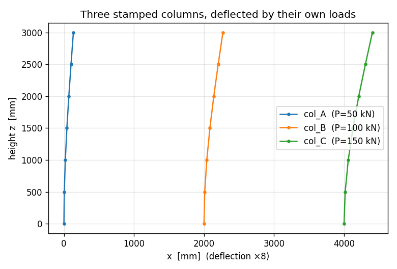

# E4 — Multi-part assembly

Real structures repeat. A building has the same column on every grid line,
the same beam in every bay. Drawing each one from scratch — re-typing the
points, re-naming the groups — is how mistakes creep in. apeGmsh has a
better way: build a member **once** as a reusable `Part`, then **stamp** it
into the model as many times as you need, each copy carrying its own
addressable **label**.

This example builds a single column as a `Part`, drops three copies into one
session at different locations, gives each a different load, and reads each
one's deflection back **by its label**. The closed-form check is the
cantilever you already trust — $\delta = PL^3/3EI$ — applied three times,
once per stamped copy.

!!! note "Units — mm, N, MPa"
    A `Part` round-trips through a CAD file (STEP) internally, so it's most
    natural in CAD units. We stay in mm, N, MPa.

## The problem

```
        col_A            col_B            col_C
       P=50 kN          P=100 kN         P=150 kN
         →                →  →             →  →  →
        ┌─┐              ┌─┐              ┌─┐
        │ │              │ │              │ │      each: 3 m tall,
        │ │              │ │              │ │      200×200 mm square,
        │ │              │ │              │ │      steel E = 200 GPa
       ▟███▙            ▟███▙            ▟███▙
       fixed            fixed            fixed
       x=0              x=2 m            x=4 m

  One Part template, stamped three times.
```

Three identical clamped columns, pushed sideways at the tip by three
different loads. Each is a textbook cantilever, so each tip moves by

$$
\delta \;=\; \frac{P L^3}{3 E I}, \qquad I = \frac{a^4}{12}.
$$

They're the *same* column — same height, same section — so the only thing
that differs between them is the load. If the three deflections come back in
the ratio 1 : 2 : 3 and each matches $PL^3/3EI$, the stamping preserved the
geometry and the labels kept the three copies straight.

## The whole model

The new ideas are **`Part`** (build once) and **`g.parts.add`** (stamp), plus
addressing each stamped copy **by label** all the way through to `Results`.

```python
import numpy as np
from apeGmsh import apeGmsh, Part, Results
from apeGmsh.opensees import apeSees, OpenSeesModel
from apeGmsh.results.capture.spec import DomainCaptureSpec

# --- Problem data (mm, N, MPa) ---
L = 3000.0                         # column height
E, nu = 200_000.0, 0.3            # steel
G = E / (2 * (1 + nu))
a = 200.0                          # square section side
A = a * a
I = a**4 / 12.0                    # second moment (Iy = Iz, square)
J = 0.1406 * a**4                  # St-Venant torsion constant, square

# --- 1. Build ONE column as a reusable Part (a vertical line) ---
column = Part("column")
with column:
    base = column.model.geometry.add_point(0.0, 0.0, 0.0)
    top  = column.model.geometry.add_point(0.0, 0.0, L)
    column.model.geometry.add_line(base, top, label="shaft")
    column.model.sync()

# --- 2. Stamp it three times into one assembly, each at its own x ---
loads = {"col_A": 50_000.0, "col_B": 100_000.0, "col_C": 150_000.0}
with apeGmsh(model_name="assembly") as g:
    shaft_tags = []
    for i, x in enumerate([0.0, 2000.0, 4000.0]):
        inst = g.parts.add(column, label=f"col_{chr(65+i)}", translate=(x, 0.0, 0.0))
        shaft_tags += list(inst.entities.get(1, []))     # this instance's line(s)
    g.physical.add(1, shaft_tags, name="Columns")        # all shafts -> one element group

    g.mesh.sizing.set_global_size(L / 6.0)
    g.mesh.generation.generate(1)
    fem = g.mesh.queries.get_fem_data(dim=1)

# --- 3. One element declaration, per-instance supports and loads ---
ops = apeSees(fem)
ops.model(ndm=3, ndf=6)                                  # 3-D frame
transf = ops.geomTransf.Linear(vecxz=(1, 0, 0))
ops.element.elasticBeamColumn(pg="Columns", transf=transf, A=A, E=E, G=G, J=J, Iy=I, Iz=I)

# Each instance's base (lowest node) and tip (highest node), found by label.
base_ids, tip_ids = [], {}
for lbl in loads:
    sel = fem.nodes.select(label=lbl)
    ids = np.array([int(n) for n in sel.ids]); z = sel.coords[:, 2]
    base_ids.append(int(ids[np.argmin(z)]))
    tip_ids[lbl] = int(ids[np.argmax(z)])

ops.fix(nodes=base_ids, dofs=(1, 1, 1, 1, 1, 1))         # clamp all three bases
ts = ops.timeSeries.Linear()
with ops.pattern.Plain(series=ts) as pat:
    for lbl, P in loads.items():
        pat.load(node=tip_ids[lbl], forces=(P, 0, 0, 0, 0, 0))   # push each tip in +x

ops.constraints.Plain(); ops.numberer.Plain(); ops.system.BandGeneral()
ops.test.NormDispIncr(tol=1e-8, max_iter=10); ops.algorithm.Linear()
ops.integrator.LoadControl(dlam=1.0); ops.analysis.Static()

# --- 4. Capture each instance by label; read each back by label ---
spec = DomainCaptureSpec(opensees=ops)
for lbl in loads:
    spec.nodes(label=lbl, components=["displacement_x"], name=f"u_{lbl}")
with ops.domain_capture(spec, path="assembly.h5") as cap:
    cap.begin_stage("push", kind="static"); ops.analyze(steps=1); cap.step(t=1.0); cap.end_stage()

om = OpenSeesModel.from_h5("assembly.h5", fem_root="/model")
print(f"square section a={a:.0f} mm,  I={I:.3e} mm^4")
with Results.from_native("assembly.h5", model=om) as r:
    for lbl, P in loads.items():
        slab = r.nodes.get(label=lbl, component="displacement_x")
        d_fem = float(np.max(np.abs(slab.values[-1, :])))
        d_exact = P * L**3 / (3 * E * I)
        print(f"{lbl}: P={P/1e3:5.0f} kN   tip_FEM={d_fem:7.3f} mm   PL3/3EI={d_exact:7.3f} mm"
              f"   err={abs(d_fem-d_exact)/d_exact*100:.3f}%")
```

Run it. You should see:

```
square section a=200 mm,  I=1.333e+08 mm^4
col_A: P=   50 kN   tip_FEM= 16.875 mm   PL3/3EI= 16.875 mm   err=0.000%
col_B: P=  100 kN   tip_FEM= 33.750 mm   PL3/3EI= 33.750 mm   err=0.000%
col_C: P=  150 kN   tip_FEM= 50.625 mm   PL3/3EI= 50.625 mm   err=0.000%
```

Three copies, three loads, three exact deflections — **16.9, 33.8, 50.6 mm**,
in the clean 1 : 2 : 3 ratio of the loads, each landing on $PL^3/3EI$ to the
last digit. The stamping reproduced the column perfectly, and the labels kept
the three results from getting mixed up.

## Step 1 — Build the column once, as a `Part`

```python
column = Part("column")
with column:
    base = column.model.geometry.add_point(0.0, 0.0, 0.0)
    top  = column.model.geometry.add_point(0.0, 0.0, L)
    column.model.geometry.add_line(base, top, label="shaft")
    column.model.sync()
```

A **`Part`** is a self-contained geometry container with *its own* Gmsh
session — it knows nothing about the assembly it will end up in. You build it
exactly like a session model (`column.model.geometry...`), and you **label**
the pieces you'll want to address later. Here the column is a single vertical
line labelled `"shaft"`.

When the `with` block closes, the Part quietly persists itself (to a STEP
file with a sidecar of label positions). That's what lets it be *re-imported*
— possibly many times — into a session. The label `"shaft"` travels with it.

!!! tip "A Part is a template, not an instance"
    Nothing is placed in a model yet. Think of `column` as a rubber stamp:
    defined once, inked as many times as you like. It can hold lines (as
    here) or solids (`add_box`, `add_cylinder`, …) — anything you'd draw in
    a session.

## Step 2 — Stamp it three times

```python
for i, x in enumerate([0.0, 2000.0, 4000.0]):
    inst = g.parts.add(column, label=f"col_{chr(65+i)}", translate=(x, 0.0, 0.0))
    shaft_tags += list(inst.entities.get(1, []))
g.physical.add(1, shaft_tags, name="Columns")
```

`g.parts.add(column, label=..., translate=...)` imports the Part into the
session at an offset, and — crucially — **prefixes its labels with the
instance label**. Stamp it as `"col_A"` and the column's `"shaft"` becomes
`"col_A.shaft"`; the instance as a whole is addressable as `"col_A"`. Three
`add` calls, three independent copies at `x = 0, 2, 4 m`, each with its own
namespace.

Each `add` returns an **`Instance`** whose `.entities` dict gives the geometry
tags it created. We collect every instance's line (`entities[1]`) into one
**physical group** `"Columns"` — because all three share the same section,
they'll be one element declaration. (The per-instance *labels* still live
alongside this group; we'll use them on the read side.)

!!! note "Labels for reading, a physical group for the element"
    The typed bridge declares elements by **physical group** (`pg=`), so the
    shafts go into one `"Columns"` group. The **labels** (`col_A`, `col_B`,
    `col_C`) are what survive to `Results` — that's how we pull each stamped
    column's answer back out separately. Two namespaces, two jobs.

## Step 3 — One element, per-instance supports and loads

```python
ops.element.elasticBeamColumn(pg="Columns", transf=transf, A=A, E=E, G=G, J=J, Iy=I, Iz=I)

for lbl in loads:
    sel = fem.nodes.select(label=lbl)
    ids = np.array([int(n) for n in sel.ids]); z = sel.coords[:, 2]
    base_ids.append(int(ids[np.argmin(z)]))
    tip_ids[lbl] = int(ids[np.argmax(z)])

ops.fix(nodes=base_ids, dofs=(1, 1, 1, 1, 1, 1))
```

One `elasticBeamColumn` over `"Columns"` writes *every* column element at once
— the whole assembly's frame in a single line, because they share a section.
(This is a 3-D model, `ndm=3, ndf=6`, so the section needs `Iy`, `Iz`, `G`,
`J` as well as `A`, `E`.)

The supports and loads, though, are **per instance** — so we find each
column's base and tip by **selecting its label** and picking the lowest and
highest node. `fem.nodes.select(label="col_A")` returns just that copy's
nodes; `argmin`/`argmax` on the $z$-coordinate gives base and tip. We clamp
all three bases at once and, in the pattern, push each tip with its own load.

## Step 4 — Read each copy back, by label

```python
spec = DomainCaptureSpec(opensees=ops)
for lbl in loads:
    spec.nodes(label=lbl, components=["displacement_x"], name=f"u_{lbl}")
...
for lbl, P in loads.items():
    slab = r.nodes.get(label=lbl, component="displacement_x")
    d_fem = float(np.max(np.abs(slab.values[-1, :])))
```

This is the payoff of stamping with labels. We declare one capture record
**per label**, and read each one back the same way:
`r.nodes.get(label="col_A", ...)` returns only `col_A`'s nodes, blind to the
other two copies. The labels we stamped in Step 2 flowed all the way through
meshing, solving, and capture — so on the read side each column is a
first-class, independently addressable object. We take each one's max
$|u_x|$ (the tip) and check it against $PL^3/3EI$.

## See it

```python
import matplotlib
matplotlib.use("Agg")
import matplotlib.pyplot as plt

coords = np.asarray(r.model.fem.nodes.coords)
nid_row = {int(n): i for i, n in enumerate(r.model.fem.nodes.ids)}
fig, ax = plt.subplots(figsize=(6.5, 4.4))
for lbl, color in zip(loads, ["#1f77b4", "#ff7f0e", "#2ca02c"]):
    slab = r.nodes.get(label=lbl, component="displacement_x")
    z  = np.array([coords[nid_row[int(n)], 2] for n in slab.node_ids])
    x0 = np.array([coords[nid_row[int(n)], 0] for n in slab.node_ids])
    order = np.argsort(z)
    ax.plot(x0[order] + slab.values[-1, order] * 8, z[order], "-o", ms=3,
            color=color, label=f"{lbl}  (P={loads[lbl]/1e3:.0f} kN)")
ax.set_xlabel("x  [mm]  (deflection ×8)"); ax.set_ylabel("height z  [mm]")
ax.set_title("Three stamped columns, deflected by their own loads")
ax.legend(); ax.grid(alpha=0.3); fig.tight_layout()
fig.savefig("assembly-columns.png", dpi=120)
```



There they are — the same column, three times, each leaning by an amount set
by *its* load, drawn straight from its label's slab. (`results.show_web()`
gives the interactive 3-D version in a notebook.) Stamp once, read each
copy by name.

## What you just learned

You built a member once and reused it without copy-paste:

- **A `Part` is a reusable template** — its own little geometry session,
  built and labelled once, then persisted so it can be stamped repeatedly.
- **`g.parts.add(part, label=, translate=)` stamps an instance** and
  namespaces its labels under the instance label (`col_A.shaft`). Each `add`
  returns an `Instance` whose `.entities` give the new geometry tags.
- **Two namespaces, two jobs.** Collect shafts into a physical group for the
  element declaration (`pg="Columns"`); use the per-instance **labels** to
  address supports, loads, and — above all — **results**.
- **Labels survive end to end.** `fem.nodes.select(label="col_A")` and
  `r.nodes.get(label="col_A", ...)` pull one stamped copy's nodes out of the
  assembly, so each instance is independently addressable.
- **The check is the cantilever, three times:** 16.9, 33.8, 50.6 mm, each
  exactly $PL^3/3EI$.

## Where next

- **Tie non-matching meshes** — when stamped parts *touch*, join their
  (possibly mismatched) meshes with a tie that the bridge emits for you.
- **[STEP import: plate with a hole](step-plate-with-hole.md)** — import a
  Part's big sibling, a full CAD file, and name its faces by query.
- **Compose modules** *(later)* — assemble a model from whole saved `.h5`
  modules instead of geometry Parts.
