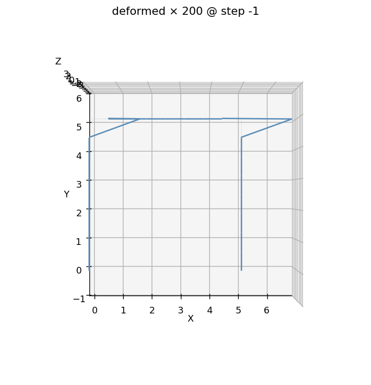

# E1 — A 2D portal frame

This is your first model with *more than one member*. A single-bay,
single-storey moment-resisting portal frame — two columns and a beam —
pushed sideways at the roof. It's the smallest model that still feels
like a building: a lateral load goes in, a drift comes out, and the base
reactions have to add back up to what you pushed with.

You already met the typed bridge on the
[cantilever](../tutorials/first-model.md). Everything here is the same
spine — session → physical groups → `apeSees(fem)` → capture → read by
name — but now you'll wire **two element groups** (columns and beam, with
*different* sections), combine a **gravity** load with a **lateral**
load, and pull two different answers back out: **roof drift** and **base
shear**.

There's a twist worth flagging up front. When you check the drift against
the hand calc you learned in school — the **portal method** — the FEM
won't quite agree. That gap is not a bug. The FEM is the *more* correct
of the two, and at the end we'll prove it by checking against a second,
sharper hand calc.

## The problem

```
        P = 60 kN                 W/2            W/2
        ───────►●═══════════════════════════════════●   ← roof (free to sway)
                ║                                     ║
                ║                                     ║   H = 5 m
                ║ columns                       beam  ║
                ║ 0.22 × 0.22                0.20×0.50║
              ██╨██                               ██╨██
              Fixed                               Fixed
              └────────────── B = 5 m ──────────────┘

  Material: steel, E = 200 GPa
  Lateral load P = 60 kN at the roof (+x)
  Gravity  W = 300 kN, split as two point loads on the roof joints (−y)
```

Two things we want out of this model:

**Roof drift Δ.** The classical back-of-the-envelope answer is the
**portal method**: idealize the beam as rigid, so each fixed-base column
behaves like a fixed–fixed shear column with lateral stiffness
$k = 12EI_c/H^3$. Two columns in parallel give a storey stiffness
$K = 2\cdot 12EI_c/H^3$, and

$$
\Delta_{\text{portal}} \;=\; \frac{P}{K} \;=\; \frac{P\,H^{3}}{24\,E\,I_c}.
$$

With $I_c = \tfrac{0.22^4}{12} = 1.952\times10^{-4}\ \text{m}^4$,
$P = 60\,000\ \text{N}$, $H = 5\ \text{m}$, $E = 200\times10^9\ \text{Pa}$,
that's **≈ 8.00 mm**.

**Base shear.** No formula needed — *statics*. The two column bases
between them must react the entire applied lateral load, so the sum of
the horizontal base reactions has to equal $P = 60\ \text{kN}$, exactly.
That one is a sanity check the FEM has to pass to the last digit.

!!! note "Units"
    Consistent SI throughout — metres, newtons, pascals. The drift comes
    out in metres because the geometry is in metres.

## The whole model

The whole script, top to bottom. It's longer than the cantilever only
because there are two members and two loads — the shape is identical.
Read it once, then we'll walk it.

```python
import numpy as np
from apeGmsh import apeGmsh, Results
from apeGmsh.opensees import apeSees, OpenSeesModel
from apeGmsh.results.capture.spec import DomainCaptureSpec

# --- Problem data (consistent SI: m, N, Pa) ---
H = 5.0                       # storey height   [m]
B = 5.0                       # bay width       [m]
E = 200e9                     # Young's modulus [Pa]  (steel)

bc, hc = 0.22, 0.22           # column section  [m]  (slim square)
Ac = bc * hc                  # column area     [m^2]
Ic = bc * hc**3 / 12.0        # column I        [m^4]

bb, hb = 0.20, 0.50           # beam section    [m]  (deeper, stiffer)
Ab = bb * hb                  # beam area       [m^2]
Ib = bb * hb**3 / 12.0        # beam I          [m^4]

P = 60_000.0                  # lateral roof load   [N]  (+x)
W = 300_000.0                 # total gravity load  [N]  (split on roof joints)

# --- 1. Geometry + physical groups ---
with apeGmsh(model_name="portal") as g:
    bl = g.model.geometry.add_point(0.0, 0.0, 0.0)   # base left
    br = g.model.geometry.add_point(B,   0.0, 0.0)   # base right
    tl = g.model.geometry.add_point(0.0, H,   0.0)   # roof left
    tr = g.model.geometry.add_point(B,   H,   0.0)   # roof right

    col_l = g.model.geometry.add_line(bl, tl)
    col_r = g.model.geometry.add_line(br, tr)
    beam  = g.model.geometry.add_line(tl, tr)
    g.model.sync()

    g.physical.add(1, [col_l, col_r], name="Columns")  # two columns -> one group
    g.physical.add(1, [beam],         name="Beam")     # the beam    -> its own group
    g.physical.add(0, [bl, br],       name="Base")     # fixed supports
    g.physical.add(0, [tl],           name="RoofL")    # load + drift readout
    g.physical.add(0, [tr],           name="RoofR")

    g.mesh.sizing.set_global_size(H / 6.0)
    g.mesh.generation.generate(1)
    fem = g.mesh.queries.get_fem_data(dim=1)

# --- 2. Build the OpenSees model through the typed bridge ---
ops = apeSees(fem)
ops.model(ndm=2, ndf=3)                    # 2-D frame: ux, uy, thetaz

transf = ops.geomTransf.Linear(vecxz=(0.0, 0.0, 1.0))
ops.element.elasticBeamColumn(pg="Columns", transf=transf, A=Ac, E=E, Iz=Ic)
ops.element.elasticBeamColumn(pg="Beam",    transf=transf, A=Ab, E=E, Iz=Ib)

ops.fix(pg="Base", dofs=(1, 1, 1))         # clamp both column bases

ts = ops.timeSeries.Linear()
with ops.pattern.Plain(series=ts) as pat:
    pat.load(pg="RoofL", forces=(P / 2.0, -W / 2.0, 0.0))   # half lateral + half gravity
    pat.load(pg="RoofR", forces=(P / 2.0, -W / 2.0, 0.0))

ops.constraints.Plain()
ops.numberer.Plain()
ops.system.BandGeneral()
ops.test.NormDispIncr(tol=1e-10, max_iter=10)
ops.algorithm.Linear()
ops.integrator.LoadControl(dlam=1.0)
ops.analysis.Static()

# --- 3. Solve, capturing roof displacement AND base reactions ---
spec = DomainCaptureSpec(opensees=ops)
spec.nodes(pg="RoofL", components=["displacement"])
spec.nodes(pg="RoofR", components=["displacement"])
spec.nodes(pg="Base",  components=["reaction_force"])
with ops.domain_capture(spec, path="run.h5") as cap:
    cap.begin_stage("lateral", kind="static")
    ops.analyze(steps=1)
    cap.step(t=1.0)
    cap.end_stage()

# --- 4. Read it back, by physical-group NAME ---
results = Results.from_native("run.h5", model=OpenSeesModel.from_h5("run.h5"))

dl = results.nodes.get(pg="RoofL", component="displacement_x")
dr = results.nodes.get(pg="RoofR", component="displacement_x")
drift_fem = 0.5 * (float(dl.values[-1, 0]) + float(dr.values[-1, 0]))

rx = results.nodes.get(pg="Base", component="reaction_force_x")
base_shear = float(rx.values[-1, :].sum())

# --- Drift check #1: the portal-method shortcut (rigid-beam) ---
drift_portal = P * H**3 / (24.0 * E * Ic)

print(f"drift_FEM    = {drift_fem*1e3:.4f} mm")
print(f"drift_portal = {drift_portal*1e3:.4f} mm")
print(f"gap          = {abs(drift_fem-drift_portal)/drift_fem*100:.2f} %")
print(f"base_shear   = {base_shear:.1f} N   (applied P = {P:.1f} N)")
print(f"shear error  = {abs(base_shear + P)/P*100:.6f} %")
```

Run it. You should see:

```
drift_FEM    = 8.3883 mm
drift_portal = 8.0041 mm
gap          = 4.58 %
base_shear   = -60000.0 N   (applied P = 60000.0 N)
shear error  = 0.000000 %
```

The **base shear is exact**: the horizontal base reactions sum to
−60 000 N, equal and opposite to the 60 kN we pushed with. Equilibrium,
to the last digit — the model is doing physics, not approximating it.

The **drift is 8.39 mm, but the portal method said 8.00 mm** — a 4.6 %
gap. Hold that thought; we resolve it below.

## Step 1 — Two physical groups, not one

```python
    g.physical.add(1, [col_l, col_r], name="Columns")  # both columns
    g.physical.add(1, [beam],         name="Beam")
    g.physical.add(0, [bl, br],       name="Base")
    g.physical.add(0, [tl],           name="RoofL")
    g.physical.add(0, [tr],           name="RoofR")
```

The cantilever had one structural group (`"Beam"`). A frame has *parts
that behave differently*, so we name them separately. `"Columns"`
collects **both** column lines into a single group — they share a
section, so they'll be one element declaration. `"Beam"` is its own group
because it gets a different (deeper) section.

The two roof joints are named **individually** — `"RoofL"` and `"RoofR"`
— so we can put a load on each and read each one's drift back. `"Base"`
groups both fixed supports together.

This is the same discipline as before, just more of it: *name every part
you'll need to address later*, and address it by that name from here on.

## Step 2 — Two element groups, one transform

```python
transf = ops.geomTransf.Linear(vecxz=(0.0, 0.0, 1.0))
ops.element.elasticBeamColumn(pg="Columns", transf=transf, A=Ac, E=E, Iz=Ic)
ops.element.elasticBeamColumn(pg="Beam",    transf=transf, A=Ab, E=E, Iz=Ib)
```

Here's the first genuinely new move. **Two `elasticBeamColumn` calls** —
one per physical group, each with its *own* section properties. The
`"Columns"` group becomes every column element with the column's `A` and
`Iz`; the `"Beam"` group becomes the beam with the deeper section. One
line per member type, the whole frame.

They *share* one geometric transform. For a planar frame all members live
in the same plane, so a single `Linear` transform orients them all — you
build it once and pass the same handle to both element declarations.
(If your columns and beam needed different local-axis orientations — say
in a 3-D frame — you'd build a transform per orientation and hand each
group the one it needs.)

```python
ops.fix(pg="Base", dofs=(1, 1, 1))
```

Both column bases, clamped in one call — `dofs=(1, 1, 1)` fixes
$u_x, u_y, \theta_z$ at every node in `"Base"`. Two fixed bases is what
makes this a *moment* frame rather than a pinned-base sway frame.

### Two loads in one pattern

```python
ts = ops.timeSeries.Linear()
with ops.pattern.Plain(series=ts) as pat:
    pat.load(pg="RoofL", forces=(P / 2.0, -W / 2.0, 0.0))
    pat.load(pg="RoofR", forces=(P / 2.0, -W / 2.0, 0.0))
```

Both the lateral push and the gravity load live in the **same** `Plain`
pattern, applied together at the two roof joints. Each joint takes half
the lateral load ($+P/2$ in $x$) and half the gravity ($-W/2$ in $y$).
The `forces=` tuple is `(Fx, Fy, Mz)` — a horizontal component, a vertical
component, and zero applied moment.

Because both loads ramp together under one `Linear` series, the analysis
applies a *combined* lateral-plus-gravity case in a single static step.
Splitting them into separate patterns (dead, then lateral) is a later
trick; for one combined check this is all you need.

The rest — `constraints` through `analysis` — is the standard linear-static
analysis chain, identical to the cantilever.

## Step 3 — Capture two different answers

```python
spec = DomainCaptureSpec(opensees=ops)
spec.nodes(pg="RoofL", components=["displacement"])
spec.nodes(pg="RoofR", components=["displacement"])
spec.nodes(pg="Base",  components=["reaction_force"])
```

We want two distinct quantities, so we declare two kinds of capture.
**Displacement** on the roof joints gives us drift. **`reaction_force`**
on the base gives us the support reactions — the bridge calls
`ops.reactions()` for you each step so the numbers are live. Three
`spec.nodes(...)` calls, all targeted by name.

The solve block is unchanged from the cantilever: open a stage, run one
static step in-process, snapshot, close.

## Step 4 — Drift and base shear, by name

```python
results = Results.from_native("run.h5", model=OpenSeesModel.from_h5("run.h5"))

dl = results.nodes.get(pg="RoofL", component="displacement_x")
dr = results.nodes.get(pg="RoofR", component="displacement_x")
drift_fem = 0.5 * (float(dl.values[-1, 0]) + float(dr.values[-1, 0]))

rx = results.nodes.get(pg="Base", component="reaction_force_x")
base_shear = float(rx.values[-1, :].sum())
```

`Results.from_native(..., model=...)` opens the run file (model in the
same file — the Composed-file pattern, `model=` required). Then we read
back by the *same names we loaded*: `displacement_x` on the two roof
joints (we average them — in a symmetric sway they're equal anyway), and
`reaction_force_x` on the base group.

The base group has **two** nodes, so `rx.values[-1, :]` is the last-step
horizontal reaction at *each* base, and `.sum()` adds them — that's the
total base shear the frame delivers to its foundations.

## The 4.6 % gap is the lesson

So why is the FEM drift (8.39 mm) larger than the portal-method drift
(8.00 mm)? Because the portal method *lies to make the algebra easy*. Its
one big assumption — **a rigid beam** — pins the column tops against
rotation. Real beams bend. When the beam flexes, the joints rotate, the
columns lean further, and the frame is **softer** than the rigid-beam
idealization predicts. A softer frame drifts more. The FEM models the
beam's real stiffness, so it sees the extra flexibility the portal method
threw away.

To prove the FEM is the trustworthy one — and not just *different* — drop
the rigid-beam fiction and do the drift the rigorous way:
**slope-deflection**, which carries the real bending stiffness of *both*
the columns and the beam. By symmetry the frame has two unknowns — the
joint rotation $\theta$ and the sway $\psi = \Delta/H$ — and a 2×2 system
in $k_c = EI_c/H$, $k_b = EI_b/B$:

```python
import numpy as np
kc, kb = E * Ic / H, E * Ib / B
A = np.array([[4*kc + 6*kb, -6*kc],
              [12*kc,        -24*kc]])
theta, psi = np.linalg.solve(A, np.array([0.0, P * H]))
drift_sd = abs(psi * H)
print(f"drift_FEM         = {drift_fem*1e3:.4f} mm")
print(f"drift_slope_defl  = {drift_sd*1e3:.4f} mm")
print(f"FEM vs slope-defl = {abs(drift_fem-drift_sd)/drift_sd*100:.3f} %")
```

```
drift_FEM         = 8.3883 mm
drift_slope_defl  = 8.3733 mm
FEM vs slope-defl = 0.179 %
```

**0.18 %.** Once the hand calc stops pretending the beam is rigid, it
lands right on top of the FEM. The residual sliver that's left is the
column **axial shortening** under gravity — which even slope-deflection
ignores, but the FEM does not. So the ranking is:

| Drift estimate | Value | What it captures |
|---|---|---|
| Portal method (rigid beam) | 8.00 mm | columns only — beam idealized rigid |
| **FEM (apeGmsh → OpenSees)** | **8.39 mm** | columns + beam bending + axial |
| Slope-deflection (flexible beam) | 8.37 mm | columns + beam bending |

The portal method isn't *wrong* — it's a deliberately conservative-on-the-
stiff-side preliminary tool, and 4.6 % is a fine first estimate to size a
member. But this is exactly the kind of effect a real model is *for*: the
FEM keeps the parts the hand formula drops. Treat the gap as a feature,
and treat the slope-deflection agreement as your proof that the model is
sound.

## See it

`results.plot.deformed(...)` renders the warped shape headless (matplotlib,
no GPU needed). Looking straight down the out-of-plane axis turns the
planar frame into a clean elevation:

```python
ax = results.plot.deformed(step=-1, scale=200)
ax.view_init(elev=90, azim=-90)     # look down +z -> 2-D elevation
ax.figure.savefig("portal-deformed.png", dpi=130, bbox_inches="tight")
```



Both columns lean to the right, the roof translates as a unit, and the
fixed bases stay put — the sway mode you'd sketch by hand, drawn straight
from the result slab. (The displacements are magnified ×200; at true
scale 8 mm over a 5 m frame is invisible.)

For an interactive 3-D view in a notebook, reach for
**`results.show_web()`** — the kernel-safe web viewer. (Never call
`results.viewer()` in a notebook; its blocking VTK+Qt loop crashes the
kernel.)

## What you just learned

This was the cantilever spine scaled up to a real structure:

- **One physical group per behaviour.** `"Columns"`, `"Beam"`, `"Base"`,
  `"RoofL"`, `"RoofR"` — name every part you'll address, then address it
  by name. Two columns share a group because they share a section; the
  beam gets its own.
- **Multiple element groups, one transform.** Two `elasticBeamColumn`
  calls, each `pg=` a different group with its own `A`/`Iz`, sharing one
  planar `geomTransf.Linear`.
- **Combined loads in one pattern.** Lateral *and* gravity at the roof
  joints, ramped together in a single `Plain` pattern.
- **Capture more than one quantity.** `displacement` for drift,
  `reaction_force` for base shear — declared by name, read by name.
- **Base shear is statics.** The base reactions summed to the applied
  load *exactly* — your free equilibrium check on any frame.
- **The FEM beats the hand shortcut.** The 4.6 % gap vs the portal method
  is the FEM capturing beam flexibility + axial that the rigid-beam
  idealization drops — confirmed by a 0.18 % match against
  slope-deflection.

## Where next

- **[Part assembly](notebooks/10b_part_assembly.ipynb)** — build a column
  once as a `Part`, stamp it three times, and keep each instance
  addressable by its own label.
- **[Labels & physical groups](notebooks/05_labels_and_pgs.ipynb)** — the
  two naming namespaces and how both reach `Results`.
- **[Modal analysis](notebooks/17_modal_analysis.ipynb)** — give this
  frame mass and pull its sway period out with `cap.capture_modes(N)`.
