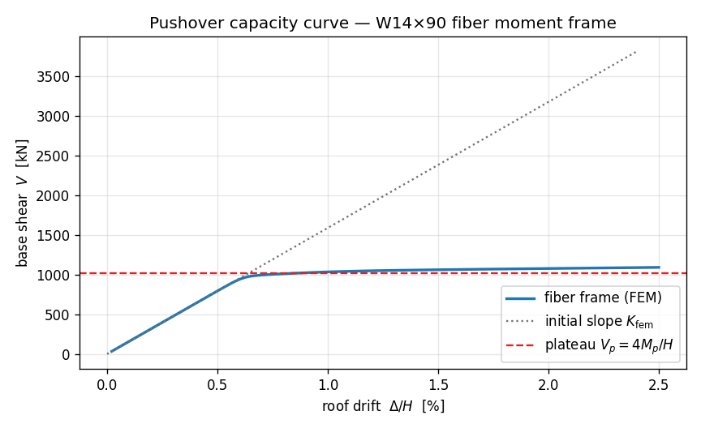

# E10 — Pushover of a steel moment frame (fiber sections)

This is where the two threads finally braid together. On the
[portal frame](portal-frame.md) you pushed a frame sideways and read its
**drift** and **base shear**; on the
[fiber moment–curvature](fiber-moment-curvature.md) page you built a
`W14×90` out of fibres and watched one section walk from first yield to
its plastic moment $M_p$. Now we put that *same fibre section* into the
*same kind of frame* and push it past yield — at member scale — to trace
the structure's whole **capacity curve**: base shear $V$ against roof
drift $\Delta$, from the elastic rise, through the yield knee, onto the
plastic plateau.

The model is a single-bay portal **moment frame**. The two columns carry
the fibre `W14×90` through a **distributed-plasticity beam–column**
element, so plasticity can spread along them and the four column ends can
form hinges. The beam is made deliberately **strong and elastic**, so the
frame fails in a clean **column-sway mechanism** — the textbook collapse
mode, and the one whose capacity we can write down by hand.

Two numbers anchor the whole exercise, both computable before we run
anything:

- **Elastic stiffness** $K$ — the initial slope of the $V\!-\!\Delta$ curve.
- **Plastic base shear** $V_p$ — the plateau the curve flattens onto.

We state both up front, run the pushover, and check the captured curve
against them at the end. Spoiler from the verified run: the slope lands
within **2.7 %** and the mechanism plateau within **1.9 %** — and the
small residuals are physics we can name, not noise.

## The problem

```
        ──►●═══════════════════════════════════●   ← roof (pushed in +x)
           ║                                     ║
           ║                                     ║   H = 3500 mm
           ║ columns                       beam  ║
           ║ W14×90 fiber             strong,    ║
           ║ (force-based)            elastic     ║
         ██╨██                               ██╨██
         Fixed                               Fixed
         └──────────────── B = 6000 mm ───────────┘

  Columns : W14×90 fiber section, A992 steel (Fy = 345 MPa, E = 200 GPa)
  Beam    : elastic, made ~1000× stiffer than a column → near-rigid
  Load    : monotonic lateral push at the roof, displacement-controlled
            to 2.5 % drift (87.5 mm)
```

!!! note "Units — N, mm, MPa"
    We stay in **apeSteel's native base** — N-mm-tonne-s — for the whole
    page, exactly as on the [fiber section](fiber-moment-curvature.md)
    example. Lengths in mm, forces in N, moments in N·mm (printed as kN·m
    by dividing by 10⁶), stiffness in N/mm, base shear in N (printed as
    kN). apeGmsh is unit-agnostic — pick one system and be consistent.

### Target 1 — elastic stiffness $K$

While everything is elastic the frame is a one-storey **shear frame**.
With a (near-)rigid beam, the beam pins the column tops against rotation,
so each fixed-base column behaves like a **fixed–fixed shear column** of
lateral stiffness $12EI_c/H^3$. Two columns in parallel give

$$
K \;=\; 2\cdot\frac{12\,E\,I_c}{H^{3}}.
$$

With $I_c = I_x = 4.16\times10^{8}\ \text{mm}^4$ (the published `W14×90`
strong-axis inertia), $E = 200{,}000\ \text{MPa}$, $H = 3500\ \text{mm}$,
that's **$K \approx 46{,}573\ \text{N/mm}$**.

### Target 2 — plastic base shear $V_p$

Push hard enough and the four column ends — two bases, two tops — each
form a plastic hinge at the column's plastic moment $M_p = F_y Z_x$. With
all four hinges open, the frame is a **mechanism**: it can sway with no
further load increase. Equilibrium of that mechanism (a sway of the
rigid-beam storey, four hinges each absorbing $M_p$) gives the plastic
base shear

$$
V_p \;=\; \frac{4\,M_p}{H}, \qquad M_p = F_y Z_x.
$$

With $Z_x = 2.57\times10^{6}\ \text{mm}^3$ and $F_y = 345\ \text{MPa}$,
$M_p = 886.6\ \text{kN·m}$ and **$V_p \approx 1013\ \text{kN}$**. That's
the height the capacity curve should flatten toward.

!!! warning "A real fibre plateau is *soft*, not flat"
    The $4M_p/H$ formula assumes ideal hinges that snap to $M_p$ and hold.
    A distributed-fibre model does **not** give a razor-flat plateau:
    plasticity spreads gradually along the columns, the hinges form one
    after another, and — crucially — the `Steel02` material **strain-
    hardens**, so the curve keeps creeping upward past $V_p$. We'll read
    the plateau where the *mechanism just forms* (≈ 1 % drift) and again
    at the *end of the push* (2.5 % drift), and explain the gap between
    them. A few-percent overshoot you can attribute to hardening is the
    honest, correct result — not a bug to be hidden.

## The whole model

Top to bottom. The genuinely new moves over the portal frame are the
**fibre column section** (from E3) wired into a **`forceBeamColumn`**
distributed-plasticity element, and a **displacement-controlled** push
walked out over many steps. Read it once; the walkthrough follows.

```python
import numpy as np
import apeSteel
from apeGmsh import apeGmsh, Results
from apeGmsh.opensees import apeSees, OpenSeesModel
from apeGmsh.results.capture.spec import DomainCaptureSpec
from apeGmsh.opensees.section.fiber import RectPatch
import openseespy.opensees as opspy

# --- Problem data (N-mm-MPa, apeSteel native base) ---
H = 3500.0          # storey height [mm]
B = 6000.0          # bay width     [mm]

SHAPE = "W14X90"
props = apeSteel.AISCv16Catalog().get_section_properties(SHAPE)
d  = props.overall_depth_d
bf = props.flange_width_bf
tf = props.flange_thickness_tf
tw = props.web_thickness_tw
Sx = props.elastic_section_modulus_strong_axis_Sx
Zx = props.plastic_section_modulus_strong_axis_Zx
Ix = props.moment_of_inertia_strong_axis_Ix
A  = props.gross_area_Ag

Fy = 345.0
E  = 200_000.0
b_hard = 0.005                      # small strain hardening (~elasto-plastic)

Mp = Fy * Zx                        # column plastic moment
My = Fy * Sx                        # column first-yield moment

# --- Closed-form targets ---
K_hand  = 2.0 * 12.0 * E * Ix / H**3    # column-sway elastic stiffness
Vp_hand = 4.0 * Mp / H                  # 4 column hinges at Mp

# Strong elastic beam → near-rigid → clean column-sway mechanism
A_beam = A * 10.0
I_beam = Ix * 1000.0

# --- 1. Geometry + physical groups (the E1 portal) ---
with apeGmsh(model_name="pushover_frame") as g:
    bl = g.model.geometry.add_point(0.0, 0.0, 0.0)   # base left
    br = g.model.geometry.add_point(B,   0.0, 0.0)   # base right
    tl = g.model.geometry.add_point(0.0, H,   0.0)   # roof left
    tr = g.model.geometry.add_point(B,   H,   0.0)   # roof right

    col_l = g.model.geometry.add_line(bl, tl)
    col_r = g.model.geometry.add_line(br, tr)
    beam  = g.model.geometry.add_line(tl, tr)
    g.model.sync()

    g.physical.add(1, [col_l, col_r], name="Columns")  # both columns -> fiber
    g.physical.add(1, [beam],         name="Beam")     # strong elastic beam
    g.physical.add(0, [bl, br],       name="Base")     # fixed supports
    g.physical.add(0, [tl],           name="Roof")     # push + drift readout
    g.physical.add(0, [tr],           name="RoofR")

    g.mesh.sizing.set_global_size(H / 4.0)
    g.mesh.generation.generate(1)
    fem = g.mesh.queries.get_fem_data(dim=1)

roof_id = int(fem.nodes.select(pg="Roof").ids[0])      # controlled node tag

# --- 2. Build the OpenSees model through the typed bridge ---
ops = apeSees(fem)
ops.model(ndm=2, ndf=3)                                # 2-D frame: ux, uy, thetaz

transf = ops.geomTransf.Linear(vecxz=(0.0, 0.0, 1.0))

# Columns: a W14x90 fiber section -> force-based (distributed plasticity)
steel = ops.uniaxialMaterial.Steel02(fy=Fy, E=E, b=b_hard)
col_sec = ops.section.Fiber(patches=(
    RectPatch(material=steel, ny=4,  nz=1, yI=d/2 - tf,  zI=-bf/2, yJ=d/2,       zJ=bf/2),
    RectPatch(material=steel, ny=24, nz=1, yI=-(d/2-tf), zI=-tw/2, yJ=d/2 - tf,  zJ=tw/2),
    RectPatch(material=steel, ny=4,  nz=1, yI=-d/2,      zI=-bf/2, yJ=-(d/2-tf), zJ=bf/2),
))
col_integ = ops.beamIntegration.Lobatto(section=col_sec, n_ip=5)
ops.element.forceBeamColumn(pg="Columns", transf=transf, integration=col_integ)

# Beam: strong elastic -> near-rigid
ops.element.elasticBeamColumn(pg="Beam", transf=transf, A=A_beam, E=E, Iz=I_beam)

ops.fix(pg="Base", dofs=(1, 1, 1))                     # clamp both column bases

# Reference unit lateral load — displacement control scales it
ts = ops.timeSeries.Linear()
with ops.pattern.Plain(series=ts) as pat:
    pat.load(pg="Roof", forces=(1.0, 0.0, 0.0))

ops.constraints.Transformation()
ops.numberer.RCM()
ops.system.BandGeneral()
ops.test.NormDispIncr(tol=1e-6, max_iter=30)
ops.algorithm.Newton()

n_steps = 120
drift_target = 0.025 * H                               # 2.5 % drift = 87.5 mm
dU = drift_target / n_steps
ops.integrator.DisplacementControl(node=roof_id, dof=1, dU=dU)
ops.analysis.Static()

# --- 3. Push step by step, capturing base shear + roof drift each step ---
spec = DomainCaptureSpec(opensees=ops)
spec.nodes(pg="Roof", components="displacement")       # roof drift
spec.nodes(pg="Base", components="reaction_force")     # base reactions

ops.run(wipe=False)                                    # build, leave domain live
with ops.domain_capture(spec, path="pushover.h5") as cap:
    cap.begin_stage("pushover", kind="static")
    for k in range(n_steps):
        if opspy.analyze(1) != 0:
            print(f"non-convergence at step {k}")
            break
        cap.step(t=(k + 1) * dU)
    cap.end_stage()

# --- 4. Read the capacity curve back, by name ---
om = OpenSeesModel.from_h5("pushover.h5", fem_root="/model")
with Results.from_native("pushover.h5", model=om) as r:
    dx = r.nodes.get(pg="Roof", component="displacement_x")
    rx = r.nodes.get(pg="Base", component="reaction_force_x")
    drift = np.asarray(dx.values)[:, 0]                # roof drift, every step
    V = -np.asarray(rx.values).sum(axis=1)             # base shear resists push

# --- Checks against the two closed forms ---
K_fem = np.polyfit(drift[:8], V[:8], 1)[0]             # initial slope

def V_at(pct):
    i = int(np.argmin(np.abs(drift / H * 100 - pct)))
    return drift[i], V[i]

_, V_mech = V_at(1.0)                                   # mechanism-formation plateau
_, V_end  = V_at(2.5)                                   # end of push

print(f"{SHAPE}:  Mp = Fy*Zx = {Mp/1e6:.1f} kN*m")
print(f"K_hand   = {K_hand:8.1f} N/mm   (2*12*E*Ix/H^3)")
print(f"K_fem    = {K_fem:8.1f} N/mm     gap = {(K_fem-K_hand)/K_hand*100:+.2f} %")
print(f"Vp_hand  = {Vp_hand/1e3:7.1f} kN    (4*Mp/H)")
print(f"V@1.0%   = {V_mech/1e3:7.1f} kN    gap = {(V_mech-Vp_hand)/Vp_hand*100:+.2f} %")
print(f"V@2.5%   = {V_end/1e3:7.1f} kN    gap = {(V_end-Vp_hand)/Vp_hand*100:+.2f} %")
```

Run it. You should see:

```
W14X90:  Mp = Fy*Zx = 886.6 kN*m
K_hand   =  46572.6 N/mm   (2*12*E*Ix/H^3)
K_fem    =  45320.8 N/mm     gap = -2.69 %
Vp_hand  =  1013.3 kN    (4*Mp/H)
V@1.0%   =  1032.8 kN    gap = +1.92 %
V@2.5%   =  1089.6 kN    gap = +7.53 %
```

Both targets land where the mechanics says they should:

- **Elastic slope: −2.69 %.** The captured initial stiffness is
  45,321 N/mm against the hand value of 46,573 N/mm — the FEM is a hair
  *softer*, for two reasons we unpack below.
- **Mechanism plateau: +1.92 %.** At 1 % drift, just as the fourth hinge
  forms, the base shear is 1033 kN against $4M_p/H = 1013$ kN. The
  mechanism prediction is essentially exact.
- **End of push: +7.53 %.** By 2.5 % drift the curve has crept up to
  1090 kN — the strain-hardening climb, not a flat plateau. More on this
  in a moment; this is the feature, not a bug.

## Step 1 — The fibre column meets a distributed-plasticity element

```python
steel = ops.uniaxialMaterial.Steel02(fy=Fy, E=E, b=b_hard)
col_sec = ops.section.Fiber(patches=(
    RectPatch(material=steel, ny=4,  nz=1, yI=d/2 - tf,  zI=-bf/2, yJ=d/2,       zJ=bf/2),
    RectPatch(material=steel, ny=24, nz=1, yI=-(d/2-tf), zI=-tw/2, yJ=d/2 - tf,  zJ=tw/2),
    RectPatch(material=steel, ny=4,  nz=1, yI=-d/2,      zI=-bf/2, yJ=-(d/2-tf), zJ=bf/2),
))
col_integ = ops.beamIntegration.Lobatto(section=col_sec, n_ip=5)
ops.element.forceBeamColumn(pg="Columns", transf=transf, integration=col_integ)
```

The section is **identical** to the [moment–curvature](fiber-moment-curvature.md)
page — three `RectPatch` blocks (top flange, web, bottom flange) laid out
in the section's local **(y, z)** frame, fibres stacked through the depth
so they resolve strong-axis bending. The patch corners come straight from
the apeSteel dimensions `d`, `bf`, `tf`, `tw`. No `Iz` is handed to the
element: the section *derives* its stiffness and strength from the fibres.

The new piece is how the section becomes an element. On E3 a single
section sat in a `ZeroLengthSection`. Here it drives a **`forceBeamColumn`** —
a **force-based, distributed-plasticity** beam–column. Two things to know:

1. **It needs a beam integration, not an `Iz`.** A distributed-plasticity
   element samples the fibre section at several **integration points**
   along its length. `ops.beamIntegration.Lobatto(section=col_sec, n_ip=5)`
   places **5 Gauss–Lobatto points** per element — Lobatto puts a point at
   each *end*, which is exactly where the hinges form in a sway frame, so
   the end sections are sampled directly. Every integration point carries
   its own copy of the fibre section and yields independently, so
   plasticity *spreads* along the column instead of lumping into a point.

2. **`forceBeamColumn` vs `dispBeamColumn`.** The bridge exposes both.
   Force-based elements interpolate the *force* field exactly (it's linear
   along a member with end loads), so a **single element per column**
   already captures the spread of yielding well — that's what we use here.
   The displacement-based `dispBeamColumn` would need several elements per
   column to reach the same accuracy. One `forceBeamColumn` per column,
   5 integration points: that's the whole column model.

!!! tip "Register materials and sections through the bridge"
    Build `Steel02` with `ops.uniaxialMaterial.Steel02(...)` and the
    section with `ops.section.Fiber(...)` — not by constructing the
    dataclasses directly. The bridge *registers* them so it can resolve
    the fibre's material tag and the integration's section tag at build
    time. Same rule as the moment–curvature page.

The beam, by contrast, is a plain elastic `elasticBeamColumn` made
~1000× stiffer than a column (`I_beam = Ix * 1000`). That near-rigid beam
is what forces the **column-sway** mechanism — the columns hinge, the beam
stays elastic — so the hand calc $V_p = 4M_p/H$ applies cleanly. Both
elements share the one planar `geomTransf.Linear`, exactly as on the
portal frame.

## Step 2 — Push by displacement, not by force

```python
roof_id = int(fem.nodes.select(pg="Roof").ids[0])
...
with ops.pattern.Plain(series=ts) as pat:
    pat.load(pg="Roof", forces=(1.0, 0.0, 0.0))        # unit reference load
...
ops.integrator.DisplacementControl(node=roof_id, dof=1, dU=dU)
```

This is the same lesson as the moment–curvature sweep, now at member
scale. Near the plateau the capacity curve *flattens* — a tiny load
increment produces a large drift jump. Under prescribed **load**
(`LoadControl`) the solver would diverge the instant we asked for more
than $V_p$. So we **control the displacement** instead: the `Plain`
pattern supplies a **unit reference load** (a 1 N push in $+x$) that only
sets the *direction* of loading, and `DisplacementControl` drives the
roof node's $u_x$ (`dof=1`) in fixed increments `dU`, solving for the load
factor at each step. We target 2.5 % drift over 120 steps.

The controlled node is resolved by **name** — `fem.nodes.select(pg="Roof")`
returns the mesh node in the `"Roof"` physical group, and `.ids[0]` is its
tag. We never type a raw integer; the tag comes from the group.

## Step 3 — Capture the whole curve, step by step

```python
spec = DomainCaptureSpec(opensees=ops)
spec.nodes(pg="Roof", components="displacement")
spec.nodes(pg="Base", components="reaction_force")

ops.run(wipe=False)                                    # build, leave domain live
with ops.domain_capture(spec, path="pushover.h5") as cap:
    cap.begin_stage("pushover", kind="static")
    for k in range(n_steps):
        if opspy.analyze(1) != 0:
            print(f"non-convergence at step {k}")
            break
        cap.step(t=(k + 1) * dU)
    cap.end_stage()
```

The capture spec is the **portal frame's exactly** — `displacement` on the
roof for drift, `reaction_force` on the base for shear, both **node-only**.
The only difference is that we now drive **many** steps and snapshot after
each one: `opspy.analyze(1)` advances one displacement increment, then
`cap.step(t=...)` writes one chunk. A hundred and twenty steps → 120 rows
in the slab → the whole capacity curve.

Two practical notes:

- **`ops.run(wipe=False)` then step the live domain.** As on the
  moment–curvature sweep, when we want a value out of *every* increment we
  build the model once with `ops.run(wipe=False)` (which leaves the
  OpenSees domain open) and then step it directly with `opspy.analyze(1)`.
  The capture writes a chunk per converged step.

!!! note "Node capture only — by design"
    We capture **`reaction_force` on `Base`** and **`displacement` on
    `Roof`** — both nodal. Base shear is the sum of nodal base reactions;
    roof drift is a nodal displacement. There's no need to record
    element or section quantities for the capacity curve, and the
    node-only path is the simplest, most robust capture there is. (It's
    the same path as the portal frame, just iterated.)

## Step 4 — Base shear vs roof drift, by name

```python
om = OpenSeesModel.from_h5("pushover.h5", fem_root="/model")
with Results.from_native("pushover.h5", model=om) as r:
    dx = r.nodes.get(pg="Roof", component="displacement_x")
    rx = r.nodes.get(pg="Base", component="reaction_force_x")
    drift = np.asarray(dx.values)[:, 0]
    V = -np.asarray(rx.values).sum(axis=1)
```

`Results.from_native(..., model=...)` opens the run file with its model
(the Composed-file pattern — `model=` is required, and the model lives in
the same file at `fem_root="/model"`). We read back by the **same names we
pushed and clamped**: `displacement_x` on `Roof` is the drift history,
`reaction_force_x` on `Base` is the per-base horizontal reaction at every
step. `.sum(axis=1)` adds the two bases each step; the sign flip makes
$V$ the shear the frame *delivers* (positive, resisting the push).

`drift` and `V` are now matched arrays, one entry per step — the capacity
curve, ready to plot and check.

## The capacity curve

```python
import matplotlib
matplotlib.use("Agg")                 # headless backend
import matplotlib.pyplot as plt

K_fem = np.polyfit(drift[:8], V[:8], 1)[0]

fig, ax = plt.subplots(figsize=(7.2, 4.4))
ax.plot(drift / H * 100, V / 1e3, "-", lw=2, color="#1f77b4",
        label="fiber frame (FEM)")
de = np.linspace(0, 0.024 * H, 50)
ax.plot(de / H * 100, K_fem * de / 1e3, ":", color="0.45", lw=1.4,
        label=r"initial slope $K_{\rm fem}$")
ax.axhline(Vp_hand / 1e3, ls="--", color="#d62728", lw=1.4,
           label=r"plateau $V_p = 4M_p/H$")
ax.set_xlabel(r"roof drift  $\Delta/H$  [%]")
ax.set_ylabel(r"base shear  $V$  [kN]")
ax.set_title("Pushover capacity curve — W14×90 fiber moment frame")
ax.legend(loc="lower right"); ax.grid(alpha=0.3); fig.tight_layout()
fig.savefig("pushover-steel-frame-curve.png", dpi=120)
```



Read it like the design diagram it is. The blue FEM curve rises straight
along the dotted **$K_{\rm fem}$** tangent while everything is elastic.
Near **0.7 % drift** it bends through the **yield knee** — the first
column ends reaching $M_y$. Past the knee the curve flattens onto a **soft
plateau** that crosses the dashed **$V_p = 4M_p/H$** line right around
**1 % drift**, where the fourth hinge completes the mechanism. Beyond
that it keeps creeping upward — the strain-hardening climb — reaching
≈ 1090 kN by 2.5 % drift.

For an interactive 3-D view of the swaying frame in a notebook, reach for
**`results.show_web()`** — the kernel-safe web viewer. (Never call
`results.viewer()` in a notebook; its blocking VTK+Qt loop crashes the
kernel.)

## The two gaps are the lesson

Both checks land close, and both residuals are nameable physics — exactly
the spirit of the portal frame's 4.6 % drift gap.

**The elastic slope is 2.7 % soft.** Two effects, both pushing the same
way:

- **The fibre section omits the rolled fillets.** Our three rectangular
  patches are the flanges and web only — the generous fillets where web
  meets flange aren't modelled, so the fibre $I$ is about **1.6 % below**
  the published $I_x$ (the same effect quantified on the
  [moment–curvature page](fiber-moment-curvature.md)). A column with
  slightly less $I$ is slightly softer.
- **The force-based element carries real flexibility the shear-column
  formula drops.** $K = 2\cdot 12EI/H^3$ is the idealized fixed–fixed
  shear column; the actual `forceBeamColumn` also feels axial and shear
  flexibility and the finite (not perfectly rigid) beam. Together with the
  fillet deficit that's the remaining ≈ 1 %.

Add them and you get the −2.7 %: the FEM is *more* honest than the
closed form, which assumed gross-section inertia and a perfectly rigid
beam.

**The plateau overshoots — by design, growing with drift.** At the
mechanism point (≈ 1 % drift) the base shear is **+1.9 %** over $4M_p/H$;
by the end of the push (2.5 % drift) it's **+7.5 %**. That growth is
**`Steel02` strain hardening** ($b = 0.005$): once a section yields it
keeps gaining moment at $\sim\!b$ of its elastic stiffness, so every
hinge carries a little *more* than $M_p$, and more so the further you
push. An ideal elastic–perfectly-plastic steel ($b = 0$) would asymptote
to $4M_p/H$ flat; real steel — and this model — climbs. The mechanism
formula nails the *onset* of the plateau (+1.9 %); the rest is the
material doing what real steel does.

| Quantity | Hand calc | FEM | Gap | Why |
|---|---|---|---|---|
| Elastic stiffness $K$ | 46,573 N/mm | 45,321 N/mm | −2.7 % | fibre $I$ omits fillets + real element flexibility |
| Plateau at mechanism (≈1 % drift) | 1013 kN ($4M_p/H$) | 1033 kN | +1.9 % | spread plasticity ≈ ideal mechanism |
| Plateau at 2.5 % drift | 1013 kN ($4M_p/H$) | 1090 kN | +7.5 % | Steel02 strain hardening ($b{=}0.005$) |

The discipline here is the same one running through the whole curriculum:
**state the closed form, run the model, read the actual number, and
explain the residual.** A 2.7 % softer slope and a plateau that overshoots
4Mp/H by a couple of percent at mechanism and a few more by 2.5 % drift —
each traceable to a specific modelling choice — is exactly what a
trustworthy fibre pushover should produce.

## What you just learned

You braided the fibre section into a frame and pushed it to collapse:

- **A fibre section becomes a member** through a distributed-plasticity
  **`forceBeamColumn`** + a **`beamIntegration.Lobatto`** — Lobatto puts
  integration points at the element ends, where sway-frame hinges form.
  One force-based element per column captures spread plasticity well.
- **Column-sway by construction.** A strong elastic beam pins the column
  tops so the frame fails in the clean four-hinge mechanism whose
  capacity is $V_p = 4M_p/H$.
- **Displacement control walks past the plateau.** A unit reference load
  sets the direction; `DisplacementControl` on the roof DOF drives the
  drift and solves for the load — the only way to trace a flattening
  capacity curve without the solver diverging.
- **Node-only capture, many steps.** `reaction_force` on the base +
  `displacement` on the roof, snapshotted each step, *is* the
  $V\!-\!\Delta$ curve — the portal-frame capture, iterated.
- **Both closed forms check out, and the residuals are physics:** the
  elastic slope is 2.7 % soft (fibre $I$ minus fillets + real flexibility),
  and the plateau lands within 1.9 % of $4M_p/H$ at mechanism, climbing to
  +7.5 % at 2.5 % drift through Steel02 strain hardening.

## Where next

- **[Fiber sections & moment–curvature](fiber-moment-curvature.md)** — the
  section-scale companion: the *same* `W14×90` fibres, driven to $M_p$ on
  a single `ZeroLengthSection`.
- **[Portal frame (2D)](portal-frame.md)** — the elastic ancestor of this
  model: the same geometry and capture, before plasticity entered.
- **[The OpenSees bridge guide](../internal_docs/guide_opensees.md)** — the
  full catalogue of typed materials, sections, elements, and integrators.
