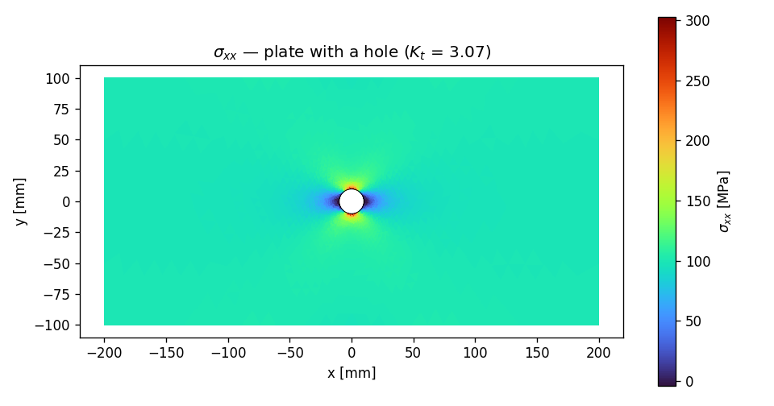

# E6 — A CAD part from STEP: the plate with a hole

Every model so far began with points and lines drawn in code. Real
projects rarely do — the geometry arrives as a **CAD file**, a STEP or
IGES part someone exported from SolidWorks or Inventor, full of faces and
edges with no helpful names attached. This example is about meeting that
geometry where it lives: **import it, heal it, name the parts you care
about by where they are in space**, and only then mesh and solve.

We'll use the canonical stress-concentration benchmark — a flat plate
with a circular hole, pulled in tension — because it has a closed-form
answer to check against. A small hole in a wide plate concentrates stress
at its edge by a factor of **about three**: the famous $K_t \approx 3$.
If apeGmsh imports the CAD part, meshes it sensibly, and lands on 3, you
can trust it on the bracket that *doesn't* have a textbook answer.

!!! note "Units — mm, N, MPa"
    CAD files are almost always in millimetres, so we stay there: lengths
    in mm, forces in N, stresses in MPa. apeGmsh is unit-agnostic; we just
    keep the geometry's native system.

## The problem

```
                       sigma_inf -->
    │←──────────────── 400 mm ────────────────→│
    ┌───────────────────────────────────────────┐  ┬
    │                                             │  │
 ═══╡                    ( O ) d = 20 mm          ╞═══  W = 200 mm   --> sigma_inf
    │                                             │  │
    └───────────────────────────────────────────┘  ┴
    fixed in x                          stretched in x
    (left edge)                         (right edge)

    thickness t = 10 mm,  steel: E = 200 GPa, nu = 0.3
    hole-to-width ratio  d/W = 20/200 = 0.10
```

Pull a plate in uniform tension $\sigma_\infty$ and a hole disrupts the
flow of stress around it. Right at the hole's crown — the top and bottom,
**perpendicular** to the pull — the stress spikes. For an *infinite*
plate, Kirsch's 1898 solution gives the peak as exactly $3\sigma_\infty$.
Our plate is finite, so the value drifts with the hole-to-width ratio;
the **Howland** finite-width correction puts it at

$$
K_t \;=\; \frac{\sigma_{\max}}{\sigma_\infty} \;\approx\; 3.03
\qquad\text{at } d/W = 0.10.
$$

(At the sides of the hole — *along* the pull — the stress actually goes
slightly **compressive**; you'll see that in the field plot.) A hole this
small relative to the width keeps us within a hair of the classic value
of 3.

!!! info "The STEP file"
    This page imports `plate_with_hole.step`. You can
    [download it here](assets/plate_with_hole.step) — drop it next to your
    script. It was produced in apeGmsh itself (a rectangle with an inner
    circular loop, then `g.model.io.save_step(...)`), but treat it as any
    CAD part you'd receive: no physical groups, no names, just faces and
    edges.

## The whole model

The shape is the familiar spine — session → physical groups → typed bridge
→ solve → check — with a CAD front-end bolted on. The new moves are
**`load_step` + heal** and **naming edges by geometric query**.

```python
import numpy as np
import gmsh
import matplotlib
matplotlib.use("Agg")
import matplotlib.pyplot as plt
from apeGmsh import apeGmsh
from apeGmsh.opensees import apeSees
import openseespy.opensees as opspy

# --- Problem data (CAD-native units: mm, N, MPa) ---
W, t, r = 200.0, 10.0, 10.0       # plate width, thickness, hole radius (d=20)
Lx = 200.0                        # half-length -> 400 mm long
E, nu = 200_000.0, 0.3            # steel
sigma_inf = 100.0                 # target far-field tension [MPa]

# --- 1. Import the CAD part, heal it, name edges by geometry ---
with apeGmsh(model_name="plate_with_hole") as g:
    g.model.io.load_step("plate_with_hole.step", heal=True)
    g.model.sync()

    surfaces = [tag for (dim, tag) in gmsh.model.getEntities(2)]
    g.physical.add(2, surfaces, name="Plate")

    g.model.select(dim=1).on_plane((-Lx, 0, 0), (1, 0, 0), tol=1e-3).to_physical("Left")
    g.model.select(dim=1).on_plane(( Lx, 0, 0), (1, 0, 0), tol=1e-3).to_physical("Right")
    g.model.select(dim=1).in_box((-r-1, -r-1, -1), (r+1, r+1, 1)).to_physical("Hole")

    # Refine the mesh toward the hole, where the stress spikes.
    dist = g.mesh.field.distance(curves="Hole", sampling=200)
    refine = g.mesh.field.threshold(dist, size_min=r/12, size_max=W/12,
                                    dist_min=r*0.4, dist_max=W*0.7)
    g.mesh.field.set_background(refine)
    g.mesh.generation.generate(2)
    fem = g.mesh.queries.get_fem_data(dim=2)

# --- 2. Plane-stress solid through the typed bridge ---
ops = apeSees(fem)
ops.model(ndm=2, ndf=2)                                # 2-D solid: ux, uy
steel = ops.nDMaterial.ElasticIsotropic(E=E, nu=nu)
ops.element.Tri31(pg="Plate", thickness=t, material=steel, plane_type="PlaneStress")

# Far-field tension: clamp the left edge in x, stretch the right edge.
ops.fix(pg="Left", dofs=(1, 0))
left_ids = np.array([int(n) for n in fem.nodes.select(pg="Left").ids])
left_xy  = fem.nodes.select(pg="Left").coords
pin = int(left_ids[np.argmin(np.abs(left_xy[:, 1]))])  # one node pinned in y
ops.fix(nodes=[pin], dofs=(0, 1))

delta = sigma_inf / E * (2 * Lx)                       # uniform far-field strain
with ops.pattern.Plain(series=ops.timeSeries.Linear()) as pat:
    pat.sp(pg="Right", dof=1, value=delta)             # prescribe edge stretch

ops.constraints.Transformation()
ops.numberer.RCM()
ops.system.BandGeneral()
ops.test.NormDispIncr(tol=1e-8, max_iter=20)
ops.algorithm.Linear()
ops.integrator.LoadControl(dlam=1.0)
ops.analysis.Static()

# --- 3. Solve; read far-field stress (reaction) and peak stress (fibres) ---
ops.run(wipe=False)
opspy.analyze(1)
opspy.reactions()

Rx = sum(opspy.nodeReaction(int(n), 1) for n in left_ids)
sig_far = abs(Rx) / (W * t)                            # total reaction / net area
tags = sorted(int(e) for e in opspy.getEleTags())
sxx = np.array([opspy.eleResponse(tag, "stress")[0] for tag in tags])  # sigma_xx / element
sxx_max = float(sxx.max())
Kt = sxx_max / sig_far

# --- 4. Stress concentration vs. the Howland closed form ---
print(f"plate {2*Lx:.0f} x {W:.0f} x {t:.0f} mm, hole d = {2*r:.0f} mm  (d/W = {2*r/W:.2f})")
print(f"mesh: {fem.info.n_nodes} nodes, {fem.info.n_elems} Tri31 elements")
print(f"far-field stress  sigma_inf = {sig_far:6.1f} MPa")
print(f"peak stress       sxx_max   = {sxx_max:6.1f} MPa  (at the hole crown)")
print(f"stress concentration  Kt = sxx_max / sigma_inf = {Kt:.2f}")
print(f"Howland (d/W = {2*r/W:.2f}):  Kt ~ 3.03")
```

Run it. You should see:

```
plate 400 x 200 x 10 mm, hole d = 20 mm  (d/W = 0.10)
mesh: 2869 nodes, 5580 Tri31 elements
far-field stress  sigma_inf =   98.8 MPa
peak stress       sxx_max   =  303.2 MPa  (at the hole crown)
stress concentration  Kt = sxx_max / sigma_inf = 3.07
Howland (d/W = 0.10):  Kt ~ 3.03
```

**$K_t = 3.07$** against Howland's **3.03** — a 1 % gap on a value pulled
straight off an imported CAD part. The far-field stress comes back as
98.8 MPa (essentially the 100 we asked for; the slight shortfall is the
hole removing a sliver of net area), and the peak at the hole crown is
three times larger. The benchmark passes.

## Step 1 — Import, heal, and name what matters

```python
    g.model.io.load_step("plate_with_hole.step", heal=True)
    g.model.sync()
```

`load_step` reads the CAD file into the OCC geometry kernel. The
**`heal=True`** flag runs OpenCASCADE's shape-healing first — sewing
faces, closing tiny gaps, dropping sliver edges. CAD exports are full of
such imperfections, and an unhealed part often refuses to mesh; healing
is the routine first move after any import.

What you *don't* get from a STEP file is **names**. The plate arrives as
one anonymous surface bounded by anonymous edges. Everything downstream —
loads, supports, the readout — addresses geometry by physical-group name,
so our job is to attach those names. We do it **by geometry**, asking
*where* each entity is:

```python
    surfaces = [tag for (dim, tag) in gmsh.model.getEntities(2)]
    g.physical.add(2, surfaces, name="Plate")

    g.model.select(dim=1).on_plane((-Lx, 0, 0), (1, 0, 0), tol=1e-3).to_physical("Left")
    g.model.select(dim=1).on_plane(( Lx, 0, 0), (1, 0, 0), tol=1e-3).to_physical("Right")
    g.model.select(dim=1).in_box((-r-1, -r-1, -1), (r+1, r+1, 1)).to_physical("Hole")
```

`g.model.select(dim=1)` starts a query over the **edges**. `.on_plane(point,
normal, tol=...)` keeps the edges lying in a given plane — the left edge
is the one in the plane $x = -200$ with normal $\hat x$; the right edge is
its mirror. The hole edge is the one bundle of geometry sitting near the
origin, so `.in_box(...)` around the hole's footprint catches it.
`.to_physical(name)` stamps the survivors with a name. From here on
`"Left"`, `"Right"`, and `"Hole"` behave exactly like the names we drew by
hand in earlier examples — *the import is invisible downstream.*

!!! tip "Query, don't guess tags"
    It's tempting to peek at the STEP and hard-code "edge 3 is the hole."
    Don't — entity numbers are an accident of how the CAD tool wrote the
    file and shift the moment anyone re-exports. A geometric query
    (`on_plane`, `in_box`, `nearest_to`) names the *right* edge no matter
    how the tags fall.

## Step 2 — Refine where the stress lives

```python
    dist = g.mesh.field.distance(curves="Hole", sampling=200)
    refine = g.mesh.field.threshold(dist, size_min=r/12, size_max=W/12,
                                    dist_min=r*0.4, dist_max=W*0.7)
    g.mesh.field.set_background(refine)
```

A stress concentration is a *local* event — the field is nearly uniform
far from the hole and ferocious right at its edge. A uniform mesh would
be wasteful far away and too coarse where it counts. So we drive element
size with a **mesh field**: `distance(curves="Hole")` measures the
distance from the hole edge, and `threshold(...)` ramps the target size
from a fine `r/12` near the hole up to a coarse `W/12` far away.
`set_background` makes that field the controlling size everywhere.

This is *the* lesson hiding inside the benchmark: capturing a peak takes
resolution **where the peak is**. Coarsen the hole and $K_t$ sags below 3;
refine it and the FEM converges up onto the analytical value. The field
buys that accuracy without paying for a fine mesh across the whole plate.

## Step 3 — A plane-stress solid, stretched

```python
ops.model(ndm=2, ndf=2)                                # 2-D solid: ux, uy
steel = ops.nDMaterial.ElasticIsotropic(E=E, nu=nu)
ops.element.Tri31(pg="Plate", thickness=t, material=steel, plane_type="PlaneStress")
```

A thin plate loaded in its own plane is a **plane-stress** problem (no
stress through the thickness). The element is **`Tri31`**, a 2-D triangle,
fed an `ElasticIsotropic` material, its `thickness` and
`plane_type="PlaneStress"` set explicitly. Note `ndf=2`: a solid node has
just two translations, no rotation — different from the beam models'
`ndf=3`.

```python
ops.fix(pg="Left", dofs=(1, 0))
...
pin = int(left_ids[np.argmin(np.abs(left_xy[:, 1]))])  # one node pinned in y
ops.fix(nodes=[pin], dofs=(0, 1))

delta = sigma_inf / E * (2 * Lx)
with ops.pattern.Plain(series=ops.timeSeries.Linear()) as pat:
    pat.sp(pg="Right", dof=1, value=delta)             # prescribe edge stretch
```

We pull the plate by **prescribing a stretch** rather than pushing with a
force — it sidesteps having to spread a traction into consistent nodal
loads. The left edge is held in $x$ (a roller — free to contract in $y$ by
Poisson), one left node is pinned in $y$ to kill rigid-body drift, and the
right edge is moved out by `delta`, the displacement a uniform strain
$\sigma_\infty/E$ would produce over the length. The actual far-field
stress then falls out of the **reaction**: total horizontal reaction
divided by the net cross-section, which is exactly what we read back as
`sig_far`.

## Step 4 — Two stresses, two reads

```python
Rx = sum(opspy.nodeReaction(int(n), 1) for n in left_ids)
sig_far = abs(Rx) / (W * t)
tags = sorted(int(e) for e in opspy.getEleTags())
sxx = np.array([opspy.eleResponse(tag, "stress")[0] for tag in tags])
Kt = sxx.max() / sig_far
```

$K_t$ needs two numbers. The **far-field stress** is the support reaction
spread over the gross area — a global equilibrium quantity, read from
`nodeReaction`. The **peak stress** is the largest element $\sigma_{xx}$
anywhere in the mesh, which (the plot confirms) sits at the hole crown;
we sweep it off `eleResponse(tag, "stress")`. Their ratio is the stress
concentration factor.

!!! note "Reading element stresses: the live domain"
    For per-element fields like this we read straight from the live
    OpenSees domain — `ops.run(wipe=False)` leaves it open, and
    `eleResponse(tag, "stress")` returns each `Tri31`'s stress. (Iterate
    `opspy.getEleTags()` for the live element tags.) The capture-pipeline
    sibling, `DomainCaptureSpec(...).nodes(...)` →
    `Results.from_native`, is the route when you want a results file and
    `results.show_web()` to spin the deformed plate around in a browser;
    here a single static read is all the benchmark needs.

## The stress field

```python
coords = np.asarray(fem.nodes.coords)
node_ids = [int(n) for n in fem.nodes.ids]
row = {n: i for i, n in enumerate(node_ids)}
conn = fem.elements.select(pg="Plate").result().resolve()[1]
tris = np.array([[row[int(n)] for n in tri] for tri in conn])

fig, ax = plt.subplots(figsize=(8, 4.2))
tpc = ax.tripcolor(coords[:, 0], coords[:, 1], tris, facecolors=sxx,
                   cmap="turbo", shading="flat")
phi = np.linspace(0, 2*np.pi, 200)
ax.plot(r*np.cos(phi), r*np.sin(phi), "k-", lw=0.6)
ax.set_aspect("equal")
ax.set_title(rf"$\sigma_{{xx}}$ — plate with a hole ($K_t$ = {Kt:.2f})")
ax.set_xlabel("x [mm]"); ax.set_ylabel("y [mm]")
fig.colorbar(tpc, ax=ax, label=r"$\sigma_{xx}$ [MPa]")
fig.tight_layout()
fig.savefig("plate-hole-sxx.png", dpi=120)
```



There's the whole Kirsch field in one picture. Far from the hole the plate
sits at a calm uniform $\sigma_\infty \approx 100\ \text{MPa}$ (the green
sea). At the **crown** — top and bottom of the hole, perpendicular to the
pull — $\sigma_{xx}$ flares red to ~300 MPa, the threefold concentration.
And at the hole's **sides**, along the pull, a small blue island where the
stress dips *below zero* into compression — the part of Kirsch's solution
people always forget until they see it. The hand formula gave us the peak;
the model gives us the whole map.

## What you just learned

You took geometry you didn't draw and drove it all the way to a verified
number:

- **CAD comes in through `load_step(..., heal=True)`** — import, then heal
  the inevitable sliver edges and gaps before meshing.
- **Name imported geometry by *where it is*.**
  `g.model.select(dim=1).on_plane(...)/.in_box(...).to_physical(name)`
  attaches durable names by geometric query — never by fragile entity
  tags. Downstream, the import is invisible.
- **Refine where the gradient is.** A `distance` + `threshold` mesh field
  concentrates elements at the hole, which is exactly what it takes to
  resolve a stress peak — coarsen it and $K_t$ sags.
- **Plane-stress solids** use `Tri31`/`FourNodeQuad` with
  `plane_type="PlaneStress"` and `ndf=2`.
- **$K_t \approx 3$ checks out** — peak/far-field came to 3.07 against
  Howland's 3.03, and the field plot shows the crown spike *and* the
  compressive side-lobes.

## Where next

- **[A plate in tension](../tutorials/plate-in-tension.md)** — the
  simpler, hole-free plate, if you want the plane-stress basics without
  the CAD front-end.
- **[Multi-part assembly](multipart-assembly.md)** — go the other way: build
  geometry from reusable `Part` templates instead of importing it.
- **[Import & heal a STEP part](../how-to/index.md)** — the how-to recipe,
  for the import options (`dedupe`, `fuse`, healing tolerances) in
  isolation.
