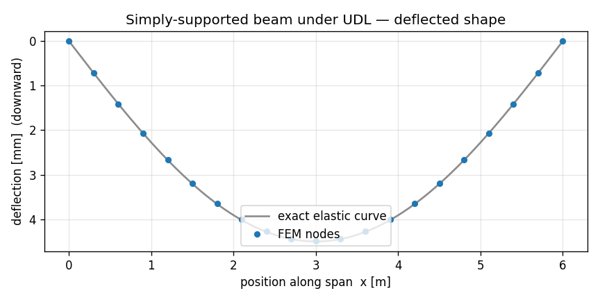

# A simply-supported beam, the apeGmsh way

In the [first tutorial](first-model.md) you applied a single point load by
hand — one node, one force vector. Real structures rarely load that politely.
A floor beam carries a *distributed* load: a uniform pressure smeared along its
whole length. This tutorial builds that case — a simply-supported beam under a
uniform distributed load — and in doing so introduces the apeGmsh habit that
makes distributed loading painless: you **describe the load once**, by name, and
let the library do the tributary bookkeeping.

No manual `np.diff` over edge lengths. No hand-summed half-segments at shared
nodes. You say "this much force per metre, along *this* span", and apeGmsh
resolves it into the right nodal forces and carries them all the way to the
solver.

We keep the same trust-but-verify spine as before: a closed-form answer stated
up front, the whole script shown once, then a block-by-block walk, and the real
printed numbers at the end.

!!! note "Prerequisite"
    This page assumes you've done [Your first model](first-model.md) — the
    session → physical groups → typed bridge → `Results` loop. We move a little
    faster through the parts that repeat.

## The problem

```
              w = 12 kN/m   (uniform, downward)
       ↓   ↓   ↓   ↓   ↓   ↓   ↓   ↓   ↓   ↓   ↓
   ────────────────────────────────────────────────
   △                                              ○
  pin                                          roller
   |<------------------ L = 6 m ------------------>|

  Section: 0.10 m × 0.30 m rectangle (strong-axis bending)
  Material: steel, E = 200 GPa
```

A pin at one end, a roller at the other: the textbook *simply-supported* beam.
Three numbers fall straight out of statics and beam theory, and you can write
all three without solving anything:

$$
\delta_{\text{mid}} = \frac{5\,w\,L^{4}}{384\,E\,I}
\qquad
M_{\text{mid}} = \frac{w\,L^{2}}{8}
\qquad
R_{A} = R_{B} = \frac{w\,L}{2}
$$

With $w = 12{,}000\ \text{N/m}$, $L = 6\ \text{m}$, $E = 200\times10^{9}\ \text{Pa}$,
and $I = \tfrac{b h^{3}}{12} = \tfrac{0.10 \cdot 0.30^{3}}{12} = 2.25\times10^{-4}\ \text{m}^4$:

$$
\delta_{\text{mid}} = \frac{5 \cdot 12{,}000 \cdot 6^{4}}{384 \cdot 200\times10^{9} \cdot 2.25\times10^{-4}}
= 4.50\ \text{mm}
\qquad
M_{\text{mid}} = \frac{12{,}000 \cdot 6^{2}}{8} = 54\ \text{kN·m}
\qquad
R = \frac{12{,}000 \cdot 6}{2} = 36\ \text{kN}
$$

Keep **4.50 mm**, **54 kN·m**, and **36 kN** in your back pocket. Those are the
three numbers apeGmsh has to reproduce.

!!! note "Units"
    Consistent SI throughout: metres, newtons, pascals. A distributed load is
    therefore **newtons per metre** (N/m). Deflections come out in metres; we
    print millimetres for readability.

## The whole model

Here is the entire script. Read it top to bottom first — the new idea is the
`g.loads` block in the middle, and it's only two lines.

```python
from apeGmsh import apeGmsh, Results
from apeGmsh.opensees import apeSees, OpenSeesModel
from apeGmsh.results.capture.spec import DomainCaptureSpec
import numpy as np

# --- Problem data (consistent SI: m, N, Pa) ---
L  = 6.0          # span             [m]
E  = 200e9        # Young's mod.     [Pa]  (steel)
b, h = 0.10, 0.30 # section sides    [m]
A  = b * h                  # area            [m^2]
Iz = b * h**3 / 12.0        # strong-axis I   [m^4]
w  = 12_000.0     # distributed load [N/m] (downward, -y)

# --- 1. Geometry + physical groups, inside a session ---
with apeGmsh(model_name="ssbeam") as g:
    p0   = g.model.geometry.add_point(0.0, 0.0, 0.0)
    p1   = g.model.geometry.add_point(L,   0.0, 0.0)
    beam = g.model.geometry.add_line(p0, p1)
    g.model.sync()

    g.physical.add(1, [beam], name="Span")    # the curve  -> beam elements
    g.physical.add(0, [p0],   name="Pin")     # left end   -> pin support
    g.physical.add(0, [p1],   name="Roller")  # right end  -> roller support

    g.mesh.sizing.set_global_size(L / 20.0)   # ~20 elements (even -> node at mid)
    g.mesh.generation.generate(1)

    # --- DESCRIBE-ONCE: declare the distributed load by NAME ---
    with g.loads.case("udl"):
        g.loads.line("Span", magnitude=w, direction=(0.0, -1.0, 0.0))

    fem = g.mesh.queries.get_fem_data(dim=1)   # resolves the load into nodal forces

# Peek at what apeGmsh resolved (optional — purely for insight here).
nodal_loads = list(fem.nodes.loads)
total_fy = sum((r.force_xyz[1] if r.force_xyz else 0.0) for r in nodal_loads)
print(f"resolved nodal-load records : {len(nodal_loads)}")
print(f"sum of nodal Fy             : {total_fy:.1f} N  (should be -wL = {-w*L:.1f})")

# midspan node id (the node nearest x = L/2)
ids, coords = fem.nodes.ids, fem.nodes.coords
mid_nid = int(ids[int(np.argmin(np.abs(coords[:, 0] - L / 2.0)))])

# --- 2. Build the OpenSees model through the typed bridge ---
ops = apeSees(fem)
ops.model(ndm=2, ndf=3)                        # 2-D frame: ux, uy, thetaz

transf = ops.geomTransf.Linear(vecxz=(0.0, 0.0, 1.0))
ops.element.elasticBeamColumn(pg="Span", transf=transf, A=A, E=E, Iz=Iz)

ops.fix(pg="Pin",    dofs=(1, 1, 0))           # pin:    ux, uy fixed; rotation free
ops.fix(pg="Roller", dofs=(0, 1, 0))           # roller: uy fixed only

# A pattern + time series scales the load over the step. The distributed load
# was declared on g.loads under the "udl" case; import that case into the
# pattern with p.from_model(...) so it reaches the deck (loads are opt-in).
ts = ops.timeSeries.Linear()
with ops.pattern.Plain(series=ts) as p:
    p.from_model("udl")

ops.constraints.Plain()
ops.numberer.Plain()
ops.system.BandGeneral()
ops.test.NormDispIncr(tol=1e-10, max_iter=10)
ops.algorithm.Linear()
ops.integrator.LoadControl(dlam=1.0)
ops.analysis.Static()

# --- 3. Solve, capturing midspan displacement + support reactions ---
spec = DomainCaptureSpec(opensees=ops)
spec.nodes(pg="Span",   components=["displacement"])
spec.nodes(pg="Pin",    components=["reaction_force_y"])
spec.nodes(pg="Roller", components=["reaction_force_y"])
with ops.domain_capture(spec, path="run.h5") as cap:
    cap.begin_stage("udl", kind="static")
    ops.analyze(steps=1)
    cap.step(t=1.0)
    cap.end_stage()

# --- 4. Read it back by physical-group NAME ---
results = Results.from_native("run.h5", model=OpenSeesModel.from_h5("run.h5"))

span_uy = results.nodes.get(pg="Span", component="displacement_y")
col = list(span_uy.node_ids).index(mid_nid)
delta_fem   = abs(float(span_uy.values[-1, col]))
delta_exact = 5.0 * w * L**4 / (384.0 * E * Iz)

pin_ry = results.nodes.get(pg="Pin",    component="reaction_force_y")
rol_ry = results.nodes.get(pg="Roller", component="reaction_force_y")
Rpin = float(np.sum(pin_ry.values[-1, :]))
Rrol = float(np.sum(rol_ry.values[-1, :]))
R_exact = w * L / 2.0

# Midspan moment, derived from the FEM-captured reaction by statics:
#   M_mid = R*(L/2) - w*(L/2)*(L/4)
M_fem   = Rpin * (L / 2.0) - w * (L / 2.0) * (L / 4.0)
M_exact = w * L**2 / 8.0

print(f"delta_FEM   = {delta_fem*1e3:.4f} mm")
print(f"delta_exact = {delta_exact*1e3:.4f} mm  (5wL^4/384EI)")
print(f"delta error = {abs(delta_fem-delta_exact)/delta_exact*100:.4f} %")
print(f"R_pin       = {Rpin/1e3:.4f} kN")
print(f"R_roller    = {Rrol/1e3:.4f} kN")
print(f"R_exact     = {R_exact/1e3:.4f} kN  (wL/2 each)")
print(f"M_mid_FEM   = {M_fem/1e3:.4f} kN.m  (from captured R)")
print(f"M_mid_exact = {M_exact/1e3:.4f} kN.m  (wL^2/8)")
```

Run it. You should see:

```
resolved nodal-load records : 21
sum of nodal Fy             : -72000.0 N  (should be -wL = -72000.0)
delta_FEM   = 4.4910 mm
delta_exact = 4.5000 mm  (5wL^4/384EI)
delta error = 0.2000 %
R_pin       = 36.0000 kN
R_roller    = 36.0000 kN
R_exact     = 36.0000 kN  (wL/2 each)
M_mid_FEM   = 54.0000 kN.m  (from captured R)
M_mid_exact = 54.0000 kN.m  (wL^2/8)
```

All three back-pocket numbers land. The reactions and the midspan moment are
**exact** — they're pure statics, and apeGmsh's resolved nodal loads sum to
exactly $wL$, so equilibrium is exact. The deflection is off by **0.2%**, and
that small gap is honest and worth understanding — we'll come back to it.

Here is the deflected shape (we'll plot it at the end), FEM nodes sitting on
the textbook elastic curve:



Now let's see why each block does what it does — focusing on what's new.

## Step 1 — Name the span and the two supports

```python
g.physical.add(1, [beam], name="Span")    # dim 1 = the curve  -> beam elements
g.physical.add(0, [p0],   name="Pin")     # dim 0 = a point
g.physical.add(0, [p1],   name="Roller")
```

Same move as the cantilever: three physical groups, three names. The only
difference is the supports. A cantilever had one fully-fixed end; here we have
two *different* supports, so they get two *different* names — `"Pin"` and
`"Roller"` — because we'll fix them differently in Step 2.

We choose `L/20` as the target element size so the mesh has an **even** number
of elements. That puts a node exactly at $x = L/2$, which we'll need to read the
midspan deflection cleanly.

### The describe-once load

```python
    with g.loads.case("udl"):
        g.loads.line("Span", magnitude=w, direction=(0.0, -1.0, 0.0))
```

This is the heart of the tutorial. `g.loads` is the **loads composite** — a
session-level place where you *declare* loads against named geometry, before
the mesh even exists in solver terms.

- `g.loads.case("udl")` is a context manager that groups everything inside
  it under a named load pattern (`"udl"`, for *uniformly distributed load*).
  Patterns let a downstream solver emit one `timeSeries` / `pattern` block per
  group — dead load, live load, wind, each its own pattern.
- `g.loads.line("Span", magnitude=w, direction=(0, -1, 0))` declares a
  **distributed load of `w` newtons per metre**, pointing straight down, along
  every curve in the `"Span"` physical group. One line. By name.

You never compute a tributary length. You never touch a node. You state the
physics — *force per metre, this direction, this span* — and stop.

### Where the load actually goes: `get_fem_data` resolves it

```python
    fem = g.mesh.queries.get_fem_data(dim=1)
```

`get_fem_data` is the snapshot, exactly as in the cantilever — but it's also the
**rendezvous point** where declared loads get *resolved*. When you call it,
apeGmsh walks each beam element under `"Span"`, computes the length-weighted
share of the distributed load, and splits each element's share equally between
its two end nodes. The result is a set of **nodal load records** stored on
`fem.nodes.loads` — the tributary work, done for you.

That's why the script peeks at it:

```python
nodal_loads = list(fem.nodes.loads)
total_fy = sum((r.force_xyz[1] if r.force_xyz else 0.0) for r in nodal_loads)
```

and prints:

```
resolved nodal-load records : 21
sum of nodal Fy             : -72000.0 N  (should be -wL = -72000.0)
```

21 records (one per node of the 20-element mesh), and they sum to exactly
$-wL = -72{,}000\ \text{N}$ — the whole distributed load, conserved. Interior
nodes carry $w \cdot \ell$ (one full element-length of load, half from each
neighbour); the two end nodes carry $w \cdot \ell / 2$. You didn't write that
arithmetic. The composite did.

!!! note "This is the point of the composite"
    Without `g.loads`, applying a UDL means: list the elements, get each
    length, halve it, accumulate at shared nodes, watch the sign convention,
    and hope you didn't double-count an interior node. With `g.loads.line(...)`
    it's one declaration and `get_fem_data` does the rest — and the
    conservation check (`sum == -wL`) is your proof it's right.

## Step 2 — Pin, roller, and a section

```python
ops = apeSees(fem)
ops.model(ndm=2, ndf=3)

transf = ops.geomTransf.Linear(vecxz=(0.0, 0.0, 1.0))
ops.element.elasticBeamColumn(pg="Span", transf=transf, A=A, E=E, Iz=Iz)
```

Identical to the cantilever's bridge setup: a 2-D frame, a linear geometric
transform, and every element in `"Span"` written as a linear-elastic
beam-column. The transform comes back as a *handle* you pass by reference.

!!! tip "Section properties: inline now, `ops.section` later"
    Here we pass `A`, `E`, `Iz` straight into `elasticBeamColumn` — perfect for
    an elastic prismatic beam. When you need a *nonlinear* fibre section
    (concrete + rebar, steel yielding), you build it once with `ops.section`
    (e.g. `ops.section.Fiber(...)`) and a `beamIntegration`, then hand the
    section to a `forceBeamColumn`. Same describe-once spirit, one rung up in
    fidelity — the fibre-section recipe lives in the OpenSees bridge how-to.

The supports are where pin and roller diverge:

```python
ops.fix(pg="Pin",    dofs=(1, 1, 0))   # ux, uy fixed; rotation free
ops.fix(pg="Roller", dofs=(0, 1, 0))   # uy fixed only
```

`dofs` is a length-`ndf` mask — `1` = fixed, `0` = free, in the order
$(u_x, u_y, \theta_z)$.

- **Pin** holds both translations but lets the end *rotate* — that's what makes
  it a pin and not a clamp.
- **Roller** holds only the vertical translation, leaving the beam free to slide
  horizontally and rotate.

Together they make the beam statically determinate, which is exactly why the
reactions come out as clean $wL/2$ values.

### The empty pattern, and an honest word about loads

```python
ts = ops.timeSeries.Linear()
with ops.pattern.Plain(series=ts):
    pass
```

In the cantilever you put a `pat.load(...)` *inside* this block. Here the
block **imports** the session-declared case instead: the distributed load was
declared on `g.loads.line` under the case `"udl"`, and `p.from_model("udl")`
replays the resolved `fem.nodes.loads` as `load` lines inside this pattern. So
the nodal forces reach the solver without you re-typing them — but only because
you imported the case (loads are **opt-in**, ADR 0051).

!!! note "What the bridge carries over — and the one subtlety"
    From the first tutorial you know the bridge *auto-emits multi-point
    constraints* but asks you to *re-declare fixities* (`ops.fix`). Loads are
    different again: they are **opt-in**. Anything you declared through
    `g.loads` resolves into `fem.nodes.loads` and persists to `model.h5`, but it
    reaches the deck only when a pattern imports its case with
    `p.from_model(case)` — that's why this `Plain` block calls
    `p.from_model("udl")` rather than sitting empty. The deck is
    authoritative: a case you don't import is simply not applied.

    The practical rule: a load reaches the deck through **one** explicit
    channel — `p.from_model(case)` (import a `g.loads` case) **or** `pat.load`
    (author on the bridge). The cantilever used `pat.load` because its point
    load lived only on the bridge; this beam imports the `g.loads` case because
    the *distributed* load is what the composite exists to handle. There is no
    typed `eleLoad beamUniform` verb on the pattern — the distributed load
    reaches the solver as the equivalent nodal forces the composite resolved.

The rest — `constraints` through `analysis` — is the standard linear-static
solver chain, unchanged from the cantilever.

## Step 3 — Capture displacement *and* reactions

```python
spec = DomainCaptureSpec(opensees=ops)
spec.nodes(pg="Span",   components=["displacement"])
spec.nodes(pg="Pin",    components=["reaction_force_y"])
spec.nodes(pg="Roller", components=["reaction_force_y"])
```

We want three things back, so we declare three capture records — all by name.
`"displacement"` on the whole span (we'll pick out the midspan node);
`"reaction_force_y"` on each support. Asking for a reaction component is enough
— apeGmsh calls `ops.reactions()` for you each step so the values are fresh.

The capture block itself is the same in-process pattern as before:
`begin_stage` → `analyze` → `step` → `end_stage`, writing `run.h5`.

## Step 4 — Read the three checks back

```python
span_uy = results.nodes.get(pg="Span", component="displacement_y")
col = list(span_uy.node_ids).index(mid_nid)
delta_fem = abs(float(span_uy.values[-1, col]))
```

`results.nodes.get(pg="Span", component="displacement_y")` returns a slab whose
columns are the span's nodes. We find the column for the midspan node id we
saved earlier and read its last-step deflection — **4.4910 mm**.

```python
Rpin = float(np.sum(pin_ry.values[-1, :]))
Rrol = float(np.sum(rol_ry.values[-1, :]))
```

Each support group is a single node, so summing its reaction column gives the
support reaction directly — **36.0 kN** at each end, exactly $wL/2$.

```python
M_fem = Rpin * (L / 2.0) - w * (L / 2.0) * (L / 4.0)
```

The midspan moment we get from statics on the **FEM-captured reaction**: take
the left reaction's moment about midspan, subtract the moment of the load on the
left half. With $R = 36\ \text{kN}$ that's
$36 \cdot 3 - 12 \cdot 3 \cdot 1.5 = 54\ \text{kN·m}$ — exactly $wL^2/8$. Because
the reaction came from the solve, this is a genuine FEM-derived check, not a
restatement of the formula.

### About that 0.2% on the deflection

The reactions and moment are exact; the deflection is off by 0.2%. Why?

The elastic beam-column element carries a *cubic* bending shape exactly — so for
**concentrated** end loads (like the cantilever's tip load) it's the closed-form
answer with zero error. But a **distributed** load is being represented here as
equivalent **nodal point loads** (the tributary forces). Lumping a smooth UDL
into a finite set of nodal pokes introduces a small discretization error in the
deflected shape — and it shrinks as you refine the mesh:

| elements | midspan deflection error |
|---------:|:-------------------------|
| 20       | 0.20 %                   |
| 60       | 0.022 %                  |

Nine times finer, ~nine times smaller error — textbook $O(h^2)$ convergence.
The 0.2% at 20 elements is not a bug; it's the honest cost of turning a
distributed load into nodal forces, and it's plenty accurate for design. (If you
ever need the *exact* distributed-load deflection on a coarse mesh,
`g.loads.line(..., reduction="consistent")` uses the shape-function-consistent
load vector instead of simple tributary lumping — it matters most for
higher-order elements.)

## The deflected shape

The figure at the top of the page overlays the FEM deflection on the exact
elastic curve. Here's the code that draws it — we read the captured `Span`
slab and plot it node-by-node against the closed-form curve
$w(x) = \dfrac{w\,x}{24EI}\,(L^3 - 2Lx^2 + x^3)$:

```python
import matplotlib
matplotlib.use("Agg")                  # headless backend
import matplotlib.pyplot as plt

uy = results.nodes.get(pg="Span", component="displacement_y")
xs = np.array([coords[list(ids).index(n)][0] for n in uy.node_ids])
order = np.argsort(xs)
w_fem = np.abs(uy.values[-1]) * 1e3                      # mm, downward positive

xx = np.linspace(0.0, L, 200)
w_exact = w * xx * (L**3 - 2*L*xx**2 + xx**3) / (24.0 * E * Iz) * 1e3

fig, ax = plt.subplots(figsize=(7.2, 3.6))
ax.plot(xx, w_exact, "-", color="0.55", lw=1.6, label="exact elastic curve")
ax.plot(xs[order], w_fem[order], "o", ms=4.5, color="#1f77b4", label="FEM nodes")
ax.set_xlabel("position along span  x [m]")
ax.set_ylabel("deflection [mm]  (downward)")
ax.set_title("Simply-supported beam under UDL — deflected shape")
ax.legend(loc="lower center"); ax.grid(alpha=0.3); ax.invert_yaxis()
fig.tight_layout(); fig.savefig("ssbeam-deflection.png", dpi=120)
```

Every FEM node lands on the analytical curve — the 0.2 % we saw is in the
*midspan magnitude*, not the shape.

## See it

```python
results.show_web()
```

`results.show_web()` launches the **notebook-safe** web viewer — an interactive
deformed-shape view right in your Jupyter cell. (The static figure above is plain
matplotlib over the captured slab — the right tool in scripts and CI; `show_web()`
is the interactive one for notebooks.)

!!! warning "Don't call `results.viewer()` in a notebook"
    The desktop viewer (`results.viewer()`, default `blocking=True`) runs a
    native VTK + Qt loop that **crashes a Jupyter or VS Code kernel**. In a
    notebook, reach for `results.show_web()` instead.

## A peek ahead — mass for a modal analysis

The same describe-once habit covers *mass*, which you'll need the moment you go
from static to dynamic. `g.masses` mirrors `g.loads`:

```python
# Lumped mass from the beam's own weight, declared once by name:
g.masses.line("Span", mass_per_length=rho * A, density=rho)
```

Like loads, masses you declare on the session resolve into the snapshot
(`fem.nodes.masses`) and flow to the solver. With mass in place you'd swap the
static chain for an eigen solve (`ops.eigen(...)`) and read mode shapes back
through `results.modes`. That's a tutorial of its own — but the *declaration*
is the same one-liner you just learned.

## What you just learned

- **`g.loads` is describe-once.** Declare a distributed load with
  `g.loads.case(...)` + `g.loads.line(name, magnitude=, direction=)` against
  a physical-group name. No tributary loop, no shared-node bookkeeping.
- **`get_fem_data` resolves it.** The declared load becomes nodal forces on
  `fem.nodes.loads` — and they conserve exactly (`sum == -wL`).
- **Loads are opt-in on the bridge.** A `g.loads` case reaches the solver only
  when a pattern imports it with `p.from_model(case)` (or you author it via
  `pat.load`). Nothing auto-emits and the deck is authoritative — a case you
  don't import is simply not applied.
- **Pin vs roller is a `dofs` mask.** `(1,1,0)` pins; `(0,1,0)` rolls — the
  difference between a fixed and a free DOF.
- **Three checks, three exact (or near-exact) hits.** Reactions and moment are
  exact statics; the deflection carries a small, convergent discretization error
  from nodal-lumping a distributed load.

And the model *checks out* — 4.49 mm against 4.50 mm, 36 kN reactions, 54 kN·m
at midspan.

## Where next

- **[Save, reload, view](#)** — persist this model to `model.h5`, reopen it in a
  fresh session, and run the full notebook-safe results loop.
- **[A plate in tension](#)** — the typed bridge on a 2-D *solid*: `nDMaterial`,
  a surface load via `g.loads.surface`, and a stress field read back by group.
- **[Modal analysis](#)** — put the `g.masses` one-liner above to work: an eigen
  solve and mode shapes through `results.modes`.
- **[Core mental model](../concepts/mental-model.md)** — the ideas behind the
  declare-then-resolve contract you just used, on one page.
