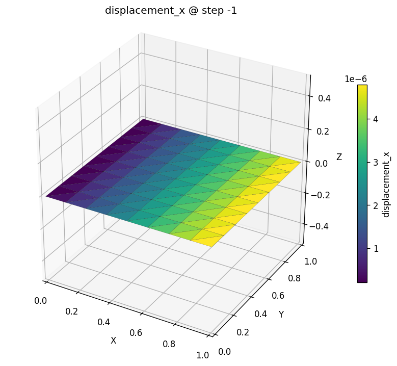

# A plate in tension

In [your first model](first-model.md) you drove a *beam* through the typed
OpenSees bridge. Now you'll drive a **2-D solid** through the very same bridge —
same `apeSees(fem)`, same "target everything by name" habit — and watch a
continuum stress problem fall out just as cleanly.

We pick the *unit square in tension* on purpose. It is the *Hello, World* of
continuum mechanics: pull on one edge, hold the opposite edge, and the whole
plate stretches by a number you can write down without solving anything. If
apeGmsh nails this uniform-stress benchmark, you can believe what it tells you
about the stress fields that *don't* have a one-line answer.

## The problem

A square plate, side $L$, thickness $t$, pulled in tension by a uniform edge
stress $\sigma$. The left edge is on rollers (it can slide up and down but not
left-right); the right edge is pulled. This is **plane stress** — the plate is
thin, so it's free to thin out through its thickness.

```
              σ (uniform edge tension, +x) →→→
  rollers ┊                                    →
  u_x = 0 ┊███████████████████████████████████ →
          ┊███████████████████████████████████ →   pulled
          ┊███████████████████████████████████ →   edge
          ┊<------------- L = 1 m ------------>┊ →

  Plane stress: thickness t = 10 mm
  Material: steel, E = 200 GPa, ν = 0.30
  σ = 1 MPa
```

Under a uniform uniaxial stress $\sigma$, the strain is uniform too —
$\varepsilon_{x} = \sigma/E$ — so the right edge moves by

$$
u_{x} \;=\; \frac{\sigma\,L}{E}.
$$

With $\sigma = 1\ \text{MPa} = 1\times10^{6}\ \text{Pa}$, $L = 1\ \text{m}$, and
$E = 200\times10^{9}\ \text{Pa}$:

$$
u_{x} \;=\; \frac{1\times10^{6}\cdot 1}{200\times10^{9}}
\;=\; 5\times10^{-6}\ \text{m} \;=\; 5\ \mu\text{m}.
$$

Keep **5 µm** in your back pocket. There's a bonus check too: the plate
contracts sideways by Poisson's ratio, so the top edge pulls *in* by
$u_{y} = -\nu\,\sigma L/E = -1.5\ \mu\text{m}$. We'll see both.

!!! note "Units"
    Same as before — apeGmsh stores the numbers you give it. We work in
    **consistent SI**: metres, newtons, pascals. Lengths in metres, so
    displacements come out in metres (we print microns for readability).

## The whole model

Here is the entire script. As before, read it top to bottom first — it's a
close cousin of the cantilever, and the shape will feel familiar. The only new
ideas are a *surface* mesh of quads, an *nDMaterial*, and a tributary edge
load. We walk through each block right after.

```python
import numpy as np
from apeGmsh import apeGmsh, Results
from apeGmsh.opensees import apeSees, OpenSeesModel
from apeGmsh.results.capture.spec import DomainCaptureSpec

# --- Problem data (consistent SI: m, N, Pa) ---
L     = 1.0       # plate side          [m]
t     = 0.010     # out-of-plane thick. [m]
E     = 200e9     # Young's modulus     [Pa]  (steel)
nu    = 0.30      # Poisson's ratio     [-]
sigma = 1.0e6     # edge tension        [Pa]  = 1 MPa
N     = 8         # quad cells per side

u_exact = sigma * L / E                       # uniform-stress closed form

# --- 1. Geometry + physical groups, inside a session ---
with apeGmsh(model_name="plate") as g:
    geo = g.model.geometry
    p0 = geo.add_point(0.0, 0.0, 0.0)
    p1 = geo.add_point(L,   0.0, 0.0)
    p2 = geo.add_point(L,   L,   0.0)
    p3 = geo.add_point(0.0, L,   0.0)
    e_bot = geo.add_line(p0, p1)
    e_rgt = geo.add_line(p1, p2)
    e_top = geo.add_line(p2, p3)
    e_lft = geo.add_line(p3, p0)
    loop  = geo.add_curve_loop([e_bot, e_rgt, e_top, e_lft])
    plate = geo.add_plane_surface(loop)
    g.model.sync()

    g.physical.add(2, [plate], name="Plate")  # the surface -> quad elements
    g.physical.add(1, [e_lft], name="Left")    # roller edge (u_x = 0)
    g.physical.add(1, [e_rgt], name="Right")   # pulled edge + readout
    g.physical.add(0, [p0],    name="Pin")     # one node pinned in y

    # Structured quad mesh: transfinite edges -> transfinite surface -> recombine
    for edge in (e_bot, e_rgt, e_top, e_lft):
        g.mesh.structured.set_transfinite_curve(edge, n_nodes=N + 1)
    g.mesh.structured.set_transfinite_surface(plate)
    g.mesh.structured.set_recombine(plate)     # triangles -> quads
    g.mesh.generation.generate(2)              # 2 = mesh 2-D entities
    fem = g.mesh.queries.get_fem_data(dim=2)

    # Grab the right-edge nodes (ids + coords, aligned) for the edge load.
    right = fem.nodes.select(pg="Right")
    right_ids, right_coords = right.ids, right.coords

# --- 2. Build the OpenSees model through the typed bridge ---
ops = apeSees(fem)
ops.model(ndm=2, ndf=2)                        # 2-D solid: ux, uy (no rotation)

steel = ops.nDMaterial.ElasticIsotropic(E=E, nu=nu, rho=0.0)
ops.element.FourNodeQuad(
    pg="Plate", thickness=t, material=steel, plane_type="PlaneStress",
)

ops.fix(pg="Left", dofs=(1, 0))                # roller: u_x = 0, u_y free
ops.fix(pg="Pin",  dofs=(0, 1))                # kill rigid-body y at one node

# Uniaxial edge tension as tributary nodal forces: total F = sigma*L*t,
# lumped to the right-edge nodes (corner nodes carry half a segment).
f_seg = sigma * (L / N) * t                    # force per full edge segment
ymin, ymax = right_coords[:, 1].min(), right_coords[:, 1].max()
ts = ops.timeSeries.Linear()
with ops.pattern.Plain(series=ts) as pat:
    for nid, c in zip(right_ids, right_coords):
        on_corner = abs(c[1] - ymin) < 1e-9 or abs(c[1] - ymax) < 1e-9
        w = 0.5 if on_corner else 1.0
        pat.load(node=int(nid), forces=(w * f_seg, 0.0))

ops.constraints.Plain()
ops.numberer.RCM()
ops.system.BandGeneral()
ops.test.NormDispIncr(tol=1e-12, max_iter=20)
ops.algorithm.Linear()
ops.integrator.LoadControl(dlam=1.0)
ops.analysis.Static()

# --- 3. Solve, capturing the nodal displacement field ---
spec = DomainCaptureSpec(opensees=ops)
spec.nodes(pg="Right", components=["displacement"])
spec.nodes(pg="Plate", components=["displacement"])
with ops.domain_capture(spec, path="run.h5") as cap:
    cap.begin_stage("tension", kind="static")
    ops.analyze(steps=1)
    cap.step(t=1.0)
    cap.end_stage()

# --- 4. Read the field back by physical-group NAME ---
results = Results.from_native("run.h5", model=OpenSeesModel.from_h5("run.h5"))
ux = results.nodes.get(pg="Right", component="displacement_x").values[-1, :]

u_fem = float(ux.mean())
print(f"u_x_FEM   = {u_fem*1e6:.4f} um")
print(f"u_x_exact = {u_exact*1e6:.4f} um")
print(f"error     = {abs(u_fem-u_exact)/u_exact*100:.4f} %")
```

Run it. You should see:

```
u_x_FEM   = 5.0000 um
u_x_exact = 5.0000 um
error     = 0.0000 %
```

That's our 5 µm, dead on. (Like the cantilever, the error is *exactly* zero,
not just small — a constant-stress field is the simplest thing a quad element
can represent, so it reproduces the closed-form answer with no discretization
error. This is the FEM "patch test" in miniature.) Now let's see why each block
does what it does.

## Step 1 — A surface, meshed into quads

```python
with apeGmsh(model_name="plate") as g:
    geo = g.model.geometry
    p0 = geo.add_point(0.0, 0.0, 0.0)
    p1 = geo.add_point(L,   0.0, 0.0)
    p2 = geo.add_point(L,   L,   0.0)
    p3 = geo.add_point(0.0, L,   0.0)
    e_bot = geo.add_line(p0, p1)
    e_rgt = geo.add_line(p1, p2)
    e_top = geo.add_line(p2, p3)
    e_lft = geo.add_line(p3, p0)
    loop  = geo.add_curve_loop([e_bot, e_rgt, e_top, e_lft])
    plate = geo.add_plane_surface(loop)
    g.model.sync()
```

Where the cantilever was a single line, the plate is a **surface**. We build it
the explicit way — four corner points, four edges, a closed curve loop, a plane
surface filling it — because that hands us a *named handle to every edge*. Those
edge handles are exactly what we'll attach the roller and the load to. (There's
also a one-liner, `geo.add_rectangle(0, 0, 0, L, L)`, when you don't need the
edges by name.)

### Physical groups, again — now mixing dimensions

```python
    g.physical.add(2, [plate], name="Plate")  # dim 2 = the surface
    g.physical.add(1, [e_lft], name="Left")    # dim 1 = an edge
    g.physical.add(1, [e_rgt], name="Right")
    g.physical.add(0, [p0],    name="Pin")     # dim 0 = a point
```

Same habit as the cantilever, one dimension up. `"Plate"` is the *surface*
(dim 2) that becomes our quad elements; `"Left"` and `"Right"` are *edges*
(dim 1) that become the support and the load; `"Pin"` is a single *point*
(dim 0). Notice all four live in one model at three different dimensions —
that's normal, and naming keeps them straight. From here on we never touch a
raw entity number.

### A structured quad mesh

```python
    for edge in (e_bot, e_rgt, e_top, e_lft):
        g.mesh.structured.set_transfinite_curve(edge, n_nodes=N + 1)
    g.mesh.structured.set_transfinite_surface(plate)
    g.mesh.structured.set_recombine(plate)     # triangles -> quads
    g.mesh.generation.generate(2)
    fem = g.mesh.queries.get_fem_data(dim=2)
```

By default Gmsh fills a surface with *triangles*. We want a clean grid of
*quadrilaterals* so we can use the four-node quad element, so we ask for a
**structured** mesh: pin the same node count on every edge
(`set_transfinite_curve`), tell the surface to interpolate a regular grid
between them (`set_transfinite_surface`), and **recombine** the resulting
triangles into quads (`set_recombine`). `generate(2)` then meshes the 2-D
geometry into an $N\times N$ grid of quads.

The payoff line is the same as before: `get_fem_data(dim=2)` snapshots the
meshed model — nodes, quad connectivity, and your physical groups — into a
`FEMData` object. We grab it *inside* the `with`, then carry it across into the
OpenSees world.

```python
    right = fem.nodes.select(pg="Right")
    right_ids, right_coords = right.ids, right.coords
```

We also pull the **right-edge nodes** straight off the snapshot — by name,
naturally. `fem.nodes.select(pg="Right")` returns a selection whose `.ids` and
`.coords` arrays are aligned row-for-row. We'll use these to lump the edge
tension onto the correct nodes in Step 2.

## Step 2 — The typed bridge, now driving a solid

```python
ops = apeSees(fem)
ops.model(ndm=2, ndf=2)
```

Identical opening to the cantilever — except for the DOF count. A 2-D **solid**
node has just two degrees of freedom, $u_x$ and $u_y$: there is no rotation,
because a continuum carries load by *stretching and shearing*, not by bending a
cross-section. So `ndf=2`, where the frame needed `ndf=3`.

```python
steel = ops.nDMaterial.ElasticIsotropic(E=E, nu=nu, rho=0.0)
ops.element.FourNodeQuad(
    pg="Plate", thickness=t, material=steel, plane_type="PlaneStress",
)
```

Here is the first genuinely new idea. The cantilever used a *uniaxial* material
baked into a beam-column. A solid element needs a **multi-dimensional**
constitutive law — an `nDMaterial` — so we reach into `ops.nDMaterial` instead
of `ops.uniaxialMaterial` and construct `ElasticIsotropic(E, nu, rho)`. Like
the geomTransf in the cantilever, it comes back as a *handle* you pass by
reference.

Then `ops.element.FourNodeQuad(pg="Plate", ...)` realizes **every quad in the
`"Plate"` group** as a four-node plane element with that material. Two new
parameters earn their keep:

- **`thickness=t`** — a 2-D element still has an out-of-plane dimension; the
  thickness sets how much material each quad represents.
- **`plane_type="PlaneStress"`** — the modeling assumption. *Plane stress* (a
  thin plate, free to thin through its thickness) is the right choice here; its
  sibling *plane strain* (a slice of a long body that can't strain
  out-of-plane) is what you'd use for a dam cross-section or a tunnel lining.
  The two give different stiffness for the same $E$ and $\nu$ — picking the
  right one is a modeling decision, not a default.

```python
ops.fix(pg="Left", dofs=(1, 0))                # roller: u_x = 0, u_y free
ops.fix(pg="Pin",  dofs=(0, 1))                # kill rigid-body y at one node
```

The supports. `dofs=(1, 0)` on `"Left"` fixes $u_x$ and leaves $u_y$ free — a
**roller** that lets the edge slide vertically as the plate Poisson-contracts,
exactly the boundary condition the uniform-stress solution assumes. Then one
node (`"Pin"`, the bottom-left corner) gets its $u_y$ pinned too, just to remove
the last rigid-body freedom (the plate could otherwise float up or down). Two
masks of length `ndf=2`, and the body is held without over-constraining it.

```python
f_seg = sigma * (L / N) * t
ymin, ymax = right_coords[:, 1].min(), right_coords[:, 1].max()
ts = ops.timeSeries.Linear()
with ops.pattern.Plain(series=ts) as pat:
    for nid, c in zip(right_ids, right_coords):
        on_corner = abs(c[1] - ymin) < 1e-9 or abs(c[1] - ymax) < 1e-9
        w = 0.5 if on_corner else 1.0
        pat.load(node=int(nid), forces=(w * f_seg, 0.0))
```

The load. A stress is force-per-area, but OpenSees applies *nodal forces*, so we
convert: the total pull on the edge is $\sigma\,L\,t$, and we spread it over the
right-edge nodes as a **tributary** load — each interior node owns one edge
segment of length $L/N$, the two corner nodes own half a segment each. That's
the `w = 0.5` on corners. We loop the aligned `right_ids` / `right_coords` we
grabbed in Step 1 and drop a horizontal force on each node inside a `Plain`
pattern — the same pattern machinery the cantilever used for its tip load.

!!! note "Why a tributary load, not the element `pressure=`?"
    `FourNodeQuad` does take a `pressure=` parameter, and it's tempting to reach
    for it here. Don't — not for *this* problem. OpenSees's quad `pressure`
    applies a normal pressure to **every edge of every element**; summed over a
    full mesh that pressurizes the *whole outer boundary* (a **biaxial**
    hydrostatic state), and it ignores the element thickness. That's the wrong
    physics for a one-edge uniaxial pull. A tributary nodal load on the named
    edge is the honest, controllable way to apply a true edge traction — and it
    is *not* a hand-rolled loop over raw tags: we drive it off the
    `pg="Right"` selection, by name. (For a genuine all-around confining
    pressure — a buried tunnel, a pressure vessel wall — `pressure=` is exactly
    the right tool.)

The remaining lines are the standard analysis chain, same recipe as the
cantilever (`Linear` algorithm, `Static` analysis) — one linear step solves an
elastic problem exactly.

## Step 3 — Solve and capture the field

```python
spec = DomainCaptureSpec(opensees=ops)
spec.nodes(pg="Right", components=["displacement"])
spec.nodes(pg="Plate", components=["displacement"])
with ops.domain_capture(spec, path="run.h5") as cap:
    cap.begin_stage("tension", kind="static")
    ops.analyze(steps=1)
    cap.step(t=1.0)
    cap.end_stage()
```

Same capture machinery as the cantilever, but now we record the displacement of
a *whole surface* — every node in `"Plate"` — not just one tip. That's what lets
us contour the field in a moment. The `"Right"` capture is the readout for our
number check. `ops.analyze(steps=1)` runs the one static step in-process, and
when the block exits `run.h5` holds the field plus a copy of the model.

## Step 4 — Read the field back, by name

```python
results = Results.from_native("run.h5", model=OpenSeesModel.from_h5("run.h5"))
ux = results.nodes.get(pg="Right", component="displacement_x").values[-1, :]
u_fem = float(ux.mean())
```

Exactly the read path from the cantilever — `Results.from_native(...)` with the
**required** `model=` broker — only now the component is `displacement_x` (the
direction we pulled) and we ask for the whole `"Right"` edge at once. The slab's
`.values[-1, :]` is the last step, all right-edge nodes. They all come back at
**5.000 µm** — the field is uniform along the edge, just as a constant-stress
solution demands — so the mean is the answer.

And the Poisson bonus, if you read `"Right"`'s `displacement_y` too: the
top-right corner has contracted to **-1.500 µm**, exactly $-\nu\sigma L/E$.
The same plate, the same solve, hands you both the axial stretch and the
sideways squeeze — read out by name.

## See it — contour the field

A number is the proof; a picture is the intuition. `results.plot` is the
headless matplotlib renderer (the `[plot]` extra), and `contour` paints a nodal
field across the mesh:

```python
ax = results.plot.contour("displacement_x", step=-1, cmap="viridis")
ax.figure.savefig("plate-ux.png", dpi=120, bbox_inches="tight")
```



Read it left to right: $u_x$ ramps **linearly** from zero at the fixed left edge
to 5 µm at the pulled right edge, and it's **constant up each column** — flat in
$y$. That's the visual signature of a uniform strain field: equal stress
everywhere means equal stretch everywhere. If your mesh ever shows blotches or
gradients in $y$ on this problem, something's wrong with the supports or the
load.

!!! tip "The interactive view"
    For a 3-D, rotatable, deform-on-slider view — great in a Jupyter notebook —
    call `results.show_web()` instead. It launches the kernel-safe web viewer
    right in your output cell. (As in the cantilever tutorial, never call the
    blocking desktop `results.viewer()` inside a notebook — it crashes the
    kernel.)

## What you just learned

Same spine as the cantilever, pushed one dimension up:

- **A surface, not a line.** Build a plane surface from named edges, mesh it
  into a structured grid of quads (`transfinite` + `recombine`), and snapshot it
  with `get_fem_data(dim=2)`. Physical groups now span dim 0/1/2 in one model —
  naming keeps them sorted.
- **A solid needs an `nDMaterial`.** Solid elements take a multi-dimensional
  constitutive law from `ops.nDMaterial`, not the uniaxial materials a beam
  uses. `FourNodeQuad` adds `thickness=` and the `plane_type=` modeling choice.
- **`ndf=2` for a 2-D solid** — two translations, no rotation. The DOF count is
  a property of the *physics*, not a default to copy.
- **A traction is a tributary nodal load**, applied through a `Plain` pattern
  by selecting the edge `pg="Right"` by name — not the element `pressure=`,
  which is a closed-boundary confining load, not a one-edge pull.
- **Read a *field* back by name** with `results.nodes.get(pg=..., component=...)`,
  and **contour it** with `results.plot.contour(...)`.

And the model *checks out* — 5 µm of stretch and 1.5 µm of Poisson squeeze,
exactly $\sigma L/E$ and $-\nu\sigma L/E$.

## Where next

- **[The SS beam, the apeGmsh way](#)** — meet the loads/masses/sections
  *composites*: declare a distributed load once and let apeGmsh resolve the
  tributary work for you (no more hand-lumping like we did on the edge here).
- **[Save, reload, view](#)** — persist a model to disk and reopen it, and the
  full notebook-safe results loop.
- **[Core mental model](../concepts/mental-model.md)** — the six ideas behind
  everything you just did, on one page.
```
