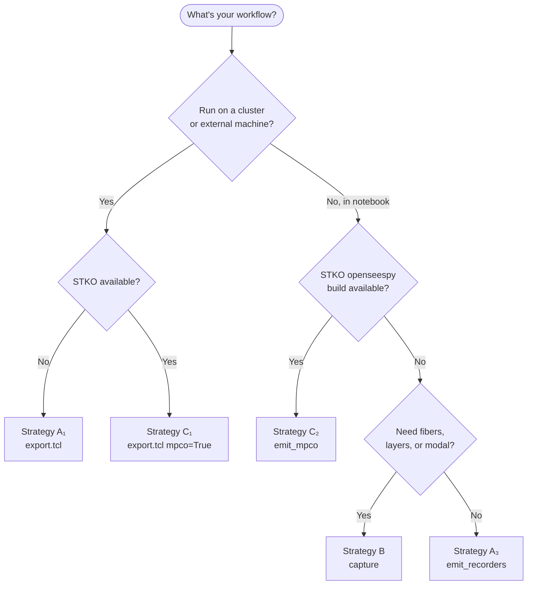

# Obtaining Results — Five Ways to Run the Analysis

apeGmsh keeps **what to record** separate from **how to run OpenSees**.
You declare the recorders once, resolve them against your `FEMData`,
and then pick an execution strategy that fits your workflow. All five
strategies produce files that the same `Results` reader can open.

This guide walks through each one with a complete, copy-pasteable
example. They assume the same model setup; only the execution block
differs.

> **Architecture note.** Curious why this works? See
> [Architecture — Obtaining the database](../architecture/apeGmsh_results_obtaining.md)
> for the spec-as-seam pattern and a strategy comparison table.

> **What can I record?** For the full vocabulary — every category,
> every component, every shorthand, with examples — see the
> [Recorder reference](guide_recorders_reference.md). The same
> information is available at runtime via
> `Recorders.categories()`, `Recorders.components_for(category)`,
> and `Recorders.shorthands_for(category)`.

## Shared setup — declaration and resolution

Every strategy starts here:

```python
from apeGmsh import apeGmsh, Results

with apeGmsh(model_name="demo") as g:
    # ... build geometry, mesh, physical groups ...
    g.opensees.set_model(ndm=3, ndf=3)
    # ... materials, elements, fix ...
    fem = g.mesh.queries.get_fem_data(dim=3)
    g.opensees.build()

    # Declare what you want recorded
    g.opensees.recorders.nodes(
        components=["displacement"], pg="Top")
    g.opensees.recorders.gauss(
        components=["stress"], pg="Body")

    # Resolve against the FEMData — frozen, gmsh-independent
    spec = g.opensees.recorders.resolve(fem, ndm=3, ndf=3)

    # ... pick a strategy below ...
```

`spec` is a frozen `ResolvedRecorderSpec`. From here, you have **five
ways** to run the analysis and read results.

---

## Strategy A₁ — Export Tcl, run elsewhere

For cluster jobs, reproducible scripts, or non-Python tooling.

```python
g.opensees.export.tcl("model.tcl", recorders=spec)
# … you run OpenSees on the cluster, files land in out/ …
```

Then from your laptop, parse the recorder output:

```python
results = Results.from_recorders(spec, "out/", fem=fem)
disp = results.nodes.get(component="displacement_z", pg="Top")
```

| Pros | Cons |
|---|---|
| Reproducible script you can check in | Requires running OpenSees externally |
| Cluster-friendly | Two-process workflow |
| Output cached by file mtime + spec hash | |

---

## Strategy A₂ — Export Python, run elsewhere

Same as A₁ but `ops.recorder(...)` source instead of Tcl.

```python
g.opensees.export.py("model.py", recorders=spec)
# … run python model.py, files land in out/ …

results = Results.from_recorders(spec, "out/", fem=fem)
```

Use when the rest of your production pipeline is Python.

---

## Strategy A₃ — Live recorders in the notebook

The new in-process classic-recorder path. Same recorder commands as
A₁/A₂, but pushed directly into the live `openseespy` domain — **no
script written, no subprocess**.

```python
import openseespy.opensees as ops

with spec.emit_recorders("out/") as live:
    # First stage
    live.begin_stage("gravity", kind="static")
    ops.system("BandSPD"); ops.numberer("RCM"); ops.constraints("Plain")
    ops.test("NormDispIncr", 1e-6, 20); ops.algorithm("Newton")
    ops.integrator("LoadControl", 0.1); ops.analysis("Static")
    for _ in range(10):
        ops.analyze(1)
    live.end_stage()

    # Second stage — different integrator / pattern, same recorders
    live.begin_stage("dynamic", kind="transient")
    # ... set up dynamic analysis ...
    for _ in range(n_steps):
        ops.analyze(1, dt)
    live.end_stage()

# Read each stage independently
grav = Results.from_recorders(spec, "out/", fem=fem, stage_id="gravity")
dyn  = Results.from_recorders(spec, "out/", fem=fem, stage_id="dynamic")
```

When `stage_id` is set and `stage_name` is left at its default (`"analysis"`), `from_recorders` mirrors `stage_name = stage_id` automatically so the loaded Results stage carries the meaningful name (`Results.py:179-180`).

### How it works

- `__enter__` validates the spec; raises immediately if it contains
  any **modal** records (those need `ops.eigen()` driving and live on
  Strategy B instead).
- `begin_stage(name, kind)` issues `ops.recorder("Node", ...)` /
  `ops.recorder("Element", ...)` calls with output filenames prefixed
  `<name>__` so per-stage files don't collide.
- `end_stage()` removes the recorders, which is what flushes their
  output files.
- `__exit__` auto-closes any forgotten stage and warns if you exited
  without ever calling `begin_stage`.

### Coverage

| Category | Status |
|---|---|
| `nodes` | Supported |
| `elements` (per-element-node forces) | Supported |
| `gauss` (continuum stress/strain) | Supported |
| `line_stations` (beam section forces) | Supported (emits paired integrationPoints recorder) |
| `fibers` | Warn-and-skip — use `spec.capture` or `spec.emit_mpco` |
| `layers` | Warn-and-skip — same |
| `modal` | **Raises** at `__enter__` — use `spec.capture` |

| Pros | Cons |
|---|---|
| Notebook-native, no subprocess | Read one stage at a time |
| Multi-stage with proper scoping | Modal not supported |
| Same recorder semantics as Tcl | |

---

## Strategy B — Domain capture (broadest coverage)

apeGmsh queries the live `ops` domain itself and writes apeGmsh's own
native HDF5 directly. The most complete strategy — supports every
topology level and modal stages.

```python
import openseespy.opensees as ops

with spec.capture(path="run.h5", fem=fem, ndm=3, ndf=3) as cap:
    cap.begin_stage("gravity", kind="static")
    # ... static analysis setup ...
    for _ in range(n_grav):
        ops.analyze(1, 1.0)
        cap.step(t=ops.getTime())     # ← apeGmsh probes ops here
    cap.end_stage()

    cap.begin_stage("dynamic", kind="transient")
    # ... dynamic analysis setup ...
    for _ in range(n_dyn):
        ops.analyze(1, dt)
        cap.step(t=ops.getTime())
    cap.end_stage()

    # Modal stages — each mode becomes its own stage
    cap.capture_modes(n_modes=10)

# One file holds all stages including modes
results = Results.from_native("run.h5", fem=fem)

for mode in results.modes:
    print(mode.mode_index, mode.frequency_hz, mode.period_s)
```

### How it works

- Each `cap.step(t)` calls `ops.nodeDisp(...)`, `ops.eleResponse(...)`,
  etc. for every record in the spec — translating canonical names to
  the right openseespy call.
- Per-step values buffer in RAM; `end_stage()` flushes a chunked HDF5
  write via `NativeWriter`.
- `capture_modes(n)` runs `ops.eigen(n)` and writes one stage per
  mode with `kind="mode"` and the eigenvalue / frequency / period in
  the stage attributes.

### Coverage

| Category | Status |
|---|---|
| All seven topology levels (incl. fibers, layers, springs) | Supported |
| Modal | **Native via `capture_modes`** |
| Multi-stage with mixed kinds | Yes |

| Pros | Cons |
|---|---|
| Broadest coverage | Slower than recorders for huge runs |
| Interactive-friendly | Output is apeGmsh-native, not Tcl-compatible |
| Modal handled natively | |

> **Tri31 strain routing.** Tri31 has no element-level `"strains"`
> branch in OpenSees (only `"stresses"`). For any class listed in
> `PER_MATERIAL_STRAIN_CLASSES` (`solvers/_element_response.py:2072`),
> capture queries strain per Gauss-point material via
> `ops.eleResponse(eid, "material", "<gp>", "strain")`
> (`capture/_domain.py:870-874`). Reads are unaffected — see the
> Tri31 note in [`guide_results.md`](guide_results.md).

---

## Strategy C₁ — Export with MPCO, run with STKO

For the STKO ecosystem and big parallel runs.

```python
g.opensees.export.tcl("model.tcl", recorders=spec, mpco=True)
# … run with STKO loaded — produces run.mpco …

results = Results.from_mpco("run.mpco")
```

apeGmsh emits a single `recorder mpco …` line into the script; STKO
writes the HDF5 file. apeGmsh's `MPCOReader` reads it directly without
re-transcoding.

For parallel runs:

```python
# Multi-partition .mpco — auto-discovers .part-N siblings
results = Results.from_mpco("run.part-0.mpco")

# Opt out of auto-discovery (read only the named partition)
results = Results.from_mpco("run.part-0.mpco", merge_partitions=False)
```

| Pros | Cons |
|---|---|
| Battle-tested STKO recorder | Requires STKO-loaded OpenSees |
| Fast, parallel-aware | External run |
| Native MPCO support for fibers / layers / modal | |

---

## Strategy C₂ — Live MPCO in the notebook

The MPCO recorder in-process. Requires an `openseespy` build with
MPCO compiled in (typically STKO's bundled Python).

```python
import openseespy.opensees as ops

with spec.emit_mpco("run.mpco"):
    # Drive the entire analysis — MPCO writes one file with all stages
    ops.analysis("Transient")
    for _ in range(n_steps):
        ops.analyze(1, dt)

results = Results.from_mpco("run.mpco")
```

### How it works

- `__enter__` issues a single `ops.recorder("mpco", path, -N <tokens>,
  -E <tokens>)` call for the entire spec.
- **No `begin_stage` / `end_stage` ceremony** — MPCO writes one file
  containing all stages with `pseudoTime` encoding stage boundaries
  internally.
- `__exit__` removes the recorder, which flushes the HDF5 file.

### Build-gate

If the active openseespy build doesn't include the MPCO recorder,
`__enter__` raises with a clear remediation pointer:

```text
RuntimeError: ops.recorder('mpco', ...) failed. The most likely cause
is that the active openseespy build does not include the MPCO
recorder; vanilla openseespy distributions do not ship it.
Workable options:
  - run inside STKO's bundled Python distribution
  - use spec.emit_recorders(...) for classic recorders + Results.from_recorders(...)
  - export with g.opensees.export.tcl(..., recorders=spec, mpco=True) and run with STKO loaded
```

### Coverage

| Category | Status |
|---|---|
| `nodes`, `elements`, `gauss`, `line_stations` | Supported |
| `fibers` (`section.fiber.stress`) | **Native** |
| `layers` (layered-section tokens) | **Native** |
| `modal` (`modesOfVibration`) | **Native** |

| Pros | Cons |
|---|---|
| Notebook-native, no subprocess | **Requires STKO-loaded openseespy** |
| Full coverage including fibers / layers | |
| MPCO output is parallel-aware | |

---

## Picking a strategy



**Quick rules of thumb:**

- **Notebook + you control the build:** Strategy C₂ if you have STKO,
  Strategy B otherwise.
- **Notebook + simple recorders only:** Strategy A₃.
- **Notebook + need modal / fibers / layers + no STKO:** Strategy B.
- **Cluster:** Strategy A₁ for general OpenSees, Strategy C₁ for STKO
  shops.
- **Mixing in Python tooling:** Strategy A₂ (same as A₁ but Python
  source).

---

## Reading the results

All five strategies feed into the same `Results` API. After you have
a `results` object, the read code is identical:

```python
# Auto-resolve when there's only one stage
disp = results.nodes.get(component="displacement_z", pg="Top")

# Multi-stage: pick one
gravity = results.stage("gravity")
sigma = gravity.elements.gauss.get(component="stress_xx", pg="Body")

# Modes (kind="mode" stages)
for mode in results.modes:
    print(mode.mode_index, mode.frequency_hz)
    shape = mode.nodes.get(component="displacement_z")

# Visualize
results.viewer()
```

See [`apeGmsh.results.Results`](../api/results.md) for the full
composite API and slab dataclass shapes.

---

## Common pitfalls

### "I called `emit_recorders` but no files appeared"

You forgot `begin_stage` / `end_stage`. The `LiveRecorders` lifecycle
requires explicit stage markers. Exiting the `with` block without any
`begin_stage` call will warn — check your stderr.

### "`Results.from_recorders` can't find the file"

If you used `emit_recorders` (Strategy A₃), you **must** pass
`stage_id=` matching the name you gave to `begin_stage`:

```python
# Wrong — looks for r_disp.out
Results.from_recorders(spec, "out/", fem=fem)

# Right — looks for gravity__r_disp.out
Results.from_recorders(spec, "out/", fem=fem, stage_id="gravity")
```

### "`emit_mpco` raises about the build"

You're running on a `openseespy` build without the MPCO recorder.
Either switch to STKO's bundled Python distribution, or fall back
to Strategy A₃ (`emit_recorders`) or Strategy B (`capture`).

### "`emit_recorders` raises about modal records"

The classic recorder path can't drive `ops.eigen()`. Move modal
records to Strategy B (`capture`):

```python
# Modal records → use capture
with spec.capture("modes.h5", fem=fem) as cap:
    cap.capture_modes(n_modes=10)

# Other records → emit_recorders separately
with spec.emit_recorders("out/") as live:
    live.begin_stage("dynamic")
    ...
```

Or split them at declaration time so the spec for `emit_recorders`
doesn't contain modal records.
